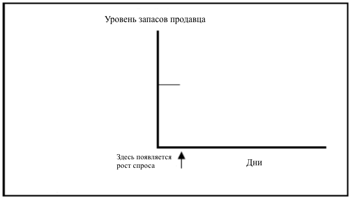
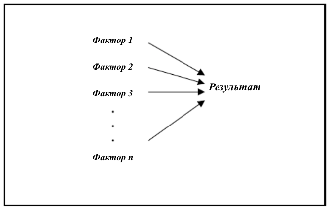

# Часть 1. Создание основы.

Две главы первой части данного пособия дадут общее представление о содержимом последующих частей книги.

Глава 1 обозначает проблему, с которой сталкиваются практически все современные организации:  *как создать инициативы по повышению производительности, которые приведут к желаемому результату*. Опыт показывает, что, будь то реорганизация целого ряда процессов, направленная на реализацию синергетического эффекта,разработка стратегии успешного развития, модернизация, способная поддерживать введённые изменения, создание эффективного набора операционных политик или разработка сбалансированной системы показателей, «исправления» слишком часто терпят неудачу, часто даже усугубляя те проблемы, которые планировалось устранить.

В главе утверждается, что причина неудач в том, что базовые мысленные модели, а также связанные с ними имитации низкого качества. Вывод заключается в том, что улучшение этих двух аспектов - ключ к решению проблемы повышения производительности.

Во второй главе предлагается рассмотреть «системное мышление» в качестве основы и программное обеспечение *ithink*, как связанный с ним ключевой инструмент, которые во взаимодействии позволят улучшить качество базовых мысленных моделей, а также повысить надёжность связанных с ними имитаций. В этой главе обозначены восемь базовых навыков системного мышления. Каждая глава во второй и третьей частях пособия позволит вам улучшить эти навыки в контексте умения использовать язык *ithink* для конструирования качественных мысленных моделей.

## Глава 1. Насущная потребность: Повышение эффективности работы.

Согласно оценкам, более 75% попыток реорганизации не дают желаемого повышения эффективности работы. Крах доткомов, которые находились на своем подъёме, является примером того, что стратегии роста зачастую не способствуют реальному развитию. Реализация большинства масштабных проектов осуществляется в условиях несоблюдения графика и сильного превышения бюджета. Среди большого количества компаний, осуществлявших попытки воспроизвести синергетический эффект за последние десять лет, лишь немногие преуспели. Существует множество историй о дорогостоящих попытках реорганизации, которые, либо закончились неудачей, либо, что ещё хуже, привели к ухудшению ситуации, на улучшение которой были нацелены. Число организаций со сбалансированной системой учета показателей, с метриками, которые никто не понимает и не умеет анализировать, достигает катастрофических цифр.

Как так вышло? Почему столько благонамеренных попыток улучшения производительности, разработанных большим количеством профессионалов, зачастую не дают желаемого результата? И, что более важно, как мы можем это исправить? Что потребуется для того, чтобы значительно повысить вероятность того, что разрабатываемые нами инициативы позволят достичь намеченных нами целей? Именно эти вопросы и будут рассмотрены в данной главе.

### Выявление корня проблемы.

Первый шаг в «исправлении» *чего-либо* - это понять, почему возникают проблемы. Если, допустим, наши инициативы по повышению эффективности слишком часто оказываются неудачными, то следует искать причины этого в процессе разработки инициатив. Как появляются эти инициативы? Ответ прост: *мы их придумываем*! Иными словами, они появляются в процессе мышления. Давайте подробнее остановимся на *этом* процессе.

В первую очередь необходимо отметить, что, когда мы обдумываем что-либо, у нас нет этого «чего-то» в голове. Задумайтесь… Вы пытаетесь понять, должны ли вы отпустить своего ребенка на вечеринку. Вы пытаетесь понять, хотите ли вы уволиться со своей стабильной, но относительно простой работы, с целью начинания полного трудностей стартапа. Вы размышляете о лучшем пути развития событий, но у вас нет его в голове. Тогда возникает вопрос – что же у вас в голове? С чем вы имеете дело, когда «думаете»?

Вы работаете с так называемой «мысленной моделью» - т.е. некой «выборочной абстракцией» реальности, о которой вы размышляете. Вы создали эту модель на основе определённых допущений о том, как обычно реальность существует, а также на основе предположений об отдельных элементах этой реальности, о которой вы думаете. Рассмотрим простой пример, чтобы вышеизложенные идеи стали более понятными.

Вы находитесь в приличном ресторане и выбираете блюдо на ужин. Мысленная модель, с которой вы «работаете», скорее всего, включает ваши допущения о еде *в целом*: еда утоляет голод; если я буду быстро потреблять еду, может произойти несварение желудка; если я буду есть руками, то окружающие посчитают меня неряхой и так далее. Такие общие положения я бы назвал «мета-допущениями», поскольку они подходят к любой ситуации, так или иначе связанной с процессом потребления пищи. Как вы узнаете далее, "мета-допущения", используемые при конструировании наших мысленных моделей, сыграют важную роль в объяснении неудач инициатив по повышению уровня производительности. Наша ситуация с ужином в ресторане также включает определённые допущения, применимые к данной *конкретной* ситуации: этот ресторан предлагает вкусные стейки; в качестве аперитива я хочу красное сухое вино и тому подобное.

После того, как вы определили набор специфических допущений для вашей мысленной модели, вы начинаете размышлять уже с их учётом. Я бы использовал более практический термин для описания этого процесса - "имитационное моделирование". Вы воображаете, то есть как бы *имитируете* свою мысленную модель; вы перебираете "что, если...?". Вернёмся к нашей ситуации. "Да, стейки здесь превосходные, но как это повлияет на уровень холестерина в моей крови? Я уже представляю вкус вина, но на улице гололёд, и я не хочу рисковать своим здоровьем." и так далее. Вы анализируйте все возможные варианты развития событий с целью оценить вероятные исходы.

Когда мы создаем любую инициативу по повышению производительности, мы думаем. И, когда мы думаем, мы конструируем и имитируем мысленную модель. Справедливо утверждать, что, если наши инициативы не принесли желаемого результата, то ошибка произошла именно на этапе конструирования и имитирования модели.

### Что происходит с конструированием и имитацией наших мысленных моделей?

Каждый из нас создаёт мысленные модели на протяжении всей своей жизни. Как известно, практика - ключ к идеалу, соответственно, мы должны быть весьма хороши в этом! Давайте проверим данную правдоподобную гипотезу...

Далее будет параграф, в котором описывается простейшая цепь поставок. Используйте её для конструирования мысленной модели. Затем, сымитируйте модель с целью оценить, как система поведет себя в ответ на «вмешательство», которому она будет подвергнута. 

Ритейлер поддерживает запасы товаров, которые отправляются потребителям по мере запроса. После очередной транспортировки, продавец заказывает дополнительный товар (для пополнения запасов) у поставщика. Продавец всегда запрашивает у поставщика заказ по электронной почте с указанием такого же количества товара, какое уже было отправлено в этот день потребителю. Например, если было отправлено 10 единиц товара, то у поставщика запрашиваются эти же 10 единиц. Продавец никогда не откладывает запрос поставщику, и всегда заказывает то же количество товаров, какое было отправлено в этот день. 

Работа поставщика тоже отличается регулярностью. Он обрабатывает заказ сразу после получения запроса, после чего отправляет запрашиваемые товары ритейлеру. Необходимо 6 дней для того, чтобы продавец получил свой заказ. У поставщика никогда не заканчивается товар, при этом шестидневный срок доставки остается неизменным. Также отправленный товар никогда не бывает бракованным, поврежденным или потерянным при транспортировке. 

Эта простая цепь поставок некоторое время находится в стабильном состоянии. Это означает, что объём запрашиваемого покупателями товара находится на одном уровне долгое время, так же как количество товаров, закупаемых продавцом и отправляемых ему поставщиком. Все находится в идеальном балансе. Теперь представим, что ни с того ни с сего, уровень спроса на товар значительно повысился и остановился на этом повышенном уровне. На осях Графика 1-1 изобразите *тенденцию*, которая, по вашему мнению, будет прослеживаться при росте уровня запасов продавца вслед за каждым однократным повышением покупательского спроса. 

**Рисунок 1.1. Графическое изображение вашего прогноза**

Обычно до 80% людей, которым предлагается выполнить это задание, выводят неправильную тенденцию! Верное решение следующее: *после однократного повышения спроса, уровень запасов продавца будет линейно уменьшаться в течение шести дней; затем он остановится и останется неизменным на определенном уровне.* (Вы поймёте, почему, в следующей главе). Значительно меньший процент опрошенных, которые смогли верно выполнить данное задание, оказалось, не относится к одной определенной культуре и не имеет схожий уровень образования или опыта работы с цепями поставок. Эти результаты показывают, что, обычно, люди или не умеют правильно конструировать мысленные модели (даже простейшие!), или не могут их имитировать, или и то, и другое! 

### Почему мы недостаточно хороши в конструировании и имитировании мысленных моделей?

Так почему же мы не умеем строить и / или имитировать мысленные модели, учитывая весь наш опыт в этом деле? Я думаю, что это связано с различиями в скорости, с которыми развиваются биологические и социокультурные системы. Разные темпы эволюции способствовали тому, что люди с примитивными когнитивными механизмами живут в более сложной реальности, где всё взаимосвязано. Именно это несоответствие и лежит в корне проблемы. 

#### Наша техника моделирования

Образно говоря, когда у наших предков появились большие пальцы, и они начали ходить на двух ногах, вместе с этим они, к сожалению, не получили большого развития когнитивных способностей. Но они им и не были нужны… в то время. В те времена, когда люди жили в пещерах, их способность к имитационному моделированию была достаточной. Правила выживания были просты – увидел медведя, убил медведя, съел его… а может даже поделился с соплеменниками. Медведи были в изобилии. Дубинка и камень были «местными» орудиями. В медвежьем мясе не было вредных добавок, тяжелых металлов или пестицидов. Людям не нужно было жертвовать временем на охоту ради дневной работы или спортивных секций их детей. Тогда не существовало адвокатов. Жизнь была простой, так же как и мысленные модели. Связанные с ними имитации были однозначными. 

Затем произошёл «прогресс». Мы создали орудия, использующиеся для разделки мяса, начали носить медвежьи шкуры, выращивать собственную еду, кто-то придумал канал MTV… Жизнь стала сложной. Стало проблематично делать что-либо, не способствуя при этом появлению множества разных событий, некоторые из которых могут быть даже не замечены нами. Всё стало «соревнованием». Мы стали бороться за ресурсы, людей, время. Все бесплатные обеды были съедены.

Проблема заключается в том, что социокультурная эволюция произошла слишком быстро, и когнитивные способности просто за ней «не успели». По сей день мы не можем одновременно размышлять о нескольких вещах сразу. И как показало задание на имитационное моделирование, которое вы недавно выполнили, наши когнитивные способности препятствуют нашей возможности создавать мысленные имитации даже для простейшего набора взаимосвязанных элементов.

Но, несмотря на то, что положение с мысленной имитацией и так бедственное, к сожалению, у меня есть *еще больше* плохих новостей! Появляется все больше доказательств того, что создаваемые нами мысленные модели не полно отражают суть действительности! Существуют три причины, почему они недостоверны: *(1) их содержание, (2) то, как это содержание представлено, и (3) процесс совершенствования содержания и его представления.* Рассмотрим каждый пункт…

#### Первая причина плохого качества мысленных моделей: содержание

Проблемы с качеством наших мысленных моделей появляются, когда мы выбираем, что в них включить… и что мы решаем не включать – то есть, когда мы начинаем «фильтровать» реальность с целью отбора материала для мысленной модели.

Проблема с содержимым моделей отсылает нас к нашему древнему прошлому, когда окружающая среда представляла для нас опасность. Наш мозг реагировал только на то, что находилось в конкретный момент перед нами – как в пространстве, так и во времени. На это есть весомая причина: то, что находилось перед нами, могло представлять для нас опасность и было способно *убить* нас! Мысленные модели наших предков содержали только *насущную* информацию. Мы знали многое… о малом. Факт того, что наши взгляды были ограниченными, не представлял проблемы, поскольку в то время причинно-следственные связи являлись прямыми и короткими. Наш мозг был хорошо адаптирован к простой жизни.

И мы выживали. На самом деле, мы даже преуспевали! Наша популяция на сегодняшний день насчитывает миллиарды человек. И, если ранее каждый человек был «сам за себя», то сейчас мы являемся частью общества и организаций, которые в свою очередь являются частью взаимосвязанной «паутины». Теперь, действия, предпринятые каждым отдельно взятым человеком, могут вызвать реакцию во всей группе. И при всем этом, наш мозг находится в том же состоянии, что в прошлом! Что еще хуже, структура многих современных организаций сохраняет эту тенденцию к «локальности», присущей нашим нейробиологическим особенностям. Производство, продажи, финансы, HR, IT, маркетинг – в каждой из этих сфер существуют свои собственные культура и «диалект», которые обладают четкими пространственными барьерами – уровнем развития «локальных» мысленных моделей. Как и наши предки, мы продолжаем знать многое о малом. И Уолл-Стрит вносит свой вклад, чтобы убедиться, что мы не забываем о Медведях, удерживая нас локально ориентированными во времени, делая так, что все для нас зависит от доходов *этого* квартала.

Таким образом, в то время как практически любое действие по увеличению производительности приводит к обширным пространственным и временным последствиям, *содержание* наших мысленных моделей (то есть связанные с ними барьеры) не позволяют нам предвидеть эти последствия! В результате мы очень часто «удивляемся» - и зачастую эти сюрпризы не являются приятными. А также из-за того, что мы не можем зафиксировать эти последствия, нам не представляется возможным *учиться* на своих ошибках! Поэтому, нам суждено заново наступать на те же грабли. На рисунке 1.2 графически изображена описанная ситуация…

**Рисунок 1.2. Глубокое, узкое содержание подрывает надежность имитационного моделирования и ограничивает возможность обучения**

Таким образом, первым шагом в улучшении качества наших мысленных моделей является улучшение их содержания. Для того, чтобы это осуществить, нам нужен лучший «фильтр». Нам нужно смотреть на проблему под таким углом, который позволил бы запечатлеть информацию, необходимую для возможности «смотреть» за пределы нынешнего пространства и времени. Как вы узнаете из второй главы, Системное Мышление позволяет это сделать.

#### Вторая причина плохого качества мысленных моделей: Представление содержания

Даже если мы научились выбирать правильную информацию для моделирования мысленных моделей, мы всё еще должны работать над улучшением методов *представления* их содержания. Проще говоря, «мета-допущения», используемые нами, недостаточно совпадают с реальностью. В результате «структура» наших мысленных моделей не отражает реальность достаточным образом для того, чтобы было возможно увидеть реальные исходы событий в процессе моделирования.

Поскольку мы так широко используем «мета-допущения», они будто утопают… исчезают из сознания! Они становятся настолько «бесспорно правдивыми», что больше не вызывают вопросов и не нуждаются в проверке. Но если у нас есть хоть какая-то надежда улучшить эти допущения, нам нужно, в первую очередь, заново принять их во внимание. Один из способов их выявления заключается в выделении концептуальных рамок и аналитических инструментов, которые широко используются в различных сферах. Тот факт, что они широко используются, демонстрирует возможность того, что за ними стоит набор часто используемых «мета-допущений».

Популярным кандидатом на концептуальном фронте является то, что мы называем «Мышление в рамках важнейших факторов успеха». Большинство организаций определили наборы *важнейших факторов успеха*. Чаще всего этот набор представляет собой список «движущих сил бизнеса». Их можно увидеть приклеенными к стенам рабочих кабинок или конференц-залов или в виде маленьких заламинированных карточек, которые люди носят в своих кошельках. Они есть у всех организаций – будь то служба доставки, завод или университет. Люди приняли на заметку эти ключевые факторы успеха. Одной из самых продаваемых книг является *Семь навыков высокоэффективных людей. Мощные инструменты личностей*  Стивена Кови – книга о важнейших факторах эффективности для тех, кто хочет «жить правильно». Множество других бестселлеров также предлагают похожие списки «рецептов успеха».

На рисунке 1.3 вы можете увидеть схему, графически отображающую суть «важнейших факторов успеха»

**Рисунок 1.3. Стандартная схема модели «Важнейшие факторы успеха»**

Какие же «мета-допущения» отражены в этой схеме? Два из них наиболее очевидны. Во-первых, «Факторы» существуют *независимо* друг от друга. Каждый «влияет» на результат, но делает это независимо от других. Во-вторых, «Результат» в свою очередь не влияет на Факторы. Таким образом, *причинная связь односторонняя* – от Фактора к Результату, но не наоборот.

Оба «мета - допущения» сильно подозрительны! В сегодняшнем мире, где всё взаимосвязанно, сложно найти *какой-либо* фактор, который не влияет на что-то и не находится под влиянием чего-то. Рассмотрим пример. Компания считает, что технологии, люди и образование являются ключевыми факторами успеха. Но нельзя отрицать, что высококвалифицированные люди создают новые технологии, и что технологии позволяют людям оставаться высококвалифицированными! Помимо этого, именно процесс обучения приводит к технологическому прогрессу, а он, в свою очередь, стимулирует обучение. И разве возможность учиться не привлекает высококвалифицированных специалистов? Вот вам и *независимость* факторов!

Другое «мета-допущение» об односторонности причинной связи тоже может быть развеяно. Не поспоришь с тем, что высококлассные специалисты формируют организации. Но можно ли отрицать, что это работает и в обратную сторону? Организации порождены специалистами, которые, при удачном стечении обстоятельств, добиваются успеха. Успех, в свою очередь, является методом привлечения других высококвалифицированных специалистов для расширения организации. Это влечет еще больший успех и больший поток новых специалистов… и у нас появляются обратные причинные связи. В какой-то момент времени компания достигает своего максимального размера (ничто не может увеличиваться бесконечно!). То, как организация справится с этими ограничениями, будет определять, продолжит ли спираль двигаться вверх, поменяет направление и подвергнется резкому падению или же перейдет в какое-то устойчивое состояние.

Таким образом, мы видим связь между высококлассными специалистами (или любыми другими факторами) и успехом организации. Успех не просто *результат*, а что-то, что «движется» под влиянием факторов. На самом деле, успех и есть движущая сила! Причинная связь является *двусторонней*, а не *односторонней*! Вот так мы разрушили и второе «мета - допущение»!

Если мы более детально рассмотрим модели «Важнейших факторов успеха», то мы сможем заметить и другие «мета – допущения». Эти допущения присутствуют во многих аналитических инструментах, используемых в наши дни. Давайте рассмотрим примеры.

Одним из таких инструментов является электронная таблица. А также *Сбалансированная Система Показателей* и диаграмма Исикавы. В искусственных объектах, созданных с помощью каждого из этих инструментов, как например, модель CSF framework, мы обнаружим одностороннюю логическую цепочку.  Помимо этого, часто количество независимых факторов превышает количество взаимосвязанных. Но эти популярные инструменты также отражают два других «мета – допущения». Первое заключается в том, что последствия ощущаются мгновенно (игнорируется возможность задержки). Второе допущение – воздействие *линейно* и *постоянно* (т.е. изменение входящего потока на x% всегда приводит к изменению выходящего потока на y%).

Рассматривая «мгновенные последствия», стоит отметить, что в каждой системе, известной человечеству, есть некая инерция. Практически ничто не реагирует мгновенно – по крайней мере не целиком. Отдельные мгновенные реакции могут существовать, но они оказывают воздействия на другие реакции, которые проявят себя в будущем. Задержки – неизбежная часть жизни! Они являются важным атрибутом как организационной, так и индивидуальной реальности. Аналогично, рассматривая второе допущение о линейности последствий, можно отметить забавный факт – иногда можно толкнуть тонну и сдвинуть унцию, а иногда перышко может снести дом! Как и задержки, нелинейные отношения являются неотъемлемой частью реальности. Обоснованность и этих двух «мета-допущений» тоже вызывает сомнения.

Если мы хотим улучшить качество представления и содержания наших мысленных моделей, то нам необходимо иметь лучший набор «мета - допущений»! В ситуации, когда допущения независимые, односторонние, с линейными моментальными последствиями, нам нужны допущения, обеспечивающие взаимозависимость, замкнутую причинную связь, с задержками и нелинейностью! Только в том случае, когда наше представление обладает этими свойствами, мы повысим вероятность удачного исхода нами созданных инициатив, которые принесут желаемый результат.

#### Третья причина плохого качества мысленных моделей: Процесс совершенствования

Так, хорошо… наша биология наравне с современными организационными структурами способствует тому, чтобы мы формировали узкие «фильтры», ограничивающие содержание, включённое в наши мысленные модели. И «мета-допущения», которые мы используем, заставляют нас представлять это содержание способами, которые не отражают действительность. Но почему после стольких ошибок мы до сих пор не нашли пути улучшения мысленных моделей? Как наши индивидуальные, так и организационные процессы обучения не являются достаточно эффективными. Нам хорошо удается управление знаниями (сбор, хранение и восстановление информации), но мы очень слабы в управлении пониманием (сбор, хранение и восстановление понимания). Почему? Во-первых, у нас нет необходимого языка для интегрирования «частичного понимания» в полную картину. И, во-вторых, у нас нет инструментов для проверки истинности понимания. Рассмотрим каждый пункт в отдельности…

Что касается языка, как было замечено ранее, у организаций есть свои функциональные, дивизиональные и/или географические владения. Людей, способных рассуждать в рамках всей организации, мало. А тех, кто владеет "частичным" пониманием, слишком много. Если бы у нас была возможность *объединить* «частичные понимания» в *управляемую* целую картину, то мы бы работали с фундаментально улучшенной мысленной моделью действительности, в которой мы существуем. Так что же нам мешает? Две проблемы. Первая из них – отсутствие *Эсперанто* – единого языка, который бы помог связать все воедино. Вторая – рамки «фильтра», которые позволяют пропустить только основную информацию, без многочисленных деталей. Устранение этих проблем даст нам возможность «управляемости». Как вы узнаете из второй главы, Системное мышление обеспечивает решения *обоих* проблем.

Что касается инструментов, представим, что нам удалось связать воедино "частичные понимания" для осознания полной картины, но теперь нам нужно проверить допущения как до применения наших идей, так и *после* того, как реальность претворила в жизнь имитацию! Предварительная проверка позволяет выявлять непостоянства и обозначить «слепые зоны» (области, в которых нам еще необходимы информация и понимание). Проверки, осуществляемые после претворения инициатив в жизнь, помогают распознать причины, из-за которых результат не совпал с запланированным. Работая над ними, можно добиться дальнейшего систематического улучшения.

Как вы узнаете из второй главы, программное обеспечение *ithink*  является инструментом для осуществления вышеописанного. Применяемое в сочетании с системным мышлением, оно может служить мощным ресурсом для решения задачи создания эффективных инициатив по повышению производительности.

### Что будет далее

В этой главе я ввел цель: *улучшение нашей способности создавать эффективные инициативы по повышению производительности*. Я выяснил, что неудачные результаты связаны с низким качеством мысленных моделей, а также с имитационными моделями, которые оказываются далёкими от действительности. Также я обозначил, что Системное мышление и программное обеспечение *ithink*  являют собой тандем, способный решить существующую проблему. В следующей главе будут представлены доводы, поддерживающие это утверждение.
