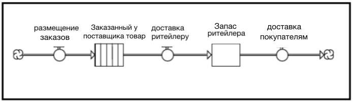
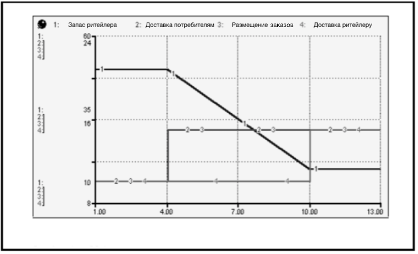

## Глава 2. Системное мышление и программное обеспечение *ithink*. Улучшенные ментальные модели c более точной имитацией. 

В первой главе было установлено, что большое количество программ по улучшению производительности не дают желаемых результатов, а зачастую только усугубляют проблемы, на устранение которых были направлены. Затем было предложено объяснение этого феномена: качество ментальных моделей, лежащих в основе инициатив было недостаточно высоким, а имитации были далеки от жизни. Для решения этой проблемы я предложил принять концептуальные рамки и инструменты, которые будут способны обеспечить улучшение ментальных моделей *и* повышение надёжности имитаций. Системное мышление и программное обеспечение *ithink* являются этими самыми концептуальными рамками и инструментами. 

Эта глава посвящена обоснованию этих утверждений. Для их доказательства, периодически будут происходить отсылки к обозначенной в 1 главе "структуре проблем", связанной с существующими парадигмами (как, например, ключевые факторы успеха) и используемыми инструментам (например, регрессионный анализ). Системное мышление и программное обеспечение *ithink* обеспечивают устранение каждой проблемы.
В 1 главе были взяты ментальные модели и проверены на: (1) содержание, (2) представление содержания и (3) процесс совершенствования качества первых двух пунктов. Я также утверждал, что наша ограниченная способность к имитационному моделированию препятствует решению задач, которые ставят перед нами сложные взаимозависимые системы, в рамках которых мы теперь должны действовать. Я буду рассматривать каждую проблему, из представленных в 1 главе, по очереди.

### Улучшение *содержания* наших ментальных моделей

Проблема с *содержанием* ментальных моделей начинается с «фильтра», который мы применяем для отбора из реальности информации для дальнейшего конструирования ментальных моделей. Как вы можете помнить из первой главы, найденным «недостатком» является ограниченность наших «фильтров». В результате наши модели переполнены узко-направленными деталями. Мы знаем многое о малом. 

На самом деле, здесь *две* основные проблемы: недостаточность широты и чрезмерная глубина. Системное мышление предлагает «фильтрование» способов мышления, которое решает обе проблемы. «Взгляд с высоты 10,000 метров» способствует расширению, контролируя при этом степень глубины. «Причинное Системное Мышление» преимущественно сфокусировано на ширине.

#### Мышление с высоты 10,000 метров

Представьте себя в самолете, парящем в 30,000 футах над землей, смотрите вниз на землю. Посмотрите на эти тысячи машин, переполняющих шоссе… бедные неудачники! Что это за машина внизу? Не можете определить марку? Может, это Форд, может Мазда. По правде говоря, вы даже не можете определить ее цвет! Вы можете быть уверены только в том, что это автомобиль, а может даже и маленький грузовичок. Это вид с 10,000 метров. Вы видите полную картину, не перегруженную деталями. Вы больше фокусируетесь на *категориях*, чем на отдельных составляющих какой-либо категории. Это «доктор», а не 43 медицинские специальности. Вещи носят более «общий» характер. Вы не можете позволить себе включить много деталей, потому что это скажется на *ширине*, а также лимитирует количество информации, которую вы можете включить в полезную ментальную модель. 

Рисунок 2-1 показывает разницу характера информации в ментальных моделях, когда используется традиционный фильтр и взгляд с «10,000 метров».

**Рисунок 2-1. **
**Содержимое Традиционной ментальной модели против «Мышления с высоты 10,000 метров»**

Важно отметить, что чем дальше вы отходите от изучаемой реальности, тем больший отрезок времени вы способны охватить. Сравните течение времени, когда вы сидите в автомобиле и самолете. Когда вы стоите в утренней пробке, все, что вы наблюдаете – *события*, происходящие в данное время. Полиция несется по выделенной полосе. Вскоре за ней проезжает скорая. А затем и пожарная машина. На контрасте, когда вы находитесь на высоте 10,000 метров над землей, вы видите *всю* пробку, перевернутый автомобиль, вереницу спасательных автомобилей, направляющуюся к месту автокатастрофы. Вы видите большую картинку как во времени, так и в пространстве. 

Другим инструментом «фильтрации», предложенным Системным Мышлением, является «Причинное Системное Мышление». Его можно объяснить на простом примере. Представьте пружину, которую вы поддерживаете снизу одной рукой, а другой держите несколько верхних колец, как это изображено на рисунке 2-2.

**Рисунок 2-2.**
**Демонстрация на пружине**

 Затем вы начинаете убирать нижнюю руку (как показано на иллюстрации посередине). Встает вопрос: *В чем причина колебаний?*

Подумали ли вы о нижней руке? Или, возможно, гравитации? Что ж, поздравляю, если это было так! Это два ответа, которые высказали 90% опрошенных 20 лет назад.

Совершенно верно, что, если бы поддерживающая рука не двигалась, то колебания бы *никогда* не появились. Также верно, что если бы не гравитация, то колебания тоже не произошли. *Однако*, представьте аналогичный эксперимент, но с использованием, например, чашки. Никаких колебаний, да? То же движение руки, та же гравитация… но никаких колебаний!

Как показывает эксперимент, еще одной причиной колебаний пружины является ее внутреннее строение. Если смотреть со стороны, то пружина – это «колебание, которое должно происходить». Когда появляется необходимый толчок, пружина колеблется в ответ на него. Это в ее природе. Но не в природе чашки.

Важно отметить, что мы не говорим о «верном» и «неверном» взглядах на этот феномен. Мы говорим о двух *разных* взглядах. Каждый из них зависит от информации, включенной в ментальную модель. Вкратце, если вы принимаете точку зрения «Причинного Системного мышления», то вы включите в модель факторы, которые действуют на нее *изнутри*. На примере с пружиной, пружина *и есть* система. Таким образом, колебание происходит из-за её строения – возможно, мы можем улучшить характеристики демпфирования, сделать ее меньшим акселератором. Достаточно небольшое внимание будет уделяться деталям, которых значительно больше (как движение руки или гравитация, например). Но это не значит, что «Причинное Системное Мышление» игнорирует их. Но вместо того, чтобы перегружать ими ментальную модель, все эти они будут сгруппированы в так называемые «потрясения» - вещи, которые вызывают динамику внутри системы. Далее, если им и будет уделено внимание, то совсем незначительное.

#### Улучшение Содержания, Коротко

«Взгляд с 10,000 метров» и «Причинное Системное мышление» определяют информацию, которая после «фильтрации» окажется в ментальной модели. Принимая во внимание эти «перспективы фильтрации», можно удостовериться, что ментальные модели будут широкого охвата, а также их детали будут относиться к связям, на которые вы можете оказывать определенное влияние. Эти методы «проведут вас на стадион». Но то, как хорошо вы сыграете, зависит от таких факторов, как *Операционное мышление, Мышление обратной связи и Нелинейное мышление.*

### Улучшаем описание процессов в наших ментальных моделях 

Возвращаясь к первой главе, было установлено, что качество представления содержания наших ментальных моделей зависит от набора «мета-допущений», которые мы решили включить. Я выделил четыре основных мета-допущения, которые широко используются на сегодняшний день. К ним относятся: (1) факторы, работающие независимо друг от друга, (2) односторонняя причинная связь, (3) мгновенно ощущаемый эффект и (4) линейность воздействия. Системное мышление предлагает диаметрально противоположные мета-допущения.

#### Факторы взаимозависимы, а причинная связь является двухсторонней

Я скомпоновал первые два "мета-допущения", поскольку они являются, на самом деле, двумя сторонами одной монеты. Этой «монетой» является *взаимозависимость*. Подходящий инструмент Системного Мышления для данной ситуации - «Мышление обратной связи». 

В первой главе, рассматривая факторы успеха компаний, я установил, что факторы являются независимыми, и что «результат» является «движущей силой». Точка зрения, предлагаемая Системным Мышлением, заключается в том, что, в большинстве своем, все в действительности взаимосвязано. И «полученный эффект» также воздействует на первоначальные факторы. Вместо того, чтобы в колонке слева указывать факторы, которые показывают стрелками на результат справа, у нас, в действительности, существует картина, представленная на рисунке 2-3.

**Рисунок 2-3.**
*Взгляд, основанный на взаимном влиянии*

На этом рисунке невозможно отличить «факторы» от «результатов». Рассматривая взаимное воздействие, или *замкнутый круг обратной связи*, представленный на картинке, непонятно, чем эта иллюстрация может быть полезна! Представление содержания ментальных моделей в виде сети замкнутых кругов обратной связи показывает, что содержание *динамично*. Круги обратной связи, как вы узнаете из главы 6, *воспроизводят* динамику! Запустив такой цикл, получится такая же ситуация, как с колеблющейся пружиной! Прогнозирование результата работы циклов помогает определить инициативы по повышению производительности, которые будут наиболее эффективными.

#### Эффект задерживается, «Эффект» должен стать "Причиной" 

Заметьте, как я добавил кое-что в описание «мета-допущения» "Эффект задерживается". Это дополнение – «Эффект» должно стать «Причиной» - очень важно, поскольку обычное «мета-допущение» о том, что «воздействие мгновенно» противоречит гораздо более широкому предположению о природе отношений, которого придерживается Системное Мышление. Этим предположением является то, что, это нормально – думать с позиций «воздействий» и «последствий». То есть ментальные модели, базирующиеся на корреляционных связях, являются достаточными для грамотной ментальной симуляции.

Большинство специалистов по Системному Мышлению сказали бы, что корреляционные связи не считаются нормой в том случае, если целью, на которую ориентирована ваша модель мышления, является повышение производительности. «Если ты стремишься повысить свою производительность, то причинно-следственная связь должна быть основой твоего поведения!» - гласит, уже ставший практически бессмертным, встречный девиз Системного Мышления. Рассмотрим простой пример, который поможет проиллюстрировать вышеприведённое утверждение…

Много лет назад, работая экономистом, я наткнулся на статью в популярном экономическом журнале, в которой была описана модель, целью которой являлось прогнозирование производства молока в США. Эта модель являла собой стандартный «регрессионной анализ», и описывалась математически как…

***Y = (a1X1 + a2X2 + a3X3 + …)***

**производство молока = f (ВНП, стоимость корма, процентные ставки, …)**

Говоря простым языком, согласно этой модели, производство молока в любом рассматриваемом году находится под влиянием определенного набора макроэкономических переменных. А именно, производство молока может быть спрогнозировано на основе изменений таких показателей, как: ВНП, стоимость корма, процентные ставки и так далее. Модель отличное справлялась с «отслеживанием истории» – «критерием адекватности», и рассмотренный пример не стал исключением.

По прошествии лет, оставив позади юношескую безрассудность, я вспомнил об этой модели и задал себе (а теперь и вам) логичный вопрос. Существует ли такая переменная, которая не удостоилась внимания при рассмотрении различных макроэкономических факторов, но, при этом, являющаяся крайне важной в процессе производства молока? Под «крайне важной» я подразумеваю такую переменную, без наличия которой НЕ сможет осуществляться производство? 

Если вашим ответом являлось робкое «коровы»… во-первых, разберитесь в разнообразии животных, а во-вторых, добро пожаловать в мир *Операционного мышления*! Операционное, а также Мышление обратных связей, являются двумя ключевыми навыками Системного Мышления, связанными с представлением информации в ментальных моделях. Главы 3-5 данного учебника посвящены исключительно Операционному мышлению. Вторым навыком мышления, который удостоился только *одной* главы, является Мышление обратных связей (глава 6). Как мы видим, Операционное мышление действительно является очень важным! А важным оно является потому, что, так же, как и Мылшение обратных связей, рассматривает структуру связей между элементами, из которой состоит та или иная ментальная модель. В особенности, Операционное мышление утверждает, что ни «корреляция», ни «влияние», ни «воздействие» не подходят для описания взаимосвязей в ментальной модели. Подходит лишь *причинно-следственная* связь!

В нашем примере по производству молока, *коровы* стали бы первой переменной, включенной в модель, формирующуюся под влиянием операционного мышления. Нет коров – нет молока… все настолько просто! Но почему корреляция *недостаточно* хороша для описания модели, особенно учитывая то, что модели, которые на ней основываются, часто предоставляют достаточно точное отслеживание истории?

Корреляция *достаточно* хороша в том случае, если вашей целью является прогнозирование… и вы обладаете большой удачей (имеется ввиду, что прошлые связи, на которых базируется корреляция, остаются неизменными). Но, когда вашей целью является *изменение* производительности, вы стремитесь *изменить* те связи, которые преобладали в прошлом, а также создать новые на их месте. Вы пытаетесь найти рычаги, на которые можно надавить для создания эффективных преобразований. Для этого, вам *необходимо* понять *причинно-следственную* связь!

Давайте вернемся к примеру с производством молока, для того, чтобы вышеупомянутое стало более наглядным. На схеме 2-4 показана простая ithink модель, которая иллюстрирует операционную картину производства молока…

**Рисунок 2-4.**
*Операциональная картина производства молока*

Вкратце, имена существительные и глаголы в языке ithink, как вы узнаете из главы 3, представлены «прямоугольниками» и «трубами с кранами». Прямоугольники, две разновидности которых можно видеть на Схеме, представляют запасы. Трубы с кранами представляют какие-то действия. Эти действия пополняют или опустошают запасы, изменяя их величины. Например, если увеличится уровень производства молока, то, следовательно, пополнится запас молока (в том случае, если уровень продаж не превысит уровень производства). Два запаса, напрямую связанные с коровами, Коровы на дойке и Количество коров, производящих молоко, представляют собой «конвейеры», которые отражают процессы «роста и старения». Таким образом, должно пройти немалое количество времени с момента зачатия до того, как телята достигнут возраста, достаточного для начала их участия в производстве. «Проработав» определенное время, они становятся слишком взрослыми, и их исключают из производственного процесса.

После рассмотрения примера, мы можем идентифицировать рычаги, на которые стоит надавить для повышения уровня производства молока. «Производительность» *обусловлено* количеством коров, которые производят молоко, и тем, сколько в среднем молока способна произвести каждая корова (т.е. «средняя продуктивность коровы»). Я не разработал логического обоснования продуктивности коров для данного примера. Вместо этого я сфокусировался на выявлении рычагов, способных изменить «количество коров». Четыре таких рычага представлены на диаграмме. Потратьте несколько минут, чтобы увидеть, сможете ли вы их опознать.

Для того, чтобы увеличить производительность, нам необходимо увеличить количество голов в стадах. Одним способом осуществления этой идеи является импортирование взрослых коров из-за границы США. На диаграмме не показаны все "не мгновенные" действия, которые возникнут в ходе увеличения производительности, но можете быть уверены в том, что их будет несколько. Втором способом достижения нашей цели является поток «зачатие». Именно так, афродизиаки для коров и таблетки, улучшающие репродуктивную способность! Хотите больше коров-производителей? Создайте условия для увеличения количества зачатий! Но имейте ввиду, что, даже если у вас все получится, вам понадобится запас времени на развитие плода в утробе, а затем на взросление теленка до возраста, пригодного для доения. Вуаля – пример классического влияния на модель, которое не относится к *данному моменту*! Надави на рычаг сейчас… получишь результат через несколько лет.

Два других рычага не так очевидны. Первый из них заключается в ускорении созревания (то есть в сокращении продолжительности времени, которое телята проводят у коров в конвейере). Не будучи близким к сфере животноводства, я не уверен, насколько возможно использовать этот рычаг. Однако, теоретически, если удастся сократить время взросления, в то время как остальные показатели останутся неизменными, то у вас появится бóльшая популяция коров для дойки. Последний рычаг для многих людей почти невидим. Он заключается в том, чтобы уменьшить объём уходящего потока. На практике это будет означать увеличение возраста, начиная с которого корова считается «непригодной». Использование данной тактики аналогично попыткам нарастить свою клиентскую базу при помощи сокращения «текучки», а не при помощи увеличения потока новых клиентов. Некоторые компании действительно используют данный способ, поскольку считают его достаточно эффективным. Однако, увеличение запасов при помощи *сокращения* выходящего потока, в сравнении с *увеличением* его входящего потока, продолжает оставаться достаточно противоречивой тактикой для многих людей (*особенно* для американцев).

Я надеюсь, что такой подробный пример смог прояснить понятие Операционного мышления и то, почему связанные с ним “мета-допущения” (эффект не должен быть мгновенным, и в более широком смысле отношения должны быть выражены причинно-следственными связями) важно учитывать при развертывании ваших ментальных моделей при попытках по повышению производительности.. Подробнее данный аспект будет рассмотрен далее в соответствующих главах. Доведение этого навыка до высокого уровня поможет вам в дальнейшем освоить Системное Мышление для дальнейшего его применения на практике.

#### Воздействия не линейны 

Последним «мета - допущением», обозначенным в первой главе, является «линейность» воздействий. Это означает, что изменение «входящего потока» на, например, Х%, приведет к изменению исхода на mХ% - где m *константа*. То есть, например, мы можем предположить, что увеличение затрат на обучение на 10% приведет к росту продуктивности на 2,5%, или что повышение количества рекламы товара на 25% приведет к увеличению продаж на 15%. 

В действительности, подобные линейные связи между вкладами и результатами встречаются весьма редко! Рынки перенасыщаются, покупатели привыкают к сезонам скидок, технологии уходят вперед, уровень осведомленности снижается. Как результат, корректировка заданной величины может быть возвратно-поступательной. В некоторых случаях для получения незначительных изменений нужно будет приложить массу усилий. А в остальных случаях и соломинка сможет сломать ребро верблюда. Вкратце, «эластичность» некой конкретной взаимосвязи крайне динамична! Именно так и работают обратные связи! Их сила возрастает и уменьшается. Таким образом, предполагая, что силы связей постоянны, как в «линейных» ментальных моделях, в результате вы можете получить «сюрприз». Именно поэтому, Системное Мышление определило «Нелинейное Мышление» одним из наиболее важных навыков, которые необходимо довести до совершенства. Большая часть Главы 7 отведена именно этому. И, как вы узнаете из нее, одной из сильных сторон программного обеспечения *ithink* является возможность представления нелинейных связей без каких-либо сложных математических расчетов!

#### Улучшение представления содержания, вкратце 

Как мы представляем то, что включено в наши ментальные модели, зависит от «мета-допущений», которые мы принимаем. В настоящее время существует четыре допущения, которые широко используются. Ими являются: (1) факторы действуют независимо, (2) причинные связи односторонни, (3) эффекты являются мгновенными (и корреляция «достаточно хороша»), и (4) воздействия линейны. Ментальные модели, которые создаются с использованием этих допущений, непригодны для создания успешных инициатив по повышению производительности. Системное Мышление предлагает четыре встречных допущения: (1) факторы действуют взаимозависимо, (2) причинная связь работает в двух направлениях («факторов» не существует!), (3) эффекты не являются мгновенными (будут действовать только причинные отношения) и (4) воздействия не линейны. Использование этого набора допущений дает модели, которые больше приближены к реальности, и, следовательно, созданные на их основе инициативы по повышению производительности будут иметь больше шансов на успех.

В Главе 1 утверждалось, что большинству организаций (так же, как и отдельным людям) не достает способности к систематическому улучшению качества содержания и представления сущности ментальных моделей. Этому могут служить две причины. Прежде всего, у нас нет *универсального языка* для интегрирования «частичного понимания» в целую картину «всего». Также, у нас отсутствуют инструменты для тестирования достоверности этого понимания. Системное мышление, а также программное обеспечение *ithink* помогут с решением обеих проблем.

Важным параметром, который делает «Операционное Мышление» операционным, является язык, основанный на иконках или пиктограммах, который наглядно показывает «как это работает». Язык состоит из четырех простых иконок (с несколькими вариациями каждой из них), но, при этом, он используется для представления как простейших переменных (таких как кредиторская задолженность, наличные деньги, запас товара), так и глобальных вещей (доверие, привязанность и мораль). Язык действительно представляет собой организационный Эсперанто. И это имеет очень важное практическое значение с точки зрения повышения качества наших ментальных моделей.

Наличие языка, который все в организации могут «читать» и понимать, означает, что «слепые пятна» - как по содержанию, так и по его представлению, могут быть выявлены и обсуждены. «О, *теперь* я понимаю, о чем вы думаете. Мне нравится эта часть, но эта часть здесь не соответствует моему опыту!» Такие комментарии типичны для компаний, где используется *ithink*. Из приведенного комментария видно, что «слепое пятно» было идентифицировано. Менее очевидным является то, что необходимо для улучшения качества ментальной модели. Поскольку комментарий направлен на *карту ithink*, а *не* на человека, то *защитные реакции* с его стороны гораздо менее вероятны. Такие ответы буквально отключали обучение. Таким образом, выступая в качестве «стороннего объекта», карта *ithink* может облегчать дискуссии, которые позволяют каждому делиться своим «частичным опытом» и, как результат, совместно работать над *построением общего понимания* - святым граалем любых хороших процессов обучения в организации!

Но карта *ithink* - это нечто большее, чем просто «симпатичная картинка», которая облегчает внутриорганизационное обсуждение. Её можно смоделировать на компьютере, чтобы определить эффективность существующих отношений, а также она фактически способна генерировать динамику! Другими словами, модели *ithink* предоставляют возможность «проверять здравомыслие» группы – используя научную лексику, чтобы проверить, является ли модель «приемлемой гипотезой». И, если модель не может произвести динамику, должен пройти процесс изучения того, какие изменения в содержании и/или его представлении должны быть сделаны. Обновление модели *ithink* модернизирует ментальные модели организации. Все учатся сообща. Качество содержания ментальной модели и ее представления систематически улучшается.

Перед внедрением инициативы по повышению производительности, программное обеспечение *ithink* позволяет людям из всей организации в прямом смысле «попасть на одну страницу», а также убедиться в её «занимательности».
Как только этот вопрос урегулирован, можно добавить интерфейс, который превратит модель *ithink* в «поле для практики». Люди могут использовать Панель управления для тестирования стратегий, создания новых процессов и т.д. Организации могут выстроить понимание того, что работает, а что нет, и почему, тем самым увеличивается вероятность того, что при возникновении реальных «полетов» можно избежать сценария «авиакатастрофа» (или даже «турбулентность»). 

До сих пор мы обсуждали только *предварительное* улучшение ментальных моделей. Но и после внедрения существует возможность для совершенствования! К сожалению, эта возможность зачастую не используется, так как ментальные модели не пересматриваются после их претворения в жизнь. Одна из самых важных причин того, что повторное возвращение к ментальной модели не происходит, заключается в том, что ментальные модели редко бывают чёткими и конкретными. В тех случаях, когда они являются таковыми, часто работа падает на «закулисную аналитику». После этого, полученная модель является слишком абстрактной и сложной, часто зафиксированной в большой многолистовой электронной таблице. Часто такие модели опускают широкий набор *весомых* предположений, содержащихся в большинстве ментальных моделей. Сочетание единоличного авторства и аналитической сложности создает низкую принадлежность организации к модели. Это приводит к повторной обработке «непривлекательного предложения». А без повторного рассмотрения теряется огромный потенциал для обучения, связанный с исправлением предположений, заполнением недостающих частей и удалением излишков!

Напротив, обеспечение ментальных моделей программным обеспечением *ithink*, является мульти-авторным действием, происходящим в рамках всей организации. Конечные карты *ithink* легко «читаемы» любым членом организации. Кроме того, программное обеспечение повышает «качественные» переменные до статуса «полноправного гражданина», что позволяет использовать полное богатство ментальных моделей людей. В результате, модели, основанные на *ithink*, порождают чувство *коллективной* собственности. И, если портфолио различных моделей *ithink* поддерживается в доступной он-лайн базе данных, то все работники организации могут «повторно посещать» ментальные модели, чтобы сравнить их с реальными результатами. Тогда кто-то может предложить концепции по улучшению содержания и/или его представления в рамках модели. Каждый может ознакомиться с предложениями, опубликовать свои впечатления на Listserve или на любом другом форуме. Таким образом, коллективное понимание, отраженное в текущем состоянии «библиотеки», основанное на *ithink*, может систематически увеличиваться. У любого человека есть мгновенный доступ к этому пониманию. Благодаря такой *структуре организационного обучения*, основанной на *ithink*, каждый может способствовать повышению уровня знаний других индивидуумов.

Важно также отметить, что ранее описанная организационная инфраструктура обучения является устойчивой к перемещению людей. То есть, когда люди покидают организацию, они не будут «забирать» с собой понимание, потому что оно также существует в коллекции *ithink* моделей. И, когда к организации присоединяются новые люди, они могут посещать «Библиотеку», чтобы быстро освоить знания из разных областей.

Программное обеспечение *ithink* может играть важную роль в процессе совершенствования ментальных моделей как на уровне личности, так и на уровне организации. Возможности ждут!

### Улучшение наших способностей моделирования

Последний недостаток (обозначенный в Главе 1), который препятствует нашим успехам в разработке эффективных инициатив по повышению производительности, -  свойственные для ментальных моделей ограничения. Мы никак не можем повлиять на нейробиологию данных ограничений. Но есть что-то, что Системное мышление и программное обеспечение *ithink* могут сделать, чтобы помочь нам в реализации наших возможностей, и «прикрыть наши спины» тем, чего нам недостает. 

Кроме того, при разумном использовании программное обеспечение ithink может помочь укрепить “мускулы” имитационного моделирования, обеспечивая строгую обратную связь по вашим ментальным моделям. Чтобы извлечь выгоду из этой обратной связи, очень важно, чтобы вы делали прогнозы о результатах моделирования явными до начала моделирования ithink! Затем, проверяя, правы ли вы и по какой причине (или вам просто повезло?), вы можете постепенно оттачивать свою способность к интуитивной динамике. При использовании этого метода вы можете думать о программном обеспечении как о своего рода студии аэробики для ума.

Чтобы проиллюстрировать влияние программного обеспечения на оттачивание интуитивной динамики, давайте вернемся к упражнению по имитационному моделированию, которое было представлено в Главе 1. Вспомните, как вам предлагалось построить простейшую цепь поставок, а точнее ее реакцию на внешние факторы. Ниже приведена карта *ithink* для задания из Главы 1. Используем ее для восстановления этого описания в памяти. Карта представлена на рисунке 2-5.

**Рисунок 2.5. Карта ithink для простой цепи поставок**

Необходимо отметить два аспекта касательно диаграммы, представленной на Рисунке 2-5. Прежде всего, несколько абзацев текста были заменены простым изображением. А также, набор иконок, использовавшийся ранее для отображения процесса производства молока, теперь используется для цепи поставок. Святой *Эсперанто*, Бэтмэн!

Из диаграммы видно, что розничный торговец отгружает товар клиентам, используя информацию о доставке для определения объема заказа. Последний элемент в диаграмме - это задержка, которая существует между временем размещения заказа и последующей доставкой его продавцу. После этого короткого описания, давайте использовать диаграмму, чтобы облегчить имитационное моделирование этой системы ...

Вышеописанная система изначально находится в «стационарном состоянии» - условии, которое легко визуализировать, глядя на карту. Это означает, в данном случае, что три *потока* в цепи равны и постоянны, и, следовательно, два *склада* неизменны по величине. Стоит отметить, что для того, чтобы поток доставки был равен потоку заказов, каждый из шести «барьеров» (по одному на каждый день задержки) на конвейере (на иконке изображены только пять «барьеров»!) должен содержать точный объем потока заказов. Это действительно будет так, так как система была в «стационарном» режиме более шести дней. Посмотрите на диаграмму и убедитесь, что вы можете визуализировать это.

Внезапно появляется рост в объеме поставок потребителю. Что тогда происходит? Попробуйте представить это без использования карты. Так как вас интересует тренд запасов розничного торговца, сделайте главным фокусом своей ментальной модели входящие и выходящие потоки товаров… 

Отгрузка, отток со склада розничного продавца, *повышается*. Но повышается ли доставка (входящий поток на склад) *такими же* темпами? Нет! Число заказов - да, но *не* доставка! Доставка будет оставаться неизменной на протяжении шести дней, поскольку именно столько потребуется для опустошения шести «барьеров», обозначающих *предварительный рост* объема заказов. По прошествии шести дней, новый объем начнет доставляться на склад! Следовательно, доставка снова станет равна отправке, а запасы ритейлера станут постоянными. 

Итак, вкратце: уровень запасов будет продолжать снижаться в течение шести дней, при этом суточный объем равен разнице между новым, большим объемом доставки и объемом поставки до роста. Через шесть дней поток доставки увеличится до уровня, равного потоку отправки, и система вернется в устойчивое состояние, но запасы ритейлера будут на *более низком* уровне!

Этот пример иллюстрирует то, каким образом карты *ithink* могут быть полезны для облегчения имитационного моделирования, а также могут развить ваш навык интуитивной динамики. Компьютерное моделирование затем может использоваться в качестве проверки имитационного моделирования для того, чтобы убедиться в том, что вы «правильно всё поняли». Если бы мы моделировали систему цепи поставок при помощи программного обеспечения *ithink*, а также оценивали уровень запасов продавца и три потока в системе, то мы бы получили что-то похожее на Рисунок 2-6. Как было спрогнозировано, уровень запасов ритейлера представляет собой нисходящую прямую на протяжении шести отрезков времени, и сопровождается ростом уровня поставки на четвертый день. Обратите внимание, что заказы выполняются ровно в одно и то же время. Однако, как показывает график, доставка не ведет себя так же аж до десятого дня – а это шесть дней спустя! Если объем притока в «ванну» меньше, чем объем оттока, то уровень воды в ванне будет снижаться с постоянной скоростью. Моделирование, основанное на языке *ithink* помогает конкретизировать интуицию.

**Рисуник 2.6. График ключевых переменных цепи поставок**

### Подведение итогов и Что будет далее

В данной главе содержалась информация о том, что Системное Мышление и программное обеспечение *ithink* являют собой мощную комбинацию для улучшения качества наших ментальных моделей и повышения качества их симуляции. Без них, или какой-то столь же сильной альтернативы, мы будем продолжать создавать модели низкого качества наравне с ненадежными результатами имитирования этих моделей. Это означает, что мы продолжим рисковать допущением ошибок в наших стратегиях и других инициативах по повышению уровня производительности. 

Принимая концепцию Системного Мышления и используя её посредством программного обеспечения *ithink*, у нас появляется гораздо больше шансов *построить* такие ментальные модели, которые лучше отражают реальность. Результатом этого является высокая вероятность создания инициатив по повышению производительности, способных достичь желаемых результатов.

В ближайших главах вы сможете развить навыки Системного Мышления, а также изучите базу языка программного обеспечения *ithink*. Вы научитесь использовать эти языковые и мыслительные навыки для улучшения своих (и чужих) ментальных моделей. *Поздравляем* с покупкой программного обеспечения! Вы предприняли важный шаг на пути к более ясному мышлению, продуктивному обучению и эффективному общению.

