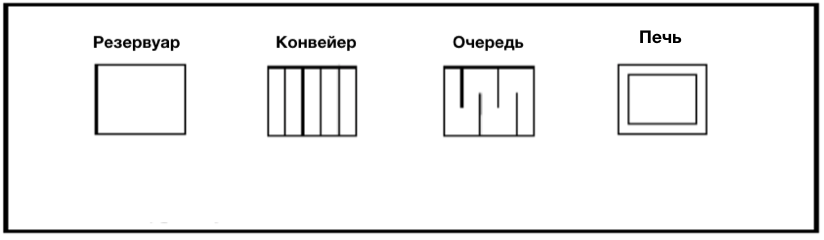
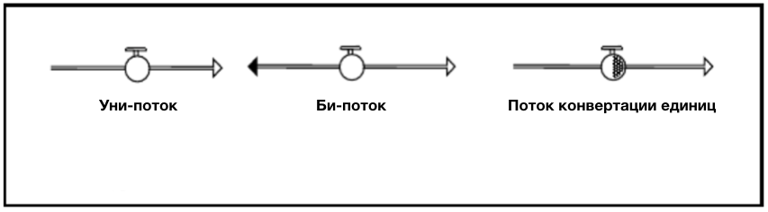
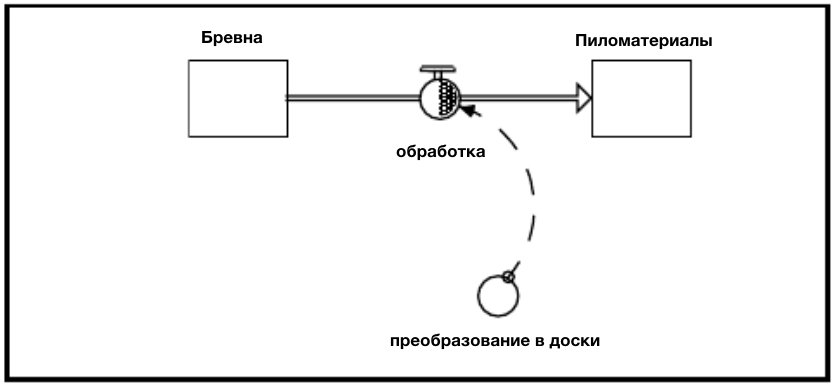
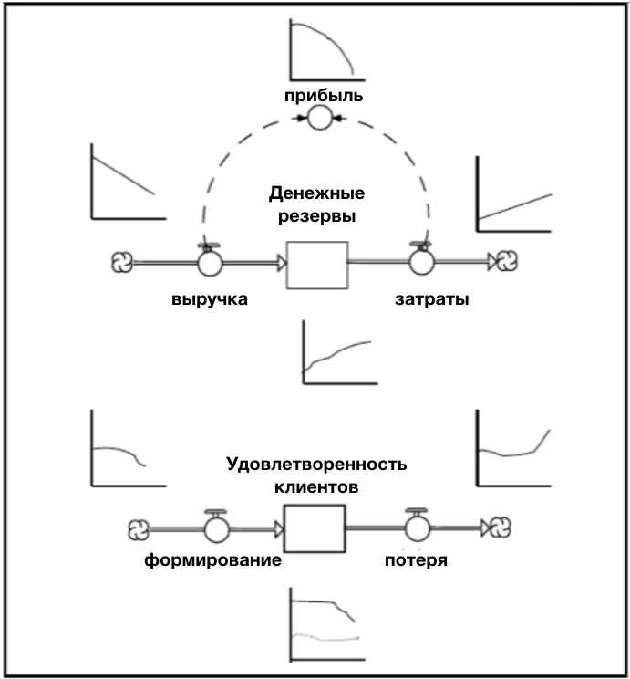

# Часть 2. Учимся "писать" на языке Системного Мышления.

Целью Системного Мышления является создание более понятных концептуальных рамок для создания и дальнейшего симулирования нашиз ментальных моделей. Все ментальные модели «написаны» на каком-то языке.
Обычно это язык, состоящий из слов, и часто слова «специализированы», поскольку они отражают диалект, специфичный для конкретной отрасли - будь то функциональная, географическая или поколенная область.

Язык Системного Мышления, как отражено в программном обеспечении *ithink*, интегрирует слова с помощью набора простых иконок. Эти иконки имеют *«общую»* природу для того, чтобы создать *Эсперанто* (универсальный язык). Такой язык позволяет людям с различными точками зрения и специализациями вносить вклад в построение коллективного системного понимания. Без такого понимания создание программ по повышению производительности часто обречено на провал.

Как и в изучении любого языка, существует логический прогресс, который необходимо соблюдать. Он начинается с основных частей речи, переходит к построению предложений, затем строит абзацы и, наконец, пишет короткие рассказы и более сложные формы композиции. Главы в этой части руководства организованы в соответствии с этой прогрессией. Каждая глава также нацелена на развитие одного из ключевых умений «Системного мышления». Главы от 3 до 5 нацелены на Операционное Мышление. В главе 3 обсуждаются существительные и глаголы языка системного мышления. В главе 4 рассматривается грамматика построения хороших базовых «предложений». В главе 5 показано, как связывать предложения вместе, вводя «наречия» в этом процессе. Глава 6 нацелена на развитие навыков мышления с замкнутого цикла. В этой главе вы научитесь создавать параграфы или, на языке системного мышления, «петли обратной связи». Наконец, в главе 7 будут развиваться ваши навыки нелинейного мышления.

Главы 8 и 9 больше похожи на Приложение к Части 2. Они представляют собой набор классических «сюжетных линий». Эти простые общи структуры могут служить ядрами для коротких рассказов и даже полноразмерных романов, которые вы сможете писать с помощью программного обеспечения. 

Рассматриваемое в контексте языка, программное обеспечение *ithink* аналогично пакету обработки текстов. То есть, это облегчает *предоставление* того, что вы хотите выразить (в данном случае, предположения, из которых состоит ваша ментальная модель). Однако это не поможет вам придумать, *что* выразить. Итак, так же, как отличный пакет обработки текстов не станет отличным автором, замечательное программное обеспечение *ithink* не сделает вас мастером построения ментальных моделей. Нужно что-то еще. Часть этого «чего-то» - это мастерство набора навыков Системного Мышления. Главы в Части 2 Руководства помогут вам их развить.

## Глава 3. Имена существительные и глаголы.
## *Операционное мышление.*

В большинстве языков существует разница между именами существительными и глаголами. Существительные представляют предметы им состояния. В то время как глаголы выражают действия. Язык *ithink* ничем не отличается.
И, как мы увидим в следующей главе, для того, чтобы составить грамматически правильное «предложение» на языке *ithink*, требуется хотя бы одно существительное и один глагол. Разница заключается в том, что язык *ithink* основан на иконках, которые имеют *операционную* природу. Это означает, что когда вы рассказываете историю с использованием языка *ithink*, вы можете видеть ее не только в своем воображении, но и *своими глазами*! И все остальные также могут это видеть. В результате как возможности двусмысленности, так и шансы на недопонимание значительно сокращаются. Язык *ithink* является очень буквальным. Вы не хотели бы составлять сонеты для своего любимого на этом языке. Но если вы пытаетесь сделать явным свою ментальную модель того, как что-то работает, то в этом ему нет равных!

### Имена существительные

Как уже отмечалось ранее, существительные представляют вещи и состояния. «Вещи» обычно носят физический характер: товар на складе, численность персонала, наличность, задолженность. «Состояния» обычно носят нефизический характер: качество, гнев, голод, жажда, чувство собственного достоинства, удовлетворенность клиентов, приверженность и доверие.

Тема, которая на ранней стадии появляется в «Системном мышлении», - это статус «полноправного гражданина», которым обладают нефизические переменные. То есть системное мышление признает, что нефизические переменные играют столь же важную роль (и во многих случаях более важную) роль в определении поведения многих систем, что и физические переменные. Действительно, организации работают не очень хорошо, не имея денег или людей. Но также верно, что они не функционируют очень хорошо без таких понятий как обязательства или доверие. Такие переменны всегда можно *количественно оценить*! И как только они появляются, они выглядят точно так же, как и любое другое количество для программного обеспечения *ithink*.

Детальный обзор этих аспектов ждет вас в Главе 13. А сейчас поймите, что существительные на языке *ithink* - даже если это компьютерный язык, который включает в себя все эти эфемерные вещи, которые действительно заставляют мир идти кругом. В конце концов, где мы были бы без любви, ревности, жадности и гнева?

Существительные на языке *ithink* представлены прямоугольниками. Прямоугольник был выбран, потому что он выглядит как ванна сбоку. И ванны являются хорошей метафорой для того, что представляют собой все существительные, то есть некие *накопления*. Именно, накопления! Товар накапливается на полках магазинов, в транспортных грузовиках и на складах. Денежные средства накапливаются в карманах, кошельках и банковских счетах. Итак, когда вы думаете о существительных на языке *ithink*, подумайте о прямоугольниках. Рассматривайте их как ванны, которые заполняются и опустошаются. Разница лишь в том, что эти ванны будут редко содержать воду.

Существительные на языке *ithink*, называются «запасами». Они обозначаются с большой буквы. Как вы увидите, это поможет визуально отличить их от потоков, которые обычно написаны строчными буквах.

Существует четыре разновидности запасов: *резервуары, конвейеры, очереди и духовки*. *Файлы Справки* выполняют работу по документированию функционирования каждого из них. Здесь наша задача - помочь вам различить четыре типа и определить, когда каждый из них наиболее подходит для использования.

На сегодняшний день наиболее часто используемым типом запасов является резервуар. Вы можете использовать резервуар для выполнения практически всех функций любого из других типов запасов. Следующим по частоте использования является конвейер. А затем уже очередь и печь. Иконки представлены на Рисунке 3-1.

**Рисунок 3.1.**
**Четыре вида запасов**

#### Резервуар

Резервуар работает как ванна. Материал течет в резервуар, и как только это происходит, отдельные объекты становятся неразличимыми. Так, например, глядя на ванну, наполненную водой, невозможно отличить, какая молекула прибыла первой, какая 10-го числа, и которая появилась последней. Вместо этого молекулы смешиваются. У вас просто есть определенное количество литров воды в ванной. То же самое верно, когда вы используете резервуар для представления, скажем, численности сотрудников или денежных средств. Вы не можете отличить Джамала от Дженис в резервуаре с надписью «Численность». У вас просто есть общее количество людей. И счета за 100 долларов неотличимы от счетов за тысячу долларов в резервуаре под названием «Наличные». У вас просто есть общая сумма денег. Вы не можете сказать, какой счет пришел, когда вы не можете различать счета разных номиналов. Резервуары размывают различия между отдельными вещами, которые входят и выходят из них. В любой момент времени они располагают сетью того, что вошло, за вычетом того, что вышло. 

#### Конвейер

Подумайте о конвейерах, как о тех «движущихся тротуарах», которые вы видите в аэропортах, или как эскалатор в вашем любимом торговом центре или универмаге. Вы наступаете, вы стоите и едете на какое-то расстояние, вы выходите - если только вы не один из тех, кто должен идти пока его перевозят, чтобы удвоить скорость движения. Вот так работают конвейеры. Независимо от количества, поступающего в «входную дверь», происходит движение. Это количество занимает «прорезь» на конвейере. Ничто другое не может занять этот слот. Количество «едет» до тех пор, пока конвейер не отложит его «на другом конце». «Поездка» займет определенное количество времени (известное как время проезда). Конвейеры отлично подходят для представления «задержек трубопровода». Такие задержки существуют, например, во всех цепочках создания стоимости и во всех «процессах» в целом. В самом деле, конвейеры часто используются, чтобы обеспечить «быстрое и грязное» представление процесса.

В отличие от резервуаров, конвейеры поддерживают целостность прибытия, а иногда и размер партии. Если в момент 3 поступит один счет за 100 долларов, а в 5 раз поступит один счет за 500 долларов, и оба «попадут» на тот же конвейер, вы сможете продолжать отличать счета, пока они находятся на конвейере, а счет на 500 долларов прибудет через два счета после счета за 100 долларов США, если транзитное время конвейера останется постоянным. Размер партии не сохраняется в ситуациях, когда, скажем, два счета за 100 долларов поступают в одно и то же время (тогда у вас будет 200 долларов «на перевозку»). Опасность слишком сильно полагаться на конвейеры (или очереди и печи) заключается в потере возможности «взгляда с высоты 10 000 метров» - одной из ключевых навыков фильтрации, необходимых для эффективного системного мышления. Когда вы начинаете различать отдельные грузовики и беспокоитесь о том, был ли доставлен этот конкретный пакет в 9:15 или 9:17, вы больше не видите «большую картину». Вы ищете конкретные ответы, а не общие идеи. И вы также расширяете границы того, что лучше всего подходит для программного обеспечения *ithink*. В целом, старайтесь собирать запасы в форме резервуаров. Если это не работает, выберете конвейер. Если вы обнаружите, что используете много конвейеров, позвоните нам (мы запланируем вам полет на самолете).

#### Очереди и печи

Я довольно тщательно пренебрегал очередями и духовками, поэтому вам, наверное, интересно, стоит ли вообще читать этот раздел. Вы можете пропустить его без потери непрерывности. Честно говоря, мы включили их в программное обеспечение, потому что продвинутая часть населения, использующего *ithink*, попросила их. Эти элементы очень важны для выполнения так называемых «дискретных событий». Не беспокойтесь, если этот термин вам незнаком. Достаточно сказать, что программное обеспечение *ithink* исходит из «непрерывной» точки зрения на реальность - снова мы говорим о «взгляде с 10 000 метров». Очереди и печи являются инструментами, обслуживающими «дискретное» мировоззрение. Включение их в программное обеспечение являет нашу попытку сделать то, что физики пытались сделать в течение 150 лет, - решить проблему двойственности волн/частиц! Мы подумали: «Нет проблем, ребята, вот тот ответ, который вы долго искали!»

На самом деле, для определенных приложений очереди и печи могут быть полезны. Очередь - это «линия», которую вы часто видите в ожидании регистрации на самолет или перед нашими офисами каждое утро, ожидая покупки программного обеспечения *ithink*. Очереди появляются, когда товары достигают скорости, превышающей способность «поглощать» их. Подумайте о том, как машины стоят в пробке на мосту Джордж Вашингтон, ожидая прибытия в Нью-Йорк. 

Очереди сохраняют целостность и размер партии. В программном обеспечении *ithink* нет «разрезания в линию», и также нет «ухода», когда вы находитесь в очереди. Когда объем материала «прибывает», если он не может «войти», он переходит в очередь (в уникальном месте). Вещь, которая прибывает позже, «встает в очередь», позади того, что уже есть, и она остается там! Опять же, *файлы справки* предоставляют дополнительную информацию об очередях.

Если конвейеры являются эскалаторами, то печи являются лифтами. Люди ждут лифт, и если двери будут открыты, они входят, а затем едут. В гораздо более реалистичном случае, когда двери закрыты... люди стоят в очереди, лифт прибывает, двери открываются, люди выходят, появляется толпа, дурно пахнущий человек стоит рядом с тобой, двери закрываются (никто другой не может зайти), и ты едешь. Это то же самое в программном обеспечении *ithink* -только без неприятного запаха! Товар поступает в духовку. Если он в настоящее время «выпекается», материал ждет (в очереди или в резервуаре). Когда «цикл выпечки» будет завершен, то, что находится внутри выходов, и вещи, которые ждут, входят (до предела объема духовки или до истечения времени «открытия дверей»). Этот материал тогда «выпекается» согласно длительности «выпекания», установленной в печи. Затем он выходит, и цикл начинается заново. *Файлы справки* снова являются вашим авторитетным источником информации о работе духовки.

### Глаголы

Существительные - прекрасные вещи, но без глаголов ... никаких предложений! Глаголы представляют действия. В отличие от существительных, которые существуют в определенный *момент времени*, глаголы существуют с *течением времени*. Различие такое же, как и в балансах и отчетах о прибылях и убытках. Первые отчеты о состоянии бизнеса в определенный момент времени были, скажем, 31 декабря 2002 года. Последний сообщает о том, что произошло за определенный период времени, скажем, между 1 января 2002 года и 31 декабря 2002 года. Итак, если запасы показывают состояние элементов системы, то потоки показывают, как *все работает*! Когда появляются потоки, они *обновляют* значения запасов. Единственный способ изменения уровня воды в ванне - это новая наливающаяся или вытекающая вода. Без потоков условия внутри системы останутся *неизменными*. Таким образом, именно потоки создают нам динамику!

Подобно запасам, потоки могут быть физическими или нефизическими. С физической стороны у нас есть такие вещи, как: наем, уход, доставка, смерть, производство, миграция, продажа и заказ. На нефизической стороне у нас есть такие вещи, как: сердиться, строить уверенность в себе, разочаровываться, хвалить, уговорить, обсуждать, спорить и учиться. 
Рассмотрим разницу между словами «найм» и «новые наемные рабочие». В разговоре оба используются для обозначения количества людей, которые недавно присоединились к организации. Но первая - это ставка или понятие «за время», а второе - понятие «в определенный момент времени». Например, кто-то может сказать, что у нас есть 10 «новых сотрудников». Эти «новые наемные работники» могли влиться в компанию, скажем, за 6-месячный период. В этом смысле они составляют накопление людей, запас! Но если кто-то использовал термин «найм», то он обязательно будет говорить о действии. Мы нанимаем 10 новых людей с этого момента и до конца года.

Одним из реальных преимуществ, которые вытекают от тщательного распознавания различий между запасами и потоками, является то, что точность и ясность ваших словесных сообщений будет возрастать. Общение станет намного эффективнее!

Существует меньше видов потоков, чем запасов. Есть всего две разновидности плюс одна «складка». Изображения всех трех представлены на Рисунке 3-2.

**Рисунок 3.2.**
**Два вида потоков и одна «складка»**

#### Уни-поток

Стандартным типом потока является «уни-поток», то есть поток одного направления. Направление потока определяется концом стрелочки. Если она направлена на запас, то поток может только пополнять его. Если из склада, то наоборот. Если уни-поток входящий, и, по какой-то причине, его величина отрицательна (отображение того, что поток должен опустошать запасы), поток будет являться нулевым! То есть, входящие потоки не могут быть выходящими! Другими словами, вы получаете то, что видите на картинке! Диаграммы не лгут.

#### Би-поток

Другой разновидностью потока является би-поток. Он позволяет потоку двигаться в двух направлениях (в и из склада). Как вы узнаете далее, когда вы научитесь «писать предложения», общее правило будет заключаться в том, что если процессы, управляющие притоком и оттоком, идентичны по своей природе, то надо использовать би-поток. В противном случае используйте уни-поток. Хорошим примером является «прибыль». Предположим, у вас есть склад под названием «Кумулятивная прибыль», которая представляет собой общую сумму накопленной прибыли, скажем, в течение года. Связанным потоком будет прибыль (возможно, более точно названная, ежеквартальная или ежемесячная прибыль). Если поток доходов за квартал превышает поток расходов за этот квартал, прибыль *переходит* в кумулятивную прибыль. Если расход превышает поток доходов, прибыль *уходит* из совокупной прибыли. «Учетный процесс», определяющий прибыль, идентичен и поэтому поток прибыли точно изображается как би-поток. Однако, если бы мы рассмотрели природу самих доходов и расходов, это было бы совсем иначе! Следовательно, как доходы, так и расходы лучше всего отражаются как уни-потоки.

#### Поток конвертации единиц

Теперь мы подошли к «складке» или конвертации единиц. В редких случаях имеет смысл конвертировать единицу потока *во время движения* этого потока! Это позволит вам, например, вытащить бревна из кучи и преобразовать их в доски, прежде чем они будут депонированы в запас пиломатериалов, как это показано на Рисунке 3-3.

**Рисунок 3.3.**
**Иллюстрация потока конвертации единиц.**

Обратите внимание - на иллюстрации, для того, чтобы сделать преобразование, необходимо иметь «коэффициент преобразования единицы». В следующей главе я расскажу об обещаниях и опасностях преобразования единиц. На данный момент вам достаточно знать, что он существует как опция в программном обеспечении. Не используйте эту функцию *слишком часто*!

### Отличие запасов от потоков.

Мы сделали сильный акцент на разграничение запасов и потоков. Но в чем дело? Почему это так важно?

Различие важно, потому что запасы и потоки составляют два принципиально разных процесса, с помощью которых реальность действительно работает: *накопление* и *поток*. Если вам не удастся уловить разницу в построении ваших ментальных моделей, вы практически обречены на ошибочные выводы о динамике! Сначала я проиллюстрирую это различие. Затем я проиллюстрирую, как неспособность распознать это может привести к ошибочным выводам - ​​и, следовательно, к неэффективной политике, стратегиям, процессам и сбалансированным системам показателей!

#### Отличие запасов от потоков. Простейший тест.

На практике лучший способ отличить запасы от потоков - это простой мыслительный эксперимент. Представьте себе мгновенное «замораживание» всей активности внутри системы. Это означает, что все потоки мгновенно обращаются в ноль. Но обратите внимание, что запасы сразу не становятся равными нулю! Вместо этого они остаются на том уровне, на котором они были, в момент «замораживания». Величины запасов сохраняются, даже если вся деятельность исчезает. Возьмем пару примеров для закрепления идеи...

Если вы ругаете ребенка, то когда вы остановитесь, по определению, действие ругани будет равным нулю. Но уровень самооценки ребенка, гнев, огорчение или какой-либо другой нефизический запас, на который может повлиять ругань, не заканчивается, когда ругань прекращается! Фактически, часто динамика начнет развиваться только после прекращения потока ругани. Запасы, которые накопились или были истощены, в результате деятельности по изъятию, в свою очередь, привели в движение новые виды деятельности. Эти мероприятия будут влиять на другие запасы. И мы отправились на гонки! 

Чтобы привести пример в контексте бизнеса ... Скажем, вы отправили дефектный продукт, а затем исправите процесс, ответственный за дефект. Это не приводит к тому, что уровень удовлетворенности клиентов мгновенно вернется в «преддефектный» уровень! Поток генерации дефектов ушел в ноль, но величина запаса (удовлетворенность клиентов), которая была затронута потоком, сохраняется. И поскольку его величина сохраняется, новая динамика приводится в движение.

Накопление и поток, следовательно, принципиально разные по своему характеру. И, viva la differènce! Именно наличие запасов позволяет потокам меняться, не вызывая серьезных сбоев в нашей жизни. Водохранилища позволяют сообществам выдерживать засухи. Продовольственные запасы защищают от неблагоприятных сезонов. Денежные резервы и долг позволяют предприятиям выжить, несмотря на отрицательную прибыль. Запасы позволяют обеспечить не всегда равный спрос.

Интересен тот факт, что запас и поток представляют собой два принципиально разных процесса, которыми действует реальность, но ну и что?

#### «И что»

Это «и что» приходит в виде ошибочных выводов, которые часто возникают в результате моделирования моделей (будь то ментальные или компьютерные), которые не признают это важное различие. Чтобы проиллюстрировать, рассмотрим следующее... друг звонит и предлагает вам инвестировать в компанию, которую он просто «открыл». Компания является и была выгодной. Его денежные резервы огромны и растут. Кроме того, друг видел рейтинги удовлетворенности клиентов фирмы, при этом уровни удовлетворенности клиентов являются одними из самых высоких показателей, зафиксированных в отрасли фирмы! Ваш друг находится вне себя от волнения, потому что фирма еще не получила широкого признания, и, следовательно, цена акций, учитывая ее финансовую и удовлетворенность клиентов, оказалась бы серьезно недооцененной. У вас есть дискреционные деньги. Вы инвестируете?

Из данных, представленных в предыдущем абзаце, будет звучать ответ «да!». Но если вы признаете различие между запасами и потоками, а затем посмотрите на полученные данные немного ближе, ответ будет однозначно «Нет!» Рисунок 3-4 полезен в объяснении почему...

**Рисунок 3.4.**
**Осмысление динамики.**

На рисунке показаны графики со временем для каждого из запасов и потоков в системе. Шаблоны соответствуют описанию работы фирмы. Денежные резервы являются высокими и растут, поскольку денежный поток является положительным. Прибыль также положительна. Уровень удовлетворенности клиентов остается на уровне, значительно превышающем средний показатель по отрасли! 

Однако, если вы изучите графики на рисунке 3-4, вы обнаружите, что высокий уровень удовлетворенности клиентов ничего не говорит о *скорости изменения*, так же как рост уровней наличных денег не говорит о *скорости изменения*. В случае удовлетворенности клиентов – да. Тот факт, что он продолжает оставаться значительно выше среднего, мало говорит о том, куда он направляется! С наличными происходит обратное. Фактически, как показывают кривые на рис. 3-4, наличные деньги, похоже, почти готовы начать падать! Как только кривая выручки (отслеживание нисходящей спирали) пересекает кривую расходов (по восходящей спирали), наличные деньги начнут падать!

Суть здесь заключается в том, что, если не будет признано различие между запасами и потоками, то шансы на получение ошибочных выводов о динамике очень высоки! Величины запаса могут повышаться, в то время как связанные темпы притока (или оттока) могут либо возрастать, либо падать! Величина запаса может падать, в то время как связанные оттоки (или притоки) падают или растут. Чтобы точно оценить динамическую ситуацию, вы должны иметь всю информацию о времени прохождения как запасов, так и потоков. Выводы об эффективности стратегии, политики или решения на основе ментальных моделей, которые не признают различия между запасами и потоками, могут быть очень обманчивыми!

### Что дальше

Хорошо, вы теперь «поняли» существительные и глаголы. Хороший способ попрактиковать различие между ними состоит в том, чтобы уловить чужую неспособность сделать это, что часто происходит в газетных статьях, заметках и общих дискуссиях. Например, по моему опыту, многие споры были устранены просто, указав, что один человек сфокусирован на запасе, а другой на потоке. Кто-то, по сути, будет утверждать, что условия действительно прискорбные, в то время как кто-то другой будет говорить, что мы добились большого прогресса в их улучшении. И они оба будут правы... но никто не добьётся компромисса, пока не будет признано различие в запасе/потоке.

Вы сделали первый шаг в создании навыков Операционного Мышления. В следующей Главе вы узнаете, как складывать запасы и потоки вместе для формирования «предложений». Это еще один важный шаг! Удачи вам.
