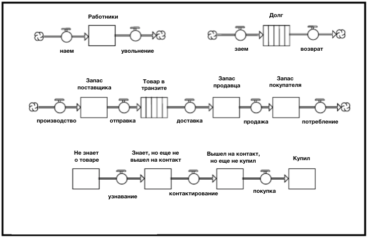
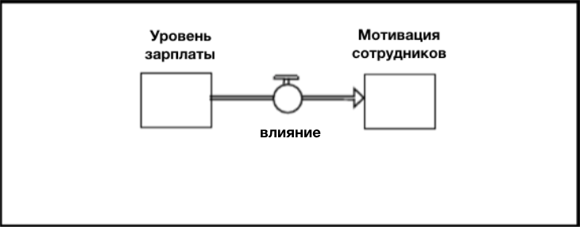
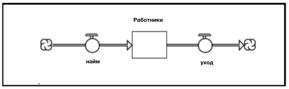
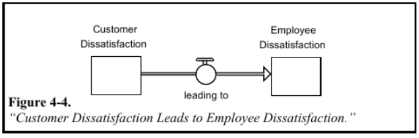

# Глава 4. Написание предложений. 
# *Операционное мышление.*

Для написания чего-то интересного, необходимо комбинировать существительные и глаголы и формировать из них «предложения». Предложения же, в свою очередь, создают абзацы. Абзацы уже *интересные*! Поэтому, умение писать предложения очень важно.

### Определение предложения

Простейшее «предложение» - запас со связанными с ним потоками. Сложносочинённое предложение состоит как минимум из двух запасов с одним объединяющим потоком. На Рисунке 4-1 показаны несколько простейших и cложносочинённых предложений.

**Рисунок 4-1. Простые и сложносочинённые предложения.**

### Грамматика

Как и в других языках, в языке программного обеспечения *ithink* существуют правила грамматики. К счастью, их немного. Всего два, если быть точнее. Разберите и запомните их, тогда вы станете мастером написания предложений на языке *ithink*!

#### Правило 1: сохраняйте согласованность элементов.

Первое правило заключается в сохранении согласованности элементов. Проще говоря, единицы измерения потоков, относящихся к конкретному запасу, должны совпадать с единицей измерения этого запаса, за исключением «единицы времени». Это правило может немного нарушаться в процессе «конвертации элементов», именно поэтому в 3 Главе было указано не злоупотреблять этим. 

В практическом значении это означает, что не надо смешивать яблоки с апельсинами. Как только вы выбрали единицу измерения, наименование запаса, всегда проверяйте, что товар, идущий в потоке, имеет *такую же* единицу измерения.

Несмотря на то, что это правило кажется очень простым со стороны, многим людям бывает сложно его соблюдать. Проблема возникает из-за общей расслабленности в манере говорить и недостатка «дисциплины» во многих языках карт и графиков. При использовании типичных программ для создания блок-схем, не нужно соблюдать *какие-либо* правила согласованности элементов, потому что они не основаны на *операционном* мышлении. В результате получаются изображения, которые показывают не истинные процессы, а скорее «что каким-то образом *соединено* с чем» или «что каким-то образом *оказывает влияние* на что».

В Системном мышлении «каким-то образом соединено» или «как-то влияет» *не* является достаточным. Специалисты по Системному Мышлению пытаются запечатлеть истинные происходящие процессы. Именно поэтому их целью зачастую является *изменение* работы процессов для *улучшения* финального результата. И привносить эти изменения, не обладая полной уверенностью в том, что вы знаете *причину*, отвечающую за нынешние результаты. 

Первым шагом в “отображении сущности» является определение различий между запасами и потоками. Вторым шагом является соблюдение правила единой единицы измерения между ними. Давайте рассмотрим несколько примеров, позволяющих понять существующие трудности. 

Фраза «уровень мотивации сотрудников влияет на зарплату» не будет казаться нелепой. И, если бы мы хотели использовать язык программного обеспечения *ithink* для «буквального изображения предложения», то это выглядело бы так, как на Рисунке 4-2. 

 
**Рисунок 4-2. Влияние уровня заработной платы на мотивацию.**

Хотя это звучит правдоподобно, когда вы говорите или пишете, если бы вы мысленно смоделировали перевод ithink (как показано на рис. 4-2), вы получили бы сумасшедший результат! Вы обнаружили бы, что для *роста* мотивации сотрудников, уровень зарплаты должен *снизиться*! В этом нет никакого смысла! Когда рисуют схему как на Рисунке 4-2, то подразумевается, что уровень зарплаты влияет на мотивацию сотрудников. Но если вы сделаете подобные заявления при использовании программного обеспечения *ithink*, то вы получите совершенно абсурдные результаты! Это говорит о том, что если вы используете мысленную модель, то это не означает, что вы получите результаты, которые *должны* по идее получиться - то есть это не работает так, как реальный мир. И это достаточно важный вывод, поскольку он позволяет вам учиться, то есть улучшать ваши мысленные модели!

Легко скорректировать диаграмму, представленную на Рисунке 4-2, чтобы связь между зарплатой и мотивацией была проиллюстрирована более верно, но это не является целью данной главы. Здесь важно то, что “предложения” ithink должны быть точными описаниями отношений между запасами и потоками, которые пополняют и опустошают их. Потоки не ”влияют" на запасы. Они также не являются ”входными данными" для запасов. Потоки *наполняют* и *осушают* запасы; они заставляют уровень вещества в ванне подниматься и опускаться. Если у ванны есть уверенность в себе, тогда уверенность в себе - это то, что течёт в нее и выходит из нее. Например, это не ”похвала", которая течёт, как можно было бы заключить из правдоподобно звучащего утверждения: "похвала укрепляет уверенность в себе.” Это нормально, что ты так говоришь, только не рисуй мысленную картину таким образом! Правильнее было бы сказать, что похвала - это одна из “деятельностных основ” для укрепления уверенности в себе.

Вывод: при конструировании «предложений» на языке программного обеспечения *ithink*, *всегда* проверяйте согласованность единиц измерения между запасами и потоками. Если они не совпадают (за исключением единицы времени, связанной с потоками), то это означает, что вы неверно изобразили этот аспект реальности. Если вы пренебрегаете правилами грамматики, вы столкнётесь с неправдоподобностью ваших моделей!  

Правило 2: Соблюдайте законы сохранения.

Второе грамматическое правило, на самом деле, тесно связано с первым. В физике существует известный закон, который гласит, что ничего не создается и не разрушается, а лишь меняет свою форму (то есть энергия сохраняется). Этот закон хорошо объясняет принцип работы вселенной. Когда вы овладеваете какой-то частью материального предмета, нужно помнить, что он изначально пришел откуда-то извне. Однако, то, что он поменял свое местоположение, не означает, что он перестал существовать. Его количество сохраняется неизменным! В этом и есть суть закона сохранения энергии. 

При построении моделей *ithink* вы будете довольно часто нарушать эти правила. Вам придется, иначе вы никогда не сможете построить модель. Однако, есть несколько корректных способов их нарушения… и несколько некорректных. Существует два допустимых способа нарушения рассматриваемых правил. 

Первым является принятие разумного решения о прерывании некой цепи физических потоков. Обоснование: то, что вы оставляете вне модели, не связано с проблемой, для решения которой вы используете модель. В качестве примера используем «предложение» с Рисунка 4-3…

**Рисунок 4-3.Простое предложение.**

«Облака» в конце двух потоков предполагают, что сотрудники, нанятые «из воздуха» и ушедшие, – одно и тоже. Это «правда?» Конечно, нет! Мы нарушаем священный Закон сохранения энергии. Но, надеюсь, мы делаем это *сознательно*. Например, мы *знаем*, что сотрудники действительно приходят откуда-то еще. Это «откуда-то еще» - это *запас*, а не «облако!». Но мы предполагаем, что для целей, которым должна служить модель, мы можем игнорировать «проблемы», связанные с тем, откуда они приходят. Например, мы будем использовать достаточное количество людей, при этом «качество» этих людей «не является проблемой». Эти предположения могут быть неправильными ... но по крайней мере: (1) мы сделали их *явными*, поэтому другие могут видеть их, а также у нас есть постоянное *визуальное* напоминание о том, что мы их создали, и (2) они были сделаны *сознательно*; вы не нарушаете Закон, потому что не обращаете на это внимания. Это первый корректный способ нарушить закон сохранения.

Второй законный способ нарушить этот закон - использовать запас для представления количества нефизических переменных, отличных от времени. Это связано с тем, что нефизические переменные не подчиняются законам сохранения! Например, если вы зададите вопрос: откуда берутся знания, гнев, приверженность или моральный дух? Правильный ответ ... из воздуха! Правильно, ни одно место (и ни один человек) не имеет меньше знаний, гнева, приверженности или морального духа, потому что у кого-то теперь больше. В этом и заключается суть!

При поиске переменных с высоким коэффициентом использования, стоит обратить внимание на нефизическую сферу. В отличие от физических запасов, чтобы увеличить величину нефизического запаса, нет необходимости уменьшать величину другого запаса. Если вы перераспределяете бюджет, количество сотрудников или время между группами внутри компании, то у одной группы ресурса становится меньше, а у другой неизбежно больше. Но если вы повышаете приверженность одной группы внутри организации, то вам не нужно «отбирать» это от любой другой группы! 

Как и в случае с сохранением единиц измерения, представление о том, что нефизические переменные не подчиняются законам сохранения, кажется очевидным. Однако многие люди, которые представляют нефизические переменные в своих моделях, похоже, испытывают проблемы с этим положением. Например, кто-то поддержит «предложение», изображенное на Рисунке 4-4, сказав, что «неудовлетворенность клиентов приводит к неудовлетворенности сотрудников». Трудно спорить со словами ... но легко спорить с диаграммой *ithink*. И также легко разрешить спор, моделируя модель! При моделировании вы обнаружите, что когда неудовлетворенность клиентов *снижается*, неудовлетворенность сотрудников *растет*! И это противоположно тому, что подразумевает словесное описание ситуации.

**Рисунок 4-4. Неудовлетворенность потребителей ведет к неудовлетворенности работников.**

Вы можете совершить грамматическую ошибку, работая над согласованностью единиц измерения, но в этом случае это довольно трудно, так как оба запасы выражены в единицах неудовлетворённости. Но *существует* проблема согласованности единиц измерения, и решение заключается в том, что нефизическая величина (отличная от времени) сохраняется. И моделирование подтверждает это. Клиенты не «передают» свое неудовольствие сотрудникам. Это не инфекционная болезнь! Благодаря выражению неудовлетворенности, клиенты могут стимулировать сотрудников развивать чувство неудовлетворенности внутри себя. Но именно сотрудники производят чувства - клиенты не «передают им» свои чувства!

Итак, второе правило построения грамматически верного предложения: *Не сохраняйте нефизические величины* (за исключением «времени»). Если так произошло, то проверьте единицы измерения. Вы должны обнаружить там проблему. Если нет, то начните процесс имитационного моделирования. Спросите, растёт ли запас, который пополняют, когда запас, осуществляющий пополнение, снижается. Если оба теста пройдут проверку, позвоните нам, мы разместим вас на нашем веб-сайте.

### Что дальше

Теперь вы должны знать, как проводить различие между запасами и потоками,
а также как писать грамматически правильные простые и сложные предложения. Эти два навыка составляют 2/3 того, чем вам необходимо овладеть, чтобы думать *операционно*. В следующей главе вы добавите третий раздел оперативного мышления для вашей армады: связывание предложений.

