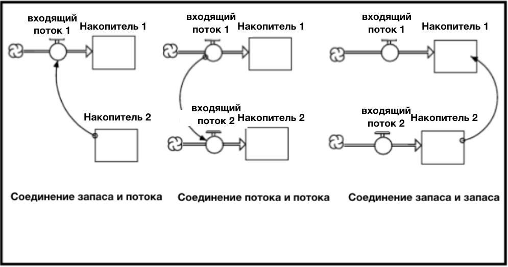
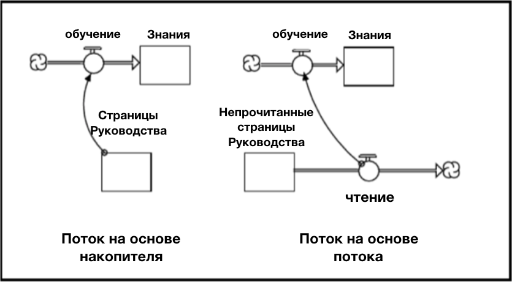
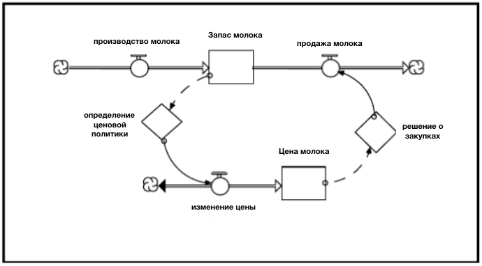
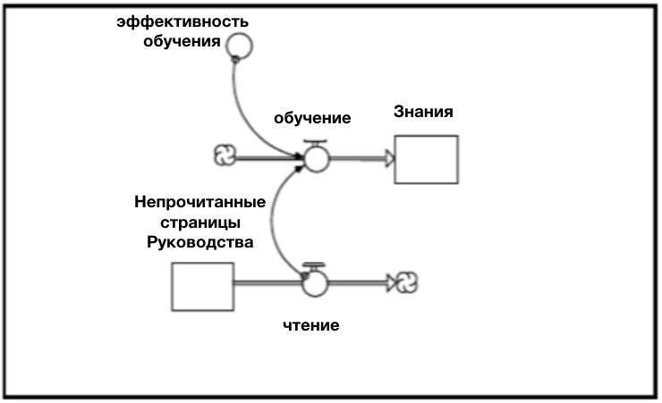
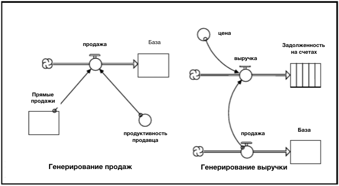
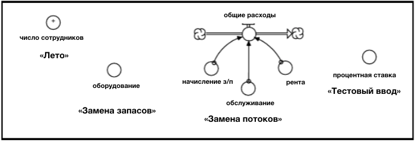

# Глава 5. Связывание предложений.
# *Операционное Мышление.*

Следующим важным шагом на пути к написанию абзацев является связывание предложений. Оказывается, есть только два способа сделать это.
Освойте различие между ними, затем узнайте, в каких случаях их использовать, и вы будете на пути к написанию абзацев!

### Два способа связывания предложений

Если вы думаете о том, как вы могли бы связать одно предложение с другим, то у вас есть три возможности ... но один из них не работает! На Рисунке 5-1 перечислены все три возможности.

**Рисунок 5-1. Три возможных способа связывания**

Первый способ заключается в соединении запаса из одного предложения с потоком другого предложения. Логика состоит в следующем: «условие» (то есть текущая величина запаса) создает вдохновение для принятия какого-либо действия (то есть заставляет объем потока быть больше нуля). Хорошим примером может быть, скажем, голод, стимулирующий вас есть... знакомы с этим, не правда ли?

Второй способ также правдоподобен. В этом случае одно действие «сопровождает» другое. Простым примером будет ваше чтение этого текста и связанное с ним обучение, которое сопутствует ему... что ведь происходит, правильно? 

Третий способ? Созданный с помощью дыма и зеркал ... программное обеспечение *ithink* не позволит такое соединение! Помните, что я сказал в Главе 3. Величина запасов не может изменяться. Величины запаса меняются только путем наполнения и опустошения. Заполнение и опустошение - это *действия* (то есть глаголы!). А глаголы представлены *потоками*, а не теми тоненькими маленькими «проводами», которые вы видите на Рисунке 5-1. Только поток может изменить запас. Таким образом, единственный способ связать предложения - это связать запас с потоком или поток с потоком. И, как вы скоро увидите, имеет значение, какую из этих двух возможностей вы выберете!

### Потоки, сгенерированные запасами и потоками.

Взгляните на Рисунок. 5-2. Решите, какая из двух схем наилучшим образом представляет процесс «передачи знаний», который происходит с материалом, который вы сейчас читаете...

**Рисунок 5-2. Потоки, сгенерированные запасами и потоками.**

Если вы сказали представление с потоком, вы были правы! Если представление с запасом было бы правильным, то все, что нам нужно было бы сделать, чтобы вы могли быстрее учиться, - это добавить страницы в Руководство. Вам не нужно было бы предпринимать никаких *действий*, чтобы изучить материал, содержащийся на этих страницах, вы бы приобретали знания просто потому, что материал был там! Согласно представлению справа, чтение представляет собой «основу деятельности» для обучения. Если вы перестанете читать, вы перестанете учиться.

Последнее утверждение может быть не совсем точным, потому что вы, конечно, можете узнать материал, содержащийся в этом Руководстве, другими способами, кроме чтения! Но, если речь идёт о чтении, то в самом деле, если вы прекратите читать, вы перестанете узнавать новое с помощью *этого* источника.

### Представление соединителя

В предыдущем примере мы решили проблему, которая является хороши примером того, что создание мысленных моделей – всегда хорошая идея. Однако, мы также могли бы смоделировать два представления на компьютере с помощью программного обеспечения *ithink*, и мы бы быстро обнаружили проблему с первым из двух представлений. Но вы решили провести свои мыслительные эксперименты, где первый шаг в соединении предложений вместе, это определение того, имеет ли смысл связывать запасы с потоком или поток с потоком. И после того, как вы определитесь, вы будете использовать «соединитель» (тонкий провод) для соединения. Соединители, в силу своей роли «линкеров», становятся *конъюнктами* на языке *ithink*.

Как вы уже заметили, есть два типа соединителей в языке ithink. Тот, который мы использовали на рисунке 5-2, сплошной провод, называется «соединителем действия». Это потому, что провод передает «действие», а не «информацию». Чтобы сделать различие более очевидным, рассмотрите Рисунок 5-3...

**Рисунок 5-3. Запас и спрос на молоко.**

Этот пример является продолжением «иллюстрации коров и молока» из Главы 2. Помните, что мы определили, что более «операционно» будет думать о *коровах*, производящих молоко, чем рассматривать этот процесс как «функцию» таких вещей, как ВНП и процентные ставки! На этом примере четко видно различие между двумя типами соединителей.

Информация (представленная штриховым коннектором) излучает уровни содержания молока и служит одним из факторов, влияющих на решение о цене. Полная «логика» решения не видна на картинке, потому что она встроена в сжатый по пространству бриллиант принятия решений (DPD). Однако из этого процесса приходит решение! Решение, например, должно снизить цену на 10% или повысить ее на 20% или держать ее постоянной. Но дело в том, что информация приводит к решению, а решение приводит к *действию*! Следовательно, пунктирная проволока начинает процесс, и сплошная проволока заканчивает его. 

То же самое верно и со стороны спроса. Информация о ценах на молоко поступает потребителям. Это часть того, что влияет на количество молока, которое они будут покупать, и, следовательно, на количество продаваемого молока. Потребители принимают решения о покупке, а затем предпринимают *действия*, т.е. покупают определенное количество молока в этот день / неделю / месяц.

Информационные соединители несут информацию, которая используется для принятия решений. Затем провода действия передают действие, вытекающее из решения. Действие проявляется как изменение объема потока. Четкое различие в назначении между двумя типами соединителей объясняет, почему только информационные соединители могут «вставляться» в DPDЮ . Однако, оба типа проводов могут «выходить» из DPD, поскольку в дополнение к действию, которое будет принято в результате принятия решения, также может быть передана информация о решении или о входных данных для этого решения. 

Соединители информации и действия похожи, поскольку ни один из них не может использоваться для представления связи с сохранением потока. То есть никакой «материал» не течет по любому из типов проводов! Когда информация «излучается», ее энергия не иссякает! Так, например, когда вы встаете на весы в ванной комнате, а информация о вашем весе тела исходит от циферблата, никакие фактические килограммы не теряются из-за изучения. Это не килограммы, которые излучают, это *информация* о весе тела, которая излучает! Таким образом, провод действия, по сути, играет роль устройства агрегации.

Аналогичная ситуация с потоком транспорта. Провода передаются. Соединители служат в качестве «входов» и «выходов», а не «притоков» и «оттоков». Возможность распознать эти различия - еще один навык *Операционного мышления*.

### Представляем конвертер

Проницательный наблюдатель заметил бы небольшую проблему на Рисунке 5-2.
Вы были обеспокоены тем фактом, что вся эта важность постоянства единиц измерения, которая была описана в Главе 4, как будто вылетела из окна?! Давайте сосредоточимся на второй схеме на Рисунке 5-2 – которая, как мы заметили ранее, была более точным из двух изображений. Каковы единицы измерения потока «вашего чтения»? Если у вас возникли проблемы с этим вопросом, помните, что единицы потока должны быть теми же единицами, что и запас, к которому он прикреплен, за исключением «единицы времени». Запасы выражены на «страницах». Поэтому «ваше чтение» должно быть измерено как «страницы за время». 

Существует последовательность действий, которая проходит от потока «вашего чтения» до потока «вашего обучения». Каковы единицы этого последнего потока? Опять же, вы можете начать с запаса, к которому прилагается поток вашего обучения, и направляться обратно. Хотелось бы надеяться, что вы пришли к выводу, что единицы потока должны быть «знанием за время» (или «пониманием за время»). Но как такое может быть, если провод, входящий *в* поток «вашего обучения» из потока «вашего чтения», имеет единицы измерения «страниц за раз?». Ответ таков: *это невозможно*!

Нам нужна другая концепция, ребята. И это не только для того, чтобы мы могли заставить подразделения работать правильно. Это для того, чтобы мы могли сделать представление более точным отражением реальности! Настаивание на последовательности единиц - это не просто компульсивная поведенческая черта, к которой каким-то образом привязались Системные мыслители. Это способ убедиться, что ваши представления отлично отражают, как все на самом деле работает. 

В этом случае давайте рассмотрим недостающую концепцию, сконцентрировавшись на процессах, а не на том, какие «единицы» нужно учитывать, чтобы заставить поток "вашего обучения" иметь верные единицы измерения.

Посмотрите, помогает ли следующий мыслительный эксперимент... Если трехлетний ребенок должен был читать эти страницы, будет ли он учиться так же, как и вы? Вряд ли. Почему? Потому что, во-первых, опыт обучения сделал вас более успешным читателем. Во-вторых, вы знаете больше и можете использовать это для понимания слов и изображений на страницах, которые вы переворачиваете. Кроме того, вы, вероятно, будете более мотивированы, чтобы изучить этот материал, чем среднестатистический трехлетний ребенок. Все эти факторы будут объединяться, чтобы вы могли узнать больше за страницу, чем ребенок. Операционно говоря, ваша «производительность обучения» (рассчитанная как «обучение на страницу») выше! Если мы добавим «производительность обучения» на картинку, мы получим Рисунок 5-4.

**Рисунок 5-4. Поправка Рисунка 5-2.**

Элемент языка *ithink*, который мы использовали для представления «производительности обучения», и который часто используется для представления «производительности» в одном из своих бесконечных разновидностей воплощений, называется *конвертером*. В этом контексте конвертер играет роль «наречия» в том смысле, что он модифицирует глагол «ваше обучение». Он рассказывает о том, как много обучения происходит для данной единицы «активности» (в данном случае «ваше чтение"). С точки зрения согласованности единиц он «преобразует» единицы, введенные в поток обучения из потока чтения (т.е. Страницы / время) в соответствующие единицы обучения (знание / время). Если вы хотите изучить алгебру, это будет выглядеть так:

Ваша обучение производительность (*знания/время*) = ваше чтение (*страницы/время*) х ваше обучение (*знания/страница*)
Примечание: единицы измерения в левой части уравнения равны единицам измерения в правой части уравнения - это делает жизнь стоящей, физики улыбаются, а учителя алгебры прыгают от радости. Это также дает представления, которые более точно отражают действительность. В результате, когда вы моделируете представления для того, чтобы сделать выводы о том, какие действия вы должны предпринять, у вас больше шансов, что эти выводы имеют смысл!
Таким образом, конвертеры часто играют роль «наречий», изменяющих потоки. В этой роли они рассказывают, какая часть вклада в деятельность делается на единицу «драйвера» этого вида деятельности - будь то «драйвер» потока (как в примере, который мы только что рассмотрели), или запасов. Давайте рассмотрим еще два примера, чтобы закрепить понимание концепции. Изучите рисунок 5-5 ...

**Рисунок 5.5. Иллюстрация конвертеров как наречий**

Первое представление на рисунке 5-5 изображает процесс деятельности по продажам. Продажа рассматривается как «сгенерированный запасами» поток. Во втором представлении доход представляет собой поток, генерируемый потоком. В обоих примерах конвертер используется для «изменения» потока.

Термин «производительность» продавца преобразует количество людей в структуре продаж (т.е. является «драйвером» потока продаж) в поток продаж, единицами измерения которого являются «продукт / время». Термин продуктивности в этом случае имеет единицы измерения: "продукт/продавец / время.” Продажа, как мы уже знаем, имеет единицу измерения «единицы продукта / времени». Цена несет в себе преобразование в этом случае. Она имеет единицу измерения «$ / единица продукта».

Оба конвертера функционируют как «условия производительности». Средняя производительность продавцов говорит о том, насколько продуктивно, в среднем, каждый продавец занимается продажами. Цена говорит о том, насколько продуктивно каждая единица продаваемого продукта генерирует доход.

Хотелось бы надеяться, что предыдущие примеры донесут концепцию конвертеров как «наречий» - или в более существенном контексте, как «условий производительности». Здесь мы находимся на твердой почве, как грамматически, так и концептуально, с точки зрения описания того, сколько процессов произведено. Фактически, две композиции потока, проиллюстрированные на Рисунке 5-5, так часто повторяются в моделях *ithink*, что мы дали им имена. Формулировка *сгенерированный запасами* называется «Процессом внешних ресурсов», а формулировка *генерируемый потоком* называется «процессом совместного потока». Вы должны запомнить эти композиции потока. Вы найдете их чрезвычайно полезными при построении моделей с использованием программного обеспечения *ithink*.

В Главе 6 мы представим еще три общих шаблона потока, в результате чего общее число будет равно пяти. Здесь, в системах isee, мы используем один из этих пяти шаблонов, чтобы обозначить 90% потоков в моделях, которые мы строим. Способность творчески адаптировать и использовать эти временные ограничения является отличительной чертой того, кто овладел операционным мышлением.

Шаблоны потоков - это элементы красоты. Но теперь мы собираемся уравновесить всю эту красоту щепоткой «уродства»...

### Конвертеры – ящики Пандоры

Оказывается, эти красивые, безобидные маленькие круги, которые мы называем конвертерами, могут функционировать не только как наречия. Они могут работать как прилагательные, причастия ... или любая другая часть речи, которую вы хотите, чтобы они представляли! Да, в этой мази есть мухи. К сожалению, не все так прекрасно. Конвертеры становятся универсальными для выполнения алгебраических операций (например, суммирование или деление двух величин), заменяя концепты запаса или потока, которые вы выбираете (из соображений упрощения). Я кратко проиллюстрирую некоторые из этих практических и не очень красивых (концептуально или с точки зрения грамматики) использований конвертеров. Затем вы, возможно, обнаружите ещё больше возможностей, просматривая различные модели, поставляемые программным обеспечением *ithink*.

Несколько различных способов применения конвертеров показаны на рисунке 5-6.

**Рисунок 5.6. Использование конвертеров.**

#### Летний конвертер

«*Лето*», да, это то, что мы очень хотели бы иметь в Нью-Хэмпшире. Поэтому мы добавили его в программное обеспечение. Маленькое устройство полезно для «сложения» величин без необходимости «запускать все стрелки» в какой-то бедный несчастный конвертер. Летние конвертеры (выбор в диалоговом окне конвертера) позволяют вам добавлять любые количества, которые вам нравятся, просто нажав на них в списке Допустимых. Только убедитесь, что вы нажимаете на правильные кнопки, потому что здесь нет визуальной обратной связи!

#### Замена запасов

«Капитальное оборудование», переменная, выбранная для иллюстрации «замены запаса», в принципе является запасом. Однако, если вас не интересует приток в запас (т.е. инвестирование) или отток (т.е. уход на пенсию), вы можете упростить ситуацию, просто представляя капитальный запас в качестве конвертера. Как мы увидим в одной из следующих глав, конвертеры со временем *могут* меняться. Они не всегда являются постоянными! Таким образом, использование конвертера для замены чего-то, что является запасом по сути, не означает, что вы теряете способность изменять эту переменную со временем. Это значит, что вы будете рассматривать эти изменения как «внешние входы», а не как те, что были созданы отношениями внутри модели. Более подробно об этом будет рассказано, когда мы перейдём к «петлям обратной связи» в следующей главе. На данный момент достаточно сказать, что существуют случаи, когда упрощение диктует, что вы представляете нечто, что является, по идее, запасом с конвертером.

#### Замена потоков

Третий пример на Рисунке 5-6 иллюстрирует использование конвертеров для замены потоков. Вместо того, чтобы иметь каждую категорию расходов в отчете о прибылях и убытках представленную как поток, вы можете представить эти концепции потока в качестве конвертеров, а затем, как на иллюстрации, сложить их в один поток. Существует одна проблема, о которой вам следует знать, когда вы это делаете. Конвертеры рассчитываются *перед* потоками. Таким образом, при использовании конвертера для представления потока вы должны сначала кликнуть на любой конвертер в списке, чтобы выбрать его. Затем нажмите кнопку C  F (в диалоговом окне «Таблица»). Это приведет к сдвигу во времени представления расчетных значений для всех таких конвертеров, поэтому они будут согласовываться с сообщёнными значениями потоков. Подробнее об этом можно узнать в *Файлах справки*.

#### Тестовый ввод

Как вы видели, если вы прошли учебные программы по программному обеспечению или просто играли с программным обеспечением, в диалоговом окне каждого конвертера есть прокручиваемый список «Встроенных» функций. Эти «функции» позволяют создавать различные типы «шаблонов» (например, пандусы, ступени, хаотичность, синусоиды и т.д.), которые полезны для тестирования вашей модели, а также для использования в качестве «экзогенных входов». Подробнее сказано об этих переменных в 3 части Руководства, где мы обсудим тестирование.

### Что будет далее

В последних двух разделах вы познакомились с тем сущностью *Операционного Мышления* - большой составляющей Системного мышления. Есть и вторая большая часть. Она называется *Замкнутым мышлением*, и будет объяснена вам в Главе 6. Овладейте этими двумя "гигантами", и вы сможете подать заявку на карточку члена Союза системных мыслителей. Также вы научитесь писать хорошие абзацы- строительные блоки коротких рассказов.
