## Глава 6. Создание «Простых» абзацев. Замкнутое мышление
«Абзац» в контексте Системного мышления представляет собой «цикл обратной связи» - замкнутый цикл причинности. В предыдущих частях говорилось о том, что «абзацы» представляют собой интерес. Они интересны тем, что подобно заводным игрушкам – вы заводите их, а затем они действуют самостоятельно. То есть, циклы обратной связи *самостоятельно генерируют поведение.* Если вы столкнулись с таким - уходите с дороги!

Существует два типа петлей обратной связи: *противодействующий* и *усиливащий* (иногда заменяются техническими аналогами: *негативный* и *позитивный*, соответственно). Мы начнем с формального определения петли обратной связи, затем рассмотрим оба типа по отдельности, а также их комбинации. В данной главе мы остановимся только на *простых* циклах обратной связи, *простыми* они являются с технической точки зрения, а не как мера сложности. В седьмой главе мы познакомимся с *непростыми* абзацами.

### Определение Петли обратной связи
*Петля обратной связи* существует только тогда, когда «существительное» (уровень) связано с «глаголом» (потоком) в *одном* предложении. Связь может быть прямой, либо являться частью цепочки ссылок, изначально проходящих через другие «предложения». Пример прямой и расширенной связи показан на рисунке 6.1.

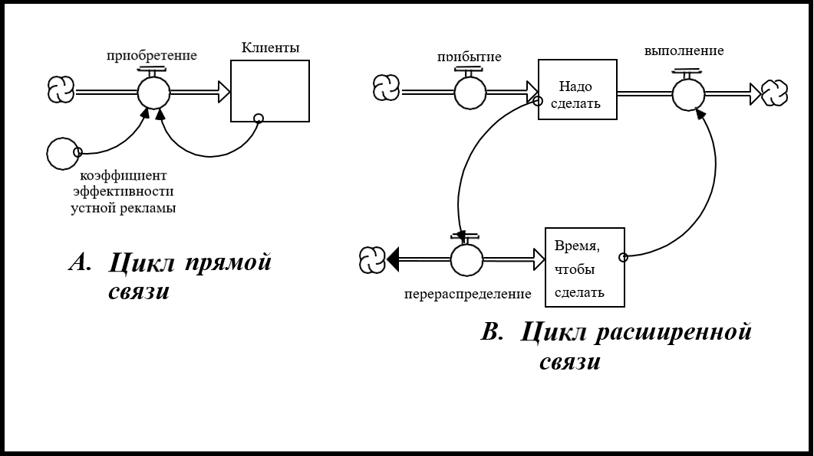 

**Рисунок 6.1. Петли с прямой и расширенной связью**

#### «Простые» циклы обратной связи

В примере с «прямой» связью новые клиенты привлекаются благодаря старым при помощи *коэффициента эффективности устной рекламы*. В случае с «расширеной» связью все зависит от объема не выполненной в срок работы - ее рост/сокращение влияет на количество часов, выделенных на работу (*второй* уровень). Увеличение/сокращение часов работы вызывает увеличение/сокращение скорости выполнения работы, тем самым приводя всю систему в равновесие и компенсируя просроченную работу.

В обоих случаях существительное соединено с со своим «соседом» по предложению - глаголом. Каждый раз, когда такое происходит, мы имеем «цикл обратной связи». Подобные циклы очен важны для функционирования *всех* природных, физических и социальных систем. Без них не существовало бы ни единой формы жизни! Это однозначно говорит о том, что нужно больше узнать о принципах их действия.

#### *«Простые» циклы обратной связи*

Для обеспечения понимания процесса, следует начинать с наиболее простого. Это, безусловно, случай с циклами обратной связи, где  развитие событий может разворачиваться с бешеной скоростью. Важно иметь фундаментальные знания о структуре и поведении циклов обратной связи для последующего укрепления и накопления информации. Поэтому, в первую очередь, мы поговорим о концепции «простых» циклов.

«Простой» цикл обратной связи определен так по той причине, что имеет лишь одну *прямую* связь (в данном случае, связь уровня с притоком и оттоком), где все параметры (с точки зрения «производительности») являются постоянными. Такой цикл отображен на Рисунке 6.1А.

### Противодействующие циклы 

Циклы называются противодействующими, когда *препятствуют* изменениям. Любое действие, выполненное внутри такого цикла, вызывает противодействие в *обратную сторону*.

Подобные циклы можно встретить повсюду - каждая клетка нашего тела использует их для поддержания установленного химического и электрического баланса, обеспечивающих нашу жизнеспособность. По принципу таких циклов госудрство поддерживает уровень торговли и военного оснащения. И каждый организм любой формы жизни использует их для соблюдения порядка и сохранения правильных пропорций. Противодействующие циклы призваны поддерживать стабильность, так как без ее поддержания невозможна ни сама жизнь, ни рост. Ниже приведены некоторые примеры противодействующих циклов в действии.

Внедрение изменений внутри организации обычно вызывает ответную реакцию - сопротивление. Повышение температуры при физической нагрузке активирует процесс потоотделения для охлаждения тела до нормального состояния. Падение прибыли заставляет одновременно сократить расходы и увеличить доходы - оба процесса направлены на возвращение былой прибыли. Совершенная оплошность является угрозой для взаимоотношений, которая должна быть исправлена. Отток клиентов к конкурентам заставляет задуматься о способах возвращения клиентов обратно.

На рисунке 6.2 представлены два случая *простых* противодействующих циклов. Подобно примерам с «Внешним источником» и «Смежным потоком» из пятой главы, такие процессы имеют место быть. Поэтому, как и их предшественникам, мы дадим им имена - «истощение» и «восполнение» уровня, соответственно. В приложении к данной главе кратко изложена информация о пяти основных шаблонах потоков, установленных в процессе работы (с пятым мы познакомимся позже, в этой главе). Мы пользуемся одним из пяти шаблонов, чтобы описать 80%-90% потоков в построенных нами моделями. Если вы хотите получить углубленные знания в области Системного мышления, изучите каждый из шаблонов более детально и обстоятельно, чтобы знать, в каких условиях применять тот или другой.

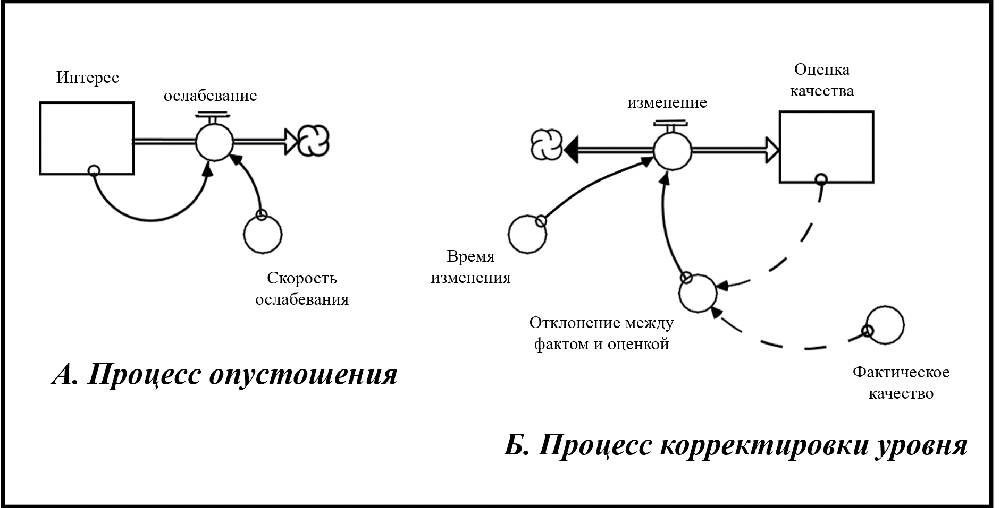

**Рисунок 6.2. Две реализации Простых противодействующих циклов**

#### *Процесс истощения*

Шаблон «истощения» используется преимущественно для описания процесса пассивного распада. В примере на рисунке 6.2 пик осведомленности «падает» - дела пускаются на самотёк (например, без использования рекламных роликов освеомленность со временем пропадает).Другие обобщенные примеры процесса истощения затрагивают процессы осознания, восприятия и памяти. Мы все помним ситуацию с зубрежкой при подготовке к тестам с закрытыми вопросами, требующих точного воспроизведения фактов без понимания сути. Заученные всю ночь ответы в спешке кое-как вносятся в старые добрые бланки. Через неделю забывается 30% материала, через две недели - 50%, и так далее.

Процесс именуется истощением, исходя из принципов действия - он не компенсируется новыми притоками. В таком контексте процесс истощения демонстрирует *отток ресурсов* На рисунке 6.3А показан случай, когда «доля истощения» или «время истощения» постоянны.

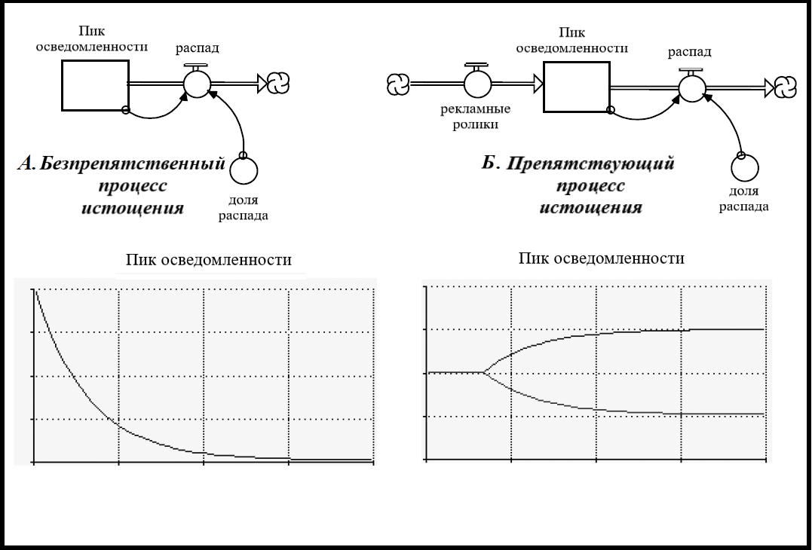

**Рисунок 6.3. Процесс истощения с постоянной долей распада**

Математически модель является «отрицательной экспоненциальной». Однако мы будем именовать ее «экспоненциальным распадом», так как верим в оставшуюся «позитивность».  На простом языке модель называют «половина расстояния до стены». Чтобы понять, почему, представьте, что все ресурсы - это «расстояние до стены». Истощающий поток может быть «нарастающим», где параметр истощения - это *доля затраченного уровня за единицу времени*. Представим, что доля равна 0.5 (т.е. 50% уровня в секунду - чтобы сохранить уровень прежним, нужно совершать 1 шаг в секунду). Допустим, изначально вы находитесь на расстоянии трех метров от стены. После первого шага вы преодолеете 1.5 метра от всего расстояния - пройдете половину пути до цели. Сейчас вы в полутора метрах от стены. На следующем шаге вы снова пройдете половину оставшегося расстояния - 0.75 метра, и так далее. Каждый следующий шаг сокращает оставшуюся до стены дистанцию вполовину.  

Если вы приверженец математических методов, то вы однозначно понимаете, что при желании выполнить данный эксперимент на практике, вы обнаружите, что достичь стены так и *не получится*. Это правда, но с практической точки зрения оказывается, что за время, равное «утроенной временной постоянной» (под «константой периода времени» мы подразумеваем параметр, обратный «доле истощения») уровень снизится настолько, чтобы можно будет считать накопитель опустошенным (уровень снизится примерно на 95% от первоначального значения).

Рисунок 6.3В демонстрирует процесс истощения с постоянным *противостоящим* притоком. Две линии на рисунке демонстрируют две имитации. На короткий промежуток времени в начале обеих имитаций приток и отток равны по значению и постоянны. В результате уровень остается неизменным. Поэтому две линии изначально плоские и равные (в начале рисунка мы видим лишь *одну* линию по этой же причине). Величина притока первой имитации *растет* до более высокой константной величины. А приток второй имитации *падает* до более низкого значения константы. В результате изменение уровня на данном рисунке отображают две симметричные противоположные кривые.

Случай с постепенным снижением в процессе истощения является «классическим» экспоненциальным распадом, но с одним отличием - значение падает до *ненулевого* уровня, значение которого можно легко посчитать. Уровень перестанет падать, когда величина оттока дойдет до точки, в которой отток будет равен падающему притоку. Объем оттока можно получить, умножив текущее значение уровня на долю распада. Когда значение дойдет до отметки, в которой подсчитанное значение численно будет равно объему притока, наступит равновесие и уровень останется постоянным. 

Случай с постепенным ростом отличается от предыдущего, и процесс уже не подчиняется классическому экспоненциальному закону. Это происходит по причине полного отсутствия спада. Однако мы видим на графике кривую, являющуюся зеркальным отображением экспоненциального процесса. Это та самая модель «половинного расстояния до стены», более известная, как «ассимптотический рост». В данном случае
уровень растет, так как приток постепенно увеличивается, а отток остается неизменным и постоянным по значению. Вскоре объем оттока (напомним, рассчитывающийся как произведение уровня на долю спада) начинает расти. Уровень все еще продолжает увеличиваться, но гораздо меньшими темпами. Рост уровня прекращается полностью, когда величина нарастающего оттока численно становится равной величине притока, система приходит в равновесие.

Как вы уже заметили, процесс истощения может протекать по-разному. Это лишь часть модели *половинного расстояния до стены*, названной так за характерное соответствующее поведение *противодействующих циклов обратной связи*, действующих без встречного *сопротивления*. Процесс *истощения уровня* - лишь частный случай процесса *корректировки уровня*

#### *Процесс корректировки уровня*

На рисунке 6.4 представлен шаблон Корректирования уровня с характерными процессами.

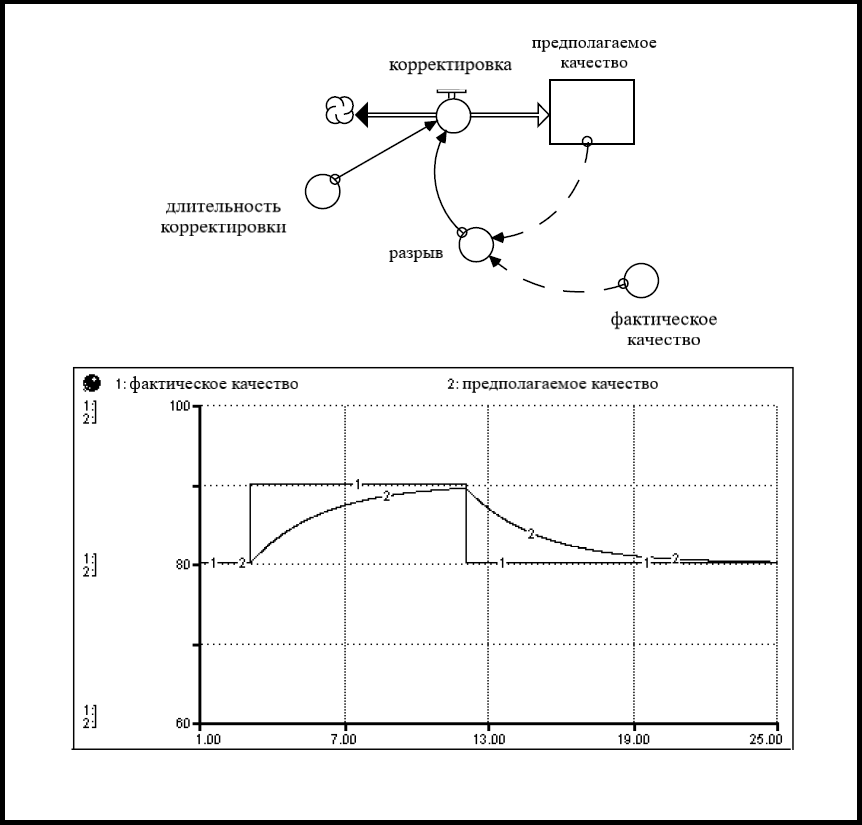

**Рисунок 6.4. Корректирование уровня с характерными процессами**

Бегло взглянув на рисунок 6.3B, вы увидите сходство между процессом истощения с *противостоящим* притоком и процессом корректровки уровня. Оба демонстрируют модель «половинного расстояния до стены». Как было оговорено ранее, истощение - лишь частный случай корректировки уровня, в котором «цель», на которую нацелена корректировка уровня (в примере - Фактическое качество) *никогда* не превысит по значению сам уровень, иначе говоря, это модель корректировки уровня с выходящим потоком.

#### *Противодействующие циклы - выводы*

Ключевая мысль - «простые» противодействующие циклы являются реализацией модели *половинного расстояния до стены*. Они либо демонстрируют экспоненциальный распад количества некоторой величины или параметра, либо ассимптотически растут относительно нее же. Изучение противодействующих циклов станет гораздо интереснее, когда мы добавим в процессы дополнительное «предложение» и допустим изменение некоторых параметров (таких как доля истощения и длительность корректировки). Но «интересные» абзацы мы рассмотрим в седьмой главе. А пока изучим «простые» *усиливающие* циклы.

### Усиливающие циклы 

Циклы получили свое название благодаря принципу действия - они *усиливают* изменения - это похоже на лавину! 

Усиливающие циклы менее распространены в природе и социуме, чем их противодейстующая братия. И это большая удача! Иметь дело с усиливающими циклами значит держать тигра за хвост. Тигры обладают большой силой. Держите силу под контролем - обладаете мощным оружием, потеряете контроль - разрушите систему. Рассмотрим противодействущие циклы в действии...

Резкий всплеск популярности вебсайтов, CD-дисков, видеофильмов. Стремительный взлет и последующее падение цен на рынке доткомов. Быстрое рзмножение раковых клеток. Распространение инфекционных заболеваний, мода на что-либо. Агрессивное поведение на дороге. Вербовка противников и приверженцев-фанатиков за и против, инициатива организационных изменений. Взлетевшие зарплаты агентов франшиз высших спортивных лиг. Быстрый рост населения в южных городах США. Данные примеры показывают усиливающие циклы в полной красе. Такие циклы *подпитываются собой же*, являясь по природе своей *усугубляющими*. По сути, в этом нет ничего «плохого», но - и это важное «но» - усиливающие циклы не могут продолжаться вечно. Многие люди не могут осознать это сразу, поэтому позвольте мне повторить еще раз: «*Не существует самоусиливающих процессов, которые могли бы длиться вечно*».

Все растущее рано или поздно достигает предела. Предел может быть «сознательно избранным», либо «вынужденным» (навязанным). Последний гораздо интереснее смотрится на графиках.

Говоря об избранных пределах, можно назвать материальные запасы. Реальный рост уменьшает потенциальный. Возьмем к примеру привлечение новых клиентов в рестораны по откликам или новых пользователей на сайт - число доступных к привлечению клиентов/пользователей будет со временем сокращаться. Строго говоря, любой человек, посетивший ресторан или зашедший на сайт, способствует этому лично. Это похоже на пресыщение рынка. Раковые клетки действуют похожим образом, только исчерпывают не количество клиентов/посетителей, а питательные элементы, отчего здоровы клетки умирают от недоедания. В конечном счете это прекращается. Рост *должен закончиться*, потому что топливо окажется исчерпанным.

В случае с нематериальными ресурсами, которые труднее учесть, пределы менее ощутимы, однако они существуют. Растущая уверенность превращается в надменное высокомерие. Энтузиазм невозможно удерживать на одном уровне по причине сжигания эмоциональных ресурсов.

Несмотря на повсеместное существование «пределов» в любом процессе роста чего-либо, многие люди до сих пор удивляются, столкнувшись с этим лично. К примеру, крах рынка доткомов шокировал инвесторов, однако, всерьез ли они верили в то, что такие космические цены на акциии и высокие оценки IPO могут продолжаться вечно? Верили ли жители Южной Калифорнии в 60-х, что рост популярности их «утопии» будет длиться и дальше? Могут ли советы директоров крупных корпораций рассчитывать на вечный *устойчивый* рост прибыли?

В каждом таком примере и во многих других хотелось бы услышать ответ «да». Я надеюсь, что, читая эту книгу, вы измените представление об этих ситуациях и поделитесь мнением с теми, кто до сих пор верит в то, что «это будет проолжаться бесконечно». Можно сделать мир чуть лучше, распространяя идею *предельности роста*. Однако есть существенное различие в зависимости от того, устаовлен ли предел самостоятельно, или это вынужденное ограничение. Последнее гораздо более болезненно.

#### *«Простые» усиливающие циклы*

Рисунок 6.5 описывает поведение *простого* усиливабщего цикла и характерные для него процессы. Это «сложный» процесс, являющийся пятой, финальной моделью поведения потока. Подобная ситуация, знакомая большинству людей, имитирует «экспоненциальный рост». Этот случай отличается от модели «половинного расстояния до стены» тем, что стена отдаляется (все более стремительно). Это похоже на попытку поймать собственную тень - чем быстрее вы бежите за ней, тем быстрее она от вас отдаляется.

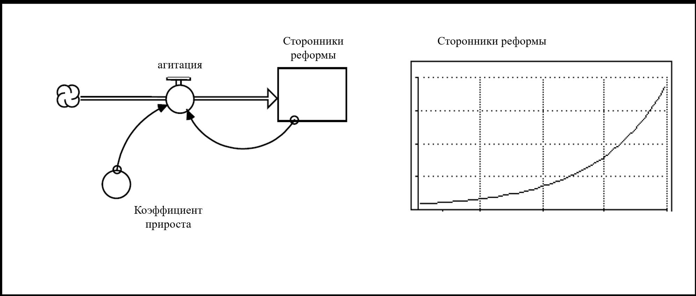

**Рисунок 6.5. Характер и Поведение простого усиливающего цикла**

Модель не особо нуждается в объяснении. Мы добавляем что-либо (деньги, энтузиазм, количество завербованных фанатиков) в уровень. Затем все растет, как снежный ком. Говоря о деньгах - ваши средства на сберегательном счету генерируют приток новых денег пропорционально объему имеющихся накоплений. Для расчета объема поступающих средств используется «процентная ставка». Почти так же дела обстоят с привлечением или изменением мышления людей-фанатиков - привлекая часть, вы раскручиваете дальнейший процесс. Это подобно инфекции и *размножению фанатиков*. Другими словами, уровень «растет за счет себя же». Это означает, что приращение уровня происходит постоянно на один и тот же процент, но к уже имеющемуся объему. Уровень растет и, как следствие, пропорционально растет входящий поток. В итоге кривая уровня (и потока) взлетает подобно ракете! Приведу небольшой рассказ, прекрасно иллюстрирующий природу экспоненциального роста.

У одного фермера во владениях имелось озеро, в котором водились сомы. Одним чудесным весенним утром он заметил на поверхности воды кувшинку. На следующий день их стало две, а на третий день и вовсе - четыре кувшинки. Через 29 дней лисья кувшинок закрыли пол пруда. Фермер начал переживать, что кувшинки плодятся непомерно быстро, что может сказаться на численности сомов в пруду. Он задался вопросом - сколько же у него осталось времени на то, чтобы предотвратить дальнейшее размножение кувшинок. Сможете ли вы угадать, сколько? 

Ответ прост: фермер ждал слишком долго - на 30-й день пруд будет полностью покрыт кувшинками. Такова природа экспоненциального роста...он подкрадывается к вам. И прежде, чем вы это заметите - вам конец! Однако большая удача, что не так много усиливающих циклов существуют отдельно от противодействующих, которые их  контролируют. Но, поскольку некоторые усиливающие циклы очень мощные, то ситуация может выйти из-под контроля, прежде, чем *сознательно избранные* противодействующие циклы остановят их. Если это произойдет, в игру вступают уже «вынужденные», и дело становится плохо.

Как говорилось ранее, ситуация становится интереснее, когда мы выходим за рамки «простых» циклов. Но прежде давайте разберемся до конца с «простыми», а затем уже двинемся дальше к более сложным вариантам. Рисунок 6.6 заключае в себе комбинацию простого противодействующего и простого усиливающего циклов вместе, демонстрируя характер их поведения.

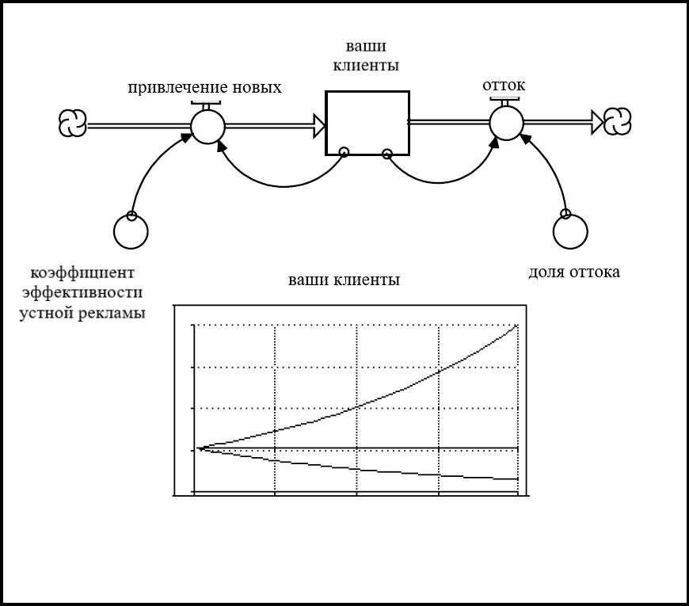 

**Рисунок 6.6. Комбинация Простого противодействующего и Простого усиливающего циклов**

Как видно, комбинируя простой препятствующий и простой усиливающий циклы, мы имеем в результате 3 модели динамического поведения. Какая из них станет доминирующей зависит от значений двух параметров (доли «прироста» и «истощения»). Когда они равны, уровень остается прежним, то есть доминирующего цикла нет, оба равны по силе воздействия. Когда «доля прироста» (коэффициент эффективности устной рекламы) превосходит «долю истощения» (отток), уровень демонстрирует экспоненциальный рост. Это значит, что усиливающий цикл доминирует, и так будет продолжаться бесконечно (в этой простой модели). Когда «доля истощения» выше «доли прироста», доминирует уже противодействующий цикл, и уровень будет экспоненциально падать (опять же, в это модели постоянно).

На этом всё. Не так уж сложно, правда? Как только появляются два параметра - реализуется одна из трех моделей возможного поведения, которая впоследствии сохраняется. В седьмой главе мы разрешим параметрам «простых» циклов динамично меняться. Мы откроем тот факт, что циклы могут перехватывать доминирующую позицию с течением времени. К примеру, усиливающий цикл изначально может преобладать, однако в это время мощность препятствующего цикла будет продолжать расти. В определенной точке это позволит противодействующему циклу переломить ход событий. Подобные изменения доминирования циклов - это последствия «нелинейного поведения», описанного в Главах 1 и 2, что подтвержает важность тренировки «нелинейного мышления» как навыка в Системном мышлении.

Вы прошли долгий путь, и осталась последняя по порядку глава до завершения изучения финальных «структурных элементов коротких историй», начатых в Главе 3. Вы уже познакомились с Операционным мышлением и Замкнутым мышлением. В седьмой главе вы окончательно разберетесь с замкнутыми циклами и перейдете к Нелинейному мышлению. Помимо, вы узнаете, как создавать расширенные циклы с меняющимися параметрами. Изучив все это, вы отточите навыки скрепления абзацев для создания содержательных историй.

## Приложение
*Обобщенные Модели потоков*

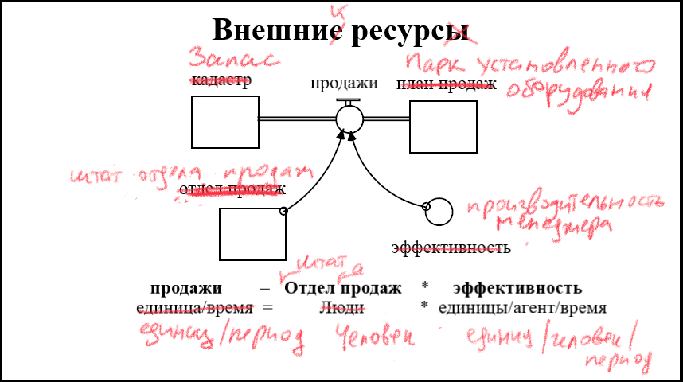

**Рисунок 6.7. Модель Внешних ресурсов**

Данный шаблон рекомендован к использованию, когда помимо уровня, который питает поток, существует некоторый ресурс, производящий поток. Обычно этим ресурсом является еще один уровень («внешний ресурс»), но это может быть и преобразователь.

Внешний ресурс выступает в роли катализатора для генерации вхоящего потока (так как он не потребляется в процессе). Ниже представлены некоторые примеры представления данной модели...

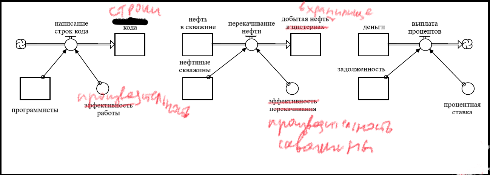

**Рисунок 6.8. Примеры создания Модели внешнего ресурса**

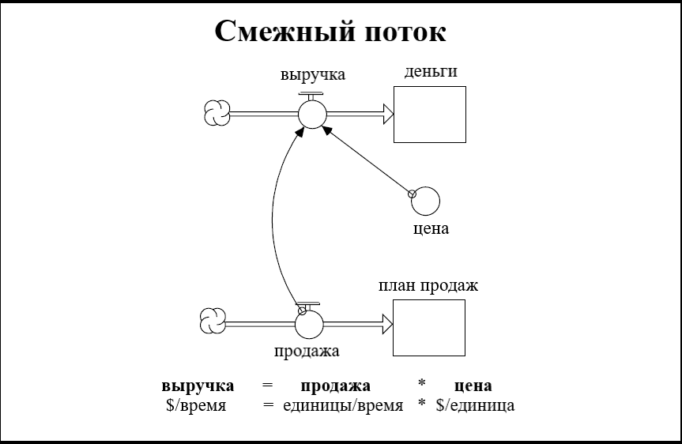

**Рисунок 6.9. Модель Смежного потока**

Модель со «смежным потоком» используется, когда вам необходимо показать, что «основная активность» сосредоточена в параллельном потоке. Это также полезно, когда вы хотите отслеить признаки, влияющие на уровень.

В таких процессах смежный поток (*выручка*) привязан к другом, приоритетному потоку (*продажи*). Продажи генерируют выручку. В процессах со смежными потоками вводятся основной поток и коэффициент преоразования (*цена*). Обычно смежный поток определяется двумя продуктами. Таким образом, два потока отличаются лишь коэффициентом преобразования. Немного примеров...

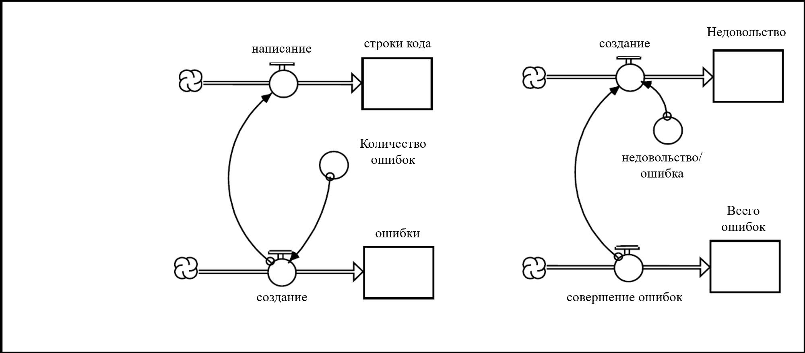

**Рисунок 6.10. Примеры Модели Смежного потока**

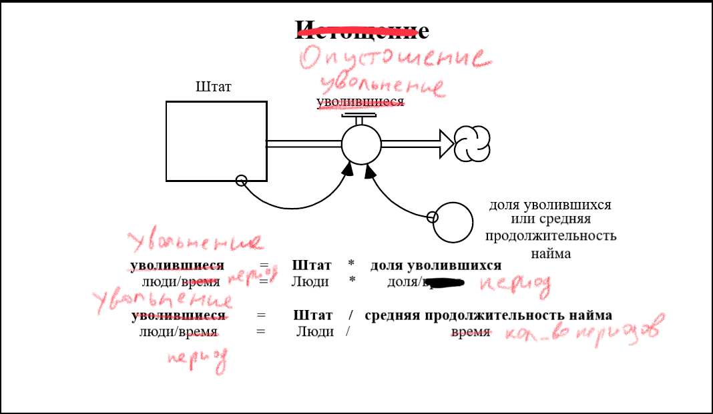

**Рисунок 6.11. Модель Истощения**

Шаблон рекомендован к использованию, если вы хотите показать *истощение, пассивный распад с течением времени* некоторого уровня, ресурса. В процессах истощения поток генерируется уровнем, к которому привяззан.

Поток (*отток* уровня) в данной модели представлен объемом уровня и долей истощения. Доля истощения - число утраченных единиц в единицу времени. В некоторых ситуациях вы, возможно, захотите заменить «временную константу» на долю истощения. Постоянная времени - обратная величина к скорости (доле) истощения. Она показывает среднее время, которое требуется единице уровня на то, чтобы пройти через уровень, когда он «устойчив». Ознакомьтесь с примерами ниже:

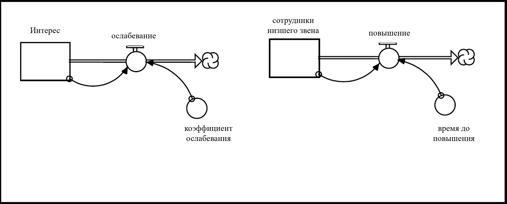

**Рисунок 6.12. Примеры Модели истощения**

**Рисунок 6.13. Модель корректировки уровня**

Используйте модель **корректировки уровня**, чтобы «скорректировать» уровень на целевой показатель. Это помогает пересмотреть свое мнение о чем-либо с появлением новых доступных данных.

Поток определяется *разницей* между уровнем (*Предполагаемое качество*) и целью (*Фактическое качество*) при помощи показателей *длительность корректировки* или *доля скорректированных едииц*. Это *двойной поток* (*би-поток*). Каждый раз при наличии разницы между уровнем и целевым показателем, поток будет *корректировать* уровень в сторону целевого показателя. 

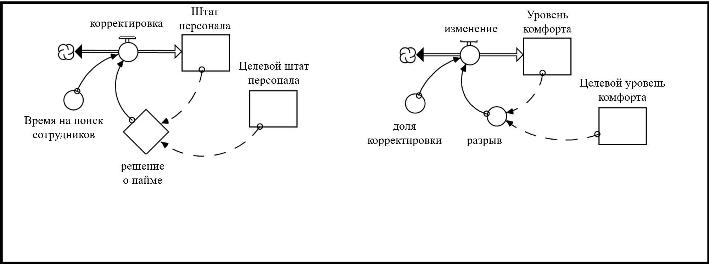 

**Рисунок 6.14. Примеры Модели корректировки уровня**

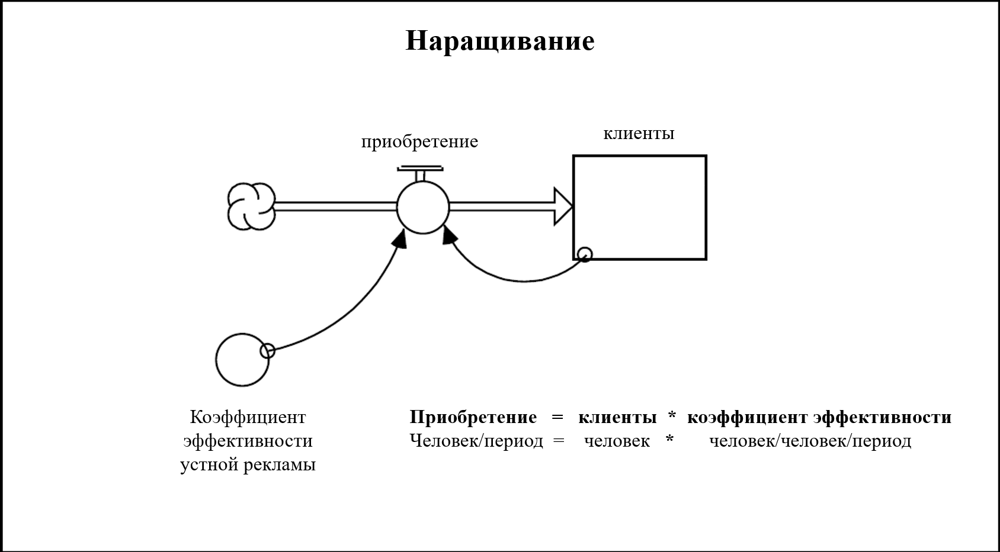 

**Рисунок 6.15. Модель усугубления**

Шаблон **усугубления** применим для самоусиливающихся процессов, поток генерируется уровнем, в который входит этот поток.

Составлющие потока - уровень (*Клиенты*) и доля усугубления (*канал привлечения*). Поток (*входящи*) уровня состоит из двух компонентов. Доля усугубления может быть представлена уровнем или преобразователем. Измерения выражаются параметрами «единицы/единица/время», где «единицы» - количественный показатель уровня. Доля **усугубления** показывает, как много единиц (количественных) порождает каждая отдельная, находящаяся в уровне единица, за период времени.

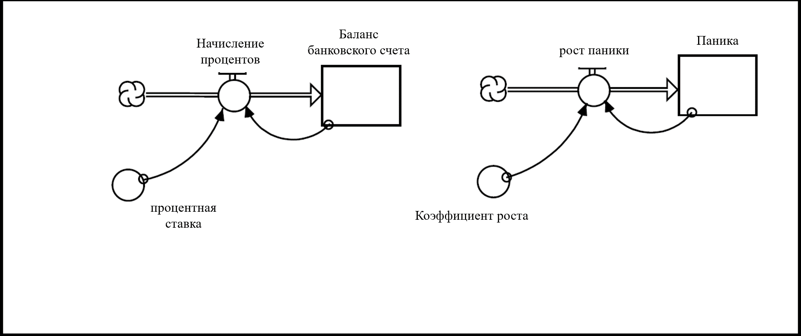

**Рисунок 6.16. Примеры Модели усугубления**
