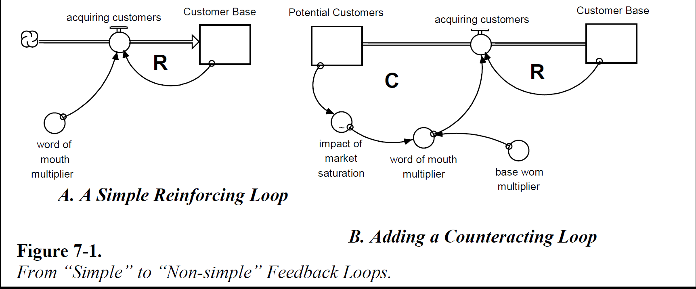

## Создание «Более интересных» Абзацев
## Замкнутое & Нелинейное мышление

В Главе 6 мы познакомились с «простыми» циклами обратной связи. В этой главе мы откажемся от двух условий, благодаря которым цикл счтается «простым». Мы позволим параметрам изменяться и расширим процесс до нескольких «предложений». Как вы убедитесь позже, отказ от этих двух условий рождает большой спектр вариантов динамического поведения.

### Допущение изменчивости параметров

До знакомства с циклами, влючающими несколько предложений, давайте посмотрим, что происходит, когда мы допускаем варьирование параметров внутри цикла из одного предложения. Рисунок 7.1А описывает простой усиливающий цикл. Предоставленный самому себе, как мы оговаривали в шестой главе, данный цикл вызовет бесконечный *экспоненциальный* рост Клиентской базы.

 

**Рисунок 7.1. От «простых» циклов к «сложным»**

