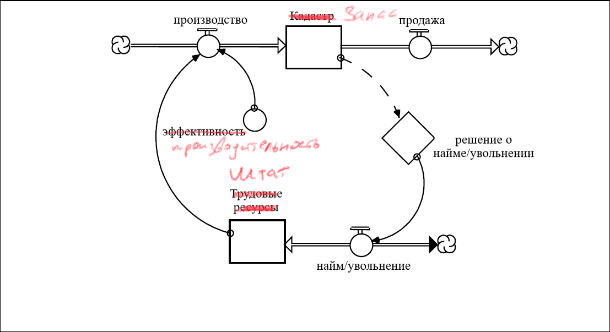
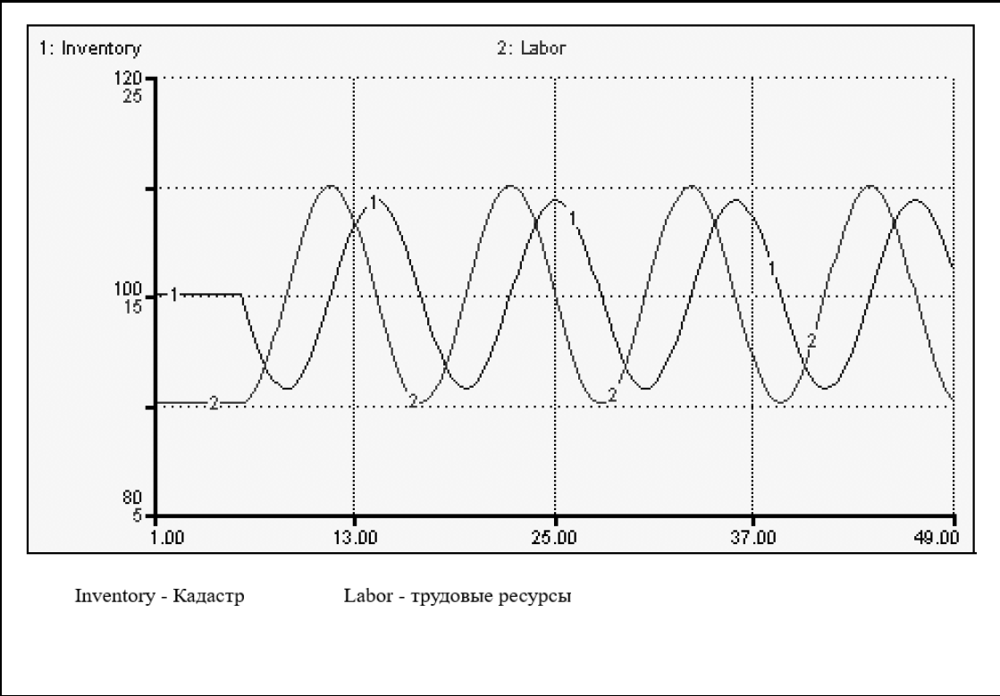
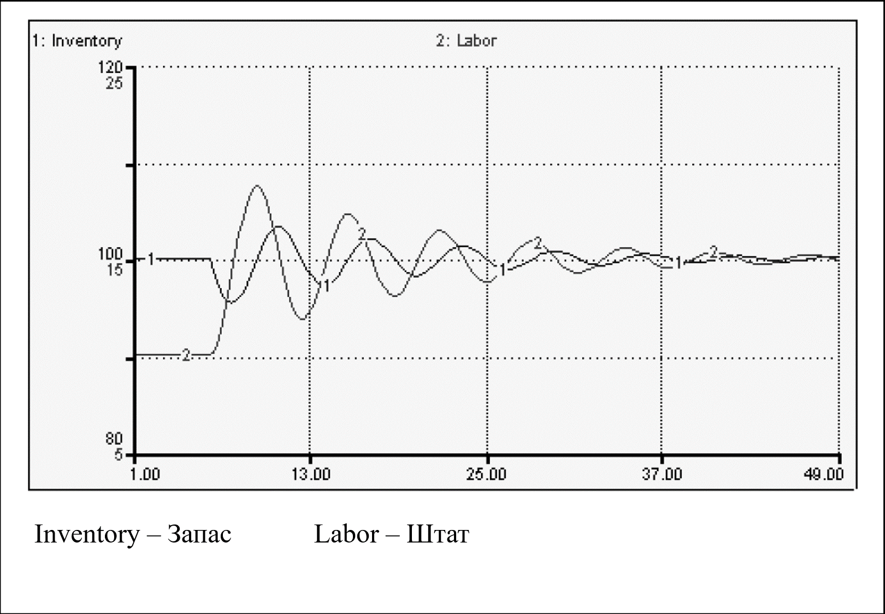

## Создание «Более интересных» Абзацев
## Замкнутое & Нелинейное мышление

В Главе 6 мы познакомились с «простыми» контурами обратной связи. В этой главе мы откажемся от двух условий, благодаря которым контур считается «простым». Мы позволим параметрам изменяться и расширим процесс до нескольких «предложений». Как вы убедитесь позже, отказ от этих двух условий рождает большой спектр вариантов динамического поведения.

### Допущение изменчивости параметров

До знакомства с контурами, включающими несколько предложений, давайте посмотрим, что происходит, когда мы допускаем варьирование параметров внутри контура из одного предложения. Рисунок 7.1А описывает простой усиливающий контур. Предоставленный самому себе, как мы оговаривали в шестой главе, данный контур вызовет бесконечный *экспоненциальный* рост Клиентской базы.

**Рисунок 7.1. От «простых» контуров к «сложным»**

Во второй части рисунка добавляется препятствующий контур. Точкой соприкосновения двух контуров является «коэффициент эффективности устной рекламы». Теперь это уже не константа, а переменная, которая зависит от насыщения рынка (сегментации). Рассчитывается коэффициент следующим образом: базисный коэффициент эффективности * степень насыщенности рынка. Базисный коэффициент постоянен по значению, а степень насыщенности может варьироваться. Это в *какой-то степени* зависит от количества Потенциальных клиентов (уровень накопителя). Способ определения этой зависимости является интересной, важной и одной из наиболее нужных особенностей в пакете *ithink*. Но перед тем, как использовать ее на практике, давайте убедимся, что вы «увидели» противодействющий контур.

Контур работает по следующему принципу: после того, как число Потенциальных клиентов снизится до определенного уровня, коэффициент эффективности устной рекламы начнет падать, так как падает уровень. Такая зависимость говорит о том, что для участника существующей Клиентской базы будет сложно превратить потенциального клиента в клиента. Это так, потому что все меньше людей составляют число Потенциальных клиентов, а те, кто в ней остаются (базе потенциальных киентов), по каким-либо причинам наименее расположены становиться частью Клиентской базы (либо они уже состояли в ней ранее). Когда насыщенность рынка падает, падает и коэффициент эффективности, это вызывает снижение степени оттока Потенциальных клиентов и, как следствие, падение уровня накопителя.

Противодействующий контур препятствует снижению числа Потенциальных клиентов и останавливает усиливающий контур. Как вы думаете - что мы получим по итогу такого взаимодействия двух контуров?

Если вы подумали, что в итоге мы увидим S-образный рост - вы правы! Посмотрите на рисунок 7.2. Пока в базе Потенциальных клиентов достаточно людей, влияние насыщенности рынка некритично. Это говорит о том, что усиливающий контур не встречает сопротивления и растет в *постоянном процентном соотношении* (процент роста равен базисному коэффициенту эффективности). Получается, что мы должны ожидать *экспоненциального роста* Клиентской базы. Как раз это и происходит при такой имитации. Если вы проследите траекторию роста Клиентской базы вплоть до 12 года, то увидите, что он, действительно, экспоненциальный. Однако после 12 года или около того, Клиентская база растет менее интенсивно, а в конце имитации расти почти совсем перестает.

Это происходит оттого, что вследствие истощения числа Потенциальных клиентов, эффект насыщения рынка становится все сильнее. Вы можете задаться вопросом: Как, такая на первый взгляд незначительная величина, как «степень насыщенности рынка» может так сильно повлиять на ситуацию? В программном обеспечении *ithink* можно показать это с помощью инструмента «графическая функция».

**Рисунок 7.2. Характер совместного действия Противодействующего & Усиливающего контуров**

Вернемся к рисунку 7.1Б. Если вы внимательно посмотрите на «Степень насыщенности рынка», то увидите знак «~», который является обозначением графической функции. Графические функции воспроизводят отношение между входящими переменными и исходящим результатом; они показывают, как меняется результат при воздействии на значение входящего параметра. Графические функции позволяют людям, не так хорошо знакомыми с математикой (как и тем, кто в ней хорошо разбирается), построить функцию автоматически, *без ручных расчетов*. Вместо этого вы можете просто двигать курсором мыши внутри плоскости координат X:Y. При двойном клике мышью на переменную «степень насыщенности рынка» вы увидите нечто похожее на то, что показано на рисунке 7.3 ниже.

 

**Рисунок 7.3. Графическая функция влияния насыщенности рынка**

Этим «нечто» и является графическая функция. Это не график, показывающй связь во времени. Он отображает изменение функции при изменении входящей переменной. В данном случае функция строится для параметра «степень насыщенности рынка», а зависит она от числа Потенциальных клиентов. Как вы можете увидеть, когда число потенциальных клиентов сохраняется на уровне 1200 или выше, показатель насыщенности рынка нейтрален (коэффициент равен 1.0). Когда число опускается ниже уровня в 1200, коэффициент становится меньше единицы, затем почти линейно падает при снижении числа потенциальных клиентов. Когда это происходит, коэффициент эффективности устной рекламы - который показывает, насколько раскручивается усиливающий контур - стремится к нулю, тормозя рост Клиентской базы.

В техническом аспекте происходящее называется «перехват доминирующей позиции» (как обсуждалось в шестой главе). Всегда при взаимодействии противодействующего и усиливающего контуров, когда первый контролирует входящий поток, а второй - исходящий, уровень накопителя либо экспоненциально растет, либо экспоненциально падает, либо  остается неизменным, что эквивалентно утверждению: один из контуров доминирует над вторым, либо они компенсируют друг друга и *доминирования нет*. И та позиция, которая получается в итоге, *сохраняется и дальше*, так как числовые параметры все еще постоянны.

Однако, как только мы допустим варьирование значений обоих параметров, доминирование одного из контуров больше не будет устойчивым и постоянным. Вернемся к только что рассмотренному рисунку. Изначально доминирует *усиливающий* контур. Пока это так - Клиентская база экспоненциально растет. Затем, когда истощается база Потенциальных клиентов, доминировать начинает *противодействующий контур*, нейтрализуя при этом экспоненциальный рост *усиливающего* контура. 

Ситуации с переменой доминирующей позицией - одна из причин появления сгенерированных системами «сюрпризов» и, так называемых, «нелинейных ответных реакций» (термин из второй главы) - когда значимые параметры едва ли вызывают заметную реакцию, в то время, как кажущиеся незначительными могут стать причиной настойщей лавины. Смена доминирующей позиции вызвана соответствующими значениями параметров (их эффективностью применительно к контурам). В моделях программы *ithink* такая вариация реализуется при помощи тех самых графических функций. Второй способ - менять дискретно (вручную) при помощи логической функции IF-THEN-ELSE. Однако, часто это нарушает принцип «взгляда с высоты 10 000 метров», поэтому в этом пособии мы не будем рассматривать данный способ. Мы рассмотрим примеры использования различных логических операторов, которые позволят вручную изменить ситуацию с доминированием в папке Sample Models, которую включает в себя программный пакет продукта. Help files помогут получить дополнительную справку о принципах построения моделей. Но опять же, если вы освоите Системное мышление, графическая функция навсегда станет вашим мощнейшим оружием для моделирования.

Графические функции трудно переоценить. С одной стороны, это искусство, но по большей части - целая наука, возможность познакомиться ближе с которой у вас будет в Приложении к данной главе, так что не жалейте времени, чтобы разобраться в данном вопросе с точки зрения механики, концепции и устройства таких моделей.

### Расширение процесса созданием «Мульти-предложений»

Вы только что видели, как допущение числовых вариаций параметров может повлиять на контуры. Следующее утверждение, которое мы отменим, будет касаться количества предложений - теперь их будет больше, чем одно. Все контуры, рассмотренные в шестой главе, состояли именно из одного предложения (т.е. включали лишь одну связку существительное/глагол). Теперь мы готовы перейти к так называемым мульти-предложениям.

Рисунок 7.4 демонстрирует структуру контура, состоящего из двух предложений. По своей природе контур является *противодействующим*. Цель данного контура - сохранить кадастр на прежнем уровне. «Стратегия» достижения данной цели - регулировать Трудовые ресурсы в большую/меньшую сторону, влияя на объем произведенной продукции. Принцип действия контура следующий: первоначально объем продаж постоянен по значению, а трудовые ресурсы на таком уровне, при котором объем производства практически равен объему продаж. В результате кадастр постоянен и находится на «целевом уровне» (цель обозначена ромбом, показывающим процесс найм/увольнение). Пока Кадастр остается на целевом уровне, активность процесса найма/увольнения будет нулевой, а пока она на нуле, Трудовые ресурсы будут постоянны по значению. Система устойчива.

 

**Рисунок 7.4. Простой Противодействующий контур из двух предложений**

Но вы знаете, что в Системном мышлении не терпят *покоящихся систем*. Нужна динамика, нужны изменения! Повысив количество работников, мы поднимем уровень продаж на более высокий константный уровень. Попробуйте мысленно смоделировать реакцию на это изменение.

Если вы представили нечто похожее на то, что изображено на рисунке 7.5, то вы абсолютно правы! Большинство людей не могут представить этого. Позже я приведу полное «анатомическое» описание. Однако, давайте сначала взглянем на рисунок и убедимся, что этот, на первый взгляд простой контур, генерирует такое сложное поведение. Соединенные предложения внутри контуров обратной связи действительно ведут себя подобным непростым образом.

 

**Рисунок 7.5. Естественная частота отклика Кадастрово-Трудовой системы**

Теперь поговорим об этом подробнее...До тех пор, пока продажи (*исходящий поток* из Кадастра) растут, уровень накопителя (Кадастр) падает, потому что объем продаж (*входящий поток* в Кадастр) сохраняется на прежнем уровне, который меньше возросшего уровня продаж. Когда уровень накопителя (Кадастр) упадет ниже целевого уровня, активируется режим найма. Увеличение трудовых ресурсов увеличит объем продаж. Однако до тех пор, пока объем произведенной продукции будет расти до величины, равной объему продаж, уровень накопителя (Кадастр) будет продолжать снижение. Убедитесь, что это так, перед тем, как двигаться дальше.

Что произойдет с уровнем накопителя (Кадастр) в точке, где процесс найма вызывает рост уровня трудовых ресурсов и увеличение объема произведенной продукции? Выходит, он снова равен объему продаж?

Если вы ответите, что уровень накопителя прекратит снижаться - Браво! Однако, обратите внимание на одну важную вещь. В точке, где уровень накопителя прекратит снижаться, он как никогда близок к целевому значению. Понимаете?

Таким образом, когда поток произведенных товаров снова становится равным потоку продаж (это условие необходимо для достижения равновесного состояния), уровень запаса оказывается максимально удаленным от своего равновесного состояния. В управлении системой есть серьезные проблемы! Входящий и выходящий потоки накопителя находятся в равновесии именно в тот момент, когда уровень в данном накопителе максимально отклоняется от своего равновесного значения. Именно при этом условии в системе возникают незатухающие циклические колебания.

Давайте подведем итог. Когда уровень накопителя (Кадастр) намного ниже целевого уровня (т.е. разница максимальна), показатель найма будет максимален. Это значит, что, раз показатель, при котором Трудовые ресурсы увеличиваются, будет максимален, то, следовательно, объем производства максимально *возрастет* до точки, в которой сравняется с объемом продаж. Так, если Трудовых ресурсов станет еще больше, объем производства последует примеру растущего объема продаж. Это перевернет ситуацию - так как приток в уровень накопителя начнет превосходить по значению отток, и показатель найма начнет снижаться. 

Однако, пока уровень накопителя ниже целевого уровня, процесс найма будет активен, а значит, объем производства будет продолжать «догонять» объем продаж, пока не сравняется. Вскоре уровень накопителя вновь восстановится до целевого значения, а система снова окажется в устойчивом равновесии. Останется ли она в таком состоянии, если оставить ее в покое?

Это вряд ли. Потому что в этой точке объем продаж, хоть и прекращает свой рост, остается *максимально высоким*, как и *разница* между объемом производства и продаж. Это означает, что мы имеем переизбыток Трудовых ресурсов. Когда уровень накопителя (Кадастр) вновь достигает устойчивого уровня, показатель Трудовых ресурсов как никогда максимален. Вы заметили здесь проблему? Управление объемами и трудовыми ресурсами в системе совершенно разрегулированы, сдвинуты по фазе. Учитывая заложенную в модель систему обратных связей, они никогда не смогут синхронизироваться.

Ключевая мысль. Несмотря на то, что система подконтрольна *противодействующему* контуру, этот контур не способен вернуть систему в состояние равновесия. Он попытается. Он правда будет стараться! Но благодаря своей природе система будет колебаться в течение вечности (ну или пока не разрядится батарея вашего ноутбука, когда вы летите на самолете).

### Комбинирование Переменных параметров и Расширенных связей

Давайте добавим *второй* противодействующий контур в эту систему. Мы можем достигнуть этого, позволив меняться одному из постоянных ранее параметров. 

Таким параметром мы сделаем «эффективность». Продуктвность выражает *тесноту связи* между уровнем Трудовых ресурсов и производящим потоком (который, к слову сказать, и является мерой силы противодействующего контура). Теперь *чем больше* показатель эффективности, *тем меньше* Трудовых ресурсов требуется для поднятия заданного уровня производства (так как каждая *единица трудового ресурса* будет вносить больший вклад в объем производства). И наоборот, низкий показатель эффективности будет уменьшать силу противодействующего контура (так как для поднятия уровня производства потребуется *больше* Трудовых ресурсов).

Предположим, что мы можем усилить противодействующий контур, как повышая эффективность (производительность), независимо от того уровня производства, который нужно поднять, так и снижая продуктивность, когда нам нужно вернуться к прежним значениям. Такая ситуация реально случается во многих рабочих процессах. Накопившиеся задолженности по работе заставляют собраться, сфокусироваться и выполнить работу, в то время, как их малое количество расслабляют, позволяя пить больше кофе и дольше болтать с коллегами у кулера с водой (продуктивность падает).

Внедряя наши изменения касательно эффективности работы, мы обратимся к нашим старым друзьяи - графическим функциям. Новая «структура процесса» изображена на рисунке 7.6

 

**Рисунок 7.6. Допущение об изменчивости продуктивности**

Учтите, что связав уровень накопителя с эффективностью, мы добавили второй *противодействующий* контур. Второй контур работает вместе с первым, усиливая мощность. Он берет на себя часть нагрузки по увеличению/уменьшению производственного потока, когда уровень накопителя растет или падает по отношению к целевому уровню. К примеру, вместо того, чтобы увеличивать производство *исключительно* за счет дополнительных единиц труда, можно частично добиться этого путем увеличения показателя эффективности.

Как изменится характер поведение системы с добавлением второго контура? Повысится или понизится устойчивость и почему?

Такие вопросы ставят в тупик. Один из основных плюсов программного пакета *ithink* состоит в том, что он позволяет проверять свою интуицию, получая при этом ответы на вопросы «почему?». При продолжительном использовании вы значительно прокачаете свою интуицию, понимая при этом первопричины происходящего. Рисунок 7.7 показывает, какие изменения происходят в системе при добавлении второго противодействующего контура. 

 

**Рисунок 7.7. От устойчивого к неустойчивому колебанию**

Как показано на рисунке, с внедрением второго контура колебания *гаснут*. Это можно объяснить следующим образом: ранее трудовые ресурсы достигали максимума в точке, где разница объема производства и объема продаж максимальна, а сейчас эта разница достигается *раньше* (до этой точки), так как показатель эффективности *также увеличивает продуктивность*. Это значит, что нужно нанять не так много трудовых единиц для повышения, следовательно, не так много нужно уволить для снижения. Затем процесс повторяется - снова можно меньше нанять/уволить для повышения/понижения уровня, и так происходит и дальше. Таким образом, система постепенно становится все более устойчивой (не принимая во внимание другие внешние воздействия).

Контур обратной связи - невероятно мощная «структура связи». Они лежат в основе физических, физиологических, природных и социальных процессов и систем. Они позволяют этим системам поддерживать необходимый баланс, не допуская разрушения. Они *самостоятельно генерируют* любое динамическое поведение. Активируйте такой контур, и вы получите в ответ динамическую реакцию, а не одиночный отклик. Поведение модели зависит от мощности различных контуров, из которых она состоит, и от роста/убыли их силы действия с течением времени. Инструмент «графическая функция» в программном обеспечении *ithink* позволяет наглядно изучить подобные изменения, разыгрывая исход.

Теперь вы хорошо подготовлены для работы с контурами обратной связи в моделях внутри программы *ithink*. Вы увидите гораздо большее число примеров и образцов моделей, созданных в программном пакете, по мере изучения этого руководства. Понимание структуры системы контуров - ключевое преимущество программного продукта *ithink* перед конкурентными *электронными таблицами*. 

В двух следующих главах будут приведены некоторые примеры обобщенной структуры контуров связи. Эта «инфраструктура» будет вам очень полезна  в качестве строительных блоков для моделей, созданных в системе *ithink*.

## Приложение
*Моделирование Графических функций*

В данном приложении вы найдете два ключевых принципа, использующихся при обращении к графическим функциям, затем перейдете к пошаговому руководству. 

#### **Принцип 1**. *При прочих равных условиях*

Графические функции позволяют наглядно проверить какую-либо гипотезу о наличии связи между двумя и только двумя переменными, принимая во внимание критерий «при прочих равных» (все остальные параметры константны). Когда вы получите графическую фукцию, направление кривой, показывающее связь между вашими переменными, не должно меняться. Если же кривая *меняет направление*, то, скорее всего, вы включили лишние переменные, меняющие структуру связи. Давайте рассмотрим это на примере.

«Плотный график работы» часто испытывают сотрудники, когда отстают от планового графика выполнения. Смысл в том, что, работая в подобном ускоренном режиме, люди быстрее фокусируются и концентрируются на цели, повышая продуктивность и возвращаясь к нормальному графику. Зависимость между наличием просроченной работы и уровнем продуктивности представлена на рисунке 7.8. При отсутствиии задолженности продуктивность меньше, так как люди чувствуют себя свободнее и не скованы дедлайном. По мере накопления просроченной работы растет и продуктивность. Но в определенной точке ситуация изменится, так как начнет слишком сильно давить на работников. Наглядно процесс представлен на рисунке 7.8.

 

**Рисунок 7.8. Графическое представление зависимости Продуктивности от Объема просроченной работы**

Очевидно, что данная кривая *меняет направление*. Давайте подумаем о возможных причинах. Как подобное расписание *влияет на работников*? Речь идет не о том, что побуждает их ускоренно работать, а о том, как такая ситуация *воздействует на них*. Это последнее, что вас интересует при построении графических моделей.

Жесткий график вынуждает проектных менеджеров все чаще напоминать рабочей группе о сорванных дедлайнах. Это заметно и по характеру работы. Люди работают больше часов, сокращая перерывы и больше концентрируясь, и так далее. Работая в таком темпе, они не сбавят его даже при нарастании нагрузки, однако могут сбавить, перегорев, почувствовав, что им не хватает времени, которое они проводят со своей семьей, либо по другим пирчинам - но не потому что нагрузка растет все больше.

Жесткий график *прямо влияет* на продуктивность, повышая ее. Такой график не может дать *позитивный эффект*, поэтому в некоторой «магической точке» ситуация разворачивается и кривая меняет направление. Связано это прежде всего с другими неочевидными факторами (перегорание, утрата мотивации и т.д.) в процессе мышления. «Другие факторы» имеют свою графическую структуру, и если вы заранее не подумаете об их наличии, то можете упустить из виду и сделать неправильные выводы о модели, получив неверный результат.

Вернемся к нашему примеру. Что если рабочие *уже испытывали перегорание в некоторой степени*, допустим, после предыдущего проекта. А сейчас они только начинают отставать от графика (пока не испытывая давления со стороны). Графическая функция на рисунке 7.8 показывает, что вы можете *увеличить* продуктивность, немного наращивая темп работы. Однако, очевидно - это не даст результатов, когда сотрудники и так уже сильно устали.

Убедитесь, что «мысленные эксперименты», которые вы проводите с двумя (и только двумя) переменными не зависят от других внеших факторов и параметров.

#### **Принцип 2**. *Не стройте модели на основе предыдущих исходов*

Второй важный принцип при графическом моделировании: *Убедитесь, что рассматриваете полный диапазон возможных исходов, а не только те, которые могут быть приемлемы, исходя из результатов прошлых опытов*. Многим людям непросто понять логику связи в графических функциях. Все потому, что порой эти связи слабые и неочевидные. Но даже когда связь более ощутима - к примеру, спрос и предложение - у людей часто возникают проблемы, так как они зацикливаются на уже известных исходах. Допустим, известно, что исторически цена могла составлять +- 25% от текущей стоимости товара. Многие люди включат в модель только этот *исторически известный* диапазон. «Мы не располагаем эмпирическими данными вне данного диапазона» - такой ответ можно улышать довольно часто.

Но давайте копнем глубже... Если вы хотите узнать, что произойдет с моделью, если *цена* упалет до нуля, или составит целых 50%, вы *обязаны* рассмотреть эластичность цены в данном диапазоне. Зачастую, вы получите более целостную картину, если выйдете за рамки уже известных диапазонов. Если ваша графическая зависимость не охватывает весь потенциальный диапазон, вы можете быть удивлены конечным результатом, потому что в этом случае они могут быть «сумасшедшими». Но пользуясь функционалом *ithink*, вы всегда сможете отличить «сумасшедшие» выбросы от подлинных «новых значений». Я сталкивался с этим на практике слишком часто, и могу с уверенностью сказать - вотрой принцип важен и имеет значение.

### Пошаговая инструкция использования графических функций

Руководство является поэтапной последовательностью шагов. Соблюдение данной последовательности поможет вам построить достоверную графическую модель независимо от того, работаете ли вы один, или в составе проектной групы.

#### Шаг 1. Соблюдайте принцип «при прочих равных»

Стройте связь только между зависимой и переменной, не принимая во внимание остальные факторы и второстепенные величины (они постоянны). 

#### Шаг 2. «Нормализуйте» входной параметр (величину)

Нормализация - это деление входной величины на определенное *приемлемое* количество. Не все данные должны быть нормализованы в обязательном порядке. К примеру, процентные показатели (как доля рынка) или индикативные (в диапазоне от 0 до 100, такие как мотивация, самооценка, выгорание) не нормализуются. Другие переменные с ограниченным диапазоном значений также не нуждаются в нормализации.

Нормализация несет в себе ряд плюсов. Во-первых, проще становится отслеживать изменения входных переменных, так как рассматривать интервалы от 0 до 1 или от 0 до 2 гораздо легче, чем более *абсолютные* диапазоны, как, например, от 0 до 1000 или от 500 до 5000. Когда интервал от 0 до 2, нам проще увидеть изменения параметров в процентах. К примеру, когда величина меняется от 1 до 1.25 - она очевидно возрастает на 25%. А когда мы рассматриваем диапазон от 0 до 10000, то сложно сказать, насколько процентов меняется величина, возрастая с 570 до 730.

Второй плюс нормализации - «независимость от масштаба». Если вы пользуетесь *абсолютными диапазонами* для входных переменых, то вам нужно будет перестраивать графические функции, если диапазоны изменятся, или если вы применяете модель к другой организации или организационной группе. Но нормализуя, вы конветируйте величины в относительные. К примеру, если ваша переменная - это деньги, то условие «Когда сумма упадет до 83 миллионов» может быть заменено на «Когда сумма уменьшится на 50% относительно первоначального уровня».

К выбору способа нормализации стоит подходить ответственно. Порой простого деления первоначального количества оказывается достаточно. Иногда лучше вводить относительные единицы измерения, такие как количество выручки на число сотрудников, продажи по регионам.

#### Шаг 3. Установите границы для входной и выходной переменных (Применяя Принцип 2)

Убедитесь, что включаете в границы интервала все возможное пространство значений для зависимой и переменной, а не только те значения, которые базируются на исторических исходах. Учтите, что графические функции нельзя экстраполировать за пределы границ их интервалов значений, они находятся в диапазоне между первым и последним выходным параметром (величиой).

#### Шаг 4. Определите направление и характер наклона

Помните, что если наклон вашей графической функции *меняет* направление, вы, скорее всего, включили в процесс более одной входной переменной. Под характером наклона я имею в виду: график линейный? S-образный? Кривая насыщенная? И так далее. Установите верную зависимость, строя график, выберите поведенческий аргумент в меню Document cache, чтобы всем было понятно ваше обоснование.

#### Шаг 5. Установите крайние точки и точку с координатами (1;1), если это возможно

Начните с низкого значения точки X (входная величина) и установите соответствующее значение Y (выходная величина). Затем сделайте то же самое для высокого значения X и Y. Иногда вы можете установить «нормальную точку» с координатами (1;1), в частности, когда вы используете переменные «воздействия». Когда переменная «воздействия» (обычно это коэффициент) принимает значение 1, это значит, что связь *нейтральна*. Нормализованная *входная* переменная обычно изначально принимает единичное значение, либо когда установлена «нормальная точка».

#### Шаг 6. Нарисуйте сглаженную кривую через установленные точки

Независимо от того, имеете ли вы лишь две крайние точки, либо еще и «нормальную точку», постройте на них сглаженную кривую. Если у вас есть точки, между которыми происходит разрыв, проверьте еще раз правильность обоснования такой графической модели.

