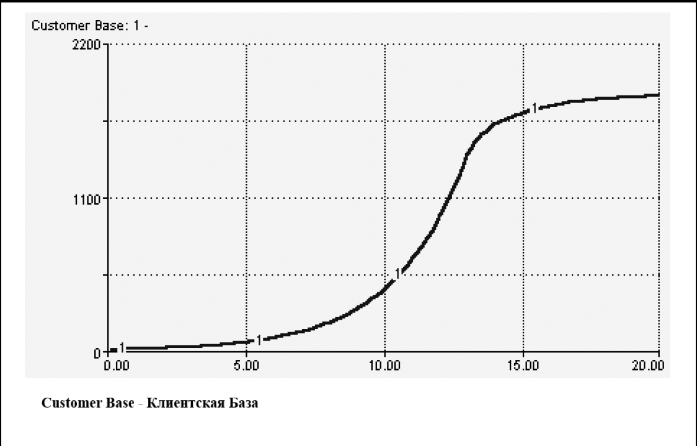
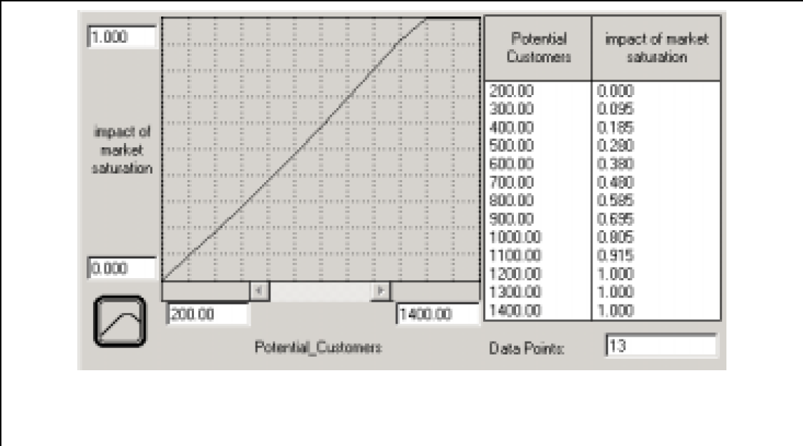

## Создание «Более интересных» Абзацев
## Замкнутое & Нелинейное мышление

В Главе 6 мы познакомились с «простыми» циклами обратной связи. В этой главе мы откажемся от двух условий, благодаря которым цикл счтается «простым». Мы позволим параметрам изменяться и расширим процесс до нескольких «предложений». Как вы убедитесь позже, отказ от этих двух условий рождает большой спектр вариантов динамического поведения.

### Допущение изменчивости параметров

До знакомства с циклами, влючающими несколько предложений, давайте посмотрим, что происходит, когда мы допускаем варьирование параметров внутри цикла из одного предложения. Рисунок 7.1А описывает простой усиливающий цикл. Предоставленный самому себе, как мы оговаривали в шестой главе, данный цикл вызовет бесконечный *экспоненциальный* рост Клиентской базы.

**Рисунок 7.1. От «простых» циклов к «сложным»**

Во второй части рисунка добавляется препятствующий цикл. Точкой соприкосновения двух циклов является «коэффициент эффективности устной рекламы». Теперь это уже не константа, а переменная, которая зависит от насыщения рынка (сегментации). Рассчитывается коэффициент следующим образом: базисный коэффициент эффективности * степень насыщенности рынка. Базисный коэффициент постоянен по значению, а степень насыщенности может варьироваться. Это в *какой-то степени* зависит от количества Потенциальных клиентов (уровень накопителя). Способ определения этой зависимости является интересной, важной и одной из наиболее нужных особенностей в пакете *ithink*. Но перед тем, как использовать ее на практике, давайте убедимся, что вы «увидели» противодействющий цикл.

Цикл работает по следующему принципу: после того, как число Потенциальных клиентов снизится до определенного уровня, коэффициент эффективности устной рекламы начнет падать, так как падает уровень. Такая зависимость говорит о том, что для участника существующей Клиентской базы будет сложно превратить потенциального клиента в клиента. Это так потому, что все меньше людей составляют число Потенциальных клиентов, а те, кто в ней остаются, по каким-либо причинам наименее расположены становиться частью Клиентской базы (либо они уже состояли в ней ранее). Когда насыщенность рынка падает, падает и коэффициент эффективности, это вызывает снижение степени оттока Потенциальных клиентов и, как следствие, падение уровня накопителя.

Противодействующий цикл препятствует снижению числа Потенциальных клиентов и останавливает усиливающий цикл. Как вы думаете - что мы получим по итогу такого взаимодействия двух циклов?

Если вы подумали, что в итоге мы увидим S-образный рост - вы правы! Посмотрите на рисунок 7.2. Пока в базе Потенциальных клиентов достаточно людей, влияние насыщенности рынка некритично. Это говорит о том, что усиливающий цикл не встречает сопротивления и растет в *постоянном процентном соотношении* (процент роста равен базисному коэффициенту эффективности). Получается, что мы должны ожидать *экспоненциального роста* Клиентской базы. Как раз это и происходит при такой имитации. Если вы проследите траекторию роста Клиентской базы вплоть до 12 года, то увидите, что он, действительно, экспоненциальный. Однако после 12 года или около того, Клиентская база растет менее интенсивно, а в конце имитации расти почти совсем перестает.

Это происходит оттого, что вследствие истощения числа Потенциальных клиентов, эффект насыщения рынка становится все сильнее. Вы можете задаться вопросом: Как, такая на первый взгляд незначительная величина, как «степень насыщенности рынка» может так сильно вытянуть ситуацию? В программном обеспечении *ithink* можно показать это с помощью инструмента «графическая функция».

**Рисунок 7.2. Характер совместного действия Противодействующего & Усиливающего циклов**

Вернемся к рисунку 7.1B. Если вы внимательно посмотрите на «Степень насыщенности рынка», то увидите знак «~», который является обозначением графической функции. Графические функции воспроизводят отношение между входящими переменными и исходящим результатом; они показывают, как меняется результат при воздействии на значение входящего параметра. Графические функции позволяют людям, не так хорошо знакомыми с математикой (как и тем, кто в ней хорошо разбирается), построить функцию автоматически, *без ручных расчетов*. Вместо этого вы можете просто двигать курсором мыши внутри плоскости координат X:Y. При двойном клике мышью на переменную «степень насыщенности рынка» вы увидите нечто похожее на то, что представлено на рисунке 7.3 ниже.

 

**Рисунок 7.3. Графическая функция влияния насыщенности рынка**

Этим «нечто» и является графическая функция. Это не график, показывающй связь с временем. Он отображает изменение функции при изменении входящей переменной. В данном случае функция строится для параметра «степень насыщенности рынка», а зависит она от числа Потенциальных клиентов. Как вы можете увидеть, когда число потенциальных клиентов сохраняется на уровне 1200 или выше, показатель насыщенности рынка нейтрален (коэффициент равен 1.0). Когда число опускается ниже уровня в 1200, коэффициент становится меньше единицы, затем почти линейно падает при снижении числа потенциальных клиентов. Когда это происходит, коэффициент эффективности устной рекламы - который показывает, насколько раскручивается усиливающий цикл - стремится к нулю, тормозя рост Клиентской базы.

В техническом аспекте происходящее называется «перехват доминирующей позиции» (как обсуждалось в шестой главе). Всегда при взаимодействии противодействующего и усиливающео циклов, когда первый контролирует входящий поток, а второй - исходящий, уровень накопителя либо экспоненциально растет, либо экспоненциально падает, либо  остается неизменным, что эквивалентно утверждению: один из циклов доминирует над вторым, либо они компенсируют друг друга и *доминирования нет*. И та позиция, которая получается в итоге, *сохраняется и дальше*, так как числовые параметры все еще постоянны.

Однако, как только мы допустим варьирование значений обоих параметров, доминирование одного из циклов больше не будет устойчивым и постоянным. Вернемся к только что рассмотренному рисунку. Изначально доминирует *усиливающий* цикл. Пока это так - Клиентская база экспоненциально растет. Затем, когда истощается база Потенциальных клиентов, доминировать начинает *противодействующий цикл*, нейтрализуя при этом экспоненциальный рост *усиливающего* цикла. 

Ситуации с переменой доминирующей позицией - одна из причин появления сгенерированных системами «сюрпризов» и, так называемых, «нелинейных ответных реакций» (термин их второй главы) - когда значимые параметры едва ли вызывают заметную реакцию, в то время, как малые могут стать причиной настойщей лавины. Смена доминирующей позиции связана вызвана соответствующими значениями параметров (их эффективностью применительно к циклам). В моделях программы *ithink* такая вариация реализуется при помощи тех самых графических функций. Второй способ - менять дискретно (вручную) при помощи логической функции IF-THEN-ELSE. Однако, часто это нарушает принцип «взгляда с высоты 10 000 метров», поэтому в этом пособии мы не будем рассматривать данный способ. Мы рассмотрим примеры использования различных логических операторов, которые позволят вручную изменить ситуацию с доминированием в папке Sample Models, которую включает в себя программный пакет продукта. Help files помогут получить дополнительную справку о принципах построения моделей. Но опять же, если вы освоите Системное мышление, графическая функция навсегда станет вашим мощнейшим оружием для моделирования.

Графические функции трудно переоценить. С одной стороны, это искусство, но по большей части - целая наука, возможность познакомиться ближе с которой у вас будет в Приложении к данной главе, так что не жалейте времени, чтобы разобраться в данном вопросе с точки зрения механики, концепции и устройства таких моделей.

### Расширение процесса цикличности созданием «Мульти-предложений»

