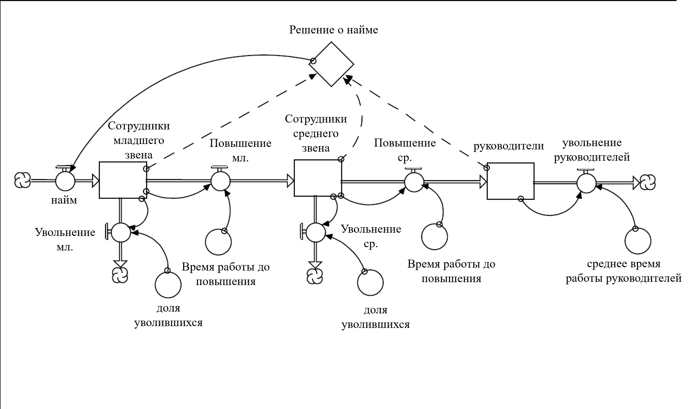
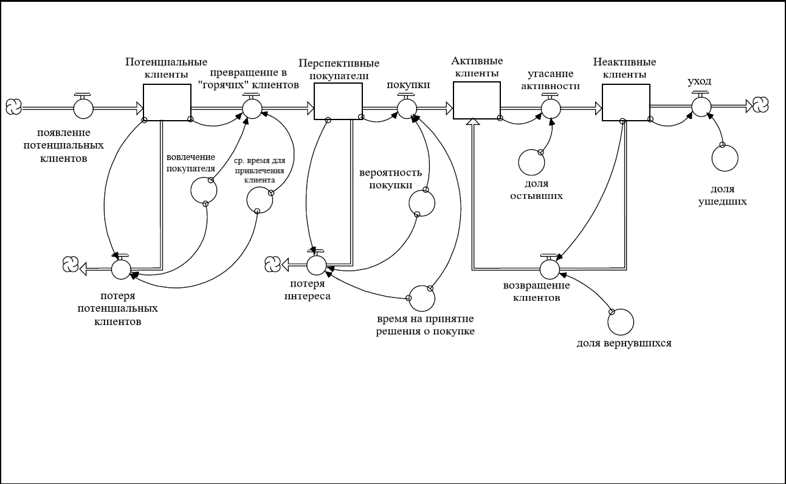
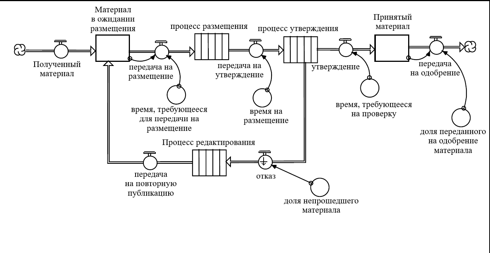
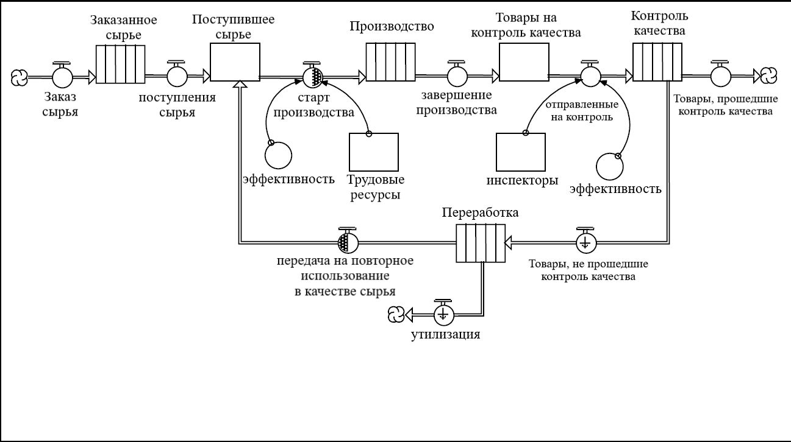
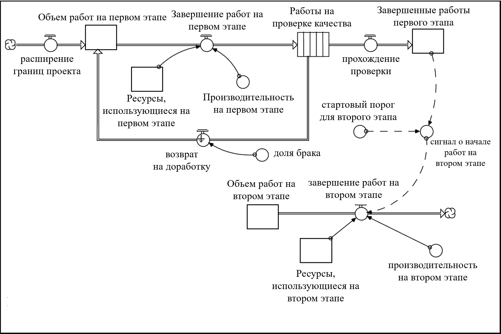
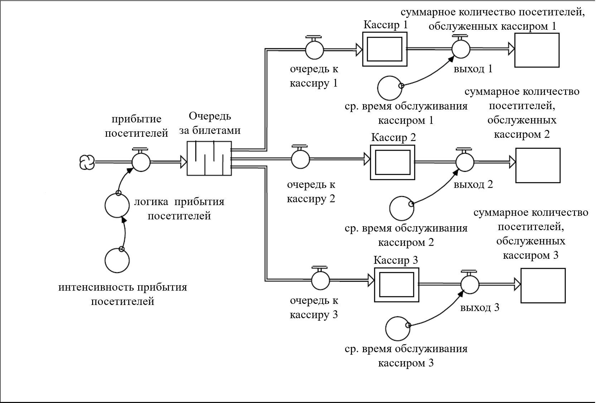

## Сюжетные линии, Часть 1
## Структура Основного каскада

Вы уже знакомы с основными частями речи, предложениями и абзацами, и теперь можно приступать к созданию коротких историй. Следующие две главы помогут вам построить несколько классических «сюжетных линий». В этой главе представлены 6 типов так называемой *Структуры Основного каскада*. Главный (основной) каскад - это скелет вашей модели. Каскад состоит из накопителей, соединенных потоками. Хороший пример: цепь поставок, которая тянется от производителя к покупателю через дистрибьюторов, оптовиков и ритейлеров. В девятой главе вы познакомитесь с примерами классической структуры неосновного каскада.

Для каждого Главного каскада мы:

* Приводим краткое словесное описание
* Устанавливаем, какие проблемы решаются посредством данного каскада
* Предлагаем способы кастомизаци для ваших целей
* Устанавливаем, каким типом модели *ithink* является данный каскад

Продвинуто изучив процесс создания Основного каскада, вы сможете оценить, насколько широко можно их применять на практике. Я рекомендую вам обращаться к приложению в конце данной главы по мере создания моделей.

### Основной каскад для модели Кадровых ресурсов

#### Описание

Данный каскад описывает в очень обобщенном виде процесс прохождения потока человеческих (трудовых) ресурсов через организацию. Сотрудников берут на работу на «Начальном уровне». Затем они либо переходят на «Средний уровень», либо уходят из организации. Далее опять же, либо они продвигаются на следующий - «Продвинутый уровень», либо увольняются. Продвижение по каскаду характеризуют такие специфические показатели, как доля ушедших и период обучения. Все потоки ушедших и проходящих обучение представлены с помощью шаблона «истощения».

Основой Каскад для Кадровых ресурсов изображен на рисунке 8.1

#### Вопросы для рассмотрения

Модель иллюстрирует важные поведенческие характеристики структуры Основного каскада. *Основные каскады будут стремиться распределить ресурсы по накопителям пропорционально величине среднего срока работы.* «Срок работы» (в данной модели) - это комбинация среднего времени работы до повышения и среднего времени работы перед уходом. К примеру, если в среднем сотрудники работают на начальном уровне в течение двух лет, на среднем в течение четырех, на руководящих постах в течение восьми, то Основной Каскад будет пытаться разбить число всех сотрудников на 3 уровня в пропорции 2-4-8 (или 1-2-4). Такое распределение может отличаться от реальных потребностей организации в штатных единицах с точки зрения экономической целесообразности и административного контроля. Пока это будет идти вразрез с потребностями, Основной каскад будет иметь «неявную целевую структуру» касательно распределения трудовых единиц, что будет стабильно приводить к «борьбе с системой». Система «физически» сильней, так что не надейтесь победить в этом случае.

#### Возможные решения

1. Сделайте время повышения зависимым от целевого распределения трудовых ресурсов по уровням. Так, если в организации много единиц топ-менеджмента, то нужно увеличить сроки работы до очередного повышения.

2. Свяжите долю уволившихся со сроками работы до повышения - так, к примеру, если период работы для Новичков перед тем, как их повысят до работников Среднего звена увеличится, то и доля уволившихся соответственно возрастет.

3. Допустите возможность нанимать на работу сотрудников всех трех категорий.

#### Расположение модели

*«HR Main Chain» (в папке «Intro to Systems Thinking»)*

 

**Рисунок 8.1. Структура Основного каскада для Кадровых ресурсов**

### Основной каскад для модели Клиентской сети

#### Описание

Данный каскад описывает стадии, пройдя которые клиент из «потенциального» превратится в «активного». Структура процесса изображена на рисунке 8.2. Как видно по рисунку, существует несколько путей, позволяющих клиентам покинуть систему.

Шаблон «истощения», или приближенный к нему вариант, описывают все потоки, за исключением одного. Для процессов *превращение в «горячих» клиентов*, 

#### Вопросы для рассмотрения

#### Возможные решения

#### Расположение модели

*«Customer Main Chain» (в папке «Intro to Systems Thinking»)*

 

**Рисунок 8.2. Структура Основного каскада для Клиентской сети**

### Основной каскад для модели Административной сети

#### Описание

#### Вопросы для рассмотрения

#### Возможные решения

#### Расположение модели

*«Administrative Main Chain» (в папке «Intro to Systems Thinking»)*

 

**Рисунок 8.3. Структура Основного каскада для Административной сети**

### Основной каскад для модели Производственного цикла

#### Описание

#### Вопросы для рассмотрения

#### Возможные решения

#### Расположение модели

*«Manufacturing Main Chain» (в папке «Intro to Systems Thinking»)*

 

**Рисунок 8.4. Структура Основного каскада для Производственного цикла**

### Основной каскад для модели Поэтапного процесса выполнения работ

#### Описание

#### Вопросы для рассмотрения

#### Возможные решения

#### Расположение модели

*«Work Flow Main Chain» (в папке «Intro to Systems Thinking»)*

 

**Рисунок 8.5. Структура Основного каскада для Поэтапного процесса выполнения работ**

### Основной каскад для модели процесса Очередь/Сервер

#### Описание

#### Вопросы для рассмотрения

#### Возможные решения

#### Расположение модели

*«Queue Server Main Chain» (в папке «Intro to Systems Thinking»)*

 

**Рисунок 8.6. Структура Основного каскада для процесса Очередь/Сервер**

