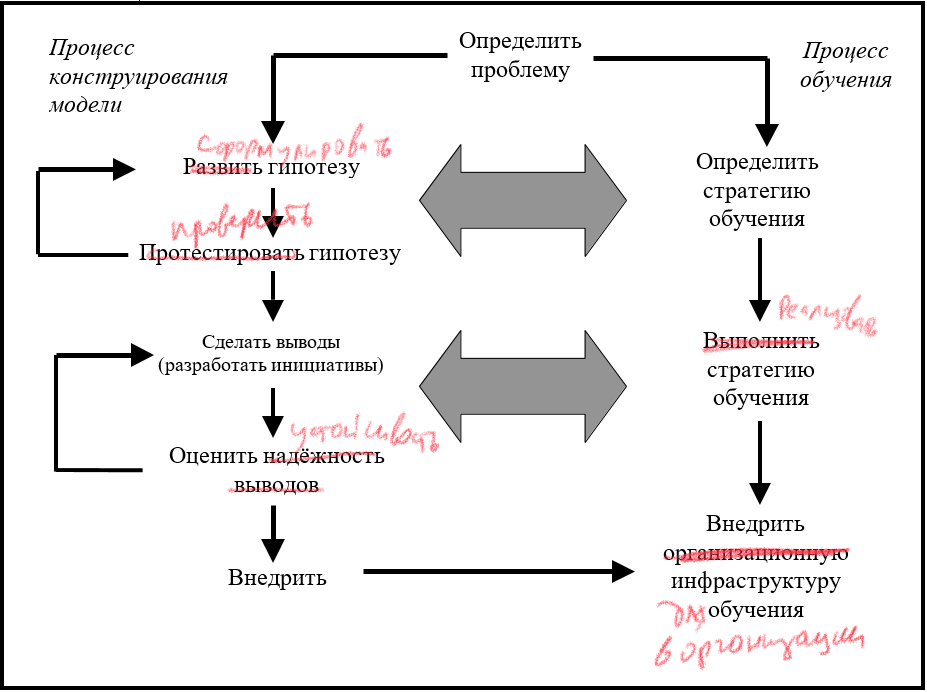

## Базовое понимание концепции процесса «Написания»

### Шаги

Написание, как и моделирование, очень творческий процесс. Тем не менее, есть определенные «шаги», следование которым сделает процесс системным. В данной главе, мы бегло ознакомимся с этими шагами. Основная цель - ознакомиться с азами, неким каркасом, подробная информация о процессе будет дана в одиннадцатой главе. Подробные рекомендации по каждому этапу, которые помогут вам в процессе создания, вы найдете в двенадцатой главе.

Для начала, рассмотрим все ключевые шаги в формате диаграммы, а затем я приведу краткое словесное описание для каждого отдельно. 

Диаграмма на рисунке 10.1 показывает пошаговый процесс создания модели. 

 

**Рисунок 10.1. Шаги при конструировании модели**

Последовательность шагов линейна, но на практике это не совсем так. В процессе создания вы будете делать много итераций вниз, затем снова вверх и *сквозь*, и все это через всю последовательность шагов. Обратите внимание, что процесс *создания модели* и *обучения* параллельны на схеме, а две большие двусторонние стрелки их соединяют. Цель этих стрелок - показать, что *процессы могут быть параллельны, но связаны между собой*. Грубо говоря, *модели, построенные где-то «в подсобке» мышления (которые не несут собой пользы в обучении других людей) не имеют смысла, в отличии от полезных моделей, когда вы «несете знания в массы» и делитесь выводами*.

Я уверен, что для каждой проблемы нужно одновременно конструировать модель и разрабатывать стратегию обучения. Стратегия должна работать и дальше, после реализации «внедрения» - последнего процессного шага моделирования. Еще в первой главе говорилось, что одной из основных трудностей в процессе разработки наших ментальных моделей является отсутствие обратной связи, связи результатов того, что случается *после внедрения*, с изначальным алгоритмом построения. Часто это происходит потому, что модели не были детально проработаны и сохранены. В результате мы не имеем возможности доработать их с помощью полученных после внедрения модели реальных результатов.

Пока отсутствует связь результатов с ментальной разработкой модели, мы не сможем улучшить наши методы, сделать их более эффективными.

Сначала мы поговорим о шагах разработки модели, а затем рассмотрим связанный параллельный процесс обучения. Это построено таким образом для простоты и ясности изложения, а не потому что сам алгритм должен строиться таким образом.

#### *Установите проблему*

*Все зависит от цели*. Часто проблема заключается в отсутствии четкого понимания того, что должно быть сделано в итоге, откуда возникают трудности с реализацией. До тех пор, пока вы четко и лаконично не сформулируете цель (для начала на словах), которая достигается с помощью сконструированной модели, не прикасайтесь к инструментарию *ithink*! Помимо словесной формулировки, не лишним будет (как вы убедитесь в двенадцатой главе) построить одну или несколько графических реализаций предполагаемого изменения переменных с течением времени, которые являют собой либо старое представление, которое нуждается в изменении, либо совершенно новый результат, либо комбинацией обоих вариантов сразу. 

Проще говоря, есть две причины использовать функционал моделирующих компонентов *ithink*. Первая - создать «рабочий инструмент». Вторая - создать «инструмент обучения». Но это не значит, что модель не может удовлетворить обе потребности. Однако, на практике это встречается довольно редко.

Рабочие инструменты - это «генераторы ответов», вспомогательны средства дял принятия решений. Такие модели в *ithink* «тяжелые» (размер) и содержат информацию преимущественно числового характера. Обучающие модели как раз наоборот небольшого размера. Да, размер и правда *имеет значение*, если ваша цель - «перепрограммировать» ментальные модли, которые люди хранят в голове. А маленькие модели *всегда* выигрывают в этом плане.

Позвольте мне пояснить, что я имею в виду под термином «инструмент обучения», потому что вам может показаться, что я употребляю это словосочетание в академическом контексте. Это далеко от истины! Инструменты обучения помогают перестраивать ментальные модели, менять точку зрения на проблему и вдохновляться новыми взглядами и способами. Они способны дать такой результат, так как сраниваются с превалирующими методами. Чтобы провести качественное сравнение, важно, чтобы модели были простыми и наглядными.  

Люди не могут мысленно воспроизвести всю механику рабочего инструмента. Диаграммы слишком большие, с огромным количеством связей и вычислений, чтобы удержать все в голове. А методологию обучающих моделей *ithink* типа накопитель/поток можно легко запомнить и в последствии воспроизвести по памяти, а значит и использовать при необходимости. Для большинства обучающих моделей не требуются точные численные параметры, так как в основе понимания лежит сам принцип действия, изучение природы взаимосвязей, поиск нелинейной зависимости и устранение задержек.

За двдцать с лишним лет, что я строил модели вместе с клиентами или для них, у меня выработалось четкое предпочтение к обучающим инструментам перед практическими. Не то, чтобы последние были неважны, просто, исходя из опыта, люди чаще направляются к деревьям, прежде чем углубляться в лес. В результате получается, что большая часть усилий, приложенных к разработке стратегии, структуре процесса, операционной политике или к формированию сбалансированной системы учета результатов, оказываются потраченными впустую, вы просто идете по ложному следу. Мой подход предполагает «тщательное исследование леса *перед* изучением корней деревьев». Часто это вынуждает отсрочить или отменить эксперимент и сэкономить время, нервы и деньги.  

#### *Разработайте гипотезу*

