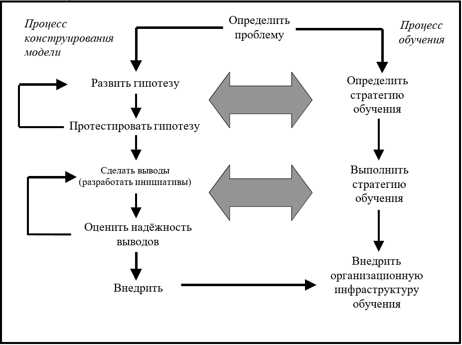

## Глава 11. Иллюстрируя процесс "написания"

Как было отмечено в главе 10, модели, построенные с использованием программного обеспечения *ithink*, как правило, подразделяются на две основные категории: Инструменты обучения и Операционные инструменты. В этой главе я покажу компромисс. Я проведу вас через процесс «написания» Инструмента обучения в деталях. Этот пример является реальным, хотя и замаскированным его применением. В конце примера инструмент обучения эволюционирует в Операционный инструмент. Таким образом, вы получите некоторое представление о том, как оба инструмента выходят из процесса "написания". Для обсуждения я буду использовать «шаги» процесса, которые указаны в предыдущей главе. Эти шаги для удобства приводятся на рисунке 11-1.

**Рисунок 11-1. "Шаги" в процессах конструирования модели/обучения**

#### "Написание" рассказа

Конкретный рассказ, который я укажу здесь, отличается тем, что он один из самых коротких из когда-либо написанных. Описание того, как он был написан, намного длиннее самой истории! Тем не менее, он также является одним из наиболее эффективных с точки зрения разъяснения этого важнейшего вопроса, понимания и стимулирования продуктивных действий.

##### Предыстория
Клиент в этом рассказе является технологической фирмой, которая была основана инженером и известна своей инженерной культурой. Фирма гордилась доставкой «самого навороченного оборудования» в бизнесе! Доходы и прибыль неуклонно росли с каждым годом. Однако в последние пару лет в организации появилась проблема. Она начала проявляться сильнее, и генеральный директор решил привлечь команду старшего руководства, чтобы серьезно ее рассмотреть. Главным героем этой проблемы был вице-президент организации обслуживания клиентов. Этот джентльмен, назовем его Джейком, не был инженером, и для него все было в порядке. Он одевался экстравагантно, использовал (то, что чувствовали инженеры), новомодный язык, был общительным и имел репутацию «громкого» человека (грохочущий смех, бурные разговоры в коридоре и т. Д.). Своим внешним видом и стилем работы Джейк резко выделялся на фоне типичного инженера фирмы.

Джейка также винили в том, что он «строит империю». При обвинениях инженеры быстро собирали аргументы для поддержки своего мнения. За последние несколько лет количество сотрудников и бюджет для «полевой» организации (в частности, для обслуживания клиентов) увеличились гораздо быстрее, чем соответствующие показатели у инженеров, хотя численность инженерных кадров и бюджет также существенно выросли. Кроме того, доля доходов фирмы, поступающих от обслуживания клиентов, пропорционально возрастали в зависимости от доходов с продаж оборудования.

Инженеры чувствовали, что имидж компании как технологического лидера находится под угрозой со стороны очень заметной нетехнической персоны Джейка. Инженерное сообщество также обеспокоилось тем фактом, что все большая доля от общего операционного бюджета выделяется как раз организации обслуживания клиентов. Такое распределение средств было в большистве своём воспринято как результат закулисного «политического маневра» Джейка. Это маневрирование, как показала картина доходов, превратило компанию, по мнению инженеров, в организацию предоставления услуг и увело её от изначальной и основной миссии. Пальцы недовольных указывали на Джейка. В это время, Джейк и его растущая армия работали, игнорируя критику. Их позиция была той же: "*Посмотрите на нижнюю строку!*" Генеральный директор сочувствовал обеим позициям и нуждался в чём-то, что сможет примирить стороны до того, как всё переросло в вооружённый конфликт!

##### Определение проблемы и Стратегия обучения
Будь я консультантом по организационному развитию, я бы, вероятно, определил этот вопрос как ориентированный на Джейка, а затем продолжил рассмотрение того, что можно было бы сделать для правильного соответствия его самого и доминирующей инженерной культуры. Фактически, позже, после того как мы завершили нашу работу, консультант по ОД был сохранен и дал хорошие результаты после такого подхода. Однако, если бы я был консультантом по ОД, генеральный директор не привел бы меня в то время. Вместо этого, зная что-то о «этом системном материале», он хотел посмотреть, может ли он «выйти за пределы личностей», чтобы увидеть, вовлечена ли какая-либо «физика». Я был молод, наивен и играю.
С самого начала было ясно, что у членов старшей управленческой команды мало времени или интереса к созданию навыков системного мышления, необходимых для самостоятельного расследования проблемы. Таким образом, это был случай, когда внешний эксперт собирался «построить модель». Тем не менее я решил, что команда вышла из расследования, не только улучшив свое понимание конкретной проблемы, но и приобрела некоторые общие Системные навыки мышления.
Я начал с опроса каждого члена старшей управленческой команды. Чрезвычайно важно, чтобы каждый из участников был опрошен, если должно быть «событие», связанное с расследованием. Оставьте кого-нибудь, и этот человек почти наверняка будет «проблемой» во время мероприятия! Такие интервью полезны для «взятия импульса» команды. Они также проливают свет на межличностную динамику и помогают вам получить общую картину организации.
Из интервью я подготовил от двух до трех графиков ключевых переменных с течением времени, чтобы увидеть, что, если таковые имеются, привлекло внимание команды как хорошее «резюме» проблемы. Члены команды довольно быстро сходились на рисунке, изображенном (замаскированном) на рисунке 11-2.
