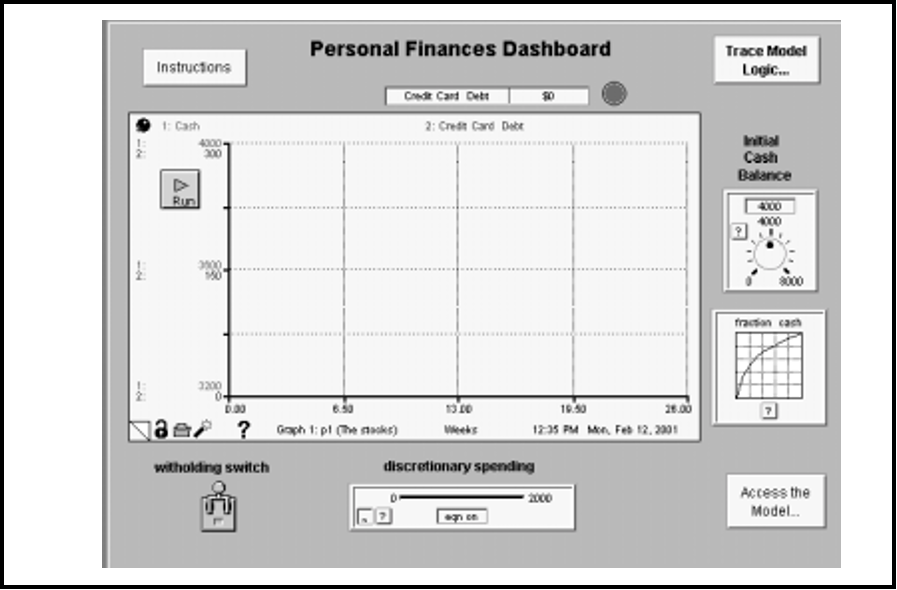

## Глава 11. Иллюстрация процесса "написания"

Как было отмечено в главе 10, модели, построенные с использованием программного обеспечения *ithink*, как правило, подразделяются на две основные категории: Инструменты обучения и Операционные инструменты, - и в этой главе я покажу их взаимосвязь. Я в деталях проведу вас через процесс «написания» Инструмента обучения. Этот пример является реальной, хотя и скрытой его реализацией. В конце примера Инструмент обучения эволюционирует в Операционный инструмент. Таким образом, вы получите некоторое представление о том, как оба инструмента выводятся из процесса "написания". Для объяснения я буду использовать «шаги» процесса, которые указаны в предыдущей главе. Для удобства эти шаги приведены на рисунке 11-1.

***Рисунок 11-1. "Шаги" в процессах конструирования модели/обучения***

### "Написание" рассказа

Конкретный рассказ, который будет мной рассмотрен, отличается тем, что он один из самых коротких из когда-либо написанных. Описание того, как он создавался, намного длиннее самого рассказа! Тем не менее, этот рассказ является еще и одним из наиболее эффективных с точки зрения разъяснения вышеупомянутой взаимосвязи, а также понимания и стимулирования продуктивных действий.

#### Предыстория
Клиент в этом рассказе является технологической фирмой, которая была основана инженером и известна своей инженерной культурой. Фирма гордилась доставкой «самого навороченного оборудования» среди конкурентов! Доходы и прибыль неуклонно росли с каждым годом. Однако в последние пару лет в организации появилась проблема. Она начала проявляться сильнее, и генеральный директор решил привлечь старшее руководство, чтобы рассмотреть ее серьезно. Главным героем этой проблемы был вице-президент подразделения обслуживания клиентов. Этот джентльмен, назовем его Джейком, не был инженером, но его в этом плане все устраивало. Он одевался экстравагантно, использовал (то, что чувствовали именно инженеры), новомодный язык, был очень общительным и имел репутацию «громкого» человека (из-за грохочущего смеха, бурных разговоров в коридоре и т.д.). Своим внешним видом и стилем работы Джейк резко выделялся на фоне типичного инженера фирмы.

Джейка также винили в том, что он якобы «создаёт империю». При обвинениях инженеры оперативно собирали аргументы в поддержку своего мнения. За последние несколько лет для «отдельного» подразделения (в частности, для обслуживания клиентов) количество сотрудников и бюджет увеличились гораздо быстрее, чем соответствующие показатели у инженеров, хотя численность инженерных кадров и их бюджет также существенно выросли. Кроме того, доля доходов фирмы, поступающих от обслуживания клиентов, пропорционально возрастала в зависимости от доходов с продаж оборудования.

Инженеры чувствовали, что имидж компании как технологического лидера находится под угрозой со стороны очень заметной нетехнической персоны Джейка. Инженерное сообщество также обеспокоилось тем фактом, что все большая доля от общего операционного бюджета выделяется как раз подразделению по обслуживанию клиентов. Такое распределение средств в большинстве своём было воспринято как результат закулисного «политического маневра» Джейка. По мнению инженеров, это маневрирование превратило компанию, как показали доходы, в организацию предоставления услуг и увело ее от изначальной, основной миссии. Пальцы недовольных показывали в сторону Джейка. В это время Джейк и его растущая армия работали, игнорируя критику. Их позиция была все той же: "*Посмотрите на нижнюю строку!*" Генеральный директор симпатизировал обеим позициям и нуждался в чём-то, что сможет примирить стороны до того, как всё переросло в вооружённый конфликт.

#### Определить проблему и стратегию обучения

Будь я консультантом по организационному развитию, я бы, вероятно, определил этот вопрос как ориентированный на Джейка, а затем продолжил бы рассматривать, что можно было бы сделать, чтобы он и доминирующая инженерная культура правильно соответствовали друг другу. На самом деле позже, уже после того как мы завершили нашу работу, консультант по организационному развитию был оставлен в должности и, применяя такой подход, продемонстрировал хорошие результаты. Однако, если бы я был консультантом, генеральный директор вряд ли бы в тот момент обратился ко мне. Вместо этого, зная что-то об «этой системной штуке», он захотел бы посмотреть, перейдет ли ситуация от личностей к разборкам "на кулаках". Я тогда был молодым, наивным весельчаком.

С самого начала было ясно, что у старшего руководства мало времени и интереса к введению навыков Системного мышления, необходимых для самостоятельного исследования проблемы. Это был тот случай, когда «построить модель» собрался эксперт извне. Тем не менее я посчитал, что команда после исследования не только улучшила свое понимание конкретной проблемы, но и обзавелась некоторыми общими навыками Системного мышления.

Я начал с опроса *каждого* члена старшего руководства. Чрезвычайно важно, чтобы каждый из участников участвовал в опросе, если планируется связанное с исследованием «событие». Забудете кого-нибудь, и этот человек во время подобного мероприятия почти наверняка станет «проблемой»! Такие опросы полезны, чтобы «дать команде толчок». Они также проливают свет на межличностную динамику и помогают вам получить целостное представление об организации.

Из опросов я делал по два-три графика ключевых переменных с течением времени, чтобы увидеть, какое «обобщение» проблемы, если таковое имеется, привлекало внимание команды. Члены команды довольно быстро сошлись на рисунке, изображенном (замаскированном) на рисунке 11-2.

***Рисунок 11-2. Отноcительное увеличение доходов от услуг (на графике 1 - доходы от оборудования, 2 - доходы от услуг)***

Доход был тщательно рассматриваемым параметром в целом внутри организации. Команда сочла, что относительный рост доходов от услуг символизирует снижение относительной важности инженерной организации.

После того, как эта картина предстала «перед» командой, проблема стала сфокусированной и операционной. Каждый мог взглянуть на простую динамическую модель поведения и сказать: «Да, вот и она!». Для меня картина четко определила цель моделирования. Как это часто бывает, подобную цель лучше всего сформулировать вопросом: *существует ли правдоподобная гипотеза, отличная от создания империи, которая может объяснить относительный рост доходов от услуг?*

#### Развить гипотезу

Как быстро показал процесс опроса, деятельность фирмы была действительно сложной - большое количество разнообразных товарных линий, обслуживающих многочисленные сегменты рынка по широким географическим регионам. Обилие обсуждений по поводу продукции еще больше добавило сложности. Мы произвели и этот чип, и этот автобус, и совершенно новую штуковину, которая появится в следующем квартале. Поговорим о корнях!

Мой осевший взгляд «с высокой перспективы» подсказал, что относительный феномен увеличения доходов не был результатом отношений по поводу «корней». Но даже если бы это было так, хорошая практика Системного мышления (и другие научные практики, например, «Бритва Оккама») подсказала бы, что мне следует думать не на этом уровне. Итак, я *ушёл* от корней, назад к точке на вершине леса. Я задал себе следующий вопрос: *если бы я строил простейшую возможную модель деятельности этой фирмы, какой запас я бы рассмотрел первым?* Напоминает вопрос из главы 2 о переменной, которую вы бы включили в операционную модель производства молока первой. Это подход, который я постоянно использую, чтобы «сбивать себя с пути» гипотезы, он звучит примерно так: «А давайте просто получим на экране что-то простое и посмотрим, что произойдёт, когда мы сымитируем это». Данный подход почти всегда привносит что-то интересное. В этот раз получилось нечто большее. Всё быстро стало ясным... для меня. Тогда я задумался о том, как я собираюсь «донести свою мысль до всех». Но пойдём по порядку.

У себя дома я придумал запас под названием «Установленная база». Он представлял собой совокупное количество «устройств», которые компания передала в руки клиентов. Используя подход «сверху-вниз», я не предпринимал никаких усилий для разбиения «устройств» по многочисленным продуктовым линиям фирмы, разбиения клиентов по разным обслуживаемым компанией сегментам рынка или разбиения этих же клиентов по географическому признаку. Выглядела ли эта модель как настоящая компания? Абсолютно нет! Было ли это хорошей отправной точкой для исследования проблемы? Абсолютно да! Одно из преимуществ того, что вы можете выполнить хотя бы часть работы оффлайн, это то, что вам предоставляется роскошь начинать «с простого»: вам не нужно просить клиента, умолять его, унижаться, а затем ещё и настаивать на своей правоте.

После того, как запас «Установленная база» встал на своё место, я задал следующий (очевидный) вопрос: *"Какие потоки связаны с этим запасом?"* Их было всего два. Первым был приток, назовём его Продажи (я бы предпочел слово «Реализация», но клиент мог бы подумать, что это странно). Второй - отток, назовём его «Изъятие из обращения». Я решил проверить, смогу ли я просто игнорировать отток как таковой. Я оправдывал это тем, что: 
1. Проблема была отнесена к условиям дохода, а отток не приносил доход;
2. Темпы оттока были довольно небольшими по сравнению с темпами продаж (притока);
3. В течение следующих пяти лет не было бы значительных выбытий, связанных с большим, как прогнозировалось, объемом продаж.

В принципе, я был неумолим в своем стремлении создать максимально простую модель, которая могла бы объяснить это интересное явление. Вы также должны быть неумолимыми в своих действиях!

Итак, моя первоначальная схема выглядела так, как вы видите на рисунке 11-3. Не особо впечатляет, правда? Это очередной пример старой пословицы: не судите книгу по ее обложке! Не впечатляет на первый взгляд? Да. Не может впечатлять вообще? Ни в коем случае! Давайте посмотрим, почему.

***Рисунок 11-3. Первоначальная схема***

#### Протестировать и проверить гипотезу

Как только вы получите предварительную схему, прежде чем придавать ей законченный вид, «проверьте» ее! Помните, что вы ищете *простейшую возможную* гипотезу, которая может объяснить данное явление. Она должна смотреть вам прямо в лицо. Итак, ищите её! Вы делаете это, *имитируя* модель. Мой коллега, Стив Петерсон, придумал полезнейшее выражение. Он очень верно подметил: *«Никогда не уходите слишком далеко от имитационной модели»*. Зафиксируйте это выражение в памяти и, когда создаете модели, постоянно держите его в голове. Это сэкономит вам бесконечное количество времени и избавит от массы разочарования. Имитируйте. Если нужно, пересмотрите/расширяйте модель, затем снова имитируйте, и так далее. Очень короткие циклы предположений, проверка ... обновленная гипотеза, опять проверка ... и так до победного конца.
 
Подобным образом я захотел смоделировать гипотезу, которая была у меня. Буду ли я в субботу днем, не имея доступа к корпоративным базам данных клиента, ограничивать себя в желаниях и не делать модель из-за отсутствия «реальных чисел»?. Скорее всего нет, и я надеюсь, вы не позволите себе оставаться в тупике. На самом деле даже если у вас *есть* доступ к готовым, бесконечно точным числовым данным в SAP, Oracle или любой другой ERP-системе на ваш выбор, я бы настоятельно рекомендовал вам не использовать их - по крайней мере, не сейчас. Прежде чем искать какие-либо реальные числовые данные, вы должны просто «вбросить некоторые числа в модель». Затем посмотрите на полученные *повременные шаблоны поведения*, а не на числовые значения! Когда вы отбираете числа, которые подставляете в модель, выбирайте красивые и простые цифры, а не большие и странные. И, если приемлемо, выберите их таким образом, чтобы привести модель в начальное стационарное состояние.

В этом случае достичь стационарного состояния было достаточно легко. Поскольку стационарное состояние означает, что все показатели в системе остаются неизменными, единственный способ добиться этого в рамках этой модели - сделать приток нулевым. Вы хотите инициализировать свою модель в стационарном состоянии для первых раундов тестирования, поскольку оно позволяет начать «чтение» динамики вашей модели с самого начала. То есть модель находится в идеальном равновесии, вы «поражаете ее» чем-то минимальным, выбивая её из равновесия, и она начинает разворачиваться. Нахождение вашей модели в состоянии, отличном от баланса, эквивалентно сдвигу модели к определенному моменту времени, а затем ее замораживанию. В момент, когда происходит имитация, вы «размораживаете» модель. Вы не знаете, как она дошла до этого момента, а уже вовсю происходит действие (так как система стремится восстановить равновесие или импульсивно разрастается/сворачивается). Стационарное состояние очень важно для первоначальных тестов гипотез!

Чтобы реализовать стратегию тестирования по стационарному состоянию, вам также необходимо, чтобы, как в торговле, использовались «идеализированные тестовые входы». Это «что-то», что вы можете использовать, дабы «выбить» систему из своего стационарного положения. Двумя любимыми методами являются функции Step и Pulse (обе доступны как встроенные в ithink). Идея здесь состоит в том, чтобы просто «cтукнуть» систему, вызывая тем самым естественный частотный отклик и делать это без «привода» (то есть навязывания динамики из внешнего источника).

Я решил использовать функцию Step (Шаг) в качестве тестового ввода. Поскольку продажи изначально были нулевыми (что продиктовано стационарным состоянием), к моменту времени 3 я увеличил их до 10. Сделав это, я получил результат, изображенный на рисунке 11-4. Ответ, хотя и предсказуемый, в отражении оказался очень интересным. Он предполагает определённое соотношение между темпами продаж и связанной с ними моделью поведения, прослеживаемой с помощью установленной базы. Если поток продаж остается постоянным, установленная база будет расти линейно. Это означает, что если фирма продолжает продавать свои «устройства» с постоянным темпом (т.е. без роста производственной части бизнеса), основная деятельность по обслуживанию клиентов все равно будет *расти* с постоянной скоростью.

***Рисунок 11-4. Реакция на шаговое увеличение продаж (на графике 1 - установленная база, 2 - продажи)***

Хммм ... это заставило меня задуматься, что может произойти, если деятельность по продаже оборудования фирмы будет расти, а не оставаться постоянной. Было ли моей целью собрать точные данные о продажах за предыдущие десять лет и использовать их в модели? Не совсем. Вместо этого я воспользовался еще одним «идеализированным» тестовым вводом, на этот раз функцией RAMP (также встроена в *ithink*). Результаты показаны на рисунке 11-5.

***Рисунок 11-5. Реакция на постепенное увеличение продаж***

Сюжет стал сложнее! Если продажи фирмы растут линейно, то ее установленная база будет расти больше, чем линейно (говоря математическим языком, полученная кривая «квадратична»). Чтобы сделать рассказ еще короче: независимо от того, какова тенденция у продаж (будь то постоянный или какой-либо другой рост), Установленная база всегда превосходит их! Это интуитивно понятно, потому что запас аккумулирует значения притока (т.е. равен сумме текущего и всех предыдущих значений), тогда как приток принимает только своё текущее значение.

И вот, эта простая, маленькая модель представила нам нечто действительно глубокое (и да, совершенно очевидное, *как только она была сделана*)!. Оказалось, что фундаментальная «механика» этого бизнеса предполагает (хотя и «непреднамеренную»!) эволюцию деятельности и, следовательно, разделение доходов. Если вы продали «устройства», а также обслуживали их, обслуживание будет расти со временем в зависимости от продаж, поскольку доход от продажи «устройства» зависит от потока, а доход от его обслуживания - от запаса. Никакого «строительства империи» нет, такая эволюция была заложена в «механике» изначально!

Картина стала немного объёмнее, когда я добавил доход. Это дало модель, которую вы можете увидеть на рисунке 11-6 ...

***Рисунок 11-6. Добавление выручки***

Первое, что я сделал с новой моделью, - это «проверил адекватность» результатов ментального моделирования, полученных компьютерной имитацией «Продаж/Установленной базы». То есть, если обе цены нейтральны (т.е. установлены в момент времени 1.0), возрастёт ли доход от обслуживания (в процентах от общей выручки) по сравнению с доходами от оборудования? Результат этого компьютерного моделирования показан на рисунке 11-7. Как вы можете видеть, результаты ментального моделирования подтвердились. Но это возрастание было намного больше, чем наблюдалось в действительности. «Все в порядке», - подумал я, потому что значения чисел в модели нигде не были близки к реальным числам фирмы. В этот момент я был счастлив, потому что качественная картина поведения, которую я искал, была доказана.

***Рисунок 11-7. Проверка базовой модели на адекватность (1 - выручка от продажи оборудования, 2 - выручка от обслуживания)***

Следующим шагом в проверке гипотезы было «вбросить» некоторые числа для двух цен. Это хорошая иллюстрация того, что подразумевается под поиском «внутренне согласованных», а не «абсолютно точных» чисел. Очевидно, что цена «устройства» должна быть значительно больше, чем то, что кто-то платит ежемесячно за контракт на обслуживание. Насколько больше? В два раза? В десять раз? Скорее всего ближе к последнему, чем к первому. Поэтому я «вбросил» число для цены на оборудование, которое было в 10 раз больше, чем для цены за обслуживание. Рисунок 11-8 показал следующие результаты:

***Рисунок 11-8. Ввод цен в относительно точном виде***

Картина теперь стала немного напоминать реальный рисунок и все еще «подстраивала числа» без особых усилий. Но, когда я думал о ценах, мне пришло в голову, что они, вероятно, не будут в постоянной пропорции друг к другу всегда. Вместо этого я ожидал, что цена на оборудование будет расти медленнее, чем ежемесячная плата за обслуживание - это то же самое, что сказать, что цена на оборудование «снизится» относительно платы за обслуживание. Мое рассуждение опиралось на то, что цена на оборудование определяется технологией, где игра всегда идёт по принципу «быстрее, меньше, дешевле» - больше за ту же или меньшую цену. Напротив, плата за обслуживание в большинстве своем основывается на стоимости предоставления услуг, а основным ее компонентом была рабочая сила, стоимость которой, как правило, возрастает постоянно с течением времени.

Посему, всё так же неустрашимый отсутствием каких-либо точных цифр, я ввел некоторые модели роста для двух цен. Я сделал так, чтобы плата за обслуживание возрастала быстрее, чем цена на оборудование. Результаты показаны на рисунке 11-9. Три вещи, которые следует отметить: во-первых, опять же нет никаких особых сюрпризов. Во-вторых, мне действительно нужно было немного исправить цифры, потому что модель создавала слишком много относительного увеличения. И, в-третьих, это было похоже на интересное развитие истории! В двух словах: *базовая механика бизнеса продиктовала относительное расширение обслуживающей деятельности, а механика, регулирующая относительную цену двух продуктов (аппаратных средств и услуг), способствовала ускорению этого расширения*. Инженеры поймут эту мысль. Она может им *не понравиться*, но они ее поймут.

***Рисунок 11-9. Ускорение относительного увеличения***

На этом этапе я столкнулся с несколькими проблемами...
Во-первых, мне нужно было сделать некоторую финальную настройку чисел. Прекрасно играть с относительными, внутренне непротиворечивыми цифрами в режиме «оффлайн». Но в реальной ситуации отсутствие точных цифр может отвлечь клиента от правильного отображения текущей ситуации. Однако обратите внимание на кое-что важное в этом отношении. Если не беспокоиться о точности данных в модели до этого момента,  вы упростите их сбор до самого минимума. Я точно знал, какие цифры мне нужны. И, так как мои запросы по данным были настолько точно определены, я не отправился в долгую экспедицию, чтобы собрать информацию (большинство из которой не подходило бы для истории). Кроме того, я не отложил начало серьезных размышлений, или, что еще хуже, постановил, что размышление в принципе «невозможно» - потому что числа либо не существовали в требуемой форме, либо не были достаточно точными!

Во-вторых, я многому научился. Я знал, что «событие» запланировано. Мне пришлось придумать эффективный процесс, позволяющий членам старшей управленческой команды понять всю модель, а затем определить, имеет ли она смысл.

В-третьих, я еще не рассмотрел извечный и важный вопрос: «Ладно, отлично, даже если сюжетная линия имеет смысл, что мы можем с ней сделать?»

Первую проблему было проще всего решить. Мне действительно нужно было всего несколько чисел, и найти их было довольно легко. Основная проблема заключалась в объединении объемов продаж и ценообразования. Я не собирался создавать с помощью этой модели точное отслеживание истории. Она просто была слишком агрегирована, и моя стратегия состояла в том, чтобы решить эту проблему. Я сказал членам старшего руководства, что модель, которую они собирались увидеть, была *самым простым* представлением, которое могло пролить свет на происходящее. Я добавил, что мы могли бы потратить много времени на то, чтобы сделать отслеживание истории более точным, дезагрегируя ее, но я знал, что это бесполезная трата времени для каждого. Я сказал им, чтобы они либо принимали модель, либо не принимали, и что её «достоверность» не зависит от точного отслеживания истории. Скорее, это зависело от того, имеет ли смысл «структура» модели (т.е. отношения, содержащиеся в ней). Если бы они приняли структуру, они приняли бы и модель. Этот довод убедил руководство, и они так и сделали. Принятие модели было показателем того, что у них на руках был «инструмент обучения», а не «операционный инструмент».

О второй и третьей проблемах я расскажу в качестве иллюстрации двух других ключевых шагов процесса.

#### Разработать стратегию обучения

Как вы «приводите людей» к определенному пути обучения, который сами уже прошли? Первое, что вы должны сделать, это признать, что это на самом деле вызов. Слишком часто вызов воспринимается как: *"Расскажите клиенту, чему вы научились"*. Здесь не место для обсуждения достоинств двух подходов к обучению: «ориентированного на открытие для себя» и «ориентированного на передачу знаний». Я просто расскажу о своем опыте. Я поимел гораздо больше успехов с подходом, ориентированном на открытие для себя. Поэтому я опишу данный подход, включив в него обмен опытом.

В этом случае подход начинался с компьютеров в комнате, где происходило «событие». Затем я разработал последовательность простых имитационных упражнений, которые выполнялись командами по два-три человека. Их последовательность вела по пути моих экспериментов: первое упражнение было основано на одном запасе и притоке. Это позволило членам команды экспериментировать с различными моделями притока (т.е. продаж), начиная с простейшего шаблона и развивая его. Второе упражнение добавило счет выручки, и так далее. Каждое упражнение обсуждалось всей группой, что позволило каждому рассказать о своей версии модели и её пути развития. В разные моменты во время обсуждения поднимались вопросы о простоте модели. Не было «пауз на аплодисменты», то есть члены команды почувствовали, что модель не была точной в числовом отношении. Но структура модели не опровергала выводы, которые она показывает.

После утреннего прорыва в ходе экспериментов по имитации, а также оживленной дискуссии группа была довольна, что они достигли общего понимания того, что именно вело к феномену «относительного увеличения». После обеденного перерыва команда вернулась, чтобы спросить: «Итак, что мы будем с этим делать?»

#### Сделать выводы и проверить их надёжность

В данном случае полученные выводы были встречены с изрядной долей фатализма. Относительное превосходство доходов от услуг в основном воспринималось скорее как необратимый результат действия «механики», нежели что-то, обусловленное операционной политикой фирмы или бизнес-процессами. Так ли это на самом деле? Один вице-президент так не думал. 

Этот вице-президент на дневном заседании в течение получаса доказывал, что если бы мы действительно хотели оставаться в роли компании, занимающейся разработкой различных технологий, мы бы задействовали третью сторону в эксплуатации услуг. Не такое уж и радикальное предложение, учитывая повсеместное распространение аутсорсинга сегодня, но на тот момент оно казалось радикальным. Другие по своему характеру были менее кардинальными, но все же было много споров по поводу того, что следует сделать. Что более важно, ни одно из этих предложений не уделяло особое внимание Джейку!

В данной ситуации инструмент обучения, разработанный, чтобы помочь понять причины интересующего нас феномена, был недостаточно детализирован для подробного изучения альтернативных способов решения проблем в команде. На данном этапе высшему руководству было нужно что-то больше похожее на операционный инструмент. В частности, модель должна была обеспечивать логику расходов, которая позволит изучить прибыльность при альтернативных вариантах действий. По итогу, оставшаяся часть заседания была потрачена только на «подгонку» возможных альтернативных вариантов. Тогда, после совещания, модель была расширена с тем, чтобы поспособствовать анализу альтернатив и включить проведение оценки надёжности.

Исходя из моего опыта, это наилучший способ справиться с возникшей необходимостью построения операционной модели. Инструмент обучения используется для того, что разъяснять те или иные аспекты, улучшить понимание и способствовать формированию креативного подхода к альтернативам. Как только определено «игровое поле», можно выделять ресурсы для подготовки этого поля к имитации «игровой ситуации». Но в первую очередь важно понять, в футбол или баскетбол ты играешь! Инструменты обучения как раз удовлетворяют эту потребность (а ее очень часто упускают из виду). 

Чтобы проиллюстрировать хорошую практику: несмотря на то, что краткий анализ, который я собираюсь обсудить, в реальности так и не состоялся, прежде чем покинуть стадию «Сделать выводы и оценить надёжность», вам следует тщательнейшим образом присмотреться к границам своей модели. У каждой модели есть 2 границы: как их называют, по «ширине» и «глубине». Первая определяет то, насколько далеко ты «закинул невод» - как много данных ты включил в модель. Вторая же связана с глубиной изложения включенного материала. Реальность простирается бесконечно далеко, все со всем связано и бесконечно глубоко – ты можешь снимать слой за слоем, пласт за пластом, но каждый раз будет еще один. Проблема написания отличного рассказа, создания впечатляющей кинокартины или сооружения хорошей модели заключается в правильном выборе соотношения между глубиной и широтой. 

В этом примере мы явно не сильно углублялись! Обошлись лишь одним параметром для отображения накопления множества разных моделей оборудования - только средней ценой этого оборудования! Модель, безусловно, была в высокой степени агрегированным представлением. Но несмотря на это, достаточно широким представлением, в том смысле, что она охватывает всю организацию полностью – от оборудования до обслуживания клиентов, включая финансы. Таково большинство хороших системных моделей: широкие, но не очень глубокие (направленные в сторону дезагрегирования).

Чтобы выявить границы, задайся следующими вопросами: если бы я разбил техническое оборудование на категории моделей, изменились бы мои выводы? Что если бы я включил маркетинг? И так далее. Сейчас я покажу вам только одно такое «тестирование» границы широты. Вспомним, что ранее я решил не включать отток в запас Установленной базы. Хорошей проверкой стало бы включить этот отток (связанный с людьми, которые перепродают свои текущие «устройства»), а затем посмотреть, при каких условиях он повлияет на выводы. В теории, поток может изменить ситуацию, поскольку, если его объем значителен, возможно, что Установленная база не будет расти в сравнении с потоком продаж, и в результате доход с продаж оборудования может расти быстрее, чем доходы от сервиса. Включение потока в модели приводит к ситуации, изображенной на рисунке 11-10.

***Рисунок 11-10. Столкновение с границами экстенсивной модели***

Как показано на рисунке, добавление оттока приносит с собой дополнительные отношения. В частности, небольшая часть тех, кто списывает свое отработанное оборудование, вновь купит оборудование у фирмы. Если эта доля будет большой, любой объем оттока фактически нейтрализуется, ведь то, что вышло из задней двери, вернется спереди! Фактически это именно то, что фирма испытала в течение своей жизни - очень высокий процент репо. И поэтому решение игнорировать отток из Установленной базы оказалось хорошим: это упростило анализ, но не оказало существенного влияния на выводы. Если бы ставка фирмы по репо по какой-либо причине резко упала, темпы динамики относительного расширения, безусловно, изменились бы, и выводы затем были бы пересмотрены.

#### Внедрение и развитие инфраструктуры организационного обучения

Внедрение в этом случае проходило двумя путями. Команда старшего руководства хотела получить для своих подразделений инструмент обучения и связанные с ним упражнения. Учитывая, что «обучающее событие» было коротким и четко определенным, его относительно легко воспроизвести. Кроме того, по моему убеждению, прогрессирование моделей было сохранено для целей «организационного обучения». Можно сказать, что реальное организационное обучение (по отношению к проблеме) происходит только в том случае, если соответствующие понимание «что» и понимание «как» разделяются, а затем *независимо* содержатся в человеческих ресурсах, которыми обладает организация в определённый момент времени. Последовательность моделей «относительного расширения» и связанных с ними упражнений соответствовала этим критериям. Она стала первым основополагающим вкладом в инфраструктуру организационного обучения фирмы.

Второй путь внедрения связан с решениями относительно того, какие действия будут предприняты в результате нового уровня понимания. Для облегчения движения по этому пути осуществлялось использование и развитие операционного инструмента.

### «Написание» романа

Тот же процесс, который используется для разработки Инструментов обучения, применим и для Операционных инструментов. На практике процесс занимает больше времени, потому что связанные модели сами по себе больше - не столько в ширину, сколько в глубину: в частности, чтобы определить четкую стратегию обучения на будущее. Опасность «уйти далеко от клиента» (независимо от того, кто занимается построением модели) гораздо больше для операционных инструментов. Опять же, риск в первую очередь связан с размером этих моделей. Следовательно, если операционный инструмент должен быть принят (т.е. использован!), нужно серьёзно задуматься вопросом «обучения по пути» и «обучения в использовании».

#### Обучение по пути

Стратегия «обучения по пути», показавшая себя весьма эффективной, состоит в том, чтобы построить модель в последовательности спиралей сверху вниз. Первая спираль дает не больше, чем инструмент обучения. В этот момент необходимо задать два вопроса (как и в конце каждого *оборота* спирали). Первый: «Является ли модель достаточно хорошей, можем ли мы остановиться сейчас?» Если ответ «да», нет необходимости задавать второй вопрос, а именно: «Что мы скорее всего получим, пройдя еще один оборот спирали?» Если ответ на второй вопрос: «Модель станет более реалистичной» (или что-то подобное), - остановитесь! Это не лучшая причина продолжать. Сделать модель более реалистичной можно *всегда*. При этом модель становится все более забитой деталями, которые мешают пониманию «что» и «как». Удостоверьтесь, что есть обоснованная причина для перехода на следующий оборот, и не делайте обороты очень широкими! Помните: «Никогда не отходите от имитационной модели слишком далеко!»

Еще один аспект эффективной стратегии «обучения по пути» подразумевает использование «секторов» (см. *Файлы справки* для подробностей по секторам), таких как сектор человеческих ресурсов, финансовый сектор, производственный сектор, клиентский сектор и т.д. Поскольку каждый из них «создается с нуля», распространите структурные наброски-карты, которые позволяют членам организации, которые напрямую не участвуют в моделировании, выразить своё мнение. Затем преобразуйте секторные карты в компьютерные имитационные модели и настройте их так, чтобы люди могли легко имитировать каждый сектор сначала отдельно, затем в парных комбинациях и т.д. Для каждого сектора обязательно соблюдайте подход «Инициализировать стационарное состояние, выбивать из колеи идеализированными вводными». Это значительно повысит вероятность того, что люди смогут понять, что заставляет общую модель генерировать производимое ей поведение.

#### Обучение в использовании

По моему опыту, для любой эффективной стратегии «обучения в использовании» необходимы две ключевые вещи. Важно отметить: «эффективный» здесь означает для «тех, кто не строил модель». Эффективность не гарантирует успех, однако ее отсутствие практически всегда ведет к провалу. Так вот, две вещи - это эффективное «повествование» и эффективный «симулятор полета». Они не являются независимыми и в большинстве успешных разработок очень хорошо дополняют друг друга. Давайте рассмотрим их по порядку.

#### Повествование

Только люди, активно занимающиеся написанием «романов», и высокопрофессиональные практики системного мышления, могут легко «вынести смысл» из диаграммы запасов/потоков. Даже если *аккуратно* выстраивать соединения между секторами - без пересечений, тщательно продумывая общую топологию карты, - как ни крути, трудно «читать» большие карты. Письменные романы имеют первую и последнюю страницы, разбиты на главы. Где вы начинаете читать большую карту? С левого верхнего угла? С середины? На что бы ни упал ваш взгляд, представьте, что вы пытаетесь прочитать большой роман, страницы которого были вырваны, номера страниц стерты, а затем напечатаны на стену в другом порядке. Это в значительной степени та ситуация, с которой сталкиваются люди, пытаясь «вынести смысл» из большой карты запасов/потоков.

То, что позволяет вам сделать «повествование», - это буквально «рассказать историю» структуры модели (*Файлы справки* содержат подробные сведения о повествовании). В повествовании структура модели разворачивается (каждый раз по маленькому кусочку) со скоростью, которую контролирует «читатель». Вы выбираете, что именно будет развернуто и в каком порядке. Вы также решаете, привязывать ли текстовую, графическую, звуковую или кинематографическую аннотацию к каждому свободному фрагменту. Для очень больших моделей в последовательностях повествования иногда используются высокоагрегантные представления с уменьшенной «реальной» структурой модели. Как бы то ни было, вы «выполняете работу», важно обеспечить какую-то читательскую развертку логики модели, если людям нужно получить реальное понимание того, почему сюжет романа разворачивается именно так.

Но действительно эффективные последовательности повествования делают больше, чем просто раскрывают структуру. Они привязывают имитацию к каждой крупной развернутой фигуре. Например, как только разворачивается основная критическая цепочка или появляется подзаголовок, связанный с особенно важной петлей обратной связи, важно объяснить читателю то, что с этим разворачиванием будет связан шаблон динамического поведения. Полная история рассказана только тогда, когда читатель может связать «структуру» с «поведением». Приостановка на разных этапах в рамках общей развертки, чтобы позволить пользователю проводить имитацию «только отдельной части», является тем, что действительно способствует глубокому пониманию.

Повествование является важным компонентом любой стратегии обучения «в использовании». Оно в первую очередь используется либо для того, чтобы «читатели» могли развивать некоторое чувство «большой картины», либо использовалось «на фоне как средство», позволяющее людям понять смысл «симулятора полета», который они только что завершили.

#### Симуляторы полета

Суть операционных инструментов заключается в том, что люди, которые не участвовали в построении базовых моделей, могут получить понимание «что» и понимание «как» от их использования. Выработка понимания «что» и «как» - совсем не то же самое, что «веселиться», хотя принесение удовольствия может быть частью эффективной стратегии «обучения в использовании».

Чтобы «читатель» мог выработать понимание «что» и понимание «как» для крупной модели, важно, чтобы она была оснащена панелью управления. Модели, оснащенные таким образом, называются «симуляторами полета». Хорошие панели управления состоят из одного или нескольких экранов (желательно одного), которые обеспечивают работу с входными и выходными устройствами, а также доступ к информации, которая будет полезна во время моделирования. Пример простой панели мониторинга показан на рисунке 11-11.

Устройства ввода, такие как ручки, слайдеры и графические устройства ввода, должны сначала дать возможность «пилотам» указать, на каком самолете они будут летать (путем изменения начальных условий и лежащих в основе поведенческих отношений) и при каких условиях (путем изменения параметров сценария). Затем, как только происходит «взлет», эти устройства позволяют пилотам принимать решения, которые будут определять, насколько хорошо проходит полет, «разбились» ли они, «горят» или успешно преодолевают турбулентность. Такие симуляторы полета не всегда создают «игровую» ситуацию. Я сконструировал множество так называемых Стратегический лабораторий, которые предлагают панели управления симулятором полета, но ни один из других атрибутов «игровой» среды.

***Рисунок 11-11. Простая панель управления***

Устройства выхода состоят из графиков, таблиц, цифровых дисплеев и сигнальных мигалок, которые сообщают пилотам о состоянии их полета. У нас заканчивается топливо? Мы летим на нашей целевой высоте? Сталкиваемся ли мы с турбулентностью? И так далее. Всё это получается путем интерпретации информации, предоставляемой устройствами вывода на основе конкретного набора решений.

Доступ к информации, не относящейся к информационной панели, часто принимает форму кнопок, которые переходят к глоссарию переменных модели, справочной информации о числовых значениях и источниках данных, разведке конкурентной среды и т.д.

Хорошие информационные панели позволяют людям понять, как реализовать то, что они хотят, а также дать определенный смысл тому, как различные рычаги решения «подключены» к вещам в соответствующей бизнес-среде. Что панели управления не смогут сделать в одиночку, так это помочь пилотам понять *системные последствия* их решений! Они могут знать, что если они тянут этот рычаг, будет прямое последствие. Например, наймите десять человек ... получите десять новых сотрудников. Сократите бюджет подготовки на 20% ... уменьшите операционные расходы на то, на это. Но если бы людям нужно было понимать только *прямые* последствия, сложные модели и интерфейсы симулятора полета не принесли бы большой ценности. Это *непреднамеренные* и *непредвиденные* последствия решений и действий, с которыми людям требуется помощь. И здесь симуляторы полета очень часто приходят на подмогу!

Многие симуляторы полёта обеспечивают непревзойденный «игровой» опыт, но не дают ответ, почему вы получаете именно такие результаты! Отсутствует то, что мы называем «JITJWN». Эта аббревиатура расшифровывается как Just-In-Time, Just-Whats-Needed (Точно в срок, То, что нужно). Это означает, что пилот в полете должен находиться на критическом стыке - с достаточным багажом коучинга, чтобы ощутить то, что заставляет их принять решение в этот момент, а также просто управлять самолетом! Единственный способ гарантировать, что этот коучинг «соответствует» JIT, заключается в том, чтобы запрограммировать его запуск самой моделью! Хороший способ обеспечить его работу в нужный момент, - это привязать его к рычагам управления приборной панелью. Например, сразу после того, как пилот решает уволить рабочих, повысить цены или урезать бюджет на обучение, хорошей последовательностью JITJWN будет: приостановить имитацию, четко указать, какой должна быть ментальная модель пилота, лежащая в основе решения, а затем предложить немного расширенный набор предположений (закрытие петли обратной связи, включая непредвиденное воздействие и т.д.). В идеале они приводят пилотов к пересмотру их решения, что, в свою очередь, помогает править самолетом (если еще не поздно для текущего полета).

В течение нескольких рейсов хороший коучинг JITJWN не только изменит специфику конкретной ментальной модели, лежащей в основе принятия решений для данной полетной ситуации, но и оснастит пилота лучшим набором общих «мета-допущений» (которые упоминались в главах 1 и 2). И это как раз то, чем является настоящее обучение.

Хорошая архитектура коучинга JITJWN очень времязатратна и сложна! Она требует умения понимать конечных пользователей, поэтому коучинг должен сочетаться с использованием связанных с воображением людей визуальных метафор и языка. Также она нуждается в проработанном запасе возможных ситуаций «в полете», с которыми может столкнуться пилот, поэтому вы должны быть уверены, что коучинг охватит самые важные из них. Наконец, она занимает много времени в отношении последовательностей коучинговых сообщений. Хорошие коучинговые архитектуры гарантируют, что конечные пользователи не так наводнены «помощью», из-за чего пропадает удовольствие от полета. Коучинговые последовательности следует распределять по целому ряду имитаций, дающие пилотам время, чтобы ассимилировать изменения в их ментальных моделях, а затем получить некоторый опыт полета с использованием модифицированных ментальных моделей, прежде чем снова «столкнуться» с альтернативными допущениями.

Разработка эффективной стратегии обучения «в использовании» является действительно сложной задачей. Но альтернатива неприемлема: большая бесполезная громоздкая модель, нечитаемый роман.

### Вывод: что дальше?

В этой главе я провел вас через шаги в процессе «написания». Я надеюсь, вы увидели, что хорошая практика состоит не в том, чтобы «писать» изолированно, а затем публиковать свою работу для других. Процесс написания сам по себе должен быть «социальным», нацелен на «обучение вместе». В противном случае ваши рассказы и романы не будут восприняты.

В главе также поддерживается моя четкая позиция по поводу положения Инструментов обучения *до* Операционных инструментов. Если вы будете участвовать в разработке операционного инструмента, я призываю вас отбросить вашу точку зрения, а также оттолкнуть тех, кто может загнать вас глубоко в лес. При отсутствии четкого представления о лесе операционные инструменты, как правило, очень быстро теряют актуальность. Я видел слишком много людей, тонущих в болоте, их модели никогда не выйдут за пределы ноутбуков.

Если когда-то вы будете создавать операционный инструмент, не игнорируйте процессы обучения «по пути» и «в использовании», иначе вы наверняка получите разочаровывающие результаты с точки зрения широкого использования и принятия инструмента.

В следующей главе я представлю поваренную книгу руководств, которые помогут вам выполнить каждый шаг в процессе моделирования/обучения. Помните, что для полного воздействия необходимо овладение теми навыками системного мышления, которые стоят за пошаговым выполнением процесса.
