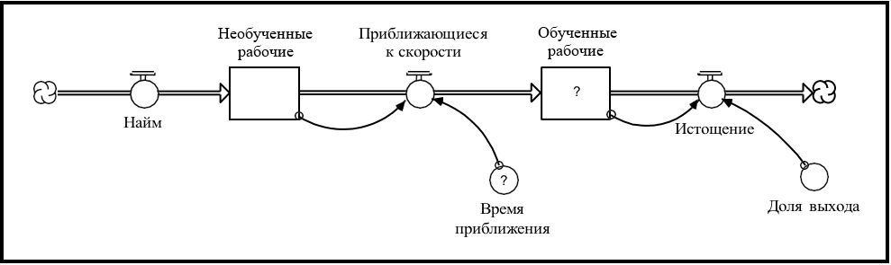

## Глава 12. Инструкции по процессу «Написания»

И написание, и построение модели - это творческие процессы. Творческая работа по определению не является чем-то, что вы производите по шаблону и рекомендациям с чётким набором шагов. После обучения системному мышлению и его использования с клиентами уже более двадцати лет я могу с большой уверенностью сказать, что есть ряд шагов, а также набор инструкций/примеров хороших практик, которые «работают». Под «работой» я подразумеваю, что, если кто-то последует им, вероятность того, что они создадут модель, которая гарантирует понимание «что?» и «как?» и спровоцирует эффективные действия, значительно возрастает. Имеет смысл внимательно прочитать материалы этой главы и, когда вы займетесь созданием моделей, держать их «под рукой».

Глава начинается с четырех цитат от четырех мудрецов. Цитаты создают отличный контекст для любого моделирования. Затем я приведу диаграмму, изображающую общую проблему, с которой вам придётся столкнуться при создании модели. Она поможет вам сосредоточиться на том, чего вы всегда должны достигать при построении модели. После этого для объяснения руководств и принципов хороших практик я буду использовать «шаги» в процессе моделирования (схемы, представленные в главе 10 и повторенные в главе 11).

### Мудрые слова

Некоторые достаточно умные люди высказывались по поводу природы хорошей практики моделирования. Рисунок 12-1 демонстрирует слова четверых таких людей:

***Рисунок 12.1. Цитаты для размышления***

Деминг и Уайтхед утверждают, что все модели «неправильны», поскольку они являются лишь упрощениями реальности. И да, если упрощение было сделано хорошо, модель становится полезной для определенной цели, но точно не для всех целей! Ни одна модель не является действительно *верной*. Если вы пытаетесь доказать обратное, плесните холодной водой себе на лицо... или еще лучше, на вашу модель!

Эйнштейн и Сент-Экзюпери, в свою очередь, ссылаясь на более элегантную прозу, озвучивают тему KISS (Keep It Simple, Stupid; рус. Придерживайся Простоты, Дурак). Тема простоты *чрезвычайно* важна! Попытки «смоделировать систему» являются наиболее распространенной причиной «крушения и пожара» в процессе моделирования. Люди сталкиваются с гигантскими моделями, которые им либо никогда не удастся сделать имитационными, либо удастся, но без какой-либо возможности объяснить её поведение. Не пробуйте «моделировать систему». Если вы обнаружите, что вы (или ваш клиент) смотрите на настоящую систему и говорите: «Хм... этого ещё нет в модели», остановитесь! Вместо фокуса на задаче с определенными проблемами целью станет перенос в модель всего того, что находится в реальной системе. Никогда так не делайте, и вы спасёте себя (и своего клиента) от мучительной агонии поражения - а подобное поражение действительно болезненно!

### Основная задача, с которой вы столкнётесь при построении модели

Когда вы решили построить модель, вы были замотивированы какой-то реальной проблемой или задачей. Когда вы смотрите на ту среду, в которой возникла проблема, то обычно находите многомерный коллаж из картинок, звуков, мнений и т.д. и т.п., попросту беспорядок! И каким-то образом вы должны получить из этой богатой смеси несколько абстрактную (хотя и операционную) диаграмму, которая состоит из всего нескольких прямоугольников, линий, связей и, возможно, пары кругов.

Основная задача построения модели заключается в том, чтобы запечатлеть суть проблемы, системы или процесса, на которые вы смотрите, не допуская обилие интересных, но посторонних деталей. Диаграмма, показанная на рисунке 12-2, должна помочь реализовать эту задачу. Она впечатляющая, насладитесь ей пару минут.

Оси на рисунке представляют собой два измерения, которыми мы можем охарактеризовать адекватность любой модели как представления реальности: *широта* и *глубина*.

Горизонтальная ось отвечает за широту. Насколько экспансированным отражением реальности является модель? Она сфокусирована на небольшом, чётко ограниченном, выделенном для изучения кусочке реальности? Или она стремится охватить обширную структуру связей с другими кусками? Каково туннельное или периферийное видение, которое предполагает модель?

***Рисунок 12.2. Позиционирование задачи моделирования по широте и глубине***

Вертикальная ось отражает охватываемую моделью глубину: от мелкой до огромной - от взгляда с 10 000 метров до луковиц корней. Насколько агрегировано изображение, нарисованное моделью? Проблема связана с общей нестабильностью на уровне запасов, или же мы должны разобраться в детали под номером БЛ4378П в 34 разных местах инвентаризации?

Сейчас мы описали глубину и широту в *структурных* терминах. Также полезно предложить *поведенческую* интерпретацию для этих двух измерений. На уровне поведения глубокая и узкая перспектива соответствует фокусу на конкретном событии или же, наоборот, на их множестве. Неглубокая и широкая перспективы рассматривают долгосрочные закономерности. Так, говорим ли мы об циклах запасов на протяжении последних двух лет, или же о ситуации с дефицитом в последнем квартале? Вас интересуют структурные отношения, ответственные за ставки закрытия выше ожидаемого, или же вы обеспокоены тем, почему вчера уехала Сьюзан Джонc? Уделяем ли мы внимание преждевременной кончине конкретной стартап-фирмы или повышенной смертности стартапов в целом?

Учитывая эту структурную и поведенческую интерпретацию двумерного пространства глубины/ширины, теперь мы можем описать основную проблему, с которой вам придётся столкнуться при построении моделей. Точка A (на рисунке 12-2) представляет собой, «местожительство» большинства мысленных моделей. Они, как правило, достаточно детализированы и узко сосредоточены. Мы знаем *наш* кусок скалы - только влияющую на нас часть - и то хорошо! Мы очень обеспокоены конкретными событиями, потому что каждое крупное из них оказывает непосредственное влияние на нашу жизнь. Точка B находится в регионе, где находятся модели «систем» - как более мелкие (более агрегированные, менее детализированные), так и более широкие позиции в пространстве (периферийные соединения, больше форм). Задача заключается в следующем: *как добраться от точки A до точки B, избегая по пути скользкий склон, а затем остаться там, на вершине (то есть не сползать вниз)?*

Ответ, к которому мы пришли и который лучше всего подходит для перехода от A к B, напоминает «Миф о Сизифе» Камю. В эссе Камю метафорически изображает состояние человека, который, долго и трудно борясь, катит огромный камень по очень крутой горной тропе, только чтобы увидеть, как камень упадёт с другой стороны. И даже осознавая, что произойдет после достижения вершины, Камю говорит, что вы должны убедить себя снова катить камень вверх. Для Камю жизненный смысл заключался в том, чтобы прилагать новые и новые усилия, - он описывал его как «lutter vers les sommets» (борьбу за отдых на вершине) - *не останавливаясь* на достигнутом.

По пути в гору от А до Б, как Сизиф, вы столкнётесь с серьезным напряжением. Оно, как показано на рисунке 12-2, начнётся с самого старта моделирования. Вам нужно будет начать с искажения вашей перспективы (и, скорее всего, перспективы вашего клиента, если он у вас есть), из-за сорняков, деталей, в которых она в плане операционной среды запутана. Вам нужно будет использовать уже упомянутый взгляд «с высокой перспективы». Как и в случае с Сизифом, чтобы не сползать со склона, вам нужно будет соблюдать дисциплину на протяжении всего пути. И так же, как Сизиф, большая часть обучения будет происходить по пути (не после того, как вы дойдете). Но также присутствуют некоторые важные отличия между проблемой Сизифа и тем, с чем вы столкнетесь в поисках пути от А до Б.

Во-первых, главный герой Камю был, по крайней мере, уверен, что он находится на пути к вершине. У вас такой уверенности нет. На самом деле многим людям предлагается выбрать *горизонтальный* путь, ведущий вправо от точки А. Мы называем этот путь «низкой дорогой». Люди, идущие по нему, «моделируют систему»! Это вернейший способ *не* попасть в B! Я уже описал агонию поражения, которая *точно* ожидает тех, кто стремится «моделировать систему». Это некрасиво. Держитесь подальше от низкой дороги!

Второе различие между тропой, пройдённой героем Камю, и той, которую вы должны искать, заключается в том, что большая часть вашего пути находится на небольшом *спуске*! После первоначального, очень крутого вертикального подъёма остальная часть процесса состоит в расширении вашего взгляда и осторожном привлечении дополнительных деталей (не теряйте опору!). Помните, что в косметических целях всегда можно добавить больше деталей, но уже *после* того, как вы поняли, к чему хотите прийти. Первое правило ведения бизнеса - это понимание.

Третье различие между путём Сизифа и вашим собственным состоит в том, что заранее неизвестно, упадет ли ваш «камень» вниз! Это может случиться, но этого не *должно* произойти. Одной из наиболее распространенных причин этого являются «клиенты». После просмотра начальной, простой версии был вызван интерес к модели. Клиенты отмечают, что, хотя модель «интересна», она была бы «ещё лучше», если добавить ещё несколько вещей. Дальше снова: «Хорошо, но...», - и добавляется новый список запросов. Спустя некоторое время, когда модель продолжает набирать охват, заинтересованные стороны всей организации понимают, что они тоже должны привнести что-то свое. Когда так происходит, вы находитесь в свободном падении вниз.

Один из лучших способов избежать толчка к свободному падению - убедиться, что на склоне вы всегда вместе с клиентом, т.е. вовлечь его в процесс принятия пограничных решений. Превратите его участие в неотъемлемую часть вашей стратегии обучения. Провоцируйте клиента спорить с вами, чтобы он понимал, почему модель делает то, что она делает, и вдохновите его на поиск ясных, интуитивных объяснений, которые могут понять и другие.

После этой прелюдии, связанной с поиском пути, мы готовы рассмотреть некоторые инструкции для процесса моделирования/обучения.

### Инструкции к процессу моделирования

Диаграмма, изображающая шаги в процессе моделирования, изображена на рисунке 12-3. Для каждого шага я предоставил некоторые рекомендации и примеры «лучшей практики», которые помогут вам в выполнении определённых шагов. Инструкции по шагам моделирования идут перед теми, что предусмотрены для шагов обучения - это строго для ясности и не предназначено для указания приоритета или порядка их выполнения.

***Рисунок 12.3. Шаги в процессах конструирования модели/обучения***

### Шаг 1. Определить проблему

На первом этапе процесса вы пытаетесь разработать чёткий фокус проблем, на который нужно направить свои усилия. Неправильно контролируемые усилия по созданию модели являются таковыми, потому что было недостаточно времени, чтобы проработать необходимую операционную формулировку цели. Тратьте время с умом!

#### *Инструкция 1: напишите чёткую, ясную цель*

* Напишите свою формулировку цели на бумаге. В дальнейшем всегда держите её в поле зрения.

* Сформулируйте цель с точки зрения получения понимания отношений, из-за которых появляется конкретная проблема, и решения этой проблемы. Например, «Данная модель предназначена для того, чтобы пролить свет на причины неустойчивости запасов с целью уменьшения этой неустойчивости».

* Никогда не уходите в «моделирование системы».

* Обязательно вовлеките в разработку цели все заинтересованные стороны.

#### *Инструкция 2: разработайте шаблон эталонного поведения*

*Образцовый шаблон поведения* представляет собой временной график с одной или несколькими переменными, которые лучше всего отображают модель поведения, которую вы пытаетесь понять/изменить.

* В случаях, когда есть «история», ваш шаблон должен показывать «Как Есть». Когда её нет (например, при разработке новой стратегии или новой организации), ваш шаблон также может включать сегмент «Быть», причем он может быть единственным в шаблоне. При разработке сегмента «Быть» обратите особое внимание на то, сколько потребуется времени, чтобы достичь уровней «Быть».

* Выберите «интересный» шаблон, визуально отображающий «загадку», для которой *необходимо* объяснение.

* По возможности создайте шаблон, используя *относительные* измерения. Разделите переменную в шаблоне некоторым количеством контрольных показателей, чтобы исключить проблемы абсолютного роста (этот процесс называется «нормализацией»).

* Обратите внимание на временной интервал, внутри которого развёртывается шаблон. Включите только те вещи в вашу модели, которые разворачиваются с частотой, релевантной для этого интервала. Например, если шаблон разворачивается более пяти лет, вы можете включать в него элементы, которые разыгрываются по кварталам или месяцам, но не по неделям или часам!

На рисунке 12-4 показаны три иллюстрации шаблонов эталонного поведения.

***Рисунок 12.4. Проиллюстрированные шаблоны эталонного поведения***

### Шаг 2. Развить гипотезу

На этом этапе вы продумываете и выдвигаете гипотезу, которая, по вашему мнению, способна объяснить шаблон эталонного поведения, определённый на первом шаге.

#### *Инструкция 1: ищите принцип динамической организации*

«Принцип динамической организации» - это базирующийся на инфраструктуре или на петлях обратной связи фреймворк, который находится в основе вашей модели. Думайте о нём как о теме, на которой строится ваша «история».

Некоторые примеры с __инфраструктурой__:

* Распределение времени (глава 9)
* Перколяция в основном каскаде (глава 8)
* Отслеживание атрибутов (глава 9)

Некоторые примеры с __петлями обратной связи__:

* Перегрузка и крах (из-за истощения ресурсной базы)
* S-образный рост (сдвиг в доминировании) (глава 6)
* Двухфазная чистая осцилляторная структура (глава 7)
* Удержание успеха
* Переход бремени к посреднику
* Разрушение целевых структур

### Основной каскад

Основная каскад - это последовательность запасов, связанных сохраняемыми (т.е. материальными) потоками. Инфраструктуры Основного каскада описаны в главе 8. Основной каскад обеспечивает физическую «магистраль», от которой может вращаться остальная часть вашей модели. Он продемонстрирован на рисунке 12-5.

* Спросите: *что проходит через систему?* Обратите внимание на связанные «пункты». Между ними должно быть накопление. Если накопления/потоки проходят по последовательности сохраняемых потоков, вы получите основную цепь.

* Каскады должны быть как можно более агрегированными.

***Рисунок 12.5. Иллюстрация Основного каскада***

### Подход «Ключевых исполнителей»

Часто, размышляя об «исполнителях», связанных с вашей моделью, вы можете идентифицировать ядро основных запасов и соответствующих им потоков.

* Определите наименьший набор Ключевых исполнителей, который вы собираетесь привлечь для участия в создании шаблона эталонного поведения. Исполнители часто не являются отдельными людьми.

* Для каждого исполнителя определите условия, которые он отслеживает, чтобы определить, как обстоят дела в его части системы. Условия могут быть материальными (например, деньги) или нематериальными (например, доверие). Скорее всего, они будут представлены в виде *запасов*.

* Затем определите действия, предпринимаемые каждым исполнителем в ответ на изменения условий. Действия будут представлены *потоками*.

* Наконец, определите ресурсы, которые поддерживают принятие мер. Ресурсы могут быть материальными или нематериальными. Ресурсами будут *запасы* (или их конвертеры).

* Полезно использовать «Матрицу Ключевых исполнителей» (см. рисунок 12-6) для сбора информации об условиях, действиях и ресурсах.

***Рисунок 12.6. Иллюстрация матрицы Ключевых исполнителей***

### Самое важное накопление

Определите накопление (запас), которое вы считаете ближайшим к «сердцу» изначальной проблемы. После этого добавьте приток и отток. Вы на правильном пути!

#### *Инструкция 3: чтобы охарактеризовать потоки, используйте шаблоны общих потоков*

После того, как вы получили запасы и потоки, следующим шагом в разработке гипотезы будет *характеристика потоков*. Стремитесь охватить природу каждого потока - то, как он работает в реальности. Используя один из шаблонов общих потоков, описанных в Приложении к Главе 6, старайтесь достичь эксплуатационной спецификации.

* Посмотрите на каждый поток отдельно. Спросите: *«Какова природа деятельности, которая генерирует поток? Как эта деятельность работает в реальной системе?»* *Не* спрашивайте: «Каковы все факторы, *влияющие* на этот поток?» Так вы придете лишь к прачечному листу!

* Если активность...
Является самоподкрепляющим процессом роста, используйте *Шаблон компаундирования*;
Включает в себя пассивный распад, дренирование или старение, используйте *Шаблон дренирования*;
Производится ресурсом, отличным от запаса, к которому прикреплен поток, используйте *Шаблон внешнего ресурса*;
Выполняется параллельно с каким-либо другим потоком, или, если поток отслеживает атрибут, связанный с запасом, используйте *Шаблон совместного потока*;
Регулирует запас до определенного целевого значения, используйте *Шаблон корректировки запасов*.

*Используйте только один общий шаблон для потока. Если требуется другой шаблон, создайте отдельный поток. Добавьте только необходимую для выбранных вами процессов общего потока структуру. Вы можете приукрасить её позже.

#### *Инструкция 4: закрыть циклы без добавления дополнительных элементов в модель*

После того, как вы охарактеризовали потоки на своей карте, следующим шагом в разработке вашей гипотезы является закрытие циклов. Очень важно сделать это без включения дополнительных запасов, потоков или конвертеров.

* Посмотрите, есть ли какой-то параметр, связанный с шаблоном общего потока, который на текущий момент постоянен, но на самом деле зависит от некой другой переменной, *присутствующей на экране* (таких будет много, но вы заинтересованы сделать их переменными только при условии, что это является частью вашей гипотезы!). Закройте цикл, как показано на рисунке 12-7.

На рисунке закрыты два цикла, тем самым превращая параметры шаблонов совместного потока и потока добавления запасов из постоянных в переменные. Первый цикл связывает запас *знаний* с временем, выделяемым на учебные мероприятия. Идея здесь заключается в том, что, например, стремление к знаниям может заставить кого-то потратить больше времени на *учебные занятия*. Второй же связывает *Знание* с *продуктивностью обучения* - чем больше человек знает, тем больше «крючков» для обучения он имеет в дальнейшем.

***Рисунок 12.7. Закрытие циклов***

#### *Инструкция 5: Преобразуйте вашу карту в компьютерную имитационную модель, включив в неё уравнения*

Затем, вычленив карту, выберите из неё кусок (сектор - хороший кусок) и сделайте его имитационным, т.е. приведите соответствующую математику и включите числа.

* Сначала щелкните на уравнения шаблона общего потока.

* Проверьте размерности каждого уравнения. Единицы измерения правой части каждого уравнения должны совпадать с единицами измерения для левой стороны. Потоки должны иметь те же единицы измерения, что и запасы, к которым они прикреплены, но с добавлением единицы "за время".

* Избегайте «мёртвых буйволов» (имя взято из-за того, как они выглядят на диаграмме, см. рисунок 12-8). Строки факторов, которые «коррелируются» или «влияют», - это не то же самое, что операционная интерпретация причинности. Избегайте подход «Критических факторов успеха».

***Рисунок 12.8. «Мёртвый буйвол» против операционной интерпретации***

#### *Инструкция 6: Преобразуйте вашу карту в компьютерную имитационную модель, включив в неё числа*

На первом проходе выберите числовые значения, которые инициализируют вашу модель в стационарном состоянии, в котором притоки и оттоки по каждому запасу равны нулю. Дополнительную информацию об инициализации моделей в стационарном режиме см. в Приложении к этой главе.

* Отдавайте предпочтение тем числам, которые просты и связаны друг с другом, а не взятым из реальной системы. Простые, внутренне согласованные числа помогут вам привести модель в стационарное состояние. На втором проходе, если это действительно важно, вы можете включить реальные данные.

* Выбирайте округлённые числа (например, 0, 1, 10, 100, 1000 и т.п.) вместо громоздких (например, 2,7182818, 97,2222, 1 квадриллион и т.п.). Так вам будет намного легче понять, что происходит в вашей модели.

* Избегайте уравнений, в которых множители «воздействия» или «влияния» используются более, чем 2-3 раза. Даже если каждое значение имеет лишь немногим меньше 1, итоговое влияние нескольких таких «воздействий» может быть удивительно большим (например, 0,9 * 0,9 * 0,9 * 0,9 = 0,66).

* Для разработки ваших графических функций следуйте процедуре, описанной в Приложении к главе 7.

### Шаг 3. Протестировать гипотезу

Моделирование ваших гипотез на компьютере призвано увеличить вашу уверенность в том, что выведенная модель полезна для целей, которым она служит. Эти тесты также предназначены для того, чтобы вы знали об ограничениях полезности модели. Таким образом, из этого шага вы должны получить знания о возможностях модели и ее пределах.

Чтобы убедиться, что из каждого теста вы вынесете столько, сколько сможете, перед каждой симуляцией наметьте своё предположение относительно соответствующего результата и сформулируйте свое обоснование. По завершении симуляции работайте над устранением любых расхождений в фактическом или прогнозируемом поведении или в вашем обосновании. Не стесняйтесь возвращаться к шагам 1 и 2 процесса моделирования, если результаты теста требуют того.

#### *Инструкция 1: Найдите «механические» ошибки*

* Запустите имитацию.
** Исследуйте любые «?» (т.е. неопределенные сущности), которые не позволяют проводить имитацию модели.
* Если имитация идёт, выберите Range Specs (Характеристики Диапазона) из меню Run (Выполнить).
** Ищите аномальные значения (?, ∞ и отрицательные значения, которые должны быть положительными).
** Поместите в Table (Таблицу) «раздражающие» переменные и связанные с ними притоки и оттоки. Установите интервал печати таблицы в DT (delta time - интервал времени). Задайте Таблицу так, чтобы она выдала начальные балансы.
* Отследите модель на протяжении нескольких DT. Посмотрите на значения в таблице, чтобы определить, какая переменная вызывает проблему.
* Повторяйте предыдущие два шага, пока не найдёте и не устраните все механические ошибки.

#### *Инструкция 2: Обеспечьте стабильность модели в стационарном состоянии*

* Запустите имитацию. Введите запасы в Таблицу.
* Установите интервал печати в DT. Задайте Таблицу так, чтобы она выдала начальные балансы.
* Запустите первый DT. Посмотрите, меняется ли стоимость запасов.
* Поместите раздражающий запас (или запасы), соответствующие притоки и оттоки в Таблицу. Устраните проблему. Повторяйте, пока модель не примет стационарное состояние.

#### *Инструкция 3: Протестируйте «надёжность» модели*

* Тесты на прочность выявляют формулировки, которые не работают «в экстремальных условиях».
* Включите уже упомянутые функции Step и Pulse в качестве тестового ввода в одно или два тщательно отобранных уравнения потока. Идея состоит в том, чтобы «шокировать» выбранный запас, выбивая его (и модель) из стационарного состояния.
** Выведите график реакции ключевых переменных, в частности, того запаса, чей поток подвергается удару.
* Используйте функцию трассировки («T» на странице Graph (График), появляется после выбора имени переменной в верхней части страницы графика) вместе с функцией «Зависание для отображения мини-графа», чтобы помочь вам понять, почему вы получаете именно такие результаты.
* Определите, демонстрирует ли модель странное или неправдоподобное поведение: запасы становятся отрицательными, когда они не должны; запасы растут без ограничений; система возвращается в «неправильное» стационарное состояние; время ответа слишком короткое, слишком длинное и т.д. *Убедитесь, что вы понимаете, почему так происходит*. Часто вы пропускаете петлю обратной связи; или она бывает слишком слабая/сильная.
* Если система проявляет «высокочастотные» колебания в ответ на любой тест (т.е. запасы и/или потоки дико прыгают вверх-вниз на каждый DT), проверьте свой DT. Уменьшите его значение в соответствии с рекомендациями, представленными в разделе DT: What, Why & Whyfore (DT: Что, Почему, Зачем) в файлах справки ithink в программном обеспечении. Если колебания остаются прежними, уменьшите интервал вдвое еще несколько раз.
* Если система демонстрирует гладкую, но постоянно расширяющуюся модель колебаний, убедитесь, что вы используете один из методов моделирования Рунге-Кутта. Подробнее см. в Имитационных алгоритмах в файлах справки ithink в программном обеспечении.
* Сравните результаты модели с шаблоном эталонного поведения.
* В первую очередь, ищите качественное сходство. Не тратьте много времени на точное «отслеживание истории», если этого не требует ваша цель (или ваш босс!). Убедитесь, что вы понимаете и можете объяснить, какие результаты вы генерируете.
* Аналогично используйте функцию трассировки в сочетании с функцией «Зависание для отображения мини-графа».
* Если требуется «отследить историю», замените в реальных номерах константы, первоначальные значения и графические функции. При необходимости также добавьте графические функции временных рядов для управления моделью с использованием исторических данных.

### Шаги 4 и 5. Сделать выводы и оценить надёжность.

Следующий набор тестов направлен на обнаружение способов изменения (чаще всего, для улучшения) производительности системы. Часто шаблоны поведения, генерируемые моделью, «нечувствительны» даже к значительным изменениям во многих параметрах. Несмотря на то, что числовые величины меняются, картина поведения сохраняется. Чувствительными параметрами являются те, которые могут привести к изменению шаблона (-ов) проявляемого моделью поведения. Такие параметры часто упоминаются как «рычаги» - изменение их значения приводит к изменению режима поведения. «Сильные рычаги» - это параметры, значения которых при изменении лишь небольшой суммы приводят к сдвигу структуры поведения. Рычаг возникает из-за того, что изменение параметра(-ов) привело к увеличению мощности усиливающей или противодействующей обратной связи, которая до сих пор была «заблокирована».

После определения некоторых эффективных инициатив важно понять, насколько они «надёжны». Будут ли они по-прежнему эффективными, когда *поведенческие предположения*, включенные в модель, и предположения о *внешней среде*, варьируются? Оценка первого известна как «анализ чувствительности», второго - «сценарный анализ». Оба важны для защиты от «синдрома серебряной пули» (т.е. политики/стратегии, которая работает практически во *всех* условиях и во всех предположениях - *очень* немногие из них существуют!).

#### *Инструкция 1: Ищите сильные рычаги*

* Просканируйте структуру модели, чтобы определить константы и графические функции, которые отражают реальные варианты поведения (т.е. находятся под контролем лиц, принимающих решения в рамках системы).
* Часто полезно искать графические функции, которые регулируют силу петель обратной связи. В частности, выявите усиливающие петли, которые существуют внутри нефизических переменных внутри системы (поскольку эти переменные иногда предлагают дополнительные возможности).
* Для каждой используйте параметр Incremental (Возрастание) в анализе чувствительности или GID (Graphic Input Device - графическое устройство ввода для графических функций), чтобы оценить объём рычага, предлагаемого параметром.

#### *Инструкция 2: Оцените надёжность по отношению к значениям параметров*

* Определите важные «поведенческие предположения» в вашей модели. Это значения, связанные с параметрами, которые являются «внутренними для системы», и, следовательно, над которыми лица, принимающие решения в системе, могут, по-видимому, осуществлять некоторый контроль. Для каждого из них проведите анализ чувствительности с параметром (параметрами) «сильного рычага», установленными на его изменённом значении (значениях). Сохраняют ли рычаги свои свойства? При каких условиях они теряют «свою магию»? Оцените вероятность возникновения этих «волшебных искореняющих» условий.
* Определите важные «сценарные параметры» в вашей модели. Эти параметры являются «внешними» для системы, и, следовательно, лица, принимающие решения в системе, мало контролируют их. Для каждого из них аналогично проведите анализ чувствительности с параметром (параметрами) «сильного рычага» и оцените вероятность возникновения условий «потери их магии».
* В результате ваших анализов определите точки вмешательства, наиболее устойчивые к изменениям как внутренних поведенческих, так и внешних сценарных параметров.
* Определите *экстенсивные* и *интенсивные* граничные точки вашей модели (см. рис. 12-9).

***Рисунок 12.9. Концепция экстенсивного и интенсивного ограничения модели***

#### *Инструкция 3: Оцените надёжность по отношению к ограничениям модели*

* Тесты *экстенсивных* границ модели помогут вам оценить адекватность *широты* вашей модели. Облака на концах потоков являются явными индикаторами широты. Облака представляют собой «бесконечные источники» или «раковины». Облако показывает, что поступающий в запас материал возникает «из воздуха» (т.е. не истощает какой-либо другой запас), а вытекающий из запаса материал аналогично исчезает (т.е. не заполняет другой запас). Облака, связанные с физическими потоками, подразумевают, что соответствующие запасы, а также любые связанные потоки и петли обратной связи, находятся «вне» охвата вашей модели. Существование облаков помогает вам помнить, что вы включаете эти допущения.
* *Бросьте вызов* облакам в вашей модели! Спросите: если я заменил это облако запасом, какие дополнительные отношения обратной связи будут введены в модель? Введение этих отношений может заставить меня изменить мои выводы? Если ответ «да, возможно», устраните облако, добавьте отношения и имитируйте!
* *Интенсивные* тесты границ модели помогут вам оценить глубину, степень десагрегации вашей модели. Вы включали «слишком много» или «слишком мало» деталей, чтобы изображать элементы, действия и взаимосвязи в модели? Вы столкнетесь с конвертором, графической функцией, представлениями запасов и потока.

Сканируйте модель для *конверторов*, которые используются в качестве заменителей запасов. Рассмотрим каждый такой конвертер в свете вашей цели, спрашивая:

* Какие потоки не учитываются в модели при выборе подхода и запаса в качестве конвертера?
* Если я включу эти потоки, как измениться динамика системы?

Если ответы на эти вопросы кажутся интересными, сделайте необходимый запас/поток для подстановок конвертера, включите любые предполагаемые отношения обратной связи, а затем имитируйте.

Определите каждый *запас*, который используется для агрегирования категории (например, врачи, а не «многочисленные» медицинские специальности). В свете вашей цели выясните, может ли десагрегация совокупного запаса изменить ваши выводы. Если этого стоит придерживаться, придерживайтесь. Изучите каждый *конвейер*, который вы включили в свою модель. Подумайте о процессах, которые он агрегирует. Может ли подробное представление деталей этих процессов заставить вас изменить свои выводы? Если да, десагрегируйте! Имитируйте.

Изучите каждый поток в вашей модели. Определите, представлена ли связанная с этим деятельность достаточно подробно, чтобы претендовать на отображение реальной картины ситуации. Если нет, подумайте о десагрегации потока, чтобы зафиксировать более достоверную картину реальности. Считаете ли вы, что это может изменить ваши рекомендации? Если да, десагрегируйте! Имитируйте снова.

Изучите каждую графическую функцию. Подумайте, действительно ли оправдано «усреднённое» предположение, встроенное в зависимую переменную. Например, в графической функции, представляющей «ценовую эластичность спроса» для товара, должна ли функция быть разделена на отдельные ценовые эластичности для каждого сегмента рынка?

### Инструкции для процесса обучения

#### Процесс обучения

Если только человек или люди, которые построят модель, будут знать о ней, огромный потенциал для ознакомления и понимания будет упущен. Жизненно важно определить общую стратегию обучения для ваших усилий. Любая такая стратегия должна включать компоненты «по пути» и «после завершения».

#### *Инструкция 1: Определите стратегию обучения «по пути»*

* Стремитесь привлечь всех ключевых заинтересованных сторон к процессу построения модели. Это не означает, что все участники группы должны участвовать в написании уравнений или сборе цифровых данных. Это означает, что участники должны улавливать концепт модели, реагировать на первоначальные структурные карты и заниматься имитацией моделей первого раунда.

* Также необходимо определить стратегию обучения для тех, кто непосредственно не участвует в построении моделей. Вы хотите сделать снабженные соответствующими последовательностями повествования «карты», которые будут доступны для прочтения и загрузки через локальную сеть организации? Вы хотите, чтобы были доступны промежуточные версии компьютерных моделей, возможно оснащённые интерфейсами симулятора полета, и люди из всей организации могли учиться «играть»?

#### *Инструкция 2: Определите стратегию обучения «после завершения»*

* После завершения модель должна стать частью онлайновой *Организационной инфраструктуры обучения*. Любой, кто находится в организации, должен иметь возможность «проверять модель» в Библиотеке, просматривать её и предлагать улучшения. Усовершенствования должны быть реализованы посредством формального процесса редактирования, который осуществляют некоторые официальные лица, контролирующие доступ к исходнику.

* Любые модели, размещённые внутри инфраструктуры, должны иметь: (1) аннотированные последовательности повествования, чтобы помочь людям «вынести смысл» из структуры модели/поведения, (2) интерфейс высокого уровня, который предоставляет контекст и документацию, и (3) некоторый пользовательский интерфейс, который облегчит процесс внесения изменений в параметры и саму имитацию.

* Вы можете конвертировать некоторые модели в симуляторах полета или полномасштабных учебных средах. *Симуляторы полета* предоставляют панели мониторинга и обычно имитируют в режиме «пауза и возобновление». Часто они включают в себя сообщения обратной связи «по характеру» и некоторые способы «поддержания оценки». *Среда обучения* - это лётные тренажеры, оснащённые кодами для тренировок JITJWN (Точно в срок, То, что нyжно).

#### *Инструкции по Симулятору полёта*

Сопроводите интерфейсную часть Симуляторов полёта и Учебных сред иконами корпоративной культуры (фильмы с участием CEO очень эффективны!), чтобы создать как можно больше точек соприкосновения с организационной реальностью. Это размывает недоверие, завлекая конечных пользователей в «волшебное королевство». Предоставьте конечным пользователям чёткое изложение своей миссии и ясную картину, «кто они» (какую роль они играют) в разворачивающейся драме. Сделайте заявление миссии практическим, объяснив, какое влияние будет оказывать каждый рычаг решения на систему (косвенные воздействия - модели разветвления - то, до чего дойдут конечные пользователи своими усилиями по управлению системой).

Держите приборные панели простыми! Ограничьте количество рычагов принятия решений примерно до пяти-семи. Ограничьте количество контролируемых переменных на основной панели до трех-четырех. Если необходимо включить дополнительные рычаги, сгруппируйте их и перейдите с центральной панели на каждую группу (или используйте единое устройство ввода списка с несколькими страницами). Дополнительные переменные, подлежащие мониторингу, должны быть включены в графики и таблицы, расположенные на отдельном экране. Подумайте, имеет ли смысл разделение рычагов решения и выходных устройств. Обязательно включите «отчёт о решениях» (графики, таблицы или все вместе!), чтобы обучающиеся могли повторно принять решения, сделанные ими во время полета.

Не включайте более 20 периодов решения (оптимально 10-15). Используйте функцию Run/Restore (Прогон/Возврат), а не Run для кнопок Run, чтобы не допустить случайного прогона после окончания симуляции и непреднамеренного уничтожения отчёта о решениях и достижениях в производительности. Подумайте о включении эскизного графа Sketchable, чтобы дать обучающимся возможность «оставлять зарубки» в отношении результатов работы, которых они надеются достичь.

При разработке тренинговых последовательностей начинайте с определения всех возможных моделей поведения, которые могут произвести ученики. Для каждого шаблона продумайте «след из хлебных крошек», который заставит ученика задавать правильные вопросы о том, почему они получают результат, который развивается. Фронтальная загрузка сообщений обратной связи по характеру, а затем переход к тренинговым сообщениям с последующей симуляцией. Если учащиеся слишком долго не чувствуют прогресса в понимании, они впадают в фрустрацию, а если «поймут все» слишком быстро, то обесценивают опыт обучения. Сделайте каждую тренинговую виньетку короткой и приятной; *не читайте лекции*! Задавайте хорошие вопросы; предоставляйте наглядные метафоры. Помните, что учащиеся находятся в «режиме действия» и не хотят долгих размышлений!

Учащиеся очень любят похлопывания по плечу! Не стоит недооценивать их важность (как мелкие, так и крупные победы должны быть признаны).

Подумайте над внедрением раздела «Расширьте свое понимание», в котором учащиеся могут модифицировать поведенческие и сценарные предположения, чтобы «сделать модель своей собственной» и развеять любое понятие «идеальных решений».

### Итоги

Основным преимуществом систематической работы процесса моделирования/обучения является то, что в результате вы сможете более чётко, более кратко и с большей уверенностью общаться как о причинах изученной проблемы, так и об эффективных путях ее решения. Вы также сможете сделать ваше обучение доступным для других в *активном* формате. Люди смогут найти для себя понимание «что?» и «как?». Так создастся общее понимание и регулирование во всей организации.

## Дополнение: *Инициализация ваших моделей в стационарном состоянии*

Достижение инициализации в стационарном состоянии часто является понятным процессом. Это всегда полезный процесс по двум причинам. Во-первых, стационарное состояние гарантирует, что параметры в вашей модели внутренне непротиворечивы. Во-вторых, как только модель находится в стационарном состоянии, вы сможете проводить контролируемые эксперименты, в которых вы наблюдаете «чистый» отклик системы на ваши тесты надежности и политики.

### Инструкции

В стационарном состоянии для каждого запаса сумма притоков равна сумме оттоков. Поэтому величина всех запасов будет постоянной.

* Определите, какой разброс у вас есть для указания значения каждого потока. Можете ли вы *прямо* установить значение потока или иначе заставить его быть тем, каким хотите?

* Как только вы определили величину имеющегося разброса, используйте данные, которые являются «самыми твердыми», чтобы вывести значения для тех параметров с «наименее твердыми» значениями. Предоставьте себе достаточную свободу при определении значений «менее твердых» параметров. Поскольку несколько реальных систем находятся в стационарном состоянии, вам часто нужно будет модифицировать числа, взятые из реальной системы. После завершения тестов, основанных на стационарном состоянии, вы можете обратно поставить «реальные» значения. По возможности используйте алгебраическую инициализацию для определения начальных значений запасов. Мы проиллюстрируем этот процесс, используя модель, изображенную на рисунке 12-10.

***Рисунок 12.10. Иллюстрация алгебраической инициализации***

Вы можете счесть полезным работать по этой иллюстрации. Модель содержится в папке «Модели» под названием «Инициализация». В ней мы с уверенностью знаем следующее:
* Необученные рабочие = 100
* Приближающиеся к скорости = Необученные рабочие / Время приближения
* Истощение = Обученные рабочие * Доля выхода
* Доля выхода = 0,25
* Найм = 50
Мы будем использовать то, что знаем с уверенностью, чтобы найти два значения, в которых мы менее уверены (начальное значение для Обученных рабочих и значение для Времени приближения). Процесс решения также приведет к инициализации модели в стационарном состоянии. 

Начнем с поиска начального значения для Обученных рабочих. В стационарном состоянии:
* Истощение = Приближающиеся к скорости

Приводя соответствующую математику для двух потоков, имеем:
* Обученные рабочие * Доля выхода = Необученные рабочие / Время приближения

Решение для обученных рабочих, мы получаем ...
* Обученные рабочие = (Необученные рабочие / Время приближения) / Доля выхода

(Теперь мы можем щелкнуть на это уравнение, используя переменные в списке Допустимые Вводные диалогового окна «Обученные рабочие». Теперь в начале моделирования программа будет решать уравнение, чтобы получить начальное значение для обученных работников. Обратите внимание - как только мы вывели это значение, поток Истощение стал равен потоку Приближающихся к скорости!)

Чтобы завершить процесс, мы найдем стационарное значение Времени приближения. Для стационарного состояния:
* Найм = Приближающиеся к скорости

Математически выводим, что
* Найм = Необученные рабочие / Время приближения

Подставляем числа:
* 50 = 100 / Время приближения

Отсюда:
* Время  = 100/50 = 2

Такой алгоритм позволяет грамотно использовать численные значения, насчет которых вы уверены, для вывода неизвестных значений. В то же время он осуществляет инициализацию стационарного состояния для вашей модели. Два зайца одним выстрелом!

