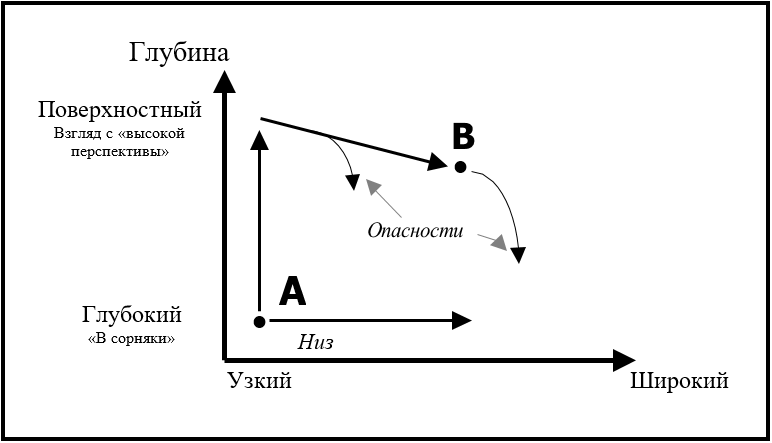
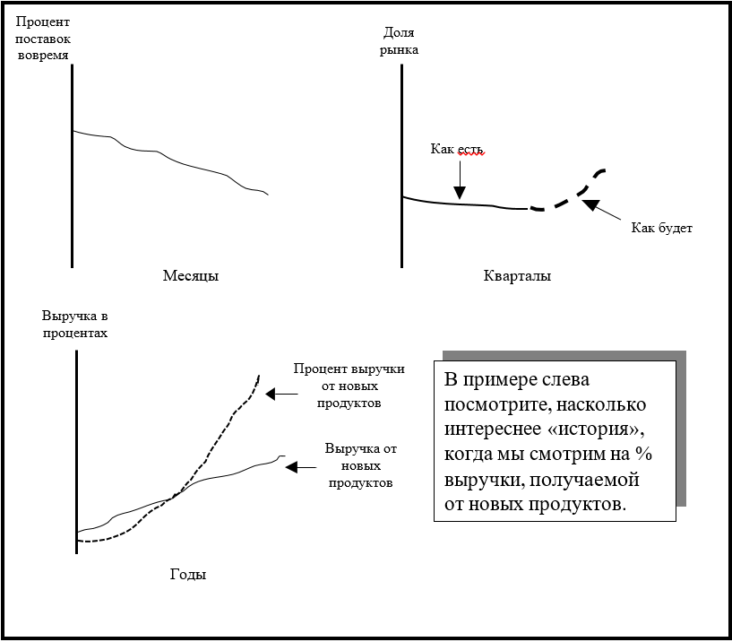
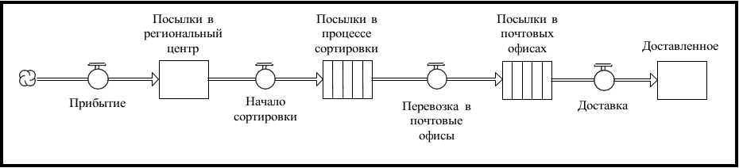
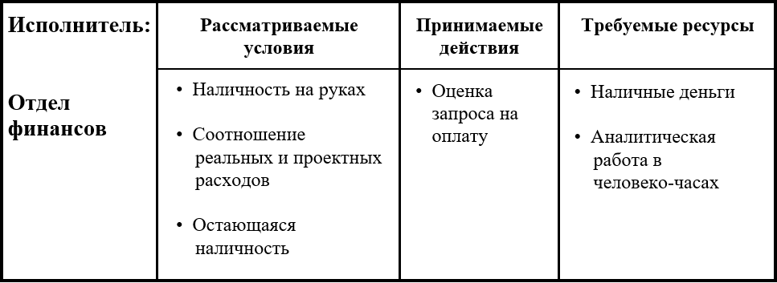
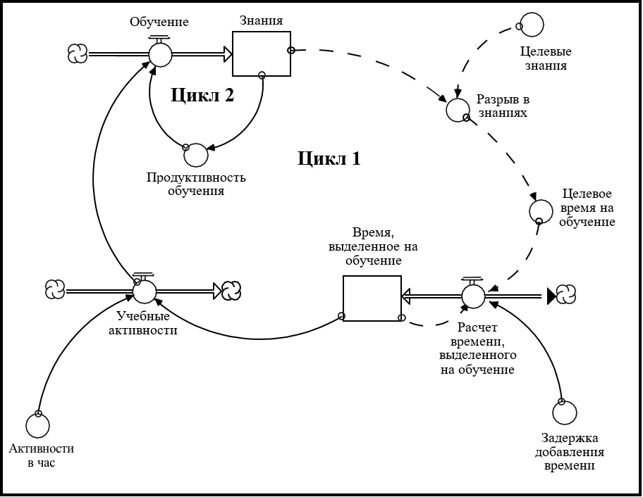
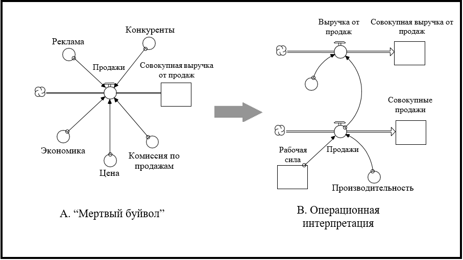
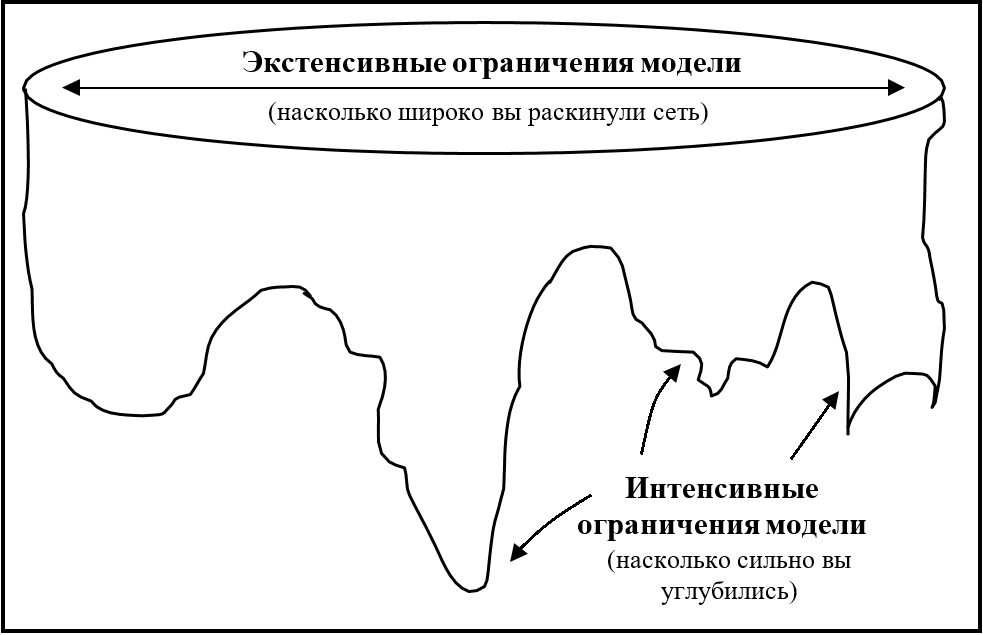

## Глава 12. Инструкции по процессу "написания"

И написание, и построение модели - это творческие процессы. Творческая работа по определению не является чем-то, что вы производите по шаблону и рекомендациям с четким набором шагов. После обучения системному мышлению и использования его с клиентами уже более двадцати лет я могу с большой уверенностью сказать, что есть ряд шагов, а также набор инструкций/примеров хорошей практики, связанных с этими шагами, которые «работают». Под «работой» я подразумеваю, что если кто-то последует им, значительно возрастает вероятность того, что они создадут модель, которая гарантирует понимание «что?» и «как?» и спровоцирует эффективные действия. Имеет смысл внимательно прочитать материал в этой главе и, когда вы займетесь созданием моделей, держать его «под рукой».

Глава начинается с четырех цитат от четырех мудрецов. Цитаты создают отличный контекст к любому моделирования. Затем я приведу диаграмму, изображающую общую проблему, с которой вам придется столкнуться при создании модели. Эта картинка поможет вам сосредоточиться на том, чего вы всегда должны достичь при построении модели. После этого я буду использовать «шаги» в процессе моделирования (схемы, представленные в главе 10 и повторенные в главе 11), для объяснения руководств и принципов хорошей практики.

### Мудрые слова

Некоторые достаточно умные люди высказывались по поводу природы хорошей практики моделирования. Рисунок 12-1 представляет собой слова четверых таких мудрецов:

***Рисунок 12.1. Цитаты для размышления***

Деминг и Уайтхед утверждают, что все модели «неправильны», поскольку они являются лишь упрощениями реальности. И да, если упрощение было сделано хорошо, модель становится полезной для определенной цели, но точно не для всех целей! Ни одна модель не является действительно *верной*. Если вы пытаетесь доказать обратное, плесните холодной водой себе на лицо ... или еще лучше, на вашу модель!

Эйнштейн и Сент-Экзюри, в свою очередь, озвучивают тему ППД (Придерживайся Простоты, Дурак), ссылаясь на более элегантную прозу. Тема простоты *чрезвычайно* важна! Попытка «смоделировать систему» является наиболее распространенной причиной «краха» в процессе моделирования. Люди сталкиваются с гигантскими моделями, которые им либо не удастся сделать имитационными никогда, либо удастся, но без какой-либо возможности объяснить её поведение. Не пробуйте «моделировать систему». Если вы обнаружите, что (или ваш клиент) смотрите на настоящую систему и говорите: «Хм... это еще не в модели», остановитесь! Вместо фокуса на задаче с определёнными проблемами целью станет перенос в модель того, что находится в реальной системе. Никогда не делайте, и вы спасете себя (и своего клиента) от мучительной агонии поражения - а такое поражение действительно болезненно!

### Основная проблема, с которой вы столкнётесь при построении модели

Когда вы решили построить модель, вы были мотивированы сделать это какой-то реальной проблемой. Когда вы смотрите на ту среду, в которой возникла проблема, то обычно находите многомерный коллаж из картинок, звуков, мнений и т.д и т.п., проще говоря, беспорядок! И каким-то образом вы должны получить от этой изысканной и богатой смеси несколько абстрактную (хотя и оперативную) диаграмму, которая состоит из  всего нескольких прямоугольников, линий, связей и, возможно, пары кругов.

Основная проблема в построении модели заключается в том, чтобы запечатлеть суть проблемы, системы или процесса, на которые вы смотрите, не допуская обилие интересных, но посторонних деталей. Диаграмма, показанная на рисунке 12-2, должна помочь реализовать эту задачу. Это действительно сильно, насладитесь ей пару минут...

Оси на рисунке представляют собой два измерения, которыми мы можем охарактеризовать адекватность любой модели как представления реальности: *широту* и *глубину*.

Горизонтальная ось отвечает за широту. Насколько экспансированным отражением реальности является модель? Она сфокусирована на небольшом, чётко ограниченном, выделенном для изучения кусочке реальности? Или она стремится охватить обширную структуру связей с другими кусками реальности? Каково туннельное или периферийное видение, которое предполагает модель?

***Рисунок 12.2. Позиционирование задачи моделирования по широте и глубине***

Вертикальная ось отражает охватываемую моделью глубину. Она варьируется от мелкой до огромной - от 10 000 метров до луковиц корневых волосков. Насколько агрегировано изображение, которое рисует модель? Проблема связана с общей нестабильности на уровне запасов, или же мы должны разобраться в детали под номером БЛ4378П в 34 разных местах инвентаризации?

Сейчас мы описали глубину и широту в *структурных* терминах. Также полезно предложить *поведенческую* интерпретацию для этих двух измерений. На уровне поведения глубокая и узкая перспектива соответствует фокусу на конкретном событии или же, наоборот, на их множестве. Неглубокая и широкая перспектива рассматривает долгосрочные закономерности. Итак, говорим ли мы об инвентарных циклах на протяжении последних пару лет, или же о ситуации с дефицитом в последнем квартале? Вас интересуют структурные отношения, ответственные за ставки закрытия выше ожидаемого, или вы обеспокоены тем, почему вчера уехала Сьюзан Джонc? Уделяем ли мы внимание преждевременной кончине конкретной стартап-фирмы или повышенной смертности стартапов в целом?

Учитывая эту структурную и поведенческую интерпретацию двумерного пространства глубины / ширины, мы теперь можем описать основную проблему, с которой вам придется столкнуться при построении моделей. Точка A (на рисунке 12-2) представляет собой, где «живет» большинство ментальных моделей. Они, как правило, достаточно детализированы и узко сосредоточены. Мы знаем *наш* кусок скалы - только влияющую на нас часть - и то хорошо! Мы очень обеспокоены конкретными событиями, потому что каждое крупное из них оказывает непосредственное влияние на нашу жизнь. Точка B находится в регионе, где находятся модели «систем» - как более мелкие (более агрегированные, менее детализированные), так и более широкие (больше периферийных соединений, больше форм) позиции в пространстве. Задача заключается в следующем: *как добраться от точки A до точки B, по пути избегая скользкий склон, а затем остаться там, на вершине (то есть не сползать вниз)?*

Ответ, к которому мы пришли и который лучше всего подходит для перехода от A к B, напоминает «Миф о Сизифе» Камю. В эссе Камю метафорически изображает состояние человека, который, долго и трудно борясь, катит огромный камень по очень крутой горной тропе, только чтобы увидеть, как камень упадет с другой стороны. И даже осознавая, что произойдет после достижения вершины, Камю говорит, что вы должны убедить себя снова катить камень вверх. Для Камю жизненный смысл заключался в том, чтобы прилагать новые и новые усилия, - он описал их «lutter vers les sommets» (борьбой за отдых на вершине) - *не останавливаясь* на достигнутом.

По пути в гору от А до Б, как Сизиф, вы столкнетесь с серьезным напряжением. Оно, как показано на рисунке 12-2, начнется с самого начала моделирования. Вам нужно будет начать с искажения вашей перспективы (и, скорее всего, вашего клиента, если он у вас есть), из-за сорняков, деталей, в которых она запутана в плане операционной среды. Вам нужно будет использовать уже упомянутый взгляд "с высокой перспективы". Как и в случае с Сизифом, чтобы не сползать с склона, вам нужно будет соблюдать дисциплину на протяжении всего пути. И, также как Сизиф, большая часть обучения будет происходить по пути (не после того, как вы дойдете). Но также присутствуют некоторые важные отличия между проблемой Сизифа и тем, с чем вы столкнетесь в поисках пути от А до Б.

Во-первых, главный герой Камю был, по крайней мере, уверен, что он находится на пути к вершине. У вас нет такой уверенности. На самом деле многим людям предлагается выбирать *горизонтальный* путь, ведущий вправо от точки А. Мы называем этот путь «низкой дорогой». Люди, идущие по нему, «моделируют систему!». Это вернейший способ *не* попасть в B! Я уже описал агонию поражения, которая *точно* ожидает тех, кто стремится «моделировать систему». Это некрасиво. Держитесь подальше от низкой дороги!

Второе различие между тропой, пройденной героем Камю, и той, которую вы должны искать, заключается в том, что большая часть вашего пути находится на небольшом *спуске*! После первоначального, очень крутого вертикального подъема остальная часть поездки состоит в расширении вашего взгляда и осторожном принятии посторонних детали (не теряйте опору!). Помните, что всегда можно добавить больше деталей в косметических целях, но уже *после* того, как вы поняли, к чему хотите прийти. Первое правило ведения бизнеса - это понимание.

Третье различие между путем Сизифа и вашим собственным состоит в том, что заранее неизвестно, упадет ли ваш «камень» вниз! Это может случиться, но этого не *должно* произойти. Одной из наиболее распространенных причин этого являются «клиенты». После просмотра начальной, простой версии интерес к модели был вызван. Клиенты отмечают, что, хотя модель «интересна», она была бы «еще лучше», если добавить еще несколько вещей. Дальше снова: «Хорошо, но...», - и разрабатывается новый список запросов. Спустя некоторое время, когда модель продолжает набирать охват, заинтересованные стороны со всей организации приходят к выводу, что они тоже должны привнести что-то своё. Когда так происходит, вы находитесь в свободном падении вниз.

Один из лучших способов избежать подталкивания к свободному падению - убедиться, что на склоне вы всегда вместе с клиентом, т.е. вовлечь его в процесс принятия пограничных решений. Превратите их участие в неотъемлемую часть вашей стратегии обучения. Провоцируйте клиента спорить с вами, чтобы он понимал, почему модель делает то, что она делает, и вдохновите его на поиск ясных, интуитивных объяснений, которые могут понять и другие.

После этой прелюдии, связанной с поиском пути, мы готовы рассмотреть некоторые инструкции для процесса моделирования/обучения.

### Инструкции к процессу моделирования

Диаграмма, изображающая этапы процесса моделирования, показана на рисунке 12-3. Для каждого шага я предоставил некоторые рекомендации и примеры «лучшей практики», которые помогут вам в выполнении определенного шага. Инструкции по шагам моделирования идут перед теми, что предусмотрены для шагов обучения - это строго для ясности и не предназначено для указания приоритета, а также порядка их выполнения.

***Рисунок 12.3. Шаги в процессах конструирования модели/обучения***

### Шаг 1. Определить проблему

На первом этапе процесса вы пытаетесь разработать четкий фокус проблем, на который нужно направить свои усилия. Неправильно контролируемые усилия по созданию модели являются таковыми, потому что было недостаточно времени, чтобы проработать необходимую формулировку цели. Тратьте время с умом!

#### *Инструкция 1: напишите четкую, ясную цель*

* Напишите свою постановку цели на бумаге. В дальнейшем всегда держите ее в поле зрения.

* Разделите постановку цели с точки зрения получения понимания связей, из-за которых создана конкретная проблема, и целей, связанных с ее решением. Например: «Данная модель предназначена для того, чтобы пролить свет на причины неустойчивости запасов, с целью уменьшения этой нестабильности».

* Никогда не уходите в «моделирование системы».

* Обязательно вовлеките все заинтересованные стороны в разработку постановки цели.

#### *Инструкция 2: разработайте шаблон эталонного поведения*

*Образцовый шаблон поведения* представляет собой временной график с одной или несколькими переменными, которые лучше всего отображают модель поведения, которую вы пытаетесь понять/изменить.

* В случаях, когда есть какой-либо предыдущий опыт, ваш шаблон должен показывать «Как Есть». Когда его нет (например, при разработке новой стратегии или для новой организации), наш шаблон может также включать сегмент «Быть», причем он может быть единственным в шаблоне. При разработке сегмента «Быть» обратите особое внимание на то, сколько потребуется времени, чтобы достичь уровней «Быть».

* Выберите «интересный» шаблон, который визуально отображает «загадку», для которой *необходимо* объяснение.

* По возможности создайте шаблон, используя *относительные* измерения. Разделите переменную в шаблоне некоторым количеством контрольных показателей, чтобы исключить проблемы абсолютного роста (этот процесс называется «нормализацией»).

* Обратите внимание на временной интервал, в течение которого развертывается шаблон. Включите только те вещи в вашей модели, которые разворачиваются с частотой, которая соответствует этому интервалу. Например, если шаблон разворачивается более пяти лет, вы можете включать в него вещи, которые разыгрываются в четверти или месяцах, но не недель или часов!

На рисунке 12-4 показаны три иллюстрации шаблонов эталонного поведения.

***Рисунок 12.4. Проиллюстрированные шаблоны эталонного поведения***

### Шаг 2. Развить гипотезу

На этом этапе вы продумываете и выдвигаете гипотезу, которая, по вашему мнению, способна объяснить шаблон эталонного поведения, который вы определили на шаге 1.

#### *Инструкция 1: ищите принцип динамической организации*

«Принцип динамической организации» - это базирующийся на инфраструктуре или на петлях обратной связи фреймворк, который находится в основе вашей модели. Думайте о нем как о теме, на которой строится ваша «история».

Некоторые примеры с __инфраструктурой__:

* Распределение времени (глава 9)
* Перколяция в основной цепи (глава 8)
* Отслеживание атрибутов (глава 9)

Некоторые примеры с __ петлями обратной связи__:

* Перегрузка и крах (из-за истощения ресурсной базы)
* S-образный рост (сдвиг в доминировании) (глава 6)
* Двухфазная чистая осцилляторная структура (глава 7)
* Когда тебе жарко, тебе жарко, когда нет, тогда нежарко!
* Переход бремени к посреднику
* Разрушение целевых структур

### Основная цепь

Основная Цепь - это последовательность запасов, связанных сохраняемыми (т.е. материальными) потоками. Инфраструктуры Главной Цепи описаны в главе 8. Основная Цепь обеспечивает физическую «магистраль», от которой может вращаться остальная часть вашей модели. На рисунке 12-5 показана иллюстрация Главной Цепи.

* Спросите: *что проходит через систему?* Обратите внимание на связанные «пункты». Между ними должно быть накопление. Если накопления проходят по последовательности сохраняемых потоков, вы получите основную цепь.

* Держите свои Основные Цепи как можно более агрегированными.

***Рисунок 12.5. Проиллюстрированная Основная Цепь***

### Подход "Ключевых исполнителей"

Часто, размышляя об «исполнителях», связанных с вашей моделью, вы можете идентифицировать ядро основных запасов и соответствующих им потоков.

* Определите наименьший набор Ключевых исполнителей, которых вы предполагаете привлечь для участия в создании шаблона эталонного поведения. Исполнители часто не являются отдельными людьми.

* Для каждого исполнителя определите условия, которые он контролирует вещи внутри определенной части системы. Условия могут быть материальными (например, деньги) или нематериальными (например, доверие). Скорее всего, они будут представлены в виде *запасов*.

* Затем определите действия, предпринимаемые каждым исполнителем в ответ на изменения условий. Действия будут представлены *потоками*.

* Наконец, определите ресурсы, которые поддерживают принятие мер. Ресурсы могут быть материальными или нематериальными. Ресурсами будут *запасы* (или их конвертеры).

* Полезно использовать «Матрицу Ключевых исполнителей» (см. рисунок 12-6) для сбора информации об условиях, действиях и ресурсах.

***Рисунок 12.6. Проиллюстрированная Основная Цепь***

### Самое важное накопление

Определите накопление (запас), которое вы считаете ближайшим к «сердцу» изначальной проблемы. После этого добавьте приток и отток. ТВы на правильном пути!

#### *Инструкция 3: чтобы охарактеризовать потоки, используйте шаблоны общих потоков*

После того, как вы получили запасы и потоки, следующим шагом в разработке гипотезы будет *характеристика потоков*. Стремитесь охватить природу каждого потока - то, как он работает в реальности. Используя один из шаблонов общих потоков, описанных в Приложении к Главе 6, старайтесь достичь эксплуатационной спецификации.

* Посмотрите на каждый поток отдельно. Спросите: *«Какова природа деятельности, которая генерирует поток? Как эта деятельность работает в реальной системе?»* *Не* спрашивайте: «Каковы все факторы, *влияющие* на этот поток?» Так вы придете лишь к прачечному листу!

* Если активность...
является самоподкрепляющим процессом роста, используйте *Шаблон Компаундирования*.

включает в себя пассивный распад, дренирование или старение, используйте *Шаблон Дренирования*.

производится ресурсом, отличным от запаса, к которому прикреплен поток, использует *Шаблон Внешнего ресурса*.

выполняется параллельно с каким-либо другим потоком, или если поток отслеживает атрибут, связанный с запасом, используйте *Шаблон Совместного потока*.

регулирует запас до определенного целевого значения, используйте *Шаблон Корректировки запасов*.

* Используйте только один общий шаблон для потока. Если требуется другой шаблон, создайте отдельный поток. Добавьте только структуру, необходимую для выбранных вами процессов общего потока. Вы можете приукрасить структуру позже.

#### *Инструкция 4: закрыть петли без добавления дополнительных элементов в модель*

После того, как вы охарактеризовали потоки на своей карте, следующим шагом в разработке вашей гипотезы является закрытие петель. Очень важно сделать это без включения дополнительных запасов, потоков или конвертеров.

* Посмотрите, есть ли какой-то параметр, связанный с шаблоном общего потока, который на текущий момент постоянен, но на самом деле зависит от некой другой переменной, *присутствующей на экране* (таких будет много, но вы заинтересованы сделать их переменными, только если это является частью вашей гипотезы!). Закройте петлю обратной связи, как показано на рисунке 12-7.

На рисунке две петли закрыты, превращая параметры шаблонов совместного потока и потока добавления запасов из постоянных в переменные. Первая петля связывает запас *Знаний* с временем, выделяемым на учебные мероприятия. Идея здесь заключается в том, что, например, стремление к знаниям может заставить кого-то потратить больше времени на *учебные занятия*. Вторая связывает *Знание* с *продуктивностью обучения* - чем больше человек знает, тем больше «крючков» для обучения он имеет в дальнейшем.

***Рисунок 12.7. Закрытие петель***

#### *Инструкция 5: Преобразуйте вашу карту в компьютерную имитационную модель, включив в нее уравнения*

Затем, вычленив карту, выберите из нее кусок (сектор - хороший кусок) и сделайте его имитационным, т.е. приведите соответствующую математику и включите числа.

* Сначала щелкните на уравнения шаблона общего потока.

* Проверьте размерности каждого уравнения. Единицы измерения правой части каждого уравнения должны совпадать с единицами измерения для левой стороны. Потоки должны иметь те же единицы измерения, что и запасы, к которым они прикреплены, но "за время".

* Избегайте «мертвых буйволов» (имя взято из-за того, как они выглядят на диаграмме, см. рисунок 12-8). Строки факторов, которые «коррелируются» или «влияют», - это не то же самое, что операционная интерпретация причинности. Избегайте взгляд «Критических факторов успеха».

***Рисунок 12.8. «Мертвый буйвол» против операционной интерпретации***

#### *Инструкция 6: Преобразуйте вашу карту в компьютерную имитационную модель, включив в нее числа*

На первом проходе выберите числовые значения, которые инициализируют вашу модель в устойчивом состоянии, в котором притоки и оттоки по каждому запасу равны нулю. Дополнительную информацию об инициализации моделей в стационарном режиме см. в Приложении к этой главе.

* Отдавайте предпочтение тем числам, которые просты и связаны друг с другом, а не взятым из реальной системы. Простые, внутренне согласованные номера помогут вам привести модель в устойчивое состояние. На втором проходе, если это действительно важно, вы можете включить данные реального мира.

* Выбирайте округленные числа (например, 0, 1, 10, 100, 1000 и т.п.) вместо громоздких (например, 2,7182818, 97,2222, 1 квадриллион и т.п.). Так вам будет намного легче понять, что происходит в вашей модели.

* Избегайте уравнений, в которых множители «воздействия» или «влияния» используются более, чем 2-3 раза. Даже если каждое значение имеет лишь немногим меньше 1, итоговое влияние нескольких таких «воздействий» может быть удивительно большим (например, 0,9 * 0,9 * 0,9 * 0,9 = 0,66).

* Для разработки ваших графических функций следуйте процедуре, описанной в Приложении к главе 7.

### Шаг 3. Протестировать гипотезу

Моделирование ваших гипотез на компьютере призвано повысить вашу уверенность в том, что выведенная модель полезна для целей, которым она служит. Эти тесты также предназначены для того, чтобы вы знали об ограничениях полезности модели. Таким образом, из этого шага вы должны получить знания о возможностях модели и ее пределах.

Чтобы убедиться, что из каждого теста вы вынесете столько, сколько сможете, перед каждой симуляцией наметьте свое предположение относительно соответствующего результата и сформулируйте свое обоснование. По завершению симуляции работайте над устранением любых расхождений в фактическом или прогнозируемом поведении или в вашем обосновании. Не стесняйтесь возвращаться к шагам 1 и 2 процесса моделирования, если результаты теста требуют того.

#### *Инструкция 1: Найдите "механические" ошибки*

* Запустите имитацию.
** Исследуйте любые «?» (т.е. неопределенные сущности), которые не позволяют проводить имитацию модели.
* Если имитация идёт, выберите Range Specs (Характеристики Диапазона) из меню Run (Выполнить).
** Ищите аномальные значения (?, ∞ и отрицательные значения, которые должны быть положительными).
** Поместите в Table (Таблицу) «раздражающие» переменные и связанные с ними притоки и оттоки. Установите интервал печати таблицы в DT (delta time - интервал времени). Задайте Таблицу так, чтобы она выдала начальные балансы.
* Отследите модель на протяжении нескольких DT. Посмотрите на значения в таблице, чтобы определить, какая переменная вызывает проблему.
* Повторяйте предыдущие два шага, пока не найдете и устраните все механические ошибки.

#### *Инструкция 2: Обеспечетьте стабильность модели в устойчивом состоянии*

* Запустите имитацию. Введите запасы в таблицу.
* Установите интервал печати в DT. Задайте Таблицу так, чтобы она выдала начальные балансы.
* Запустите первый DT. Посмотрите, меняется ли стоимость запасов.
* Поместите раздражающий запас (или запасы), соответствующие притоки и оттоки в Таблицу. Устраните проблему. Повторяйте, пока модель не примет устойчивое состояние.

#### *Инструкция 3: Протестируйте "надёжность" модели*

* Тесты на прочность выявляют формулировки, которые не работают «в экстремальных условиях».
* Включите функции Step и Pulse (Шаг и Импульс) в качестве тестового ввода в одно или два тщательно отобранных уравнения потока. Идея состоит в том, чтобы «шокировать» выбранный запас, выбивая его (и модель) из устойчивого состояния.
** Выведите график реакции ключевых переменных, в частности, того запаса, чей поток подвергается удару.
* Используйте функцию трассировки («T» на странице «График», появляется после выбора имени переменной в верхней части страницы графика) вместе с функцией «Зависание для отображения мини-графа», чтобы помочь вам понять, почему вы находитесь получая результаты, которые вы получаете.
* Определите, демонстрирует ли модель странное или неправдоподобное поведение: запасы становятся отрицательными, когда они не должны; запасы растут без ограничений; система возвращается в «неправильное» устойчивое состояние; время ответа слишком короткое, слишком длинное и т.д. *Убедитесь, что вы понимаете, почему так происходит*. Часто вы пропускаете петлю обратной связи; или, если нет, она слишком слабая/сильная.
* Если система проявляет «высокочастотные» колебания в ответ на любой тест (т.е. запасы и/или потоки дико прыгают вверх-вниз на каждый DT), проверьте свой DT. Уменьшите его значение в соответствии с рекомендациями, представленными в разделе DT: What, Why & Whyfore (DT: Что, Почему, Зачем) в файлах справки ithink в программном обеспечении. Если колебания остаются прежними, уменьшите интервал вдвое еще несколько раз.
* Если система демонстрирует гладкую, но постоянно расширяющуюся модель колебаний, убедитесь, что вы используете один из методов моделирования Рунге-Кутта. Подробнее см. в Имитационных Алгоритмах в файлах справки ithink в программном обеспечении.
* Проверьте результаты модели против шаблона эталонного поведения.
* В первую очередь, ищите качественное сходство. Не тратьте много времени на точное «отслеживание истории», если этого не требует ваша цель (или ваш босс!). Убедитесь, что вы понимаете и можете объяснить, какие результаты вы генерируете.
* Аналогично используйте функцию трассировки в сочетании с функцией «Зависание для отображения мини-графа».
* Если требуется «отследить историю», замените в реальных номерах константы, первоначальные значения и графические функции. При необходимости также добавьте графические функции временных рядов для управления моделью с использованием исторических данных.

### Шаги 4 и 5. Сделать выводы и оценить надежность.

Следующий набор тестов направлен на обнаружение способов изменения (чаще всего, для улучшения) производительности системы. Часто шаблоны поведения, генерируемые моделью, «нечувствительны» даже к значительным изменениям во многих параметрах. Несмотря на то, что числовые величины меняются, картина поведения сохраняется. Чувствительными параметрами являются те, которые могут привести к изменению шаблона (-ов) проявляемого моделью поведения. Такие параметры часто упоминаются как «рычаги» - изменение их значения приводит к изменению режима поведения. «Сильные рычаги» - это параметры, значения которых при изменении лишь небольшой суммы приводят к сдвигу структуры поведения. Плечо возникает из-за того, что изменение параметра(-ов) привело к увеличению мощности усиливающей или противодействующей обратной связи, которая до сих пор была «заблокирована».

После определения некоторых эффективных инициатив важно понять, насколько они «надежны». Будут ли они по-прежнему эффективными, когда *поведенческие предположения*, включенные в модель, и предположения о *внешней среде*, варьируются? Оценка первого известна как «анализ чувствительности», второго - «сценарный анализ». Оба важны для защиты от «синдрома серебряной пули» (т.е. политики/стратегии, которая работает практически во *всех* условиях и во всех предположениях - *очень* немногие из них существуют!).

#### *Инструкция 1: Ищите сильные рычаги*

* Просканируйте структуру модели, чтобы определить константы и графические функции, которые отражают реальные варианты поведения (т.е. находятся под контролем лиц, принимающих решения в рамках системы).
* Часто полезно искать графические функции, которые регулируют силу петель обратной связи. В частности, выявите усиливающие петли, которые существуют внутри нефизических переменных внутри системы (поскольку эти переменные иногда предлагают дополнительные возможности).
* Для каждой используйте параметр Incremental (Возрастание) в анализе чувствительности или GID (Graphic Input Device - графическое устройство ввода для графических функций), чтобы оценить объем рычага, предлагаемого параметром.

#### *Инструкция 2: Оцените надежность к значениям параметров*

* Определите важные «поведенческие предположения» в вашей модели. Это значения, связанные с параметрами, которые являются «внутренними для системы», и, следовательно, над которыми лица, принимающие решения в системе, могут, по-видимому, осуществлять некоторый контроль. Для каждого из них проведите анализ чувствительности с параметром (параметрами) «сильного рычага», установленными на его измененном значении (значениях). Сохраняют ли рычаги свои свойства? При каких условиях они теряют «свою магию»? Оцените вероятность возникновения этих «волшебных искореняющих» условий.
* Определите важные «сценарные параметры» в вашей модели. Эти параметры являются «внешними» для системы, и, следовательно, лица, принимающие решения в системе, мало контролируют их. Для каждого из них аналогично проведите анализ чувствительности с параметром (параметрами) «сильного рычага» и оцените вероятность возникновения условий «потери их магии».
* В результате ваших анализов определите точки вмешательства, наиболее надежные к изменениям как внутренних поведенческих, так и внешних сценарных параметров.
* Определите *экстенсивные* и *интенсивные* граничные точки вашей модели (см. рис. 12-9).

***Рисунок 12.9. Концепция экстенсивного и интенсивного ограничения модели***

