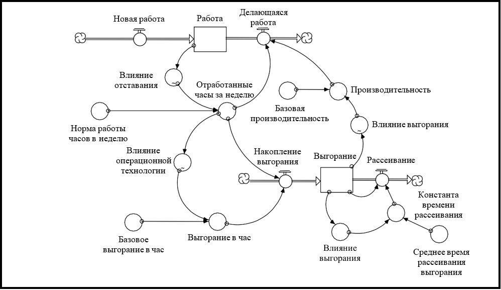

## Глава 13. Добавление текстуры в ваши композиции. *Моделирование «мягких» переменных*

Такие вещи, как самооценка, заинтересованность и доверие, обычно не упоминаются в одном ряду с компьютерами. Такие переменные «сентиментальны» и аморфны, а компьютеры являются научными, численными и точными. Но, знаете, эти переменные абсолютно необходимы для эффективного функционирования систем, в которых играют роль люди - не всех, но многих! Оставляя такие переменные вне модели, в которой подразумевается их присутствие, равнозначно предположению, что они не имеют отношения к ней. Будьте честными. Можете ли вы представить себе *какую-либо* систему, включающую людей, для которых доверие, уверенность в себе, заинтересованность и чувство собственного достоинства (и это лишь некоторые переменные) совершенно неактуальны?

Реальная проблема здесь - одна из целей модели. У многих моделей есть неявная или даже явная цель, точное числовое предсказание. «Свет мой, модель, подскажи, да всю правду доложи, какие процентные ставки, доходы, продажи будут осенью». С точностью до тысячных, спасибо. Дело в том, что никогда не будет точной меры разочарования, уверенности, любви или гнева. Действительно, измерение таких переменных является «трудным» даже в теории. Это из-за давно признанного «эффекта Хоторна» - сам акт измерения вызывает изменение того, что измеряют. Физики знают этот эффект как «принцип неопределенности Гейзенберга». Итак, если цель модели - точное предсказание, царство «сентиментов» почти наверняка останется за бортом.

Учитывая все это, давайте отступим и беспристрастно посмотрим на ситуацию. Варианты: вы можете продолжить работу с моделью, чья цель - численно-точное прогнозирование, но умышленно не учитывающей переменные, несколько которых (возможно, основных) влияют на работу системы. Или вы можете пожертвовать определенной численной точностью, но не обязательно аналитической строгостью, чтобы включить «мягкие» переменные, которые, как вы знаете, играют важную роль в формировании динамики системы.

Вот еще полезная информация, которая поможет вам оценить два варианта. Численно-точное предсказание на самом деле недостижимо, потому что всегда есть переменные, которые влияют на результаты, но не контролируются лицами, принимающими решения в системе (и, следовательно, непредсказуемыми). Кроме того, преследование в качестве цели прогноза противоречит реактивной, ориентированной на проблему позиции, в отличие от, например, стремления понять, как обеспечить устойчивость перед силами, которые вы не можете контролировать! Численная точность для этих целей редко так же важна, как и получение качественной сущности соответсвующих отношений. Перевод: сентиментальные переменные приветствуются!

Таким образом, не всегда необходимо включать «мягкие» переменные в ваши модели. Но когда вы знаете, что эти переменные важны, вы не должны умышленно их игнорировать! В этой главе вы узнаете, как довести «мягкие» переменные до полного, первоклассного статуса «граждан» в ваших моделях.

### Различие между количественной оценкой и измерением

Одна из причин, почему люди уклоняются от мягких переменных, состоит в том, что они не могут распознать одно важное различие. Это различие между количественной оценкой и измерением.

Измерение означает «определение величины». Часто результат определения выражается численно. Для физических величин мы имеем множество предопределенных единиц измерения. Например, у нас есть мили, метры, килограммы, килограммы, кварты и кубические сантиметры. Очень точно можно измерить количество единиц в инвентаре готовой продукции. Также можно измерить высоту и вес ребенка, расстояние до дома бабушки или диаметр цирковой палатки с большой точностью.

Напротив, количественная оценка означает «присвоение числового индекса». Вы можете количественно оценить все! В процессе существует некоторый врожденный произвол. Например, если кто-то попросил меня количественно оценить мой уровень усталости, первый вопрос, который я задал бы ... «По шкале от скольки до скольки?» Когда получен ответ «от 0 до 100» или «от 1 до 10», я могу выбрать число, чтобы определить уровень усталости. Вы тоже можете! И так же можно сделать для нашего уровня уверенности, похоти, зависти, заинтересованности и всех других нефизических переменных, которые оживляют нашу жизнь!

Итак, легко количественно оценить что-либо. Настоящий трюк заключается в том, чтобы сделать это таким образом, чтобы вы могли поддерживать строгость мысли, связанную с физическими (то есть измеримыми) переменными в модели. На самом деле, нет никакого «трюка»... как вы потом поймете.

### Количественная оценка «мягких» переменных

Я буду использовать пример количественной оценки переменной, чтобы проиллюстрировать работающий подход. Затем я завершу эту главу выделением самой сути и обобщением связанных процессов и принципов.

Пример включает в себя так называемое «выгорание». Выгорание охватывает целый континуум психологических состояний. Это и легкая усталость, которая возникает после тренировок в течение нескольких ночей подряд. Это и так называемая «средняя прожарка», когда вы уже тренируетесь один-два месяца. Ваша программа упражнений становится все меньше и меньше, а диета распадается на фаст-фуд и шоколад. Каждый раз, когда вы пробуждаетесь, вы клянетесь, что потратили время на сон, только чтобы быть готовым к следующей тренировке. Наконец, есть «сильная прожарка». Этот случай обычно требует клинического лечения и отказа от тренировок на долгий срок.

Как и при представлении *любой* подобной нефизической величины, первый шаг в представлении «выгорания» внутри модели не имеет абсолютно *никакого* отношения к числам! Это важно. Первый шаг - задать себе классический вопрос Cистемного Мышления: «Как это работает?»

Подумайте об этом секунду, прежде чем продолжить. Как действительно работает процесс выгорания?

Диаграмма, представленная на рисунке 13-1, предлагает один из ответов. Он прдеполагает то, что процесс «накопления выгорания» носит *сопутствующий* характер. Накопление выгорания сопутствует выделению часов на работу и, соответственно, недостаточному количеству часов для действий, которые рассеивают накопившееся выгорание. Как показывает диаграмма, каждый час работы к запасу выгорания добавляется определенное количество выгорания. По мере нарастания уровня выгорания постепенно снижается производительность. По мере того, как производительность падает, при прочих равных условиях, еще больше увеличивается отставание в работе. Это заставляет рабочих «бросать» еще больше времени на проблему, вызывающую выгорание, вследствие чего выгорание только увеличивается. Порочный цикл, будь он неладен!

***Рисунок 13-1. Простая модель выработки выгорания***

Из этой простой модели можно много чего вынести. Во-первых, как уже отмечалось, модель иллюстрирует, как фиксировать накопление выгорания: оно «операционное», в отличие от «факторов» (тех шести вещей, которые «вызывают» выгорание).

Во-вторых, выгорание количественно оценивается с помощью индекса от 0 до 100. Значение 0 означает отсутствие следа выгорания; значение 100 означает настолько сильную прожарку, насколько это возможно. Целью модели является не прогнозирование точного момента, когда уровни выгорания достигнут, например, 67,49. Цель будет заключаться в том, чтобы определить, что позволит выгоранию оставаться на уровнях, которые не оказывают существенного снижения производительности. Эти уровни ближе к 20, чем к 60.

В-третьих, выгорание *оперативно связано* с физическими переменными в системе. Например, оно влияет на *производительность*, которая, в свою очередь, определяет скорость завершения работы. Оно также зависит от *количества часов работы в неделю*. Операционное вплетение  переменных, связанных с выгоранием, в структуру физических переменных позволяет внутри системы эмпирически откалибровать соответствующие отношения. Давайте более подробно посмотрим, как работает этот процесс.

Посмотрите на переменную «выгорание в час». Она определяется как продукт базовой величины выгорания в час и влияния, исходящего от количества сверхурочных часов в неделю. Итак, как бы вы оценили эти две переменные? Вот как!

Начните с «Базового выгорания в час». Давайте просто поставим, например, 10. Вы хотите 1? Хорошо, пусть будет так. Предположим, что «Влияние сверхурочных часов» нейтрально (т.е. равно 1,0, поскольку рабочие работают без сверхурочных). Затем рассмотрим уравнение для «выгорания» (т.е. притока). Это «Количество часов работы в неделю», умноженное на «Выгорание в час». Если мы предположим, что рабочие обычно работают 40 часов в неделю, это будет означать, что приток к скорости выгорания в *нормальную* неделю будет равен 40 в неделю (потому что мы подставили в «Выгорание в час» 1)! Если 100 - это по определению максимальный уровень, которого может достичь Выгорание, накопление 40 единиц выгорания в неделю при *нормальных* обстоятельствах не имеет никакого смысла.

Итог: значение 1,0 для «Выгорания в час» работать не будет! Значение 10, которое было первым предложенным вариантом, вызвало бы 400 единиц накопленного выгорания в неделю... что не просто абсурдно, а *невозможно*! Вероятно, мы смотрим на значения в районе 0,1 для «Базового выгорания в час» - получая, что за *нормальную* рабочую неделю будет накоплено 4 единицы выгорания. Можно ли взять число 0,2 (при котором за нормальную 40-часовую рабочую неделю будет накоплено 8 единиц выгорания)? Вероятно. Достижение согласованного значения привело бы к интересному обсуждению. Но, наверное, трудно будет поспорить, что число будет больше 0,2.
В этом процессе мы используем комбинацию произвольного, но согласованного численного масштаба (от 0 до 100 для Выгорания) и физической переменной, чьи надежные числовые данные у нас уже имеются (т.е. количество часов, отработанных за нормальную рабочую неделю), чтобы «вывести» значения пары сентиментальных параметров, для которых у нас *нет* числовых данных! Другим значением сентиментального параметра, которое мы можем «вывести» из этого конкретного процесса расчета, является «Влияние сверхурочных часов». Поскольку он является множителем «Базового выгорания в час» для произведения «Выгорания в час», а также опираясь на то, что мы уже определили (значения «Выгорания в час» скорее всего лежат в диапазоне от 0,1 до 0,2), мы можем найти диапазон значений для переменной «Влияния». Процесс, который вы бы использовали, будет выглядеть примерно так.

Когда вы работаете 80 часов в неделю, сколько выгорания вы произведете? Предположим, что ваш ответ был, например, 40 единиц. Давайте также скажем, что вы решили установить значение «Базового выгорания в час», равное 0,1. Чтобы генерировать приток 40 единиц выгорания, множитель «Влияния» в течение 80 часов в неделю должен принять значение 5 (потому что 5 * 0,1 = 0,5 и 0,5 * 80 часов в неделю = 40). Значения, превышающие 5, будут производить слишком большой приток выгорания в неделю, учитывая, что максимально допустимое значение для выгорания, по определению, равно 100. Видите, как работает этот процесс?

Давайте рассмотрим еще один пример в модели выгорания. «Влияние выгорания», множитель, определяющий уровень производительности, может быть эмпирически откалиброван ранее продемонстрированным способом. Начните с потока «Делающейся работы». Численное значение этого потока может быть легко получено из данных компании. Поток показывает, сколько единиц работы (например, задач, виджетов, транзакций и т.д.) совершается за неделю. Он рассчитывается как продукт «Количество часов работы в неделю» и «Производительности». Если вы знаете, что, например, за обычную 40-часовую рабочую неделя завершено 80 единиц работы на человека (независимо от того, что представляют собой «единицы»), то «базовая производительность» должна быть равна 2,0. Базовая производительность изменилась под «влиянием» уровня выгорания. Чтобы развить отношение графических функций, влияния выгорания, вы будете действовать следующим образом.

Если уровень выгорания оставался равным нулю, «влияние» на производительность было бы нейтральным (1,0). По мере увеличения уровня выгорания влияние на производительность будет становиться все более негативным. В крайнем случае, очень высокий уровень выгорания приведет к нулевой производительности (но не ниже). Таким образом, значение множителя будет находиться в диапазоне от 0 до 1,0. В дальнейшем обсуждении родились бы остальные точки графических отношений, а затем вы бы провели анализ чувствительности (см. раздел «Файлы справки»), чтобы увидеть, меняются ли выводы на основе различных форм соответствующих кривых, проходящих через точки (0,1) и (100,0).

Как и в предыдущем расчете, мы опирались на здравый смысл, «надежные данные», где они есть, и произвольное (но все же согласованное) масштабирование значений для «мягких» переменных. Эта комбинация и позволяет нам «выводить» внутренне-согласованные значения параметров. Процесс работает! Попробуйте.

### Некоторые рекомендации для количественной оценки мягких переменных

Отбрасывание из вашей модели «мягких» переменных, когда вы знаете, что они играют важную роль в формировании динамики системы, это единственная гипотеза, которую вы можете с уверенностью отвергнуть! Вам не составит труда включить такие переменные в ваши модели, если вы примете следующий четырехэтапный подход:

1. Используйте согласованный диапазон для всех «мягких» переменных в модели. Я рекомендую от 0 до 100. 0 означает «полное отсутствие». 100 означает 100% (т.е. максимальное значение).
2. Если переменная представлена в качестве запаса, *операционно* подумайте о том, как действительно работают операции по притоку и оттоку. По возможности используйте один из *шаблонов общих потоков* (глава 6), чтобы представить эти действия.
3. Используйте «надежные» данные для «выведения» числовых значений для «мягких» переменных.
4. Проведите анализ чувствительности, чтобы понять, насколько важны выбранные вами конкретные значения для уже сделанных выводов. В данном контексте параметр чувствителен, если он изменяет характер выводов/рекомендаций, исходящих из модели.

### Что дальше

Берите и делайте! Пришло время взять то, что вы узнали, и использовать это на практике для создания более качественных ментальных моделей, более надежного имитирования и эффективных коммуникаций. Мы будем искать ваши «рассказы» в списке Лучших Моделей NY Times!
