## **Часть 1**

# **Язык системного мышления:**
# *Оперативное, замкнутое и нелинейное мышление*

Мы полагаем, что построение хорошей модели с использованием ПО *STELLA* очень похоже на написание хорошего сочинения, такого как рассказ, сценарий или роман. И поскольку люди больше знакомы с письмом, чем с моделированием, мы решили в значительной степенни положиться на аналогию в надежде ускорить ваше понимание языка моделирования, концептов и процесса. Каждая из оставшихся глав в этом Руководстве будет опираться на письменные аналоги.

Как видно из названия этой части, главы, входящие в нее, будут идти в порядке параллельной прогрессии. Суть первой - это язык. 2 главу Вы начнете с изучения основных частей речи в языке накопителей/потоков. В главе 3 будут представлены правила грамматики для построения правильных предложений. В 4 главе Вы узнаете, как связать предложения вместе. В главах 5 и 6 сначала будет обсуждаться, как составлять  простые абзацы, а затем и сложные. Наконец, в главе 7 будет показано, как абзацы можно объединить, чтобы создать короткий рассказ.

Параллельное языковое сопровождение - это развитие навыков системного мышления. В главах этой части основное внимание будет уделено разработке трех ключевых умений Системного мышления: Оперативного, Закрытого и Нелинейного мышления.

Язык и мышление действительно переплетаются. Вы не можете написать хороший рассказ или даже составить хорошее предложение, если у вас нет четкого понимания языка и связанных с ним навыков мышления, которые позволят вам эффективно применять его.

## Глава 1.

## Системное мышление и ПО STELLA:
## *Мыслить, общаться, учиться и действовать более эффективно в новом тысячелетии*

Я писал и переписывал это Руководство в течение пятнадцати лет. Я всегда начинаю главу 1, отказываясь от множества серьезных проблем, стоящих перед человечеством. И знаешь, что? Список остался почти таким же! Есть бездомность и голод, наркомания и неравенство в распределении доходов, экологические угрозы и бедствие СПИДа. За последние пару десятилетий мы достигли огромного прогресса для решения любых из этих проблем! А на деле, можно легко доказать, что, большинство (если, конечно, не все) обострились! И возникли некоторые новые проблемы. Возможно, наиболее тревожным из них является то, что, кажется, (до сих пор) в основном американское явление: дети убивают детей (и учителей) в школе.

Так в чем проблема? Почему мы не добиваемся значительного прогресса в решении наших многочисленных, очень насущных социальных проблем?
Мой ответ заключается в том, что то, как мы думаем, *общаемся и учимся, устарело*. В результате этого, наши действия становятся причиной появления проблем. И плюс к этому, мы плохо подготовлены к их решению из-за того, как нас учили *думать, общаться и учиться*. Это довольно радикальное обвинение относительно некоторых фундаментальных человеческих навыков, в пропогандировании которых обвиняются все наши школьные системы! Однако, это исходное условие этой главы (и системного мышления), что мы можем развивать наши способности *мышления, общения и обучения*. После того, как мы сделаем это, сможем добиться прогресса в решении неотложного проблем, которые бросают вызов нашей жизнеспособности. Но для достижения этой эволюции мы должны преодолеть некоторые серьезные препятствия. Первичными среди них являются укоренившиеся парадигмы, определяющие, что и как преподают ученикам. У нас есть возможность развивать эти парадигмы. Пришло время использовать эту силу!

Я начну с предложения более практических определений *мышления, общения и обучения*. Их наличие позволит мне осветить те навыки, которые должны развиваться, как нынешние парадигмы препятствуют этому разитию, и как Системное Мышление и ПО *STELLA* могут помочь. Наконец, я вкратце расскажу о том, что Вас ждет в оставшейся части Руководства. В ходе этой главы я идентифицирую восемь навыков Системного Мышления: взгляд с высоты 10 000 метров, Система как Причина, Динамичное, Оперативное, Замкнутое, Нелинейное, Научное и Эмпатическое мышление.  Каждый из них снова появится, некоторые получат больше внимания, чем другие, во всем Руководстве. Овладение этими навыками позволят вам эффективно использовать программное обеспечение STELLA.

### Предоставление практических определений

Процессы мышления, общения и обучения составляют *взаимозависимую систему* или, по крайней мере, имеют потенциал для того, чтобы такой стать. Они не осуществляют свою деятельность в синергии в рамках существующей системы официального образования. Первым шагом к реализации потенциального синергизма является четкое представление о том, как каждый процесс работает относительно другого. Я использую программное обеспечение STELLA, чтобы помочь с визуализацией ...

#### *Мышление*
Думать... мы все это делаем. Но что это? Словарь говорит, это «... иметь мысль; рассуждать, размышлять или обдумывать. Это говорит Вам о чем-то? Мне нет.

Я определяю мышление как колоборацию двух видов деятельности: *разработка* ментальных моделей, а затем их *моделирование*, для того, чтобы делать выводы и принимать решения. Скоро мы займемся построением и моделированием, но во-первых, что же это за *ментальная модель*?

Это «избирательная абстракция» реальности, которую вы создаете, а затем носите в голове. Какими бы большими не были наши головы, мы все равно не сможем уместить в них всю реальность. Вместо этого у нас есть *модели* различных аспектов реальности. Мы имитируем эти модели, чтобы «придать смысл» тому, что мы переживаем, а также помочь нам прийти к решениям, которые оживляют наши действия.

Например, Вам приходится иметь дело с вашим ребенком, с братом/сестрой или с родителем. Ни один из них физически не присутствует в Вашей голове. Вместо этого, когда Вы имеете дело с ними в определенном контексте, Вы выбираете определенные особенности каждого из них, которые уместны в данном контексте. В Вашей голове, Вы связываете эти особенности друг с другом, используя некоторую форму логики причинно-следственных связей. Затем вы *моделируете* взаимодействие этих связей в различных сценариях «что, если», чтобы делать выводы о наилучшем исходе событий или понимать то, что произошло.

Если Вы пытались понять, почему Вашей дочери сложно дается арифметика, Вы, вероятно, можете смело игнорировать цвет ее глаз при выборе аспектов реальности, чтобы включить в ментальную модель, которую вы строите. Этот аспект реальности вряд ли поможет вам в понимании причин ее трудностей или в принятии решения о том, что делать. Но, выбирая блузку на день рождения? Цвет глаз, скорее всего, должен быть в *этой* ментальной модели.

Как показывает предыдущий пример, все модели (ментальные и другие) являются упрощениями. Они непременно опускают многие аспекты реалии. Это приводит к очень важному утверждению, которое будет повторяться несколько раз в этом Руководстве. Утверждение - это перефраз того, что когда-то произносил В. Эдвардс Деминг (отец «движения качества»): *«Все модели ошибочны, некоторые модели полезны»*. Важно, чтобы эта освященная правда возвращалась в сознание время от времени, чтобы предотвратить Вашу "чрезмерную привязанность» к одной из  ментальных моделей. Тем не менее, несмотря на то, что все модели ошибочны, *у Вас нет другого выбора, кроме как использовать их* - нет выбора, если Вы собираетесь *думать*. Если Вы хотите использовать нерациональные средства (например, шестое чувство и интуицию), чтобы прийти к заключению или решению, ментальная модель не нужна. Но, если Вы хотите думать ... Вы не сможете сделать это без ментальной модели!

На рис. 1.1 представлена карта *STELLA*, в которой представлено «мышление»: *построение* (ментальная модель) и *моделирование*, чтобы сделать выводы. Как показано на рисунке, построение разбивается на две функциональные подзадачи: *выбор* и *представление*. Первая подзадача отвечает на вопрос: *Что я должен включить в свою ментальную модель*? Вторая подзадача отвечает на вопрос: *Как мне представить то, что я включаю*? Это два фундаментальных вопроса, на которые нужно ответить при построении *любой* ментальной модели. Я убежден в том, что парадигмы, которые в настоящее время регулируют преподавание в наших школах, ограничивают развитие всех навыков, необходимых для того, чтобы добиться эффективности при выполнении как построительной, так и моделирующей деятельности. То есть наши школы препятствуют развитию мыслительной способности - то, что ни один школьный совет не одобрит, а мы можем себе позволить!

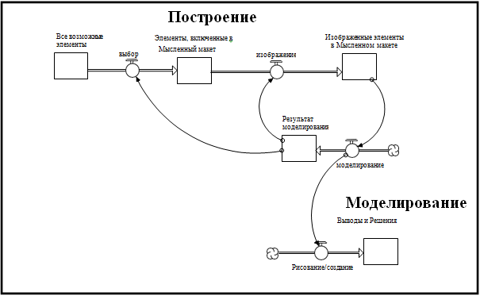

**Рисунок 1.1. Определение "Мышеления" от STELLA.**

«Провод», который простирается от *Представленных Элементов в Ментальной Модели* до *моделирования*, предполагает, что *она* не может продолжаться до тех пор, пока не будет доступна ментальная модель - то есть, операции *выбора* и *представления* не будут выполнены. Моделирование приводит к выводам, которые, среди прочего, помогают нам принимать решения. Но, как видно из рисунка 1.1, результаты моделирования играют еще одну важную роль в процессе мышления. Они обеспечивают обратную связь при *выборе* и *представлении* (обратите внимание на «проводы», идущие от *результатов моделирования до двух видов деятельности*). Результаты моделирования, которые не имеют смысла, или, как было показано, были ошибочными, являются сигналом для возврата к доске для черчения. Может мы забыли включить что-то в нашу ментальную модель, что на самом деле должно там быть, или включали то, что не должно? Может мы неверно изобразили то, что включили? Самоанализ наших ментальных моделей, инспирированный результатами моделирования, является одним из основных способов, по которым мы все *учимся* ... но мы забегаем вперед истории. Прежде чем обсуждать *обучение*, давайте посмотрим на *общение*.

#### *Общение*
Практическое определение общения представлено на рисунке 1.2. Первое, что нужно отметить, это то, что рисунок включает в себя элементы, которые являются частью *мышления*. Цель заключается в том, чтобы показать, что *общение* неразрывно связано с *мышлением*. Действительно, поскольку переменная *Сделано для Справки Другими* показывает, что результаты процесса *Мышление* являются исходным материалом для процесса *Общение*. На рисунке показаны три источника «исходного материала»: ментальная модель, соответствующие результаты моделирования и выводы, которые были сделаны в результа моделирования. После представления этих источников на всеобщее обозрение, другие могут «думать» о них! В частности, они могут сравнивать их с соответствующей информацией, которой они обладают. Процесс сравнения, как вы скоро увидите, приводит ко второму типу *обучения*!

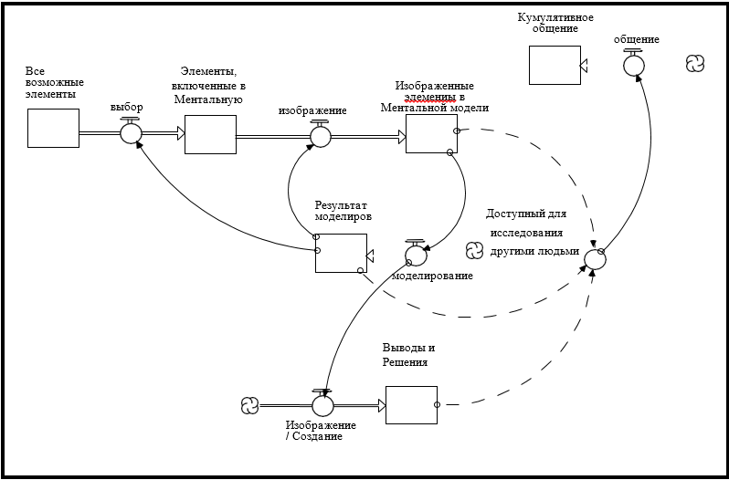

**Рисунок 1.2. Карта Процесса Общения от STELLA.**

#### *Обучение*
Обучение ищображено на рисунке 1.3. Это довольно детально разработанная картина, и хороший пример того, что нужно раскрывать один блок за другим отдельно, используя функцию повествования ПО *STELLA*, чем набрасывать всю информацию в куче. Если Вы предпочиаете увидеть «развернутую» версию рисунка 1.3, откройте модель «Обучение» в папке *«Вступление в системное мышление»*, и опыт может быть вашим!

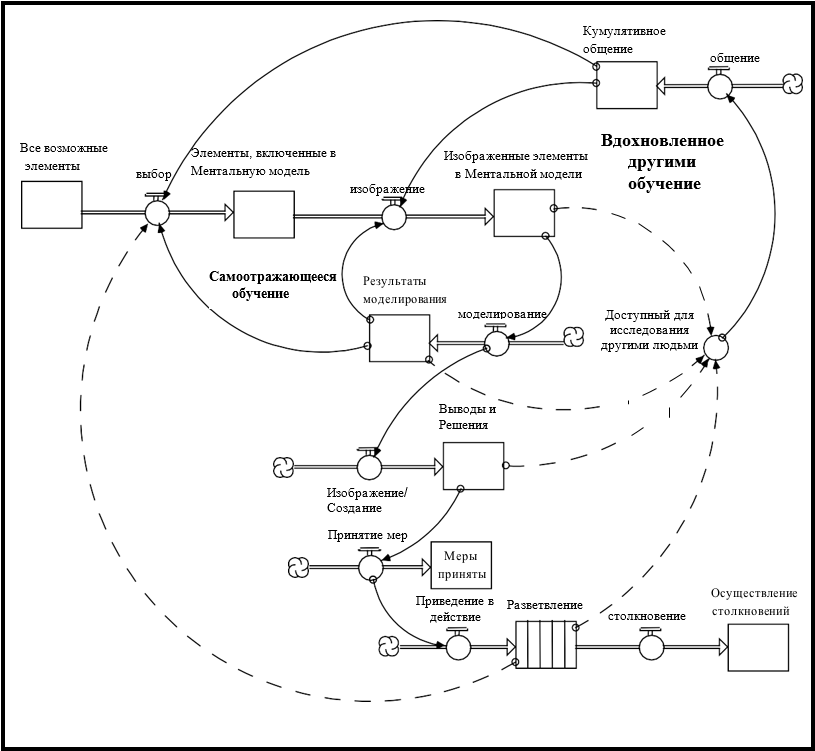

**Рисунок 1.3. Карта Процесса Обучения от STELLA.**

Первый тип обучения был определен в обсуждении процесса *«Мышление»*. Называйте это *обучение с элементами самоанализа*. Это происходит тогда, когда результаты моделирования используются для управления процессом, в котором изменяется содержание и/или представление контента в ментальной модели. Я также просто упомянул о втором типе обучения ... который управляется процессом *общения*. Называйте это *другим способом обучения*. Как показано на рис. 1.3, исходным материалом для этого типа обучения является: сама ментальная модель, связанные с ней результаты моделирования, и/или выводы, сделанные после моделирования. Количество необходимого обучения, зависит как от качества предоставляемой обратной связи, где «качество» включает как контент, так и «упаковку», а также готовность и способность «услышать» обратную связь.

На рис. 1.3 также добавлен четвертый источник сырья для обучения: влияние чьих-либо действий. Как видно из рисунка, часто трудно осознавать это влияние полностью, потому что разветвление занимает много времени и распространяется на большом расстоянии. Чтобы отразить этот факт, информация для этого типа обучения показана как излучающий «конвейер» под названием *"Разветвление"*, а не накопитель под названием *"Реализованные воздействия"*. [ПРИМЕЧАНИЕ. Конвейеры используются для представления задержек].

Полезно потратить немного времени на осмысление рисунка 1.3, в котором показана *система* мышления, общения и обучения. Важно отметить, что все дороги в конечном счете приводят к обучению, то есть *улучшению качества ментальной модели*. Обучение происходит, когда происходит либо изменение ментальной модели (через поток *выбора*), либо представление содержимого изменяется (через поток *представления*). Кстати, чтобы сделать фигуру более читаемой, были показаны не все проводы, идущие к *изображенному* потоку.

Рисунок показывает два важных вывода. Во-первых, три процесса - *мышление, общение и обучение* - образуют самоподкрепляющуюся систему. Создание навыков в любом из трех процессов помогает создавать навыки во *всех* трех процессах! Во-вторых, если ментальная модель не меняется, *обучение не имеет места быть*!

Теперь я буду использовать предыдущие определения мышления, общения и обучения в качестве основы для изучения того, насколько хорошо нынешняя система формального образования готовит нашу молодежь к проблемам, с которыми они столкнутся как граждане в новом тысячелетии. Как только я буду обвинять систему, я сразу же предложу альтернативы. Альтернативы будут исходить из структуры под названием «Системное мышление» и использовать программное обеспечение *STELLA* в качестве инструмента реализации. Я начну с обвинительного заключения, а затем продолжу использовать систему мышления/общения/обучения для организации конкретных обвинительных актов.

### Обвинительное заключение

Если бы у школ было полномочие заниматься тем, что хотя бы отдаленно похоже на схему на рис. 1.3, я бы не писал эту главу! Вместо этого ученики проводят большую часть своего времени, «усваивая содержание», или говоря более благородными словами, «приобретая знания». Итак, основная учебная деятельность в наших школах - это *запоминание*! Это перключать флеш-карты или  повторять про себя снова и снова, «частями клеток являются ...», «три причины Второй мировой войны ...», «планеты в порядке отдаления от Солнца ...» Учеников пичкают фактами, терминами, именами и датами, а затем заставляют выдавать эти знания обратно на экзамене, в соответствующем месте. Это происходит, несмотря на то, что студенты воспринимают значительную часть информации, как не имеющую особой значимости для их будущей жизни, и то, что полезная на тот момент информация будет устаревшей до окончания учебы.

Обратите внимание на процесс «приобретения знаний». Он абсолютно не похож на процесс, изображенный на рисунке 1.3. При приобретении знаний никакая ментальная модель не строится. Не принимаются решения о том, что включать, или как изобразить то, что включено. Никакого умственного моделирования не происходит. Приобретение знаний также не требует общения и не способствует ему. Напротив, процесс приобретения знаний является одиночным и таким, над которым *не надо задумываться*, по своей природе. А затем, coup de gras ("смертельный удар") ... Действительно ли эти знания помогут молодому поколению в эффективном решении проблем, с которыми они столкнутся в новом тысячелетии?

Важно понять, что, хотя я и критикую содержание, на котором сосредоточена наша система образования, я не обвиняю учителей, которые способствуют этому фокусированию (по крайней мере, не всех)! Преподаватели в колледже больше всех страдают от жестких государственных (и в некоторых случаях федеральных) мандатов в отношении материала, который нужно преподавать, педагогического подхода и даже установления последовательности. Мое обвинение в первую очередь направлено на людей, которые выдают эти мандаты! Я обвиняю тех, кто создал измерительные системы, которые устанавливают стандарты для оценки мастерства человека на основе знаний определенных фактов, и которые путают «знание» с «пониманием» и «интеллектом». Вам я только хочу сказать (громко): «Проснитесь» !

Тем не менее, давайте приступим к некоторым конкретным обвинительным заключениям и предложениями о том, что можно сделать для улучшения ситуации.

### Мышление: Построение Ментальной Модели

Независимо от того, построенная ментальная модель об экосистеме, химической реакции, семье или обществе, при ее построении всегда должны отвечать на три фундаментальных вопроса. (1) Какие элементы должны быть включены в модель - или, наоборот, какие элементы следует опустить из списка? (2) Как должны быть изображены элементы, которые вы решили включить? (3) Как должны быть изображены отношения между элементами?

#### *Что включить?*

Вопрос что же включить в ментальную модель, в свою очередь, разбивается на два других вопроса. *Насколько широко Вы охватываете своей сетью?* Это «горизонтальный» вопрос. *И насколько глубоко Вы ее рассматриваете?* Это «вертикальный» вопрос. Умение дать хорошие ответы на эти два вопроса требует определенных навыков. И, как и любой другой навык, нужно сначала подкрепить его принципами «хороших практик», а затем отточить через многократное применение на практике. Давайте посмотрим, как поощраются навыки «Что включать?» в текущей системе образования.

Первое, что нужно отметить, это то, что на развития таких навыков остается мало времени, потому что очень много времени выделяется на зубрежку материала, что, как уже было отмечено, является деятельностью, которая не требует выбора «что включить/как изобразить». Тем не менее формальная система образования оставляет свой отпечаток на навыках *принятия решения*. И он не особо положителен!

Одно из скрытых презумций в господствубщей образовательной системе заключается в том, что то, что может быть познано, должно быть *сегментировано*. Обоснование заключается в том, что это позволит более эффективно осваивать информацию. Конечную стратегию обучения можно назвать: «Раздели и Побори». Те, кто лучше всего справляются с этой стратегией, раскрывают своее мастерство в среднесрочной и конечной перспективе, оказывая влияние на единичный или последовательный поток информации, например, оставляя задания по истории  в сторону , чтобы они не мешали сосредоточиться на изучении биологии. Со временем ученики выясняют, какие области им даются лучше всего и концентрируют свое внимание на них. В результате студенты становятся *специалистами в определенной узкой области*. В то же время появляются и набирают популярность многочисленные фобии: математики, литературы, языков и науки. Ученики видят мир разделенным на «контейнеры с содержанием», некоторые из которых они «любят», другие из которых избегают.

Специалисты в одной сфере склонны охватывать свои сети узко (по областям, которые они «знают»). И они также склонны максимально углубляться в эту сеть, так как они помнят множество подробностей об их «комфортной(ых)» сфере(ах). Таким образом, их ментальные модели чаще всего бывают узкими и глубокими. Они содержат много ... о немногом. Между тем, навыки студентов касательно *горизонтальных* связей никогда не развиваются. Вместо этого вертикальные нюансы доминируют.

Проблема с таким подходом к развитию способности мышления учащихся состоит в том, что *все* проблемы, которые я поставил перед собой в начале главы - бездомность, неравенство в распределении доходов, глобальное потепление, СПИД, дети, убивающие детей и т.д., являются *социальными* по своей природе! Они возникают из-за взаимодействия людей друг с другом, с окружающей средой, с экономикой. Это проблемы *взаимозависимости*! Это горизонтальные проблемы! Потому что горизонтальные границы социальных систем, по сути, продолжаются вечно. Внесите изменения в определенную организацию, например, и волновой эффект быстро перевалит за границы организации. Каждый сотрудник взаимодействует с множеством людей вне организации, которые, в свою очередь, взаимодействуют с другими и т.д. Таким образом, в социальной сфере важно мыслить *горизонтально*! Сети должны быть широко охвачены, прежде чем углубляться в детали. Тем не менее, по мере развития умения выбирать у студентов, они смещаются в прямо противоположном направлении ... к бинцентрированности.

Системное мышление предлагает три навыка, которые могут помочь учащимся стать более эффективными в ответе на вопрос «Что же включать?». Это: «10 000 метров», «Системы как причина» и «Динамическое мышление».

#### *Взгляд с высоты 10 000 Метров*

Первый навык мышления, взгляд с высоты 10 000 метров, появился благодаря виду, который открывается в ясный, солнечный день, когда Вы смотрите вниз из реактивного лайнера в полете. Вы видите горизонтальное широкое пространство, но мало вертикальных деталей. Вы получаете «общую картину», но отказываетесь от возможности устанавливать мелкие различия.

#### *Мышление: система как причина*

Следующий навык Системного Мышления называется «Система как причина», который тоже помогает противостоять вертикальному уклону в сторону включения слишком большого количества деталей в изображения, содержащиеся в Ментальных моделях. Мышление «Система как причина» на самом деле просто отражение бритвы Оккама (т.е. самое простое объяснение явления является лучшим объяснением). Оно предполагает, что ментальные модели должны содержать только те элементы, взаимодействие которых способно самопораждать интересующее явление. Он не должен содержать никаких так называемых «внешних сил». Простое изображение должно помочь пролить свет на задействованный навык.

Представьте, что вы держите пружину, как показано на рисунке 1.4a. Затем, как показано на рисунке 1.4b, вы убираете руку, поддерживающую предмет снизу. Пружина колеблется, как показано на рис. 1.4c. Возникает вопрос: *В чем причина колебаний*? Другой способ сформулировать этот вопрос: *Что Вам нужно включить в Вашу Ментальную модель, чтобы объяснить колебания*?

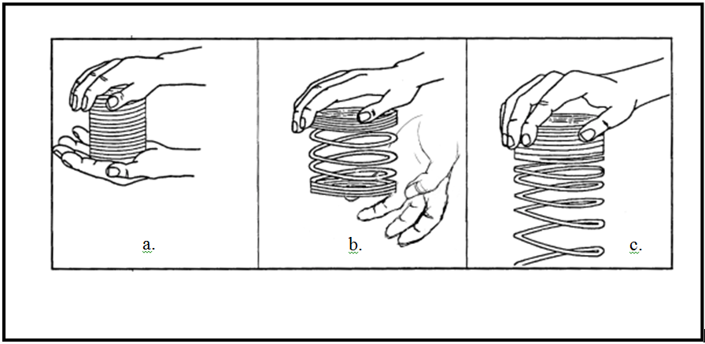

**Рисунок 1.4. Пружина делаает то, для чего она предназначена.**

Две наиболее часто приводимые причины: сила тяжести и перемещение руки. Ответ на вопрос, который дает «Система как причина»: Пружина! Чтобы лучше оценить достоинства этого ответа, представьте, что вы выполнили тот же эксперимент, скажем, с чашкой. Результат, который вы получите, облегчает понимание того, что причина колебания скрыта в самой структуре пружины. При наличии силы тяжести, после приложения внешнего стимула (то есть, убирая опорную руку), «вызывается» динамика, скрытая внутри структуры. Это не значит, что сила тяжести и перемещение руки не имеют никакого отношения. Однако, они не будут отображаться как часть «причинного содержания» Ментальной модели, которая пыталась объяснить, почему пружина колеблется.

#### *Динамическое мышление*

Третий из так называемых «навыков фильтрации» (навыки Системы мышления, которые помогают «отфильтровывать» несущественные элементы реальности при построении Ментальной модели) называется «Динамическое мышление». Этот навык обеспечивает такое же «дистанцирование от деталь", которое предусматривает мышление "Взгляд с высоты 10 000 метров", за исключением того, что он относится к поведенческому, а не к структурному измерению.

Помимо того, что перспективы улавливаются в мелочах структуры, они также попадают в сети «событий» или «точек», за счет тот, что осматривают предысторию. В истории студенты запоминают даты, в которые проходили критические битвы, рождались великие люди, делались объявления и т.д. Но до и после каждой такой «даты» есть предыстория, которая отражает непрерывные накопления или истощения различных видов. Например, США объявили о своей независимости от Англии 4 июля 1776 года. Но до этой конкретной даты между двумя сторонами возникающих конфликтов постоянно возникала напряженность. В экономике основное внимание уделяется *точкам* равновесия, в отличие от траекторий, которые прослеживаются по мере продвижения переменных между точками.

Динамическое мышление побуждает человека «отталкиваться» от событий и точек, чтобы увидеть предысторию, частью которой они являются. Подразумевается, что Ментальные модели будут способны справляться с динамическим, а не только статистическим взглядом на реальность.

Рисунок 1.5 должен помочь более четко определить разницу между точкой зрения, вдохновленной стратегией «Раздели и Побори» и перспективой, вдохновленной Системным Мышлением, с точки зрения итогового содержания Ментальной модели. Рисунок довольно резко показывает различия между Ментальными моделями, построенными с использованием альтернативных перспектив. Это правильная картина. Тем не менее, нет ничего, что помешало бы моделям, подкрепленным *обеими* перспективами, сосуществовать внутри одного индивидуума. Ничего, кроме поиска места для разработки трех связанных навыков мышления в системе ("Взгляд с высоты 10 000 метров", "Система как причина" и "Динамическое мышление") в учебной программе, уже переполненной заданными требованиями «приобретения знаний», ориентированными на дисциплину. Конечно, всегда были (и всегда будут) усилия, направленные на развитие навыков горизонтального мышления, обычно в форме междисциплинарных предложений. Но такие усилия разбросаны и в значительной степени зависят от «внеклассных» обязательств и энтузиазма отдельных людей. И, они растут все реже, когда уровень оценок поднимается, и почти не существуют на послесреднем уровне.

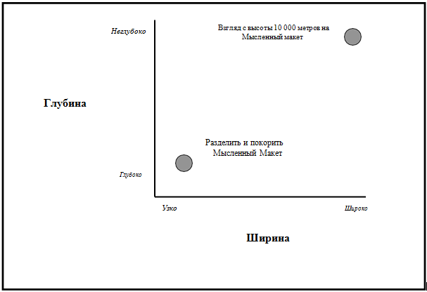

**Рисунок 1.5. Содержание, вдохновленное стратегией Раздели и Побори, против Ментальных моделей Системы Мышления.**

До тех пор, пока среднестатистический гражданин не почувствует себя комфортно, изучая ментальные модели с горизонтально расширенными/вертикально ограниченными границами, мы не можем ожидать *какого-либо* значительного прогресса в решении актуальных проблем, с которыми мы сталкиваемся в социальной сфере. И пока система оценивания красной ручкой, на которой базируется наша система образования, не будет изменена, чтобы большее внимание сосредоточить на развитии навыков горизонтального мышления, мы продолжим производить граждан со склонностью строить узкие/глубокие ментальные модели. Выбор наш. Давайте *требовать* изменения!

#### *Как изобразить то, что Вы включаете?*

Когда был решен вопрос о том, *что* же включить в ментальную модель, возник следующий вопрос, как изобразить то, что было включено. В основном предел развития навыков в сфере изображения у учеников заключается в том, что каждая дисциплина имеет свой собственный уникальный набор терминов, понятий, и в некоторых случаях - символов или значков для запечатления их содержаний. Студенты стараются усвоить каждый специфический словарь, а это способствует тому, что фактически становится навыком, *подходящим под одну определенную область*.

Системное Мышление подразумевает граическую лексику, называемую языком «накопления и потоки». Этот язык представляет собой своего рода *Эсперанто*, лингва-франка, который облегчает *междисциплинарное* мышление и, следовательно, реализует «горизонтальную» перспективу. Ментальные модели, закодированные с использованием запасов и потоков, *независимо от содержания*, признают фундаментальное различие между элементами, которые их заполняют. Это различие между вещами, которые накапливаются (называемыми «накоплениями») и вещами, которые протекают (называемыми «потоками»). Нкопления представляют собой условия внутри системы - то есть то, как обстоят дела. Потоки же представляют собой действия, которые вызывают изменения условий. Некоторые примеры накоплений: вода в облаке, масса тела и гнев. Связанные с ним потоки: испарение/выпадение осадков, приобретение/потеря, а также усиливание/выпуск наружу. Рисунок 1.6 должен помочь Вам более четко понять различия между накоплениями и потоками.

**Рисунок 1.6. Несколько примеров Накоплений и Потоков.**

Чтобы получить краткое представление о том, почему различие имеет значение, рассмотрим пример на рисунке 1.6b. Предположим, что человек, чей вес увеличивался, решает предпринять некоторые меры для решения этой проблемы. Во-первых, он успешно устраняет *всю* нездоровую пищу из своего рациона и в качестве компенсации не увеличивает порции при регулярных приемах пищи. Во-вторых, он расписывает строгую программу аэробных упражнений, к которой он добросовестно придерживается. Это означает, что человек снизит объем приобретаемого потока (т.е. уменьшит вброс калорий) и увеличит объем потерянного потока (увеличение физической нагрузки).

Так что же происходит с весом этого человека?

Была ли в Ваш ответ включена возможность, что он все равно будет увеличиваться? А должна была! Посмотрите на рис. 1.6b. Причина, по которой человек все еще может набирать вес, состоит в том, что уменьшение скорости *приобретения* (притока) и увеличение скорости *потери* (оттока) приведет к уменьшению *массы тела* (накопление), только если *приобретение* на самом деле упадет ниже *потери*. Пока это не произойдет, человек будет продолжать набирать вес, хотя и медленнее! Потратьте минутку, чтобы убедиться в том, что Вы понимаете логику этого рассуждения, прежде чем продолжать.

Когда различие между накоплениями и потоками не признано, как в этом примере или в любой другой ситуации, в которой ментальные моделировани] должны приводить к динамической модели поведения, существует значительный риск того, что будут сделаны ошибочные выводы. В этом случае, например, если потоки притока и оттока не пересекаются через какой-то определенный период времени, человек вполне может сделать вывод, что обе предпринятые меры неэффективны и должны быть прекращены. Конечно же, что это не так. И так же часто возникает другой тип ошибочного вывода: «Я все делаю правильно, просто этого недостаточно». Переусердствование в таких случаях просто подливает масла в огонь.

В дополнение к повышению надежности ментальных моделирований использование накоплений и потоков при изображении содержимого ментальной модели имеет еще одно очень важное преимущество. Оно вытекает из того факта, что концепция накопления и потока *не зависит от содержимого*. Поэтому в какой бы конкретной области они не использовались, это все равно будет способствовать *общему* развитию навыка изображения содержимого! На рисунке 1.7 предпринята попытка изобразить эту идею через связи, которые идут из каждого из четырех специфичных видов деятельности к общему развитию навыка изображения содержимого.

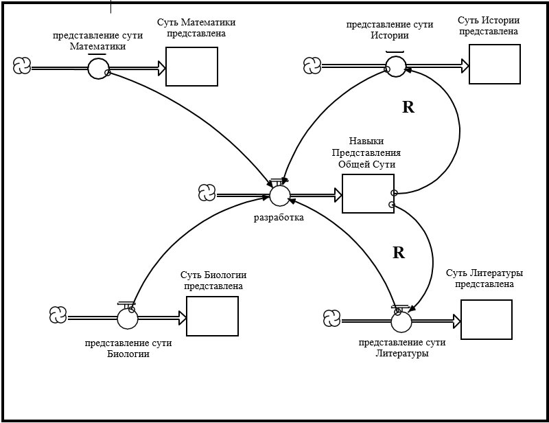

**Рисунок 1.7. Развитие навыков изображения рандомного содержимого путем изображения конкретного контента.**

Есть еще вторая важная идея проиллюстрированая на рисунке 1.7. Обратите внимание на два «R». Они обозначают слово «Reinforcing» (Усиление), это является *цепью обратной связи*, которую они обозначают. Цепь работает так ...

По мере развития общих навыков изображения контента облегчается изображение содержимого каждой конкретной деятельности - хотя, для простоты восприятия, на рисунке проиллюстрирована только связь с двумя из конкретных сфер деятельности. Затем, когда учащиеся участвуют в изображении содержимого *конкретных* видов деятельности, потому что они используют язык с исключительным содержимым конкретно с этой целью, они будут развивать общие навыки изображения контента - *порочный обучающий круг*! Он пораждает синергию, потому что все контентные сферы остаются в выигрыше от деятельности, происходящей в любой из них! Теперь, вместо концентрации на одной сфере, что мешает обучению в другой, каждая помогает ускорить процесс обучения в любом из других.

#### *Операционной Мышление*

Чтобы быть способным эффективно «говорить/писать» на языке накоплений и потоков, требуется, чтобы учащиеся освоили четвертый навык «Системноего мышления», и *очень* важный: *«Оперативное мышление»*. В главах 2-7 большее внимание будет уделено на развитие этого навыка, поэтому я больше не буду говорить об этом здесь. Преподавание языка накоплений и потоков и связанных с ним навыков оперативного мышления на раннем этапе школьного учебного процесса (например, четвертый, пятый, шестой класс) было бы огромным шагом на пути к тому, чтобы учащиеся могли разработать лучший набор *изобразительных* навыков. В то же время это будет способствовать развитию навыков горизонтального мышления учащихся. И хорошая новость заключается в том, что в младших классах по-прежнему существует достаточная гибкость в большинстве учебных программ, которая может позволить предпринять этот шаг. Лови момент!

#### *Как изобразить связь между элементами, которые Вы включаете*

Последним вопросом, на который мы должны дать ответ при построении ментальной модели - это как изобразить *связи* между элементами, которые мы решили включить. Отвечая на этот вопрос, мы обязательно должны сделать несколько предположений о сущности этих отношений в целом. Среди самых священных из всех заветов, которые связывают членов общества вместе, есть неявное соглашение о том, как работают такие отношения. В западных культурах оно заключается в том, что реальность функционирует через структуру последовательных причинно-следственных связей. Что-то такое происходит, что приводит к тому, что что-то происходит и т.д. Не все культуры верят в теорию причинно-следственных связей (некоторые поддерживают такие перспективы, как «синхронность» и «рука Бога»). Но не западная культура.

У меня нет притензий к последовательному причинно-следственному эффекту. Это довольно практичная точка зрения. Однако, когда я более внимательно изучаю предположения, которые описывают конкретную модель, в которую верит западная культура, я прихожу к выводу, что эти предположения серьезно ограничивают обучение! Давайте посмотрим как...

Для западной модели последовательных причинно-следственных связей я буду использовать название «Метод подробного списка» (или «Метод критических факторов успеха»). Метод подробного списка определяется набором из четырех "мета-предположений", которые используются для структурирования причинно-следственных связей. Я использую термин «мета», потому что эти предположения являются *транцедентными по содержанию*. То есть мы используем их для структурирования причинно-следственных связей независимо от того, относится ли контент к литературе, химии или психологии, а также когда мы строим ментальные модели для решения личных или деловых вопросов. Поскольку все мы соглашаемся с этими "мета-предположениями" и нам внушали их с пеленок, мы по сути даже не осознаем, что используем их! Они стали настолько привычными и очевидными, что их даже не относят к предположениям. Наоборот, они считаются, скорее, атрибутами реальности.

Но, как Вы сейчас убедитесь, «мета-предположения», связанные с Методом подробного списка, скорее всего, приведут к такому структурированию связей в наших ментальных моделях, которое приведет к ошибочным выводам после моделирования. Я идентифицирую четыре «мета-предположения», связанные с «Методом подробного списка», а затем предложу альтернативу в «Системном мышлении», которая устранит недостатки каждого из них. Вот вопрос, который я буду себе задавать при построении каждого из четырех предположений ...

*Что заставляет студентов достигать успехов в учебе?* Пожалуйста, уделите минутку на ответ на этот вопрос.

Прежде чем я приступлю к ответу на вопрос, я хочу привести некоторые доказательства того, что Методом подробного списка будет широко распространен как в академических, так и в неакадемических кругах.

С неакадемической точки зрения книги «рецептов» по-прежнему в тренде. Одной из первых и самых популярных из них является «Семь привычек высокоэффективных людей» Стивена Кови. Привычки, которые он описывает, не большее (и не меньше), чем подробный список! И для тех из Вас, кто знаком с основами «критических факторов успеха», это тоже просто другое название для подробного списка. С академической же -  множество теорий как в физических, так и в социальных науках были порождены на основе «Метода подробного списка». Например, один очень популярный статистический метод, известный как «регрессионный анализ», является прямым "потомком" строения. Уравнение «Всемирной эрозии почвы», проверенный временем стандарт в геологических/земных науках, служит хорошим примером теории, основанной на регрессионном анализе. Уравнение объясняет эрозию (A, *зависимую* переменную) как «функцию» списка «факторов» ОЭДУЗП (*независимых* переменных):
    **А = ОЭДУЗП**
**А** Потеря почвы на единицу площади
**О** Осадки
**Э** Эрозия почвы
**Д** Длина наклона
**У** Угол наклона 
**З** Заведование урожаем
**П** Практика контроля эрозии

Итак, теперь, когда я представил несколько доказательств того, что «Метод подробного списка» довольно широко распространен, Вы не должны себя неловко чувствовать, если (как и большинство людей) подготовили подробный список в ответ на вопрос *«Что заставляет студентов достигать успехов в учебе?»*

Если Вы создали такой список, он, вероятно, включает в себя некоторые из переменных, показанных в левой части рисунка 1.8. Рисунок противоречит всем четырем «мета-предположениям» о причинно-следственных связях, скрытых в структуре «подробного списка». Давайте же разоблачим их!

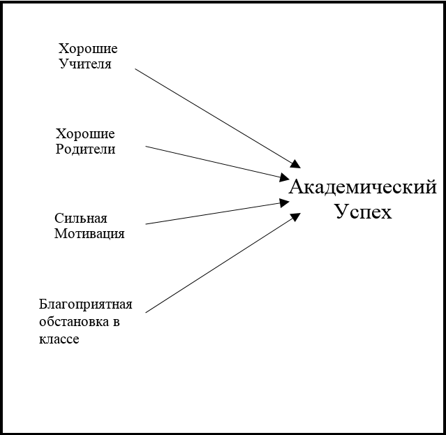

**Рисунок 1.8. Ментальная модель метода подробного списка.**

Первое «мета-предположение» состоит в том, что причинные «факторы» (четыре из них показаны на рисунке 1.8) каждый *независимо* друг от друга оказывают влияние на «результат» («академический успех» на рисунке). Если бы мы должны были «прочитать рассказ», изображенный на рисунке, мы услышали бы: «Хорошие Учителя вызывают академический успех; Хорошие родители вызывают...» Предполагается, что каждый фактор или *независимая* переменная оказывает влияние на Академический успех, *зависимую* переменную.

Чтобы понять, насколько глубокий смысл несет эта теория «независимых факторов», обратитесь к *Вашему* опыту...

Разве это не «колоборация» между учителями и родителями (хорошее открытое *взаимное* общение, доверие и т.д.) позволяет обеим сторонам эффективно способствовать повышению успеваемости ученика? И не помогают ли хорошие учителя создать как высокую мотивацию для студентов, так и благоприятную атмосферу в классе? Высоко мотивированные ученики и благоприятная атмосфера в классе делают обучение более увлекательным и приятным, и в результате заставляют учителей делать свою работу леучше, не так ли? Я бы мог продолжить. Но подозреваю, что сказал достаточно, чтобы объяснить суть. Четыре фактора, показанные на рисунке 1.8, даже близко не стоят к *независимости* друг от друга! Они действуют как тесно переплетенный набор *взаимозависимых* отношений. Они образуют *сеть взаимосвязанной причинной связи*! Реальная картина больше похожа на рисунок 1.9, чем на рис. 1.8!

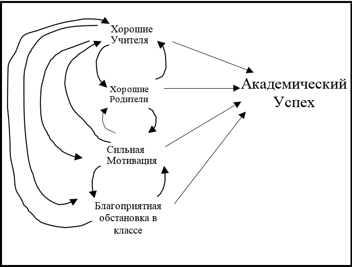

**Рисунок 1.9. Ментальная модель метода подробного списка.**

Итак, первое «мета-предположение», связанное с Методом подробного списка - это то, в котором причинные «факторы» действуют *независимо*. Теперь давайте посмотрим, как второе «мета-предположение» потерпит поражение! Второе предположение состоит в том, что *причинная связь движется в одном нааправлении*. Посмотрите на рисунок 1.8. Обратите внимание, что все стрелки указывают от причины к действию; все они запускаются слева направо. Теперь краем глаза посмотрите еще на рис. 1.9. Заметили что-то отличающееся?

Правильно, стрелки, связывающие «причины», теперь идут в *обоих* направлениях! Причинно-следственная связь становится *замкнутым кругом*! Как показано на рис. 1.10, когда замкнутая причинно-следственная связь появляется на рисунке, так называемая переменная «результата» также теряет свой статус «зависимой». Она тоже теперь является «причиной» чему-то, то есть можно сказать, что успехи в учебе стимулируют мотивацию студентов и благоприятную атмосферу в классе, ровно так же, как и эти факторы ведут к академическому успеху. Он также помогает учителям лучше работать, преуспевающих учеников легче учить, так же, как и хорошие учителя способствуют академическому успеху. И так далее. «Академический успех» является *причиной* любого из четырех «факторов» на столько же, на сколько они являются причиной ему! И поэтому независимые и зависимые переменные становятся как курица и яйцо. Все становятся соучастниками в причинной сети взаимоотношений.

**Рисунок 1.10. Результат также является причиной.**

#### *Мышление в замкнутой цепи*

Переход от метода «Подробного списка», который работает в одностороннем режиме, к Системному Мышлению, работающему в двухстороннем или замкнутом цикле - это большой прогресс! Первый является *статическим* по своей природе, в то время как последний предполагает «непрерывный процесс» или *динамичность*. Восприятие реальности, как состоящей из *сети замкнутых циклов* (называющихся *циклами обратной связи*), и способность структурировать отношения между элементами в ментальных моделях, чтобы изобразить ее, является пятым из навыков Системного мышления. Это называется *мышлением в замкнутой цепи*. Освоение этого навыка позволит учащимся проводить более надежные ментальные моделирования. Инициативы, направленные на решение неотложных социальных проблем, не будут рассматриваться как «разовые», а скорее как «захватывающие» сети цепей, которые будут продолжать долго вращаться и оказывать влияние, после того как инициатива будет активирована. Развитие навыков мышления в замкнутой цепи позволит учащимся лучше предсказывать непреднамеренные последствия и краткосрочные/долгосрочные отношения. Эти навыки также незаменимы в выявлении точек вмешательства с высоким коэффициентом усиления. Суть заключается в увеличении вероятности того, что инициативы следующего поколения будут более эффективными, чем инициативы, созданные нашим поколением, руководствующимся «прямолинейной причинно-следственной связью».

Третье и четвертое предположения «мета», подразумеваемые в «Методе подробных списков», легко обнаружить, когда циклы обратной связи появляются на рисунке. В подробных списках подразумевается, что причинные воздействия должны быть «линейными» и приходить в действие «мгновенно» (то есть без какой-либо значительной задержки). Давайте рассмотрим эти два оставшихся «мета-предположения» подробного списка...

#### *Нелинейное мышление*

Предположение о «линейности» означает, что каждый причинный фактор влияет на «результат» в фиксированной пропорциональной мере. Например, в рамках уравнения «Всемирной эрозии почвы» кто-то может собирать данные для конкретной экосистемы, а затем статистически оценить, что, например, увеличение осадков на 8%(О) приводит к 4% -ному увеличению потери почвы на единицу площади(А). Тогда мы могли бы составить следующее уравнение, чтобы выразить соотношение: A=0,5О. Вероятно, оно у вас сразу же ассоциировалось с широко известным уравнением прямой (т.е. Y=mX+b). В линейном уравнении  изменение в переменной «X» приводит к фиксированному соответствующему изменению в переменной «Y». Переменной, выражающей величину соответствующего изменения, является «m», наклон прямой, связывающий две переменные. Давайте сравним «линейный» вид взаимосвязи между осадками и потерей почвы с «нелинейным» видом, как показано на рисунке 1.11.

Провод, идущий от *дождя* до *эрозии*, показывает, что эрозия «управляется» осадками. Уравнение для *эрозии* - это отношение *осадков* (количества воды за раз), к *почве, потерянной на единицу воды*. Обратите внимание на «~» на лице переменной, названной *почвой, потерянной на единицу воды*. Он обозначает переменную как то, что называется «графической функцией». (Я расскажу о графической функции более подробно в главе 6). Функция рисуется в виде графика в правой части рисунка 1.11. Графическое соотношение показывает, что количество почвы, которое утрачивается с каждой единицей воды, *не* постоянно! Наоборот, это зависит от количества растительного покрова, которое присутствует в это время. В частности, по мере увеличения количества растительного покрова количество почвы, потерянное на единицу воды, уменьшается - обратная связь (растительность оседает в почву, которая помогает удерживать частицы почвы вместе и тем самым уменьшает эрозию).

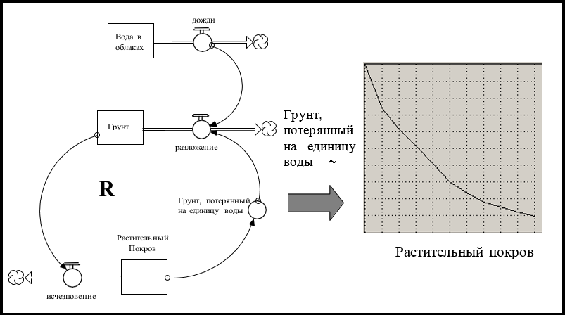

**Рисунок 1.11. "Нелинейный" взгляд на эрозию почвы.**

Сделанное здесь предположение заключается в том, что между осадками и количеством почвы, потерянном за единицу воды, *отсутствует* «линейная» зависимость. Наоборот, зависимость будет *меняться* по мере изменения величины третьей переменной, *растительного покрова*. И здесть дела принимают крутой оборот... Как показывает провод, идущий от *почвы* до *исчезновения* (отток из *растительного покрова*), скорость исчезновения растительного покрова зависит от того, сколько почвы находится на этом месте. Чем меньше почвы, тем быстрее исчезает растительный покров; чем быстрее исчезает растительный покров, тем меньше его остается; чем меньше растительного покрова, тем быстрее почва будет исчезать. Порочный круг или *усиление циклов обратной связи* (тот же «R»).

Поскольку циклы обратной связи взаимодействуют с неустойчивой интенсивностью, они создают *нелинейные* шаблоны поведения, которые часто возникают как в естественных, так и в социальных системах. Такие шаблоны не могут возникнуть из моделирования ментальных моделей, отношения которых *линейны*. 

Развитие навыков *нелинейного мышления* (шестого из навыков системного мышления) *позволит* студентам создавать ментальные модели, способные генерировать такие шаблоны. Это, в свою очередь, позволит учащимся лучше предвидеть последствия своих действий, а также инициативы, которые будут реализованы для решения неотложных социальных и экологических проблем, с которыми они столкнутся после окончания учебы.

Четвертое подразумеваемое «мета-предположение», связанное с пониманием «Метода подробных списков», заключается в том, что воздействие ощущается «мгновенно». Например, когда мы рассматриваем факторы, влияющие на успехи в учебе, подразумеваемое предположение заключается в том, что каждый из них оказывает свое влияние «прямо сейчас». Возьмем, к примеру, "благоприятную атмосферу в классе". Идея здесь заключается в том, что благоприятная атмосфера в классе, то есть физические факторы, такие как пространство, свет, хорошее оборудование и т.д., будут стимулировать учащихся для достижения высоких академических успехов. Повысьте качество физической среды... повысите академический успех. Звучит разумно, но когда вы рисуете более оперативную картину, причина и следствие не так прямолинейны. Взгляните на рис. 1.12.

Вместо слов и стрелок - благоприятная атмосфера в классе -> Академический успех - чтобы показать причинность, на рисунке 1.12 показаны связанные с ней причинно-следственные связи. В частности, на рисунке показана потенциально значимая *задержка* между поялением инициативы улучшить атмосферу в классе и «исполнением» этих улучшений. Транспортное средство для фиксирования задержки, как вы уже видели (на рис. 1.3), называется «конвейером». На этой иллюстрации предположим, что задержка связана, например, с доставкой и последующим вводом в эксплуатацию , мобильной компьютерной лаборатории для классной комнаты. Известно, что такие задержки растягиваются на несколько месяцев. Между тем, возможно, что студенты и учителя могут морально пострадать. Это, в свою очередь, могло бы привести к *оттоку* из *уровня академического успеха* до появления новой лаборатории, который стимулирует соответствующий приток!

**Рисунок 1.12. "Немгновенная" точка зрения.**

Задержки - неотъемлемая составляющая реальности. Опуская их при структурирование отношений в ментальных моделях, Вы рискуете надежностью результатов моделирования, создаваемых этими моделями. Создание навыков *оперативного мышления*, позволяющих учащимся узнать, когда и как включать задержки, должно стать важной частью любой учебной программы, связанной с развитием потенциала эффективного мышления.

#### *Краткое подведение итогов*

Итак, это был долгий путь. Давайте быстро освежим все в памяти, прежде чем продолжать. С самого начала я утверждал, что наша система образования ограничивает развитие *мышления, общения* и *обучения* наших студентов. До сих пор я был сосредоточен главным образом на навыках мышления. Я утверждал, что система образования ограничивает как *избирательную*, так и *представляющую* деятельность (два подпроцесса, которые являются основой *построения* ментальной модели). Там, где были обнаружены ограничения, я предлагал навык «Системного мышления», которое может быть разработано для их преодоления. До этого момента были описаны шесть навыков Системного мышления: взгляд с высоты 10 000 метров, Система как Причина, Динамичное, Оперативное, Замкнутое и Нелинейное мышление. Развивая эти навыки, ученики будут лучше подготовлены к построению ментальных моделей, которые более соответствуют реальности. Это само по себе приведет к более надежному ментальному моделированию и к более точным и правильным выводам. Но мы можем сделать еще больше!

Теперь мы готовы рассмотреть второй компонент мышления, *моделирование*. Давайте посмотрим, что делается для того, чтобы ограничить развитие возможностей студентов в этой области и что мы можем сделать, чтобы помочь исправить ситуацию.

### Мышление: *Моделирование ментальной модели*

Первая состовляющая мышления - это *построение* ментальных моделей. Вторая же - *моделирует* их. На протяжении всего обсуждения до сих пор я предполагал, что все моделирование осуществляется *мысленно*. Это неплохое предположение, потому что подавляющее большинство дейтсвительно осуществляется в уме. Как вы думаете, насколько вы хороши в ментальном моделировании? Вот вам тест...

Прочитайте следующий отрывок, а затем выполните требуемое ментальное моделирование...

Фирма, управляющая определенным лесом, несет ответственность за поддержание стабильного запаса зрелых деревьев, одновременно занимаясь срезанием деревьев каждый год для продажи. Каждый год в течение последних 50 лет или около того фирма собирала постоянное количество зрелых деревьев. Чтобы сохранить запас зрелых деревьев на указанном целевом уровне, фирма следует политике повторной посадки рассады для каждого зрелого дерева, которое оно собирает в течение определенного года. В этом волшебном идеальном лесном заповеднике никакие животные не питаются саженцами, и каждое только посаженное дерево не только выживает, но и достигает зрелости ровно через шесть лет. Поскольку заповедник работает таким образом более 50 лет, он находится в «устойчивом состоянии». Это означает, что ежегодно собирают равное (и постоянное) количество деревьев, сажается равное количество рассады каждый год, и то же количество деревьев также созревает каждый год. Таким образом, запас зрелых деревьев оставался неизменным в течение 50 лет.

Предположим, что в этом году фирма решит увеличить сбор зрелых деревьев на новый, более высокий уровень, а затем удерживать ее в таком состоянии в обозримом будущем.

Задача ментального моделирования: если фирма продолжит со своей нынешней политикой пересева (т.е. Пересаживать один рассаду для каждого зрелого дерева, которое они срезают), а идеальные условия для посева продолжат преобладать в заповеднике, какая картина, со временем, будет прослеживаться по количеству зрелых деревьев после повышения уровня сбора урожая? Нарисуйте свою догадку на оси, представленной на рисунке 1.13.

**Рисунок 1.13. Ваша попытка.**

Если Вы похожи на 90% людей, которым мы задавали такой вопрос, Вы набросали неправильную модель. Если Вы хотите проверить свою интуицию, откройте модель под названием «Деревья» в папке «Вступление в системное мышление» и запустите ее.

Тот факт, что 90% людей, которые проходят этот тест проваливают его, является показательным. Этот процент имеет межкультурный характер и не зависит от пола, уровня образования и любого другого атрибута, который мы рассматривали. Это означает, что результат говорит о человеческом виде в общем! Как вид, мы не очень хорошо строим ментальную модель из письменного описания и/или мысленно моделируем ее после построения. Стоит отметить, что модель, которую мы просили вас построить и смоделировать, очень проста! Например, она намного проще, чем та, которая включает в себя проблемы, такие как дети, убивающие детей, наркоманию и глобальное потепление. И мы имитируем эту последнюю систему в наших головах, чтобы создать политические инициативы для решения этих проблем! Страшно? Вы даже не представляете!

Если Вы вернетесь к рисунку 1.3, то вспомните, что *моделирование* является ключевой частью самоотражающего цикла обучения. Отражение результатов моделирования, которые мы генерируем, является важным стимулятором изменений в наших ментальных моделях. Но что, если эти результаты являются фиктивными? Что делать, если мы неправильно отслеживаем динамику, которая подразумевается в предположениях наших ментальных моделей? Правильно... *Самоотражающий цикл обучения* развалится. Кроме того, поскольку результаты моделирования являются одними из исходных материалов, доступных для проверки другими людьми в процессе коммуникации, ключевой компонент цикла *«вдохновленного другими»* также будет разрушен. Поэтому очень важно, чтобы наши результаты моделирования были надежными, чтобы соответственный канал обучения мог быть эффективным.

Детализация наших недостатков (как вида) в сфере моделирования выходит за рамки этой главы. Тем не менее, часть вопроса здесь, безусловно, биологическая. Наш мозг просто еще не развился до такой степени, чтобы мы могли надежно манипулировать взаимодействием множества переменных в наших головах. Тем не менее, растут доказательства того, что люди могут оттачивать эту способность. Но в нынешней системе образования очень мало внимания уделяется этому жизненно важному навыку.

Системное Мышление может предложить пару вещей, которые могут помочь в этой сфере. Первый - это язык накоплений и потоков. Поскольку язык является визуальным и оперативным, он облегчает моделирование мышления. В качестве примера см. Рис. 1.14. Это карта STELLA, разработанная на основе истории про срез деревьев. Давайте использовать его для облегчения ментального моделирования.

**Рисунок 1.14. Карта STELLA, разработанная на основе истории про срез деревьев.**

Как было написано ранее в отрывке, система начинается в устойчивом режиме. Это состояние легко визуализировать с помощью карты. Это означает, что эти два накопителя являются постоянными, поскольку все три потока равны (а также постоянны). Затем *срезающий* поток поднимается на новый, более высокий уровень и остается там. Через модель оттока из *зрелых деревьев*, карта «говорит вам», что модель, со временем прослеживаемая накоплениями, будет полностью определяться тем, что произойдет с *потоком созревания*. Вы «слышите»?

Если поток *созревания* увеличится одновременно с потоком *среза деревьев*, запас *Зрелых деревьев* останется неизменным; то есть приток и отток останутся равными. Следовательно, величина запаса не изменится. Но увеличится ли поток *созревания* одновременно с потоком *среза деревьев*?

Нет! В течение шести лет после того, как начнется постепенное увеличение *среза деревьев*, поток *созревания* останется равным изначальному. Это объясняется тем, что сеянцы, которые «находятся в стадии разработки», рассчитаны на шесть лет а количество рассады в когорте каждого года равно значению *срезки деревьев* до запуска процесса. Таким образом, через шесть лет *после* того, как произойдет увеличение среза деревьев, поток *созревания*, наконец, станет увеличиваться до достижения нового, более высокого объема *среза деревьев*. На этом этапе система вернется в устойчивый привычный режим. Однако, поскольку рост потока *созревания* был меньше объема *среза деревьев* в течение шести лет, запас *Зрелых деревьев* снизился бы на шесть лет. И поскольку *созревание* было меньше, чем *сбор урожая* на постоянной основе, снижение будет *линейным*. Теперь накопление *«Зрелые деревья»* будет находиться на *более низком* уровне, чем был до повышения *урожайности*.

#### *Научное мышление*

Карты *STELLA* действительно облегчают ментальное моделирование! Но другая приятная вещь в них заключается в том, что они легко конвертируются в модели, которые могут быть смоделированы компьютером. И если Вы будете следовать «хорошей практике» при выполнении Ваших моделирований *STELLA*, она будут служить отличным «проверочным пунктом» для Вас. Подумайте о программном обеспечении как о фитнес-центре для укрепления ментального моделирования «мышц». Чтобы полностью использовать возможности зала, важно иметь четкое представление о том, какую динамику создаст конкретная модель *до* фактического использования *STELLA* для их генерации. Опыт показал, что слишком легко, «возвращаясь к анализу», придти к выводу, что Вы «на самом деле знали», что модель собирается создать этот образец. Также важно привести свои модели в устойчивое состояние (по крайней мере на начальном этапе) и протестировать их, используя «идеализированные тестовые входы» (например, функции STEP и PULSE). Сборник строгих методов моделирования называется *Научное мышление*, седьмой из навыков Системного мышления.

#### *Мышление, в заключение*

В настоящее время в системе формального образования очень мало внимания уделяется разработке моделирующих навыков. Это означает, что очень важный набор циклов обратной связи для улучшения качества ментальных моделей по существу игнорируется. Программное обеспечение *STELLA* - это легкодоступный инструмент, который может играть важную роль в развитии этих навыков.

### Общение

Следующий процесс в системе мышления/общения/обучения - это *общение*. Общение, о котором я говорю, не ограничивается тем, что обычно изучается на уроках литературы. Оно должно стать важной частью *любой* дисциплины! Я говорю об обратной связи, которую дают ученики после изучения ментальных моделей друг друга и связанных с ними результатов моделирования (см. Рис. 1.3).

Нынешняя система образования не предоставляет студентам возможность поделиться своими ментальными моделями и связанными с ними результатами моделирования. Хорошо организованные обсуждения на уроках предоставляют такую возможность (и поэтому учащиеся так любят эти классы!). Студентам иногда предлагают критиковать письменные работы и устные выступления друг друга, но чаще всего эта обратная связь носит грамматический или стилистический характер.

#### *Эмпатическое мышление*

Способность давать и принимать обратную связь по ментальным моделям имеет жизненно важное значение для развития, если мы хотим стать лучше в предоставлении конструктивной обратной связи при обучении друг друга! Многие навыки задействованы в повышении этой способности, включая слушание, артикуляцию и, в частности, *эмпатическую* способность. Желание сопереживать увеличивает усилия, чтобы как внимательно выслушать, так и четко сформулировать. Эмпатическая способность - это умение, которое может быть развито - и в некотором роде - высшее умение «Системного мышления», потому что оно приводит к расширению границы истинного ухода за собой (навык, который почти каждый человек не отказался бы улучшить). Постоянно расширяя горизонтальную перспективу, Системное мышление тайно работает, чтобы ослабить границы, которые удерживают людей от более свободного сочувствия.

Но даже с усиленными эмпатическими навыками нам нужен язык, который обеспечит эффективные безграничные беседы для того, чтобы общение зашло максимально далеко. И именно здесь проблема учебного плана, ориентированного на определеннный контент, возникает как ограничивающий фактор. Даже если бы учебная программа выделяла время для обмена обратной связи между студентами по ментальным моделям, а эмпатия бы присутствовала в достаточном количестве, дисциплинарная сегментация подорвала бы процесс коммуникации. У каждой дисциплины есть своя профессиональная лексика, а в некоторых случаях даже своя совокупность символов. Это затрудняет для многих учеников освоение всех диалектов (не говоря уже о соответствующем содержании!) достаточно хорошо, чтобы чувствовать себя уверенно и делиться своими размышлениями. Язык *Эсперанто* накоплений/потоков, связанный с Системным мышлением, может сыграть важную роль в повышении уровня как комфорта, так и уверенности в более свободном выходе за дисциплинарные границы.

Рисунок 1.15 наглядно показывет это понятие...

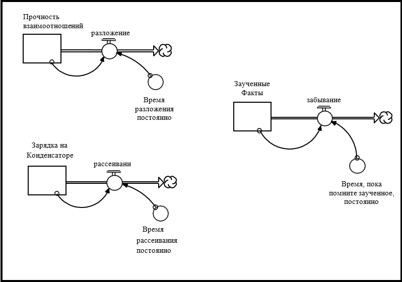

**Рисунок 1.15. Универсальная структура процесса рассеивания.**

На рисунке показано накопление силы в личных отношениях, накопление электростатического заряда на конденсаторе и накопление фактов в человеческой памяти. Каждый из них представлен *одним и тем же* символом. Как и накопление, каждый выполняет аналогичную функцию, хотя и в совершенно разных контекстах, то бишь «сообщает» о состоянии. Кроме того, как можно увидеть на рисунке, «логика», по которой работает один или несколько связанных потоков, является общей для всех. По крайней мере, это довольно утешительное открытие в мире, который обычно воспринимается как ежедневно становящийся более сложным и непостижимым, и в учебном плане, насыщенном подробными, содержащими специфичные диалекты сборниками. Но он также обладает прекрасным потенциалом для создания синергетического взаимодействия между учебными планами. То, что изучается в физике, может фактически *ускорить* (а не затруднить) процесс обучения в литературе или психологии (и наоборот)! И, развивая свою способность видеть «универсальную структуру», студенты будут одновременно улучшать свою способность создавать «горизонтальные» связи в реальном мире.

Изучение языка *Эсперанто* накоплений/потоков и навыков *оперативного* и *эмпатического мышления*, необходимые для эффективных «речи/письма», могут значительно помочь улучшить коммуникативные способности ученика, необходимые для реализации синергии, скрытой в рамках многодисциплинарной учебной программы.

Главы 2-9 этого Руководства должны обеспечить основу того, что требуется для выполнения этой инструкции.

### Обучение

Обучение - это буквально и образно «нижняя грань» мышления/общения/обучения триумвирата. Поскольку эти три процесса тесно переплетаются между собой, все предложения по Системному мышлению и ПО *STELLA*, которые были сделаны для улучшения процессов *мышления* и *коммуникации*, также будут эффективны для улучшения процесса обучения. Есть еще одно предложение, которое я хотел бы сделать, которое сосредоточено исключительно на самом процессе обучения. Я закрою программное обеспечение *STELLA*, чтобы нарисовать то, что я надеюсь, будет четкой визуализацией предложения, которую Вы можете увидеть на рисунке 1.16.

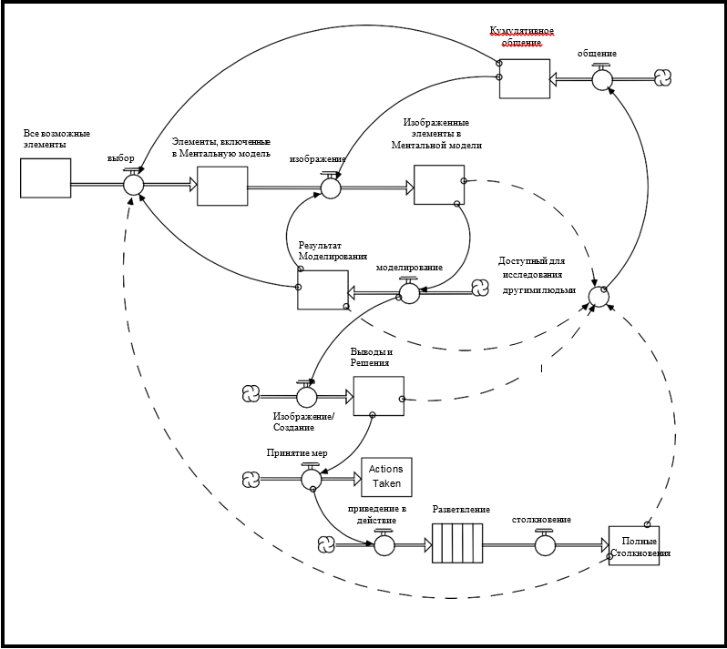

**Рисунок 1.16. Захват всех последствий предпринятых действий.**

Для лучшего понимания, Вы можете взглянуть на рис. 1.3. Он отличается от рисунка 1.16 только в одном моменте. Две линии обучения, которые выходили из *Разветвления* на рис. 1.3, теперь выходят из *Полного воздействия*. Это подразумевает, что каким-то образом мы смогли «закрыть цикл обучения» в полном объеме действий, которые были предприняты, вместо того, чтобы фиксировать только частичные воздействия (поскольку эти воздействия все еще разветвлялись). Как мы можем этого достичь?

Ответ, который я хотел бы дать, попадает под рубрику того, что известно как «организационное обучение». Это никому неинтересный термин, который был скрыт от глаз, когда был впервые придуман. Организации не учатся, а *люди* - да! Я использую термин «организационное обучение» для обозначения *знаний, которые поглощаются, а затем каким-то образом хранятся вне тел людей, которые создают и используют их*. Таким образом, когда люди исчезают, их вклад в коллективное понимание не исчезает вместе с ними. И, когда приходят новые люди, они могут быстро придти к нынешнему коллективному пониманию, потому что это понимание находится в каком-то экстракорпоральном резервуаре.

Транспортное средство, которое я бы предложил создать для этого «экстракорпорального» резервуара (можно называть его «организационной обучающей инфраструктурой»), - это набор моделей *STELLA*. Инфраструктура будет работать следующим образом... Каждая модель будет использоваться для прогнозирования того, что будет происходить (но не в численном выражении, а в качественном смысле) в любой сфере, которую он обслуживает. Будет создан процесс мониторинга фактических результатов по сравнению с прогнозами, генерируемыми моделью. Когда возникают несоответствия между ними, предположения в модели будут тщательно изучаться, обсуждаться и затем корректироваться соответствующим образом. Со временем модель будет постоянно улучшаться как представление реальности, по которой накапливается обучение.

Было бы здорово реализовать такой «экстракорпоральный» процесс обучения в классе в течение учебного года, возможно даже продлить его до нескольких лет, и тем самым дать ученикам чувство непрерывности обучения по мере их взросления. Преобретение опыта в подобном процессе в школьные годы может вдохновить некоторых студентов на продолжение столь необходимой практики освоение уроков из «полного воздействия» для своей профессиональной и общественной карьере.

### В заключение

Проблемы, с которыми сталкиваются сегодняшние студенты после окончания школы, вызывают опасения и увеличиваются с каждым днем. Система образования не разработала учебную программу, методы и инструменты, которые способствовали бы лучшей готовности учащихся к решению этих проблем. Система по-прежнему основывается на стандартом «получении контента», который подразумевает *зубрежку* в качестве основной «обучающей» деятельности. Ключом к развитию нашей системы образования является выявление потенциальных синергий, которые существуют во взаимодополняющих процессах *мышления, общения* и *обучения*. Системное мышление и программное обеспечение *STELLA* могут многое привнести в этот процесс!

В этой главе были определены восемь навыков системного мышления, которые используются во всех трех процессах. Каждое умение может быть легко реализовано в современных школьных системах. Основным препятствием для этого является мнение о том, что миссия системы образования состоит в том, чтобы заполнить головы учащихся знаниями. Это мнение приводит к резкой дисциплинарной сегментации и к рейтингам учащихся, основанным на количестве знаний, связанных с конкретной дисциплиной. Изменение точек зрения, особенно когда они поддерживаются измерительной системой и океаном учебного материала, - чрезвычайно сложная задача. Но последствия бездействия непригоды для жизни. Время уже настало.

### Что будет дальше?

Остальная часть Руководства основана на расширенной аналогии. Обучение использованию программного обеспечения *STELLA* для визуализации ментальных моделей трактуется как аналогичное тому, чтобы учиться писать повествовательное сочинение, например, рассказ или сценарий. Руководство разделено на две части.

Часть 1: **«Язык системного мышления:** *оперативное, замкнутое и нелинейное мышление».* Шесть глав в этой части составляют параллельное развитие языка/грамматики и связанных с ними навыков мышления, необходимых для эффективного применения представленных языка и грамматики. Вы будете изучать все: от частей речи до коротких сюжетных тем, и в этом процессе начинают усваиваться первые три из восьми навыков системного мышления.

Часть 2 Руководства: **«Процесс написания:** *10 000 метров, система как причина», «Динамическое, научное и эмпатическое мышление*». В трех главах этой части вы узнаете о хороших «письменных» практиках, просмотрите изображения этих практик и, наконец, получите некоторые общие «письменные» рекомендации.

Как Вы, вероятно, заметили, если Вы дошли до этого момента, это не типичное «Руководство пользователя». Это объясняется тем, что изучение того, как эффективно использовать программное обеспечение *STELLA*, действительно имеет мало общего с механикой самого программного обеспечения. Пользовательский интерфейс программного обеспечения достаточно прост, чтобы им овладеть нужно просто «покопаться» несколько часов. Реальная проблема программного обеспечения *STELLA* - это интернализация связанных с ним навыков Системного мышления, а также языка и метода. Это концептуальная, а не механическая работа! Руководство посвящено тому, чтобы помочь Вам более рационально использлвать свою память и освоить новый язык. Если Вам нужна техническая помощь при обучении использования программного обеспечения, есть отличные *Онлайн Справочник* и учебные пособия по самостоятельной подготовке, которые сопровождают ваше программное обеспечение. Для получения концептуальной помощи посетите веб-сайт HPS (www.hps- inc.com) для статей и ссылок на ресурсы Системного мышления.

Поздравляем Вас с приобретением программного обеспечения *STELLA* и удачи в его освоении. Преимущества, которые вы получите от обучения Системному мышлению, будут многократно окупать инвестиции, которые вы сделаете!
