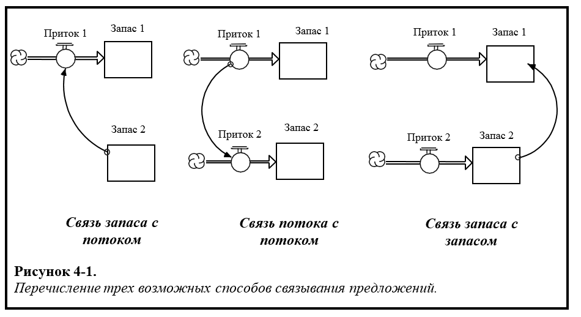
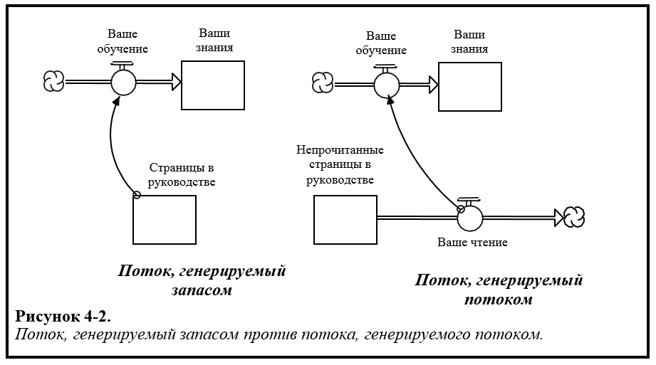
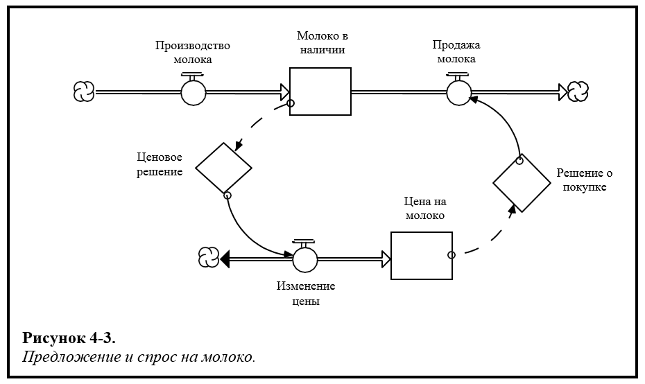
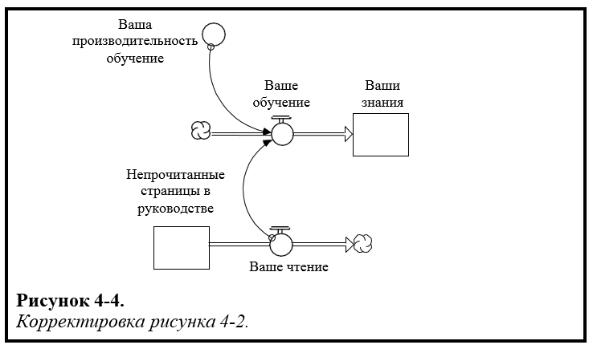
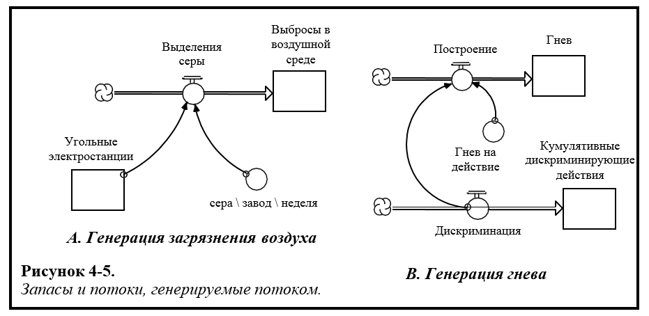
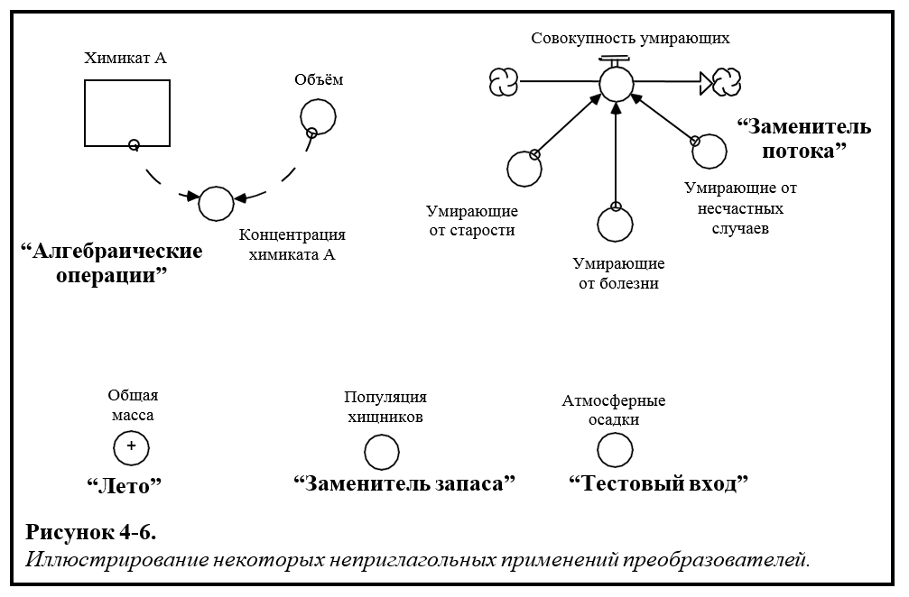

## Глава 4: Связывание предложений. *Оперативное мышление*

В процессе написания коротких историй следующий важный шаг – выучить, как связываются предложения. Оказывается, существует всего 2 способа связывания предложений друг с другом. Поймите, в чем различия между способами, потом выучите, когда какой способ стоит использовать, и у вас будет отлично получаться написание роскошных параграфов!

### Способы связывания предложений

Если перечислять все возможные способы связи предложений с другими предложениями, то можно обнаружить, что их всего три… но один из не работает! Рисунок 4-1 перечисляет возможные способы.  

Первый способ соединения предложений – через связь запасов в одном предложении с потоком в другом. Идея состоит в том, что это «условие» (то есть преобладание величины запаса) генерирует желание действовать (то есть приводит к тому, чтобы объём потока был больше 0). Хорошим примером может служить голод, побуждающий кушать… вы знакомы с таким, не правда ли? Второй способ, продемонстрированный на фигуре 1-4, также правдоподобен. Здесь одно действие «несет за собой» другое действие. Хорошим примером служит ваше прочтение данного текста и связанный поток обучения, который сопровождает его… это же так и происходит, не правда ли?

Третий способ? Создан дымом и зеркалами! Программное обеспечение STELLA не позволит подобные связи! Запомните то, что я говорил во второй главе. Величина запасов не может быть изменена «влиянием на» или «вводом в». Величина запасов меняется лишь через заполнение и дренирование. Заполнение и дренирование – *действия* (глаголы!). А глаголы представлены в качестве *потоков*, а не в качестве тех тоненьких маленьких «проводов», которые вы видите на рисунке 1-4. Только поток может изменить запас. Следовательно, единственный способ связать предложения – это соединить запас к потоку или поток к потоку. И, как вы сейчас увидите, это имеет большое значение, в частности, динамичное, который из этих двух способов вы выберете.

### Запас, генерируемый потоком против потока, генерируемого потоком

Посмотрите на рисунок 4-2 и решите, которое из двух представлений процесса «передачи знаний», с уважением к материалу, читаемый вами, имеет больше смысла…

Если вы выбрали изображение справа, вы были правы! Если бы изображение слева было верным, тогда все, что нам нужно было бы сделать, чтобы помочь вам учить больше – это добавить страниц в Гид. Вам бы не пришлось *действовать*, чтобы выучить материал, содержащийся на тех страницах, вы бы учили только лишь потому, что материал был бы там! Согласно изображению справа, существуют «основные действия» для вашего обучения. Эта основа – чтение. Если вы перестанете читать, вы перестанете учить. Последнее утверждение не полностью соответствует действительности, так как, безусловно, вы можете выучить материал, содержащийся в данном Гиде, другими способами, помимо чтения. Но, учитывая простоту представления, верно, что вы перестанете учиться через *этот* источник (то есть перестанете читать).

### Знакомство с элементом соединения

В предыдущем примере мы решили проблему, которую лучше представлять путем проведения ментального моделирования, а это всегда очень удачный вариант, который облегчает визуальный характер языка запаса / потока. Однако мы также могли бы смоделировать два образа на компьютере с помощью программного обеспечения STELLA и быстро бы обнаружили проблему с первым из двух образов. Однако вы решили провести свои мысленные эксперименты, первый шаг в соединении предложений вместе - это определить, имеет ли смысл связывать запасы с потоком или поток с потоком. И после того как вы определите это, вам надо будет использовать «соединитель» (тонкий провод) для соединения. Соединители, благодаря своей роли «линкеров», становятся *элементами соединения* на языке STELLA.

Как вы уже заметили, на языке STELLA есть два типа соединителей. Тот, который мы использовали на рисунке 4-2, сплошной провод, называется «соединителем действия». Это потому, что провод передает «действие», а не «информации». Чтобы понять разницу, рассмотрите рисунок 4-3 ...

В этом примере информация (представленная пунктирным соединителем) исходит из уровня наличия молока, чтобы внести свой вклад в решение ценового вопроса. Логика решения не видна на картинке, потому что она встроена в Алгоритм принятия решений (DPD), названный *ценовым решением*. Специфика этой логики не относится к тому моменту, который я пытаюсь донести здесь. Информацию о DPD смотри в *файлах справки* в программном обеспечении. Из этого процесса принятия решений выходит ценовое решение! Это может снизить цены на 10% или повысить на 20% или оставить ее постоянной. Дело в том, что информация приводит к решению, а решение, в свою очередь, к *действию*! Таким образом пунктирная проволока начинает процесс, и сплошная проволока заканчивает его.

То же самое касается и спроса на книгу. Информация о ценах на молоко поступает потребителям. Это часть того, что влияет на количество молока, которое они будут покупать, и, следовательно, сколько молока будут продавать. Потребители принимают решения о покупке, а затем *действуют*, то есть они покупают определенное количество молока в день / неделю / месяц.

Информационные соединители предоставляют информацию, которая используется для принятия решения. Провода действий, по сути, преобразуют полученное решение в действие, которое в конечном счете проявляется как изменение объема потока. Четкое различие в назначении между двумя типами соединителей объясняется тем, что только информационные соединители могут «вставляться» в DPD. Однако оба типа проводов могут «выходить» из DPD, поскольку в дополнение к действию, которое будет принято в результате принятия решения, информация о решении или входы в это решение также может быть передана.

Соединители информации и действия аналогичны, поскольку ни один из них не может использоваться для представления связи с сохранением потока. То есть никакой «материал» не сможет течь по любому типу провода! Когда информация «излучится», она не исчезает совсем! Таким образом, например, когда вы наступаете на шкалу ванной комнаты, и информация о вашем весе тела излучается от циферблата, фактические килограммы не теряются через это излучение. Это не вес тела, который излучается, это *информация* о весе тела, которая излучается!

Итак, поток транспорта; провода передаются. Соединители служат в качестве «входов» и «выходов», а не «притоков» и «оттоков». Способность понимать эти различия - это еще один из суб-навыков, которые включают в себя *оперативное мышление*.

Проницательный наблюдатель заметил бы небольшую проблему на рисунке 4-2. Если вы хотите, то взгляните еще раз подумайте, есть ли то, что беспокоит вас в этом рисунке. Я подожду…

Вы обеспокоены тем фактом, что вся эта суматоха вокруг единственной констистенции, о которой я говорил в главе 3, как будто вылетела из окна? Ну, а вы должны быть! Давайте сосредоточимся на втором образе на рисунке 4-2. Мы сказали, что это было более точное из двух изображений. Каковы единицы измерения *потока чтения*? Если у вас возникли проблемы с этим вопросом, то запомните, что единицы потока должны быть в тех же единицах, что и запас, к которому он прикреплен, за исключением «времени». Запасы выражены на «страницах». Поэтому *ваше чтение* должно быть рассчитано как «страницы за раз».

Существует проводка действий, которая проходит от *потока чтения* к вашему *потоку обучения*. Каковы единицы последнего потока? Опять же, вы можете начать с запаса, к которому привязан ваш *поток обучения* и работать обратно. Хотелось бы надеяться, что вы пришли к выводу, что единицы потока должны быть «знанием за время» (или «пониманием за время», или некоторым из них). Но как это может быть, если провод, входящий в поток от *вашего чтения*, не имеет этих единиц измерения? Ответ: *никак не может*! Нам нужна другая концепция, ребята. И дело не только в том, что мы можем заставить подразделения работать правильно. Таким образом, мы можем сделать образ *работоспособным*, то есть точнее отразить, как работает реальность! Настаивание на единичной консистенции - это не просто анальная компульсивность, от которой системные мыслители стали зависимыми. Это способ гарантировать, что ваши образы лучше отражают, как все работает!

В этом случае давайте обнаружим недостающую концепцию, подумав о процессе, а не поддерживая его, выясняя, что нужно «единицам», чтобы заставить ваш *поток обучения* иметь правильные единицы измерения.

Вот мысленный эксперимент: если семилетний ребенок должен был прочитать те же страницы, которые читали и вы, то они бы узнали столько, сколько вы узнали? Вряд ли. Почему? Потому что, по-видимому, ваш накопленный опыт обучения сделал вас лучшим читателем, чем семилетний ребенок, и вы также накопили больше контента и понимания (то есть у вас больше «крючков»), с помощью которых можно было бы понять понимание слов и фотографии на страницах, которые вы переворачиваете. Кроме того, вы, вероятно, будете более мотивированы, чтобы выучить этот материал, чем среднестатистический семилетний ребенок. Все эти факторы подтверждают то, что вы бы научились большему «за перевернутую страницу», чем семилетний. Говоря оперативно, ваша «производительность обучения» (единицы измерения: «обучение на страницу») выше! Если мы добавим «производительность обучения» к картине, то мы получим рисунок 4-4.

### Введение к теме преобразователя

Элемент языка STELLA, который мы использовали для представления *вашей производительности обучения*, и который часто используется для представления «производительности» в одном из своих многочисленных воплощений, называется *преобразователем*. В данном случае преобразователь играет роль «наречия». Он изменяет глагол, который *вы изучаете*. А также рассказывает, как много обучения происходит для данного подразделения «вождения» (в данном случае *вашего чтения*). С точки зрения согласованности единиц, он «преобразует» единицы, вводимые в поток обучения из потока чтения (то есть страницы / время), в соответствующие единицы обучения (знания / время). Если вы хотите рассмотреть это с точки зрения алгебры, это будет выглядеть так:

**Ваше обучение = ваше чтение х ваша производительность обучения**

***(Знания/время)   (Страницы/время)   (Знания/страницы)***

Обратите внимание, что (страницы/время) времена (знания/страницы) равны (знания/время), так что единицы измерения в левой части уравнения балансируют с единицами в правой части уравнения - это делает жизнь лучше, физики улыбаются, а учителя алгебр прыгают от радости. Это также дает представления, которые более точно отражают то, как работает реальность, так что, когда вы имитируете эти представления для целей выводов, у вас больше шансов быть уверенными в том, что можно полагаться на эти выводы. *Оперативное мышление* рулит!

Таким образом, преобразователи часто играют роль «наречий», изменяющих потоки. В этой роли они рассказывают, сколько вклада в деятельность делается на единицу «драйвера», будь то «драйвер» потока (как в примере, который мы только что рассмотрели) или запаса. Давайте рассмотрим еще два примера, просто чтобы закрепить концепцию. Изучите рисунок 4-5 ...

Первый образ на рис. 4-5 показывает образование выбросов серы на угольных электростанциях. Поток, *выделяющий серу*, представляется в виде потока, *генерируемого запасом*. Во втором образе *построение* гнева - поток, *генерируемый потоком*. В обоих примерах преобразователи используются как термин «производительность».

Преобразователь, сера \ завод \ неделя, используется для преобразования количества *угольных электростанций* , работающих в любой момент времени в потоке *выбросов серы*. Он имеет единицы: сера на завод в неделю.

В примере про *гнев* поток дискриминации подвергается нарастанию гнева. Срок службы, гнев на действие, показывает, сколько гнева генерирует каждый акт дискриминации, то есть, как «продуктивность» каждого акта дискриминации порождает гнев. Его единица измерения: гнев на акт дискриминации.

Предыдущие примеры должны помочь внедрить концепцию конвертеров в качестве «наречий» или более оперативно сформулированных как «термины производительности». Мы находимся на твердой почве здесь как грамматически, так и концептуально, с точки зрения описания того, сколько процессов действительно работает. Фактически две формулировки потока, проиллюстрированные на рисунке 4-5, повторяются в моделях STELLA настолько часто, что мы дали им общие имена. *Сгенерированная запасами* формулировка называется «шаблоном внешних ресурсов», а формулировка, порожденная потоком, называется «шаблон совместного потока». Вы должны изучить эти две формулировки. Вы найдете их чрезвычайно полезными при построении моделей с использованием программного обеспечения STELLA. В 5 главе мы представим еще три таких *типовых шаблона потока*, а всего их пять. Я использую один из этих пяти шаблонов, чтобы специфицировать 90% потоков в моделях, которые я создаю. Возможность творчески адаптировать и использовать эти шаблоны является отличительной чертой того, кто действительно овладел *операционным мышлением*.

Предыдущие примеры должны помочь привести концепцию конвертеров в качестве «наречий» или более оперативно сформулированных как «термины производительности».

Шаблоны потоков - это красивые вещи. Но теперь, мы собираемся сбалансировать всю эту красоту небольшим «уродством» ...

### Преобразователь как ящик Пандоры

Оказывается, эти красивые безобидные маленькие круги, которые мы называем преобразователями, могут функционировать как нечто большее, чем просто наречия. Они могут действовать как прилагательные, обособленные причастные обороты ... и почти любая другая часть речи! Как говорится в Нью-Гэмпшире ... «Ах да, тут есть ложка дёгтя в бочке мёда». Преобразователи становятся универсальными для: выполнения алгебраических операций (например, суммирования или деления), представляющих экзогенные входы и служащих заменой как акций, так и потоков, которые вы выбираете (из соображений упрощения), чтобы не представлять их как таковые. Я вкратце проиллюстрирую некоторые из этих практических, но не очень красивых применений преобразователей. Затем вы, возможно, обнаружите еще больше возможностей, просматривая различные модели, предоставляемые программным обеспечением STELLA.

Несколько неприглагольных применений преобразователей показаны на рисунке 4-6.

#### Алгебраические операции

Использование преобразователя для выполнения алгебраической операции является первым из видов использования, показанных на рисунке 4-6. В этом примере вычисляется концентрация химического вещества - простое деление количества химического вещества на объем, в котором содержится это количество. Вычисление плотности было бы еще одним хорошим примером такого использования преобразователя. Часто вы захотите «похоронить» такие расчеты внутри Алгоритма принятия решений(DPD). Он «получает алгебру» от центральной ступени, которая должны быть зарезервированы для водопровода и водоотвода (это обсуждается в следующей главе).

#### Летний преобразователь

Лето - это то, чего нам бы очень хотелось, чтобы было больше в Нью-Гемпшире. Итак, мы добавили его в программное обеспечение. И в дополнение к тому, чтобы служить постоянным напоминанием о том, чего у нас нет, оно также полезно для «добавления» количества без необходимости «запускать все провода» в плохой преобразователь. Летние преобразователи, выбор в диалоговом окне преобразователя, позволяют вам добавлять любые количества, которые вам нравятся, просто нажав на них в списке «Допустимый».

#### Заменитель запаса

*Популяция хищников*, переменная, выбранная для иллюстрации «заменителя запаса», представляет собой концепцию запаса. Однако если вас не интересует приток к запасу (то есть *процесс рождения*) или отток (то есть *процесс умирания*), вы можете упростить ситуацию, просто представляя запас в качестве преобразователя. Как мы увидим в главах, описанных позднее, преобразователи *могут* меняться со временем. Они не всегда являются постоянными! Таким образом, использование конвертера для замены чего-то, что действительно является запасом, не означает, что вы теряете способность изменять эту переменную со временем. Это просто означает, что вы будете рассматривать изменения как отношения, не включенные в границы модели. Более подробно об этом будет написано позднее, когда мы перейдем к главам, в которых описываются «циклы обратной связи».

#### Заменитель потока

Поток *полного умирания* на рисунке 4-6 иллюстрирует использование преобразователей для замены потоков в концепции. Нет проблем. Вместо того чтобы иметь три типа умирающих, представленных в виде потоков, вы можете представлять их как преобразователи, а затем, как на иллюстрации, суммировать их в *один поток*. Существует одна проблема, о которой вам следует знать, когда вы это делаете. Когда числовые значения представлены в таблицах в программном обеспечении STELLA, переменные, представленные как преобразователи, вычисляются до того, как переменные представлены в виде потоков. Таким образом, при использовании преобразователя для представления потока с целью вызвать числовые значения, указанные в таблицах и появляться одновременно с потоками, необходимо щелкнуть кнопку CF (в диалоговом окне таблицы) после ввода преобразователя в выбранный список. Подробнее об этом можно узнать в разделе *Помощь*.

#### Экзогенный или тестовый вход

Как вы могли заметить, если вы проходили учебные программы по программному обеспечению или просто играли с ним, в диалоговом окне каждого преобразователя имеется прокручиваемый список "встроенных" функций. Эти «функции» позволяют создавать различные «шаблоны» (например, пандусы, ступени, случайность, синусоиды и так далее), которые полезны для «тестирования» вашей модели и при этом служат «экзогенными входами». Мы будем больше говорить об этих переменных, когда дойдем до обсуждения тестирования модели в главе 9.

### Что же дальше?

За последние пару глав вы познакомились с сущностью того, что представляет собой *Оперативное мышление* - главное умение системного мышления. Второй важный навык называется *замкнутым мышлением*. Поместите эти два «значимых пункта» вместе, и вы сможете подать заявку на профсоюзную карту системного мыслителя. Вы также сможете написать хорошие параграфы - строительные блоки коротких рассказов.
