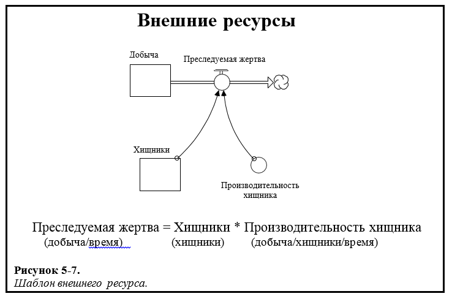
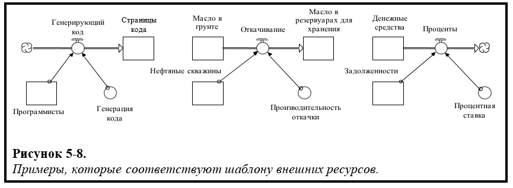
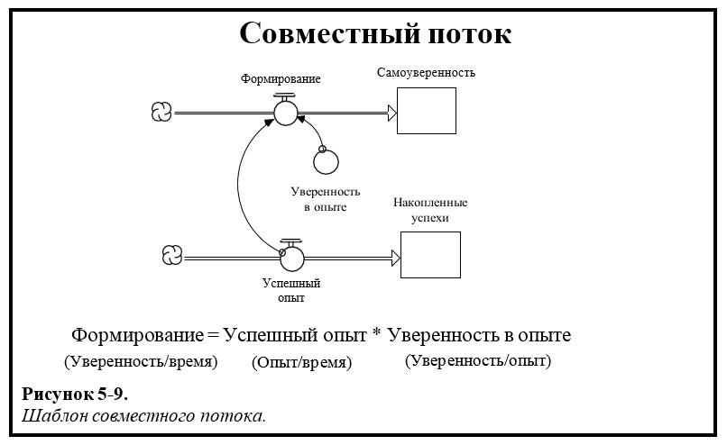
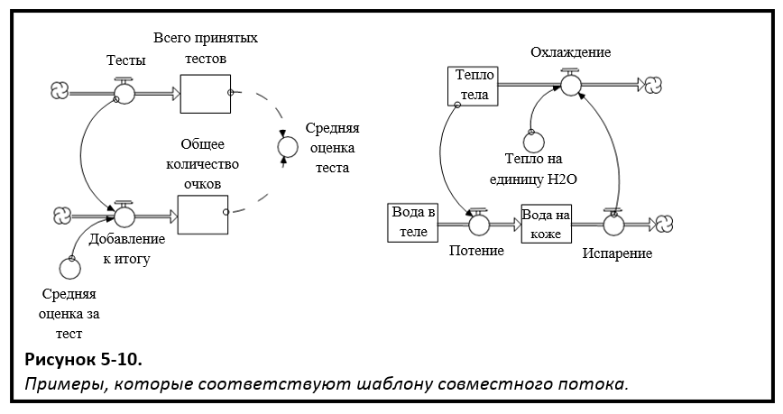
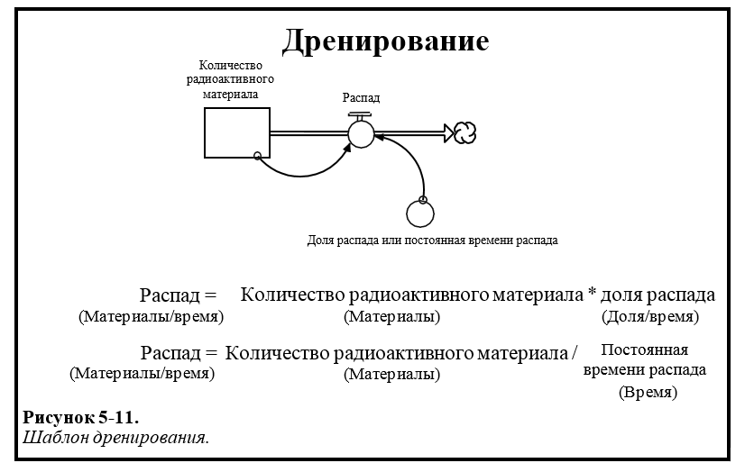
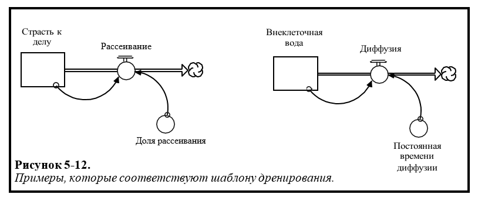
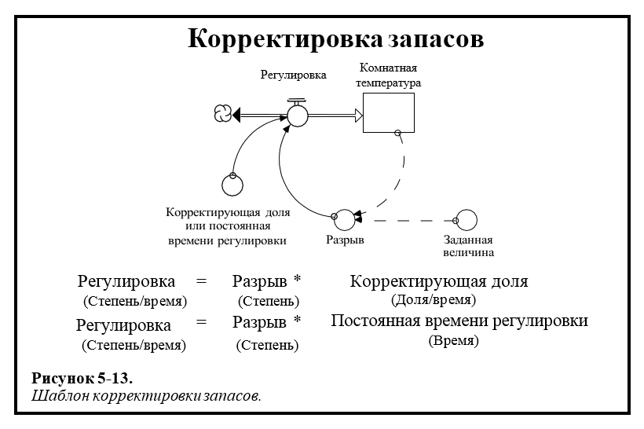
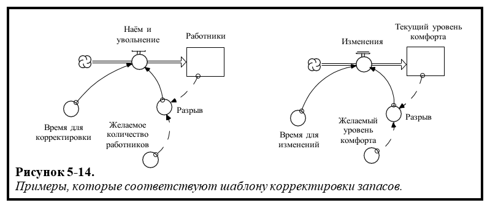
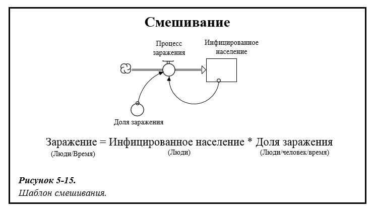
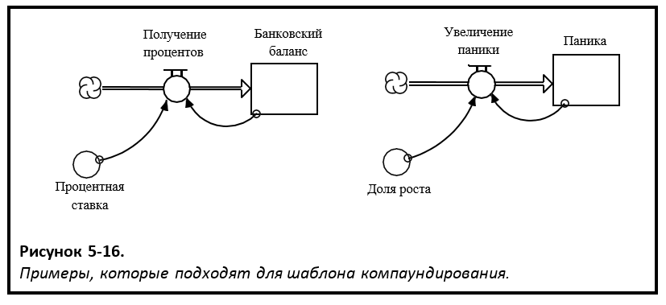

## Глава 5: Конструирование простых абзацев. *Замкнутое мышление.*

### Определение термина «контур обратной связи»

«Абзац» на языке Системного Мышления представляет собой «контур обратной связи» – замкнутый контур причинностей. В предыдущих главах уже упоминалась их значимость и «интересность», и, возможно, вас заинтересовало, почему же они являются таковыми? Причиной является их схожесть с маленькими заводными игрушками… сначала вы запускаете их, а потом они начинают действовать самостоятельно! Обратная связь *самостоятельно генерирует* поведение. Если ты столкнешься с одной, то лучше поскорее убраться с дороги!

Существует два типа контуров обратной связи: *противодействующий* и *усиливающий* (некоторый технический персонал называет их *отрицательным* и *положительным* соответственно). Начать стоит с формального определения контуров обратной связи, а затем перейти к разбору противодействующего и усиливающего типов. В этой главе мы рассмотрим только *простые* контуры обратной связи, где эпитет «простой» имеет техническое определение и не связан с мерой сложности.  В 6 главе мы рассмотрим сложные абзацы.

*Контур обратной связи* существует только в том случае, когда «существительное» (запас) связано с «глаголом» (поток) *в одном* предложении. Связь может быть прямой, а может быть частью цепочки связей, проходящих сначала через другие «предложения». Пример прямых и расширенных связей показан на рисунке 5-1.

На схеме A описана «прямая связь» на примере бактериальной популяции, которая воспроизводится самостоятельно. На схеме B показа «расширенная связь» на примере неприятной спиралеобразной ситуации, которую можно наблюдать в тюрьмах и в государствах с диктаторским режимом правления, где угнетение порождает сопротивление, которое разжигает угнетение еще больше. В обоих примерах существительное соединяется зависимым глаголом. В первом случае соединение является *прямым*. Во втором случае соединение сначала проходит через другое предложение. Всякий раз, когда существительное ссылается к зависимому глаголу, возникает «контур обратной связи». Обратная связь чрезвычайно важна для функционирования *всех* естественных, физических и социальных систем. Без контуров обратной связи не существовало бы никакой жизни! Можно сказать, что эти контуры имеют довольно фундаментальное значение. Для того чтобы понять, как именно они работают, необходимо изучить *Замкнутое мышление*.  

### «Простые» контуры обратной связи

Для качественного понимания материала стоит начать с самого простого. Это, безусловно, относится и к пониманию контуров обратной связи, где все может быстро стать довольно непонятным. Очень важно иметь высокий уровень подготовки в основных знаниях структуры и поведения контуров обратной связи, прежде чем приступать к построению моделей. По этой причине я дал определение тому, что я называю «простой» контур обратной связи, и описал его отличия от «сложного» контура. 

«Простой» контур обратной связи удовлетворяет двум условиям: он состоит из *прямой* связи (то есть запасы напрямую связаны с его притоком или оттоком) и его параметры (то есть «условия производительности») являются *постоянными*. Пример, показанный на рисунке 5-1 A, представляет собой «простой» контур обратной связи, тогда как пример 5-1 B – нет. 

### Простые противодействующие контуры обратной связи

Противодействующие контуры обратной связи называются именно так, потому что они *противодействуют* изменениям. Попробуйте нажать в одном направлении на то, что контролируется противодействующим контуром обратной связи, и вы будете испытывать сопротивление или «отталкиваться» в *другом* направлении.

Противодействующие контуры обратной связи можно наблюдать повсюду! Каждая клетка в вашем теле использует их для поддержания тонких химических и электрических балансов, которые нужны, чтобы оставаться в живых. Страны используют контуры для поддержания баланса торговли и вооружений. И каждая форма жизни между ними использует их для поддержания порядка, чтобы сохранять вещи в правильных пропорциях. Противодействующие контуры необходимы для поддержания стабильности. При отсутствии такой стабильности ни жизнь, ни рост невозможны! Примеры противодействующих контуров в действии можно увидеть повсюду...

Внедрение изменений внутри организации обычно стимулирует противодавление замедлиться или нивелироваться. При повышении температуры тела путем тренировки появляются активные потовыделения – данный процесс необходим, чтобы охладить Вас. Падение цен мотивирует потребителей совершать покупки, что истощает запасы и стимулирует рост цен. Совершение какой-либо оплошности, которая наносит ущерб важным взаимоотношениям, является стимулом к действиям, которые исправят сложившуюся ситуацию. Сосредоточение влаги в облаке, которое истощает влагу, вызывает осадки. 

На рисунке 5-2 изображены два примера *простой* противодействующей обратной связи. Подобно «внешнему источнику» и «смежным» шаблонам, представленным в 4 главе, два процесса потока, показанные на рисунке 5-2, обычно повторяются. И так как и их предшественникам, мы дали этим шаблонам имена. Мы называем их шаблонами «опустошение» и «корректировка запасов» соответственно. Приложение в конце этой главы суммирует пять шаблонов общих потоков, которые мы определили в нашей работе (вы ознакомитесь с пятым шаблоном позже в этой главе). Как указано в 4 главе, мы используем один из этих пяти шаблонов, чтобы специфицировать 90% потоков в моделях, которые мы строим. Если ваша цель – это получить навык использования Системного мышления, то время, затрачиваемое на овладение структурой этих шаблонов и, когда это целесообразно, использование их, *чрезвычайно* верно потрачено!

#### Шаблон Опустошения

Шаблон «опустошения» используется в основном для захвата *процессов пассивного распада*. В примере, показанном на рисунке 5-2, заряд на конденсаторе «затухает». Достаньте вилку из блока питания вашего ноутбука. Обратите внимание, что маленький зеленый свет «on» не исчезает мгновенно, а блекнет постепенно. Это происходит потому, что требуется некоторое время, для того чтобы заряд, который хранится в конденсаторах, распался. Другими распространенными примерами процессов опустошения являются: распад любого вида осознания, потеря памяти; затухание восприятия; вода, стекающая вниз, после того как вы откроете слив; оставшаяся на столе тепловая энергия, рассеиваемая из горячей чашки кофе.

Процессы опустошения названы так из-за своего поведения в ситуации, когда отсутствует какое-либо сопротивление – то есть, когда у них нет притока к связанным запасам, чтобы их компенсировать. В этих условиях процессы опустошения *истощают* запасы! Шаблон, на который влияют связанные с ним запасы, когда «опустошающая доля» или «постоянная времени опустошения» постоянны, выглядит так, как показано на рисунке 5-3 A. Первоначально заряд на конденсаторе поддерживается постоянным, поскольку скорость разряда обнуляется. Затем процесс «обнуления» нейтрализуется, и конденсатор может свободно разряжаться.

Результирующая схема распада известна математически как «отрицательная экспонента». Но поскольку мы верим в наличие позитивной экспоненты, мы будем называть ее «экспоненциальным распадом». Более разговорный вариант названия данной схемы – «половина расстояния до стены». Чтобы понять, почему, представьте, что запас – это *расстояние от стены* (измеряется в метрах). Опустошенный поток можно назвать *ступенчатым* и измерять в единицах *метров / секунду*. Параметр опустошения может представлять собой долю *за время* «опустошения» запаса. Допустим, что доля равна 0,5 (или 50% от величины запаса в секунду, предположим, что вы делаете 1 шаг в секунду, чтобы все было просто). Также предположим, что вы находитесь на расстоянии 3 метров от стены. На первом шаге вы опустошаете 1,5 метра от запаса – вы прошли ½ расстояния до стены. Вы теперь стоите в 1,5 метрах от стены. На следующем шаге вы опустошаете ½ того, что осталось на складе, или 0,75 метра. И так далее. Каждый шаг, который вы предпримете, устранит ½ оставшегося расстояния до стены. Следовательно, отсюда и появился разговорный вариант названия схемы.

Сообразительный наблюдатель быстро определит, что если бы кто-то действительно выполнял эксперимент «половина расстояния до стены», то он *никогда* бы не достиг стены. Это правда, но, оказывается, что ""трехкратной" постоянной времени" («постоянная времени» определяется как обратная «опустошающей доли»), величина запаса будет "достаточно близка", чтобы считаться «там» (примерно 95% от первоначальной величины будет опустошено).

На рисунке 5-3 B изображено, как ведет себя процесс опустошения, когда он «противостоит» притоку. Две линии на графике отражают два моделирования, которые были проведены. В течение короткого периода времени в начале обоих имитаций приток и отток запаса постоянны и равны. Таким образом, величина запаса неизменна. Вот почему две линии изначально плоские и равные (и поэтому изначально вы видите только *одну* линию). В первом из двух имитаций приток достигает *более высокого* постоянного объема. Во втором случае приток уменьшает (на ту же величину) до *более низкого* постоянного объема. Как вы можете видеть, схема заряда на конденсаторе прослеживается как симметрично противоположные кривые.

В случае уменьшения притока процесс опустошения проявляется в «классической» экспоненциальной схеме распада, однако запасы не истощаются до нуля (как это было в случае, когда поток опустошения не встретился с противодействием), они убывают до ненулевого уровня. Этот уровень можно легко вычислить. Запасы перестанут истощаться, когда объем оттока уменьшится до такой степени, когда он снова станет равным уменьшенному объему притока. В этот момент приток и отток равны. Следовательно, величина запаса будет оставаться постоянной. Объем оттока рассчитывается путем умножения текущей величины запаса на дренажную долю. Снижение будет прекращено в момент, когда эта величина снизится до такой степени, что умножение даст значение, равное объему притока. 

В случае увеличения притока процесс опустошения не обнародует своего присутствия в классической экспоненциальной форме распада. На самом деле никакого «распада» вообще нет! Но есть полная противоположность экспоненциального процесса в действии. Модель «половина расстояния до стены», упомянутая выше, также известна как «асимптотический рост». В этом случае происходит рост величины запаса, поскольку сам приток был увеличен (выше первоначального постоянного оттока). По мере того как объем оттока нарастает, величина запаса растет, но медленнее. Когда объем оттока увеличивается до такого состояния, что равняется нарастающему приточному объему, величина запаса перестанет расти, и система снова возвращается в устойчивое состояние.  

Итак, как вы можете заметить, так называемый «процесс опустошения» не всегда проявляется именно так. Более точно будет описать его как элемент процесса «половина расстояния до стены», названный так из-за характера поведения, показанного *противодействием контурам обратной связи*, которые работают изолировано. Как вы увидите в дальнейшем, процесс опустошения – это частный случай процесса *корректировки запасов*.

#### Шаблон Корректировки Запасов

На рисунке 5-4 изображен шаблон корректировки запасов и связанные с ним характерные модели поведения. 

Если вы взглянете на рисунок 5-3 B, вы увидите сходство в моделях поведения, создаваемых процессом опустошения при столкновении с противодействием и процессом корректировки запасов. Оба генерируют схему «половина расстояния до стены». Как упоминалось ранее, процесс опустошения является просто «частным случаем» процесса корректировки запасов. В частности, это процесс корректировки запасов, в котором «цель», по отношению к которой регулируются запасы (в примере «Фактическое качество») никогда не имеет значение большее по величине, чем запас, то есть процесс корректировки запасов с потоком ориентируется только на запасы. 

#### Противодействующие петли: заключение.

Главный вывод заключается в том, что *простые* противодействующие контуры обратной связи демонстрируют схему поведения «половина расстояния до стены». Они либо экспоненциально распадаются по отношению к некоторой цели (или целевой величине), либо асимптотически возрастают по отношению к цели. Рассказ о противодействующих контурах обратной связи становится намного более интересным, когда мы расширяем связи для формирования контуров, включающих более одного «предложения», а также когда мы позволяем варьировать связанные параметры (доля опустошения и время корректировки восприятия). Но эти «более интересные параграфы» будут описаны в 6 главе. А сейчас давайте рассмотрим простой *усиливающий* контур обратной связи.

### Усиливающий контур обратной связи

Усиливающие контуры обратной связи называются именно так, поскольку они усиливают изменения. Если вы надавите на то, что контролируется усиливающим контуром обратной связи, то вы начнете лавину! 

Усиливающие контуры менее распространены и в естественных, и в человеческих системах, нежели противодействующие контуры. И это хорошо. Когда вы связываетесь с усиливающими контурами, вы будто тянете тигра за хвостом! А тигры мощные. Необходимо взять силу под свой контроль, и тогда у вас появится замечательный двигатель для роста, изменений или эволюции. Если вы потеряете контроль над силой, то у вас появится мощный двигатель разрушения! Вот несколько примеров усиливающих ц контуров в действии ...

Волна популярности после выпуска нового «горячего» сайта, музыкального компакт-диска или фильма. Ослепительный взлет и последующее свободное падение в ценах на акции в период бума. Быстрая пролиферация клеток в раковой опухоли. Распространение инфекционного заболевания или нового веяния моды в народе. Агрессивное поведение на дорогах. «Наём» резисторов и приверженцев, выступающих за и против организационных изменений. Стремительный рост зарплат свободных агентов в высшей лиге. Бурный рост населения в городах на крайнем юге США. Все эти примеры иллюстрируют усиливающие контур обратной связи в работе. Усиливающие контуры «подпитываются самостоятельно». Они «усложняют» природу. В таких процессах нет ничего «плохого». Однако существует важное "но" – такой процесс не может продолжаться вечно!

Все, что питается самостоятельно, должно в конечном итоге достичь предела. Либо этот предел будет возведен «добровольно», либо он будет «навязываться извне». В том случае, когда предел устанавливается самостоятельно, действующие лица в системе решают, когда «пора знать меру», и предпринимают некоторые действия, чтобы разрядить механизм усугубления. Так, например, когда разражается ценовая война между конкурентами или активизируется гонка вооружений между странами, кто-то обычно появляется между двух огней и говорит: «Ладно, тайм-аут! Ситуация выходит из-под контроля». Обе стороны начинают остывать, и процесс усугубления перестает быть в напряжении.

В тех случаях, когда не возникает никаких собственных ограничений, окружающая среда, в которой происходит рост, в конечном итоге «скажет сама». Сначала это будет шепотом. Затем скажет нормальным голосом. В конечном счете ее визг будет становиться все более пронзительным до тех пор, пока барабанные перепонки не лопнут и рост не прекратится. Например, раковые клетки, как правило, не очень хорошо слышат. Они игнорируют нормальные модели роста, заданные особенностями тканей. Они продолжают накапливаться до тех пор, пока не будут исчерпаны имеющиеся потоки питательных веществ и превышены возможности удаления метаболических отходов. В результате клетки, обычно в центре опухоли, начинают умирать от недоедания и отравления от метаболических отходов. Эти смерти затем возмещаются (а иногда и более чем возмещаются) «рождением» новых клеток, которое происходит во внешних слоях опухоли, и, следовательно, рост останавливается.

Самостоятельное выставление лимита или навязанное окружающей средой ... в любом случае, необходимо знать меру! Экспоненциальный рост должен прекратиться в какой-то момент.

#### Смешение шаблонов

На рисунке 5-5 показана *простая* усиливающая структура контуров обратной связи и ее характерная модель поведения. Она называется «усугубленным» процессом и представляет собой пятый и последний *общий шаблон потока*. Связанная со структурой, легко узнаваемая, модель поведения называется «экспоненциальным ростом». Здесь, вместо того чтобы экспериментировать с «половиной расстояния до стены», сама стена отодвигается (с постоянно растущей скоростью). Этот процесс аналогичен попытке поймать тень. Чем быстрее вы бежите за ней, тем быстрее она удаляется от вас. 

Объяснение модели поведения довольно легко понять. Материалы поступают в запасы, будь то деньги, энтузиазм или раковые клетки. Оказавшись в запасах, они притягивают еще больше себе подобных материалов. В случае с деньгами, та сумма, что у вас есть на сберегательном счете, является основанием для притока процентных выплат. Объем процентов, который вы заработаете, пропорционален сумме денег, которая в настоящее время находится на вашем счете. Константа роста в этом случае называется «процентной ставкой». Аналогично ситуация и для энтузиазма или раковых клеток, вы получаете некоторое их количество, а затем они притягивают еще большее таких же как они. Энтузиазм «заразен», и раковые клетки делятся на новые раковые клетки. В любом случае, запас «пополняется самостоятельно!». Процесс «кормления» создает модель роста, при которой каждое увеличение притока является постоянным процентом от предыдущей величины соответствующего запаса. В результате, по мере роста величины запаса, также пропорционально увеличивается связанный объем притока. Следовательно, кривая величины запаса (а также объем потока) резко поднимается вверх. Есть небольшая история, которая хорошо иллюстрирует природу экспоненциального процесса роста.

У фермера был пруд, в котором он разводил сомов. В одно весеннее утро он заметил, что на пруду появилась кувшинка. На следующий день он заметил, что их стало две. На третий день на пруду было уже четыре кувшинки. Через 30 дней уже половина пруда была в них. Фермер начал беспокоиться о том, что количество кувшинок может поставить под угрозу популяцию сомов. Его интересовал вопрос, как долго он должен ждать, прежде чем предпринять какие-то действия, чтобы остановить рост кувшинок? Можете ли вы оценить, сколько еще дней может подождать фермер, перед тем как что-нибудь сделать? 

Ответ заключается в том, что фермер, возможно, прождал уже слишком долго. Так как популяция кувшинок растет в два раза *каждый день*, то уже через один день пруд будет заполнен лилиями *полностью*! Такова природа экспоненциального роста ... он приближается к вам незаметно. И, прежде чем вы это узнаете, вам конец! Опять же, к счастью, не многие усиливающие контуры существуют независимо от противодействующих контуров обратной связи, которые удерживают их под контролем. Однако поскольку некоторые усиливающие контуры очень сильны, они могут вырваться из-под контроля, прежде чем *сознательно выбранные* противодействующие контуры смогут вступить в силу. Когда это происходит, это почти никогда не «хорошо». «Противодействующие контуры окружающей среды» обычно довольно безжалостны!

### Комбинированные контуры

Как уже отмечалось ранее, ситуация становится намного более интригующей, когда мы выходим за пределы «простых» контуров. Но просто с целью того, чтобы завершить рассказ о «простых» контурах и сделать более понятными «сложные» контуры, на рисунке 5-6 я изобразил сочетание простого противодействующего и простого усиливающего контуров. На рисунке также показан поведение моделей при комбинировании. 

Как вы можете видеть, при взаимодействии простых противодействующих и усиливающих контуров создаются три модели динамического поведения - в зависимости от значений двух параметров (названных в общем виде, доли «опустошение» и «усугубления»). Когда оба параметра равны, величина запаса остается неизменной, то есть *ни один* контур не доминирует, поскольку они в точности равны по силе (строка 2 на графике). Когда «доля к усугубления» превышает «долю опустошения», величина запаса равна экспоненциальному роста (строка 1 на графике). Это означает, что усиливающий контур является доминирующим, и поскольку параметры постоянны, они останутся *неизменными*. Если «доля опустошения» больше, чем «доля усугубления», тогда преобладает противодействующий контур, и запас будет экспоненциально затухать (строка 3 на графике). 

Вот и все. Поведение динамических моделей не очень сложное и интересное, не так ли? После того, как двум параметрам присвоены значения, будет выбрана одна из трех возможных моделей динамического поведения и продолжит свою деятельность. В 6 главе рассматриваются последствия, позволяющие динамически изменять значения параметров, связанных с контурами обратной связи. Мы обнаружим, что такие изменения могут привести к тому, что доминирующие контуры обратной связи будут *меняться* со временем. Например, усиливающий контур может доминировать в начале движения, но сила связанного противодействующего контура может существовать на протяжении всего времени. В какой-то момент это позволит противодействующему контуру преодолеть усиливающую спираль (охлаждая ее!). Такие сдвиги в доминировании контуров обратной связи - вот что создает «нелинейное поведение», обсуждаемое в главе 1, и почему же *нелинейное мышление* – важный навык при изучении «Системного мышления».

### Что же дальше?

Хорошо, вы прошли долгий путь, и у вас осталась только одна глава для ознакомления, чтобы завершить прогрессию «составных элементов из коротких рассказов», которые начались еще во 2 главе. Вы познакомились с *оперативным мышлением* и узнали, что же такое *замкнутое мышление*. В главе 6 вы закончите изучение *замкнутого мышление*, а также узнаете о *нелинейном мышлении*. В частности, вы узнаете, как создавать контуры обратной связи, которые связаны с *расширенными ссылками* и которые имеют различные параметры. Как только вы освоите этот материал, вы сможете создать свой проницательный рассказ, всего лишь написав несколько абзацев. 

## Приложение: Шаблоны общих потоков. 

Существует пять шаблонов, которые очень полезны для объяснения логики потоков. Эти шаблоны снова и снова появляются в хорошо построенных моделях STELLA. Они описаны в этом Приложении вместе с примерами. Стоит потратить время на то, чтобы понять, как создавать эти шаблоны, как каждый работает, и когда наиболее целесообразно их использовать.

• Шаблон внешнего источника
• Шаблон совместного потока
• Шаблон опустошения
• Шаблон корректировки запасов
• Шаблон смешивания

Шаблон **внешнего ресурса** стоит использовать, когда какой-то ресурс, кроме запаса, с которым связан поток, служит основой для создания потока. Относительно запаса, генерирующего собственный приток или отток, в данном случае поток создается вторым запасом («внешним ресурсом»), который связан с *производительностью*.

Внешний источник выступает в качестве катализатора при генерации потока (то есть он не потребляется в процессе). Ниже приведены примеры деятельности, хорошо представленные шаблонами внешнего источника...

Термин «смежный поток» является синонимом «совмещенного потока». Этот шаблон полезен всякий раз, когда вы хотите изобразить деятельность, которая управляется другой деятельностью. А также в случае, когда вы хотите отследить «свойства», связанные с запасом.

В процессе **совместного потока** этот самый поток (*здание*, выше) связан с каким-то другим основным потоком (*имеющим успешный опыт*). Вводные параметры в процессе совместного потока это: «движущийся» поток и коэффициент конверсии (*доверие на опыт*). Совместный поток обычно определяется как произведение двух. Некоторые примеры…

Шаблон ** опустошения ** стоит использовать в случае, когда необходимо представить процесс *пассивного распада*. В процессе опустошения поток генерируется запасом, из которого он течет.

Поток (*отток* из запаса) определяется как произведение запаса на долю потерь или же как запас деленный на «постоянную времени». «Постоянная времени» является обратной величиной доли распада и указывает на среднюю продолжительность времени, в течение которого единица находится в запасе, который в свою очередь находится в «стационарном состоянии». Некоторые примеры деятельности хорошо описываются шаблоном опустошения...

Шаблон **корректировки запасов** стоит использовать, чтобы представить ситуации, в которых запасы «настраивается» на целевое значение. Эта структура часто используется для представления того, как корректируются восприятия, мнения и т.п. Обратите внимание, что поток является *двунаправленным*!

Поток определяется путем умножения разницы между запасом, *температурой в помещении* и *заданным значением*, с помощью *корректирующей доли* (или деления на *установленную константу времени*). Всякий раз, когда существует несоответствие между запасом и целью, поток будет *корректировать* запас по отношению к цели. Как целевая, так и корректирующая доля / постоянная времени обычно являются преобразователями, но могут быть и запасами.

Шаблон **смешивания** подходит, когда вы хотите представить процесс самоподкрепляющегося роста. В процессе смешивания поток генерируется запасом, в который он течет.

Вводные параметры для потока - это запасы (*зараженное население*) и смешенная *доля зараженных*. Поток в запас (*процесс заражения*) определяется как произведение двух параметров. Смешенная доля может быть либо запасом, либо преобразователем. Единицы измерения: «единицы / единица измерения / время», где «единицы» - это единицы, в которых деноминированы запасы. Смешенная доля рассказывает, сколько новых единиц производится каждым существующим устройством, находящимся в запасе, на единицу времени.

параграфы - строительны
