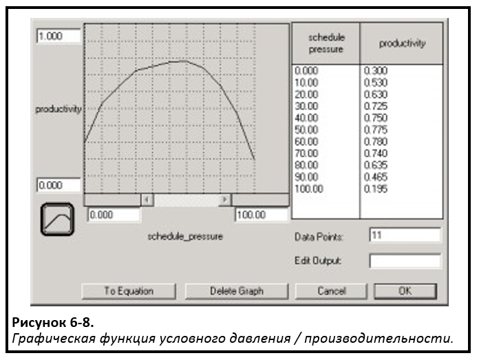

## Глава 6: Конструирование «более интересных» абзацев. *Замкнутое и нелинейное мышление*

### Возможность параметров варьироваться

В 5 главе мы рассмотрели «простые» контуры обратной связи. В этой главе мы рассмотрим два условия, которые определяют контуры как «простые». Мы примем во внимание изменения параметров, связанных с контуром обратной связи, а также расширим связи, из которых состоит контур обратной связи, для привлечения более чем одного "предложения". Как вы увидите в дальнейшем, ослабление этих двух ограничений позволит контурам обратной связи генерировать гораздо *более* богатое разнообразие динамических действий, чем это было возможно при «простых» контурах!

Прежде чем мы продолжим рассматривать связи для создания контуров обратной связи с участием *нескольких* предложений, давайте посмотрим, какое характерное изобилие мы можем вызвать, позволяя изменять параметры в *прямой* структуре контура обратной связи. На рисунке 6-1А изображен простой усиливающий контур обратной связи (как показано на рисунке 6-1 с буквой «R»). Как было описано в 5 главе, если оставить контур действовать самостоятельно, это приведет к тому, что *Инфицированное население* будет всегда расти экспоненциально.

На рисунке 6-1B был добавлен противодействующий контур (как показано на рисунке 6-1 с «C»). Точка соединения между усиливающим и противодействующим контуром находится в переменной *доля зараженных*. Вместо того чтобы оставаться постоянной, на нее теперь воздействует (то есть умножается) «эффект насыщения», который зависит от размера *Незараженного населения*. То, как данная зависимость обнаруживается, иллюстрирует одну из самых мощных функций программного обеспечения STELLA. Но прежде, чем рассматривать эту функцию, я хочу быть уверенным, что вы «видите» противодействующий контур (обозначенный на рисунке 6-1 «C»).

контур работает следующим образом: после того как значение Незараженного населения опускается ниже некоторого порогового уровня, *воздействие насыщения* начинает снижать *долю инфекции*, которая, в свою очередь, замедляет скорость *заражения*. По мере того, как *население, которое еще не инфицировано*, продолжает уменьшаться, воздействие становится все более депрессивным - в конечном счете поток будет *полностью заражен*. Эта взаимосвязь отражает тот факт, что с меньшим количеством людей, которые еще не инфицированы, становится все труднее находить человека, который восприимчив к инфекции (то есть без иммунитета или какой-либо защиты от болезни)! Таким образом, воздействие насыщения приводит к разрыву роста *зараженного населения*. Противодействующий контур «охлаждает» отводящий усиливающий контур. Какой шаблон будет отслеживать *Зараженное население* в результате этого взаимодействия между противодействующим и усиливающим контуром? 

Если вы подумали о «S-образном росте», то вы были правы, это изображено на рисунке 6-2.

Если вы так не подумали, то вот почему вы должны были... В начале моделирования, когда население незараженных людей велико, *доля заражения* находится на самом высоком уровне. Она остается постоянной какое-то время, потому что *воздействие насыщения* еще не «нагнетается» (то есть противодействующий контур оказывает нейтральное воздействие). Это означает, что усиливающий контур работает так, как будто он изолирован, усугубляется с *постоянной* процентной ставкой. Поэтому мы должны ожидать *экспоненциального роста* инфицированной популяции в течение определенного периода времени. И это именно то, что происходит на ранней стадии симуляции. Если вы посмотрите на траекторию, прослеживаемую Инфицированным населением примерно до 7 лет, то можно заметить, что она экспоненциальная. После этого она постепенно начинает прогрессировать медленнее (верхняя часть «S»), пока к концу симуляции она практически не перестает расти.

Итак, вам может быть интересно ... Как эта невидимая маленькая *инфекционная доля* справляется со всей этой магией? Как она может оказывать все большее влияние, а количество *незараженного населения* уменьшаться? Она работает благодаря очень важной и мощной функции в программном обеспечении STELLA. Эта функция называется «графической функцией».

#### Графическая функция

Взгляните на рис. 6-1B. Если вы внимательно посмотрите на *долю инфекционных*, вы увидите знак (хотя и тонкий) его «утери безгрешности» (в свое время он был просто неизменным). Обратите внимание на маленький знак «~» на лице? «~» обозначает «графическую функцию». Графические функции выражают связь между входной переменной и выходной переменной. В частности, они указывают, как изменится выходная переменная при изменении соответствующей входной переменной. Важно отметить, что они выражают двумерные отношения, не прибегая к математике, а скорее используя эскиз с сеткой на нем. По существу, вы *рисуете* отношения, которые вы себе представляете.

Таким образом, графические функции позволяют не-математически склонным людям выражать отношения, которые до сих пор в значительной степени ограничивались областью математики. Конечно, математики также могут использовать графическую функцию, и многие делают это довольно эффективно. Если бы вы дважды щелкнули на переменной *воздействия насыщения*, то увидели бы что-то вроде того, что показано на рисунке 6-3.

Графические функции *не являются* графиками вывода модели во времени. Вместо этого они используются для представления «структурных отношений» внутри модели. Они показывают, как данная переменная изменяется в результате движений какой-либо другой переменной.

В этом случае воздействие насыщения определяется переменной. Переменная, определяющая его - это пропорция *еще незараженного населения* к *пороговому* значению. Значение, принимаемое «воздействием», будет определяться значением, принятым этой пропорцией. Когда количество *еще незараженного населения* не превышает или равно *пороговому значению* (то есть пропорция больше 1.0), «воздействие» будет принимать значение 1.0. Графические функции *сохраняют* свои конечные значения (то есть они *не* экстраполируют кривые за пределы рисунка). Как видно на рисунке 6-3, когда пропорция *еще не зараженного* населения к пороговому значению (которое является константой) опускается ниже 1,0, «воздействие» становится все более удручающим (помните, что «воздействие» было умножено, поэтому меньшее значение означает *более* удручающее воздействие). Когда пропорция падает до 0,2 (то есть еще количество *еще незараженного* населения составляет 20% от *порогового значения*), рост числа инфицированных людей равен нулю, поскольку множитель воздействия будет принимать значение нуля в этой точке.

Как показано на примере, графические функции позволяют контурам обратной связи изменять силу в ходе моделирования. Такие «изменения в силе» называются «сдвигами в доминировании контуров обратной связи». При отсутствии таких сдвигов поведенческий репертуар контуров обратной связи довольно ограничен. При необходимости вспомнить это стоит обратиться к 5 главе еще раз. Всякий раз, когда усиливающий и противодействующий контуры были в действии, - один из них контролировал приток, другой - отток, запас, либо величина запаса росла экспоненциально (всегда), подвергалась экспоненциальному распаду (всегда) или оставалась неизменной (всегда). Это связано с тем, что, когда доли смешивания и опустошение остаются постоянными, преобладает либо усиливающий контур, либо противодействующий контур, либо *ни один* из них не доминирует (поскольку они точно равны по силе). И как только первоначальная обстановка доминирования создается выбором значений параметров, она затем *сохраняется* навсегда, потому что значения параметров не могут измениться! 

Как только мы позволим одному или двум параметрам, определяющим силу соответствующих контуров, меняться, доминирование петли может *сдвинуться*! Например, на предыдущей иллюстрации *усиливающий* контур изначально является доминирующим. Во время его правления *Инфицированное население* растет экспоненциально. Затем, когда количество *еще не зараженного* населения падает ниже порогового значения, значение *противодействующего* контура постепенно увеличивается. И поскольку он все больше нейтрализует *усиливающие* контуры, изменяется картина экспоненциального роста на шаблон «подгонки», характерный для систем с преобладанием *противодействующих* контуров обратной связи. 

Сдвиги в доминировании контуров обратной связи являются одной из вещей, которые заставляют системы генерировать «сюрпризы». Такие сдвиги отвечают за «нелинейные реакции» (обсуждаемые в 1 главе), в которых большие толчки иногда дают едва заметные реакции, а небольшие щекотки могут развязать лавины!

Сдвиги в доминировании петли обратной связи вызваны изменением соответствующих значений параметров (то есть терминов «производительности»), связанных с контурами. В моделях STELLA такие вариации чаще всего реализуются с помощью графической функции. Также эти параметры можно «разделить» с помощью алгоритма типа IF-THEN-ELSE. Это в большинстве случаев является нарушением мысли «10 000 метров». Таким образом, я не буду обращаться к дискретному варианту. *Файлы справки*, связанные с программным обеспечением, содержат подробную информацию о том, как создавать такие выражения. Но, опять же, по большей части, если вы рассматриваете перспективу системного мышления, графическая функция почти всегда будет вашим оружием для создания сдвигов в доминировании контуров обратной связи.

Таким образом, графические функции очень важны для небольших устройств. Формулирование их - это своего рода искусство, но в основном наука. Приложение к этой главе описывает подробнее эту науку. Уделить большее количество времени подробному изучению как механических, так и концептуальных аспектов Приложения - очень хорошая идея!

### Расширение связей для создания контуров обратной связи «множественного предложения»

Вы теперь видели, как послабление допущения о постоянстве по параметрам, определяющим силу контура обратной связи, может обогатить репертуар динамики, которую может проявить система. Следующий пункт послабления будет относиться к «размерам» контуров обратной связи. Все контуры обратной связи, которые мы рассмотрели в 5 главе, и до этого момента в 6 главе, включали в себя только *одно* предложение (хотя в некоторых случаях и составное предложение). Теперь мы готовы рассмотреть, что может случиться, когда мы расширяем связи, составляющие контур обратной связи, чтобы включить *более чем одно* предложение.

Рисунок 6-4 иллюстрирует структуру контура обратной связи с двумя предложениями. Контур *противодействует* природе. Его цель - поддерживать *Запас* на заданном уровне. «Стратегия» для достижения этого заключается в том, чтобы регулировать показатель *рабочей силы* вверх или вниз, чтобы регулировать объем *производства*. Вот как работает контур обратной связи ...

Первоначально *объем продаж* постоянный. *Рабочая сила* находится на том уровне, который заставляет *объем производства* (обратите внимание, что *производительность постоянна*) равняться *объему продаж*. В результате * Запас * остается постоянным на своем «заданном» уровне (цель «зарыта» внутри решения *о найме и увольнении* DPD). Пока * Запас * остается на заданных уровнях, объем *найма и увольнения* останется на нуле. И до тех пор, пока объем *найма / увольнения* остается равным нулю, показатель труда будет оставаться постоянным. Система находится в стационарном состоянии.

 

Но вы знаете, как Системы Мыслители *ненавидят* системы, которые остаются в состоянии покоя. Они хотят видеть динамику! Чтобы уговорить эту систему раскрыть свой материал, мы повысим прежний поток *продаж* до более высокого и постоянного объема. Необходимо мысленно сымитировать то, что, по вашему мнению, будет происходить в ответ на это нарушение. 

Вы узнали шаблон, который вы видите на рисунке 6-5? Если так, браво! Большинство людей этого не могут сделать.

 

Здесь я приведу краткое «анатомическое» объяснение. Но сначала признайте, что эта простейшая маленькая структура создает довольно дикое и запутанное поведение! Связывание предложений через контуры обратной связи даже с *постоянными* параметрами действительно расширяет связанный поведенческий репертуар!

В этом случае происходит... как только рост *продаж* постепенно вырастет (*отток* из * Запас а*), показатель * Запаса* начинает падать, потому что объем *производственного* потока (*приток* в Запас) остается на прежнем статичном уровне, что меньше, чем теперь увеличившийся объем *продаж*. По мере того, как * Запас * падает ниже заданных уровней, наём «вступает в игру». В результате рост *рабочей силы* увеличивает объем *производства*. Однако до тех пор, пока объем *производства* не станет равным объему *продаж*, * Запас * будет продолжать падать. Удостоверьтесь, что вы поняли данный раздел, прежде чем продолжить.

Хорошо, так что все-таки происходит с * Запасом* в момент, когда наем вызвал увеличение запасов *рабочей силы*, чтобы увеличить объем *производства* до такой степени, что теперь он снова равен объему *продаж*?

Если вы сказали, что * Запас * перестает падать... Хорошо! Однако обратите внимание на то, что действительно важно для понимания этой динамики. В тот момент, когда * Запас * перестает падать, он так же далеко, как и всегда, от своего заданного уровня! Вы видите это?

Таким образом, когда объем производства увеличился до такой степени, когда он (как первоначально был) равен объему продаж - необходимость в установившемся состоянии будет достигнута. *Показатель запаса * достигает устойчивого уровня! Таким образом, у нас теперь есть система, которая очень далека от удара! Потоки, связанные с данным запасом, равны в точке, где запасы достигают своего целевого уровня! Это именно то условие, которое должно преобладать для того, чтобы произошло «устойчивое колебание». 

Давайте продолжим разбираться дальше, чтобы вы точно поняли, что происходит. Когда *Запас* будет намного ниже своего заданного уровня (то есть отрицательное несоответствие между ними максимально), уровень найма достигнет максимума. Это означает, что фонд *рабочей силы* расширяется с максимальной скоростью, и, следовательно, *производство* также будет *расти* с максимальной скоростью, и это происходит прямо в точке, где *производство* равно *продаже*. Таким образом, по мере того как объем *рабочей силы* продолжает расширяться, объем *производства* последует его примеру, быстро падая на фоне объема *продаж*. И, как и раньше, *Запас* начнет восстанавливаться (приток в ванну теперь будет превышать отток), и темпы найма будут замедляться.

Однако, пока уровни * Запаса* остаются ниже заданных уровней, процесс найма будет продолжаться, и, следовательно, объем *производства* будет продолжать расти за пределами объема *продаж*. В какой-то момент уровни * Запаса* будут перестроены обратно в точности на заданные уровни - еще одно из условий, необходимых для того, чтобы система снова получила устойчивое состояние. Но на данный момент то система может успокоиться?

Нет, не может. Потому что на данный момент объем *производства*, хотя он и прекратит свое увеличение, будет стоять *выше* объема *продаж*. Это означает, что значение *рабочей силы* слишком велико. Таким образом, в то время как * Запас * будет восстановлен на установившемся уровне, *рабочая сила* будет выше своего установившегося уровня. Ты видишь проблему? Это называется состояние «вне фазы»! И учитывая расположение структуры обратной связи, цель не может вернуться в состояние «в фазе». 

Итог: хотя эта система регулируется *противодействующим* контуром, этот контур не способен вернуть систему в режим покоя. Но он попробует и будет стараться изо всех сил! Но из-за природы противодействующих отношений эта система будет продолжать колебаться в течение целой вечности (или до тех пор, пока батарея вашего ноутбука не сядет, если вы в самолете).

### Объединение переменных параметров и расширенных связи

Итак, как мы можем добиться определенного контроля над этой системой? Противодействующие контуры всегда выигрывают над усиливающими контурами в плане увеличения контроля, поэтому давайте добавим *второй* противодействующий контур в эту систему. Мы сделаем это, разрешив одному из ранее постоянных параметров стать переменным. 

Конкретным параметром, который мы позволяем изменять, является *производительность*. *Производительность*, по сути, определяет *силу* связи между *рабочей силой* и *производственным* потоком (то есть сила противодействующей обратной связи). То есть чем больше значение *производительности*, тем меньше объем *рабочей силы*, который потребуется для увеличения объема *производства* на определенную сумму (поскольку каждая единица рабочей силы будет вносить большую сумму в объем *производства*). И наоборот, меньшее значение *производительности* приведет к ослаблению противодействующих контуров, поскольку это будет означать, что потребуется больше *рабочей силы* для увеличения *производства* на любую заданную сумму. 

Предположим, что мы смогли укрепить противодействующий контур как путем повышения *производительности*, когда необходимо увеличить объем *производства*, так и путем снижения *производительности*, когда этот объем необходимо сократить. Такое изменение происходит естественным образом в большинстве рабочих ситуаций. Нарастание рабочих процессов, как правило, стимулирует фокус, сворачивание и выполнение работы (то есть повышение *производительности*). Положительные отставания позволяют людям пить больше кофе и болтать возле кулера с водой (падение *производительности*).

Чтобы реализовать такую возможность изменения, мы будем полагаться на старого приятеля - графическую функцию. Полученная новая «структура» выглядит так, как представлено на рисунке 6-6.

 

Обратите внимание, что, связывая * Запас * с *производительностью*, мы добавили второй противодействующий контур обратной связи. Этот второй контур работает в согласии с первым, то есть усиливает его! Этот второй контур несет определенную *производственную* нагрузку на увеличение (и уменьшение) объема добывающего потока, поскольку уровни * Запаса* возрастают и падают относительно цели. Например, вместо того чтобы иметь возможность проворачивать *производство* исключительно путем привлечения дополнительной рабочей силы, некоторые из способов увеличения *производства* могут быть достигнуты за счет повышения уровня *производительности*.

Итак, какой эффект, по вашему мнению, наложит этот второй противодействующий контур на поведение системы? Будет ли это усиливать или ослаблять нестабильность, проявляемую системой? И почему? 

Такие вопросы ставят в тупик. Одним из значительных вкладов программного обеспечения STELLA является тот факт, что он обеспечивает проверку интуиции, а также предоставляет средство для построения понимания «почему». Благодаря этому процессу будет развиваться ваша способность к интуитивной динамике, так же, как и ваша способность формулировать связанные «как происходит». На рисунке 6-7 показано, что происходит с поведением системы при добавлении второго контура противодействия.

 

Как показано на рисунке, активация нового контура ослабляет колебания. Простое объяснение состоит в том, что вместо того чтобы показатель *рабочей силы* продолжил расширяться до такой степени, когда *производство* достигает максимума выше *продаж*, *производство* теперь может достичь своего максимума выше продаж до того, как *рабочая сила* достигнет своего максимума (поскольку *производительность также* увеличивает *производство*!). Это означает, что на подъеме будет нанято не так много *рабочей силы*, и, следовательно, на спаде будет не так много необходимости в ней. Это, в свою очередь, означает, что на *следующий* подъем будет нанято еще меньше людей, и тем не менее еще меньше будет значение последующего упадка и так далее. Таким образом, система может постепенно оседать в устойчивое состояние (за исключением дальнейших наружных нарушений).

### Контуры обратной связи, подводя итоги

Контур обратной связи - это гениальная и невероятно мощная «структура». Контуры обратной связи изобилуют физическими, технологическими, естественными и социальными системами. Они позволяют этим системам поддерживать внутренние балансы, а также расти. Они руководят эволюционной адаптацией и катастрофическими крахами. Обратные контуры *самогенерируют* все виды динамического поведения. Начните волновать один, и вы будете приводить в движение постоянную динамическую систему целиком, а не разово. Шаблон, который будет отслеживаться динамикой, зависит от относительной силы различных контуров обратной связи, которые составляют систему, и того, как эти сильные стороны то нарастают, то убывают с течением времени. Графическая функция в программном обеспечении STELLA, выступая в качестве точки соединения между контурами, часто является средством, позволяющим разворачивать такое нарастание и убывание.

Теперь вы хорошо подготовлены (после изучения Приложения к этой главе), чтобы начать захватывать в своих моделях STELLA контуры обратной связи, существующие в реалиях, которые вы хотите представить. Вы увидите больше примеров контуров обратной связи на протяжении всего этого руководства и в моделях, приведенных в качестве образцов, которые сопровождают программное обеспечение. Использование структуры контура обратной связи системы на оперативном уровне является сущностью разницы между строительными моделями с такими инструментами, как электронные таблицы, и использованием программного обеспечения STELLA. Это важная разница!

### Что же дальше?

В следующей главе приведены несколько примеров общих схем контура обратной связи. Вы найдете эти небольшие «инфраструктуры» очень полезными в качестве строительных блоков для заполнения «коротких рассказов», которые вы пишете с помощью программного обеспечения STELLA.

## Приложение: Формирование графических функций

В этом Приложении описываются два принципа, которые следует учитывать при формулировании графических функций, а затем предоставляется «справочное руководство», описывающее шаги, которые следует выполнить при их формулировании. 

### Принцип 1. 
#### Принцип "при прочих равных условиях"

Графические функции используются для определения отношения, которое, как вы и предполагали, существует между двумя и только двумя переменными и взаимодействуют на фоне «при прочих равных условиях» (все остальное сохранялось постоянным). Когда вы рисуете графическую функцию, кривая, которую вы чувствуете, определяет отношения, которые вы пытаетесь представить, наклон этой кривой не должен (в общем) меняться! Если это *так*, подумайте о том, не косвенно ли вы включаете влияние одной или нескольких других переменных в свою формулировку отношений. Давайте разберем пример, чтобы прояснить суть.

*Условное давления* часто приходится на работников, когда проект отстает от графика. Идея заключается в том, что такое давление может заставить людей сосредоточить внимание на поставленной задаче и, следовательно, увеличить их *производительность*, ускоряя проект, и, надеюсь, вернуться к графику. Описание взаимосвязи между уровнями *условного давления* и результирующими уровнями *производительности* обычно происходит примерно так ...

При полном отсутствии *условного давления производительность* меньше, чем может быть, потому что люди не будут хорошо фокусироваться, не испытывая какого-либо давления предстоящего дедлайна. По мере того, как *условное давление* возрастает от нуля, *производительность* увеличивается на некоторое время. Но за пределами определенной точки *условное давление* перестает быть функциональным, потому что оно слишком сильно влияет на рабочих. Реализация данной логики в графической функции даст что-то вроде того, что вы видите на рисунке 6-8. 

 

Совершенно ясно, что это кривая, наклон которой меняет направление. Давайте более подробно рассмотрим предположения, лежащие в основе этого. Как условное давление влияет *непосредственно* на работников? Нет, я имею в виду не какие действия накладывают условное давление на работников, а как оно непосредственно влияет на них? Именно этот последний вопрос вам необходимо задать при формулировании графической функции.

Условное давление обычно принимает вид управляющего проектом, напоминающего работникам о надвигающихся сроках чаще, чем обычно, а также с большей настойчивостью. Фактически это может заставить рабочих предпринять определенные действия. Они могут, например, работать дольше, брать меньше перерывов, сильнее сосредоточиться на поставленных задачах и так далее. Как только они начинают делать подобное, они продолжают процесс уже самостоятельно. Они могут перестать только потому, что они перегорели или им не хватает времени на свою семью или по другим причинам, но не потому, что условное давление увеличивается! 

Поэтому *непосредственное* влияние условного давления на производительность, вероятно, должно увеличить его, хотя воздействие, безусловно, насыщается. Условное давление не может оказать положительного воздействия, а затем в какой-то «волшебной точке» внезапно обратить вспять направление его воздействия! Осознанное изменение направления удара, по сути, связано с неосознанием введения в процесс мышления других вещей (таких как перегорание, ослабление мотивации и так далее), и они не принадлежат к *одной и той же* графической функции!

Если вы не тщательно сортируете такие «другие влияния» на выходной переменной при формулировании отношения графической функции, ваши модели могут давать ошибочные выводы при имитации. Например, на предыдущей иллюстрации, что если рабочие *уже* переживали некоторый уровень перегорания, скажем, из предыдущего проекта. Теперь предположим, что они просто начинают отставать от текущего проекта (то есть было применено давление с нулевым расписанием). Графическая функция, описанная на рисунке 6-8, предполагает, что вы можете *увеличить* производительность труда, применяя некоторое условное давление. Однако очевидно, что это *не* имело бы результата, если бы рабочие уже стали менее успешными и эффективными!

Будьте уверены, что «мысленные эксперименты», которые вы проводите при формулировании графических функций, включают две и только две переменные! Вычеркните «другие влияния» на выходную переменную. 

### Принцип 2. 
#### Подумайте об историческом поле

Второй важный принцип, которого следует придерживаться при формулировании графических функциональных отношений: *Обязательно оценивайте любые отношения по всему своему потенциально реализуемому рабочему диапазону, а не только по диапазону, который, возможно, был исторически наблюдаемым.* Многие люди чувствуют себя тревожно при формулировании отношений графических функций в целом. Частично это объясняется тем, что графические функции часто используются для захвата «слабых» отношений. Но даже когда отношения более ощутимы, например, влияние цены на спрос, люди часто сталкиваются с проблемами, выходящими за пределы исторически сложившихся диапазонов отношений. Например, исторически цена может иметь только диапазон в плюс минус 25% от ее текущей стоимости. Таким образом, это та область, в которой многие люди чувствуют себя комфортно, в том числе в связанной графической функции. «Вне этого диапазона у нас нет массивных эмпирических данных», - это то, что мы часто слышим. 

Только подумайте об этом ... Если вы хотите, чтобы ваша модель могла пролить свет на то, что *может* произойти, если цена упадет до нуля или увеличится на 50%, вы *должны* дать некоторую оценку эластичности цены в этом диапазоне! Зачастую появляются реальные идеи, когда вы управляете системой вне ее исторического рабочего диапазона. Если значения параметров вашей модели (особенно ее графические функциональные отношения) не оцениваются по их полному, потенциально реализуемому, рабочему диапазону, то вы теряете возможность того, чтобы модель вас «удивила»! Результаты модели в этих случаях могут быть «сумасшедшими». Но с моделью STELLA всегда можно узнать, как эти результаты возникают, и поэтому вы всегда можете отделить «сумасшествие» от подлинного «нового понимания». Я был свидетелем последнего достаточно много раз, перед тем как уловить важность принципа номер два.

#### Руководства по эксплуатации для составления графических функций

Давайте теперь рассмотрим некоторые общие рекомендации, которые следует придерживаться при формулировании графических функций. Приведенные ниже руководства выстраиваются четко в последовательность шагов. Следуя этим шагам в представленном порядке, как правило, вы сможете сформулировать правильные отношения графических функций независимо от того, делаете вы это самостоятельно или при групповом обсуждении.

#### Шаг 1. Применить принцип "при прочих равных условиях"

Подумайте только о связи между входной переменной и выходной переменной, о том, чтобы удерживать все остальные переменные, влияющие на переменную выходного параметра.

#### Шаг 2. «Нормализовать» входную переменную

Не всегда необходимо «нормализовать» входную переменную, но довольно часто этот шаг очень полезен, поэтому я его добавлю в свой список.

«Нормализация» выполняется путем деления входной переменной на некоторую *соответствующую* величину. Процентные переменные (например, доля рынка) и переменные индекса (например, переменные с масштабированием 0-100, такие как мотивация, самооценка и выгорание), не обязательно должны быть нормализованы.

Нормализация имеет несколько важных преимуществ. Во-первых, это облегчает движение во входной переменной, поскольку нормализованный диапазон обычно простирается от 0 до 1 или от 0 до 2, а не от 0 до 10000 или от 500 до 5000. Когда диапазон от 0 до 2, гораздо легче думать об изменениях входной переменной в *процентном выражении*. То есть если входная переменная увеличивается от 1 до 1,25, это сразу отразится как увеличение на 25%. Если диапазон входных переменных составляет, скажем, от 0 до 10000, трудно понять, на сколько процентов произойдет увеличение, например, оно может составить от 570 до 730.

Второе преимущество процесса нормализации состоит в том, что он делает соотношение «независимым от масштаба». Если вы использовали *абсолютные* диапазоны для входных переменных, вам придется перекалибровать ваши графические функции в те моменты, когда эти абсолютные диапазоны изменились. Нормализуя, вы преобразуете их в *относительный* масштаб. Например, если вы выбрали значения популяции оленей, вопрос может измениться с «Если население оленей падает до 4 328 ...» до «Если население оленей падает до 50% от значения начала 2001 года." Выбор подходящей «нормализующей» переменной часто занимает немного времени. Иногда простое разделение входной переменной на ее начальное значение (то есть его значение в начале моделирования) работает достаточно хорошо. В других случаях деление на переменную, которая имеет разные единицы измерения, работает лучше, например, оленя на волка или граммы на миллилитры.

#### Шаг 3. Установите диапазоны для входных и выходных переменных (примените принцип 2)

Не забудьте установить не только диапазоны, позволяющие полностью перемещать как входные, так и выходные переменные, но и движение, которое исторически наблюдалось. Помните, что графические функции не экстраполируются вне их определенных диапазонов. Вместо этого они сохраняют первые и последние выходные значения, которые были назначены. Если вы не расширяете эти диапазоны, чтобы охватить все возможное передвижение, то ограничиваете пространство для создания прообраза, созданного моделью!

#### Шаг 4. Определите направление и природу наклона

Помните, что если наклон кривой, который вы определили, *изменил* направление, то вы, вероятно, включили в свое мышление более одной входной переменной. Если наклон вашей графической функции меняет направление, тщательно подумайте о своих предположениях, а затем поделитесь сделанным с несколькими другими людьми. 

Под «природой» наклона я имею в виду ... Разве кривая подвергается изменениям? Являются ли они линейными? S-образными? И так далее. Создайте подробный поведенческий аргумент для поддержки вашего выбора кривой и включите его в кэш документа диалогового окна графического выражения, чтобы другие могли понять ваше обоснование.

#### Шаг 5. Определите экстремальные точки и, если необходимо, точку «1,1»

Начните с минимальной x-точки (входного значения) и установите соответствующую y-точку (выходное значение). Затем сделайте то же самое для максимальных x- и y-точек. В некоторых случаях, особенно если вы используете переменные «impact of...», вы также сможете установить так называемую «нормальную точку» или «1,1». Когда переменная «impact of ...» (обычно «множитель») принимает значение 1.0, это означает, что она оказывает *нейтральное* воздействие. Нормализованная входная переменная обычно принимает значение 1 в начальном состоянии, когда система находится в стационарном состоянии. 

#### Шаг 6. Нарисуйте ровную кривую через установленные точки

Следует провести *плавную* кривую линию через две крайние точки и "нормальную", если она имеется. Если у вас есть несколько «магических точек» на вашей кривой (некоторые точки, в которых происходят резкие разрывы или направление изменения наклона), то стоит очень хорошо подумать, чтобы убедиться, что вы сможете оправдать нарисованное вами. рассказов.
