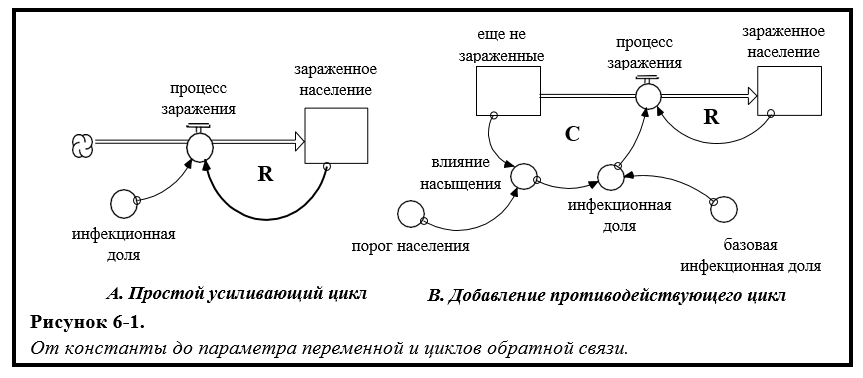
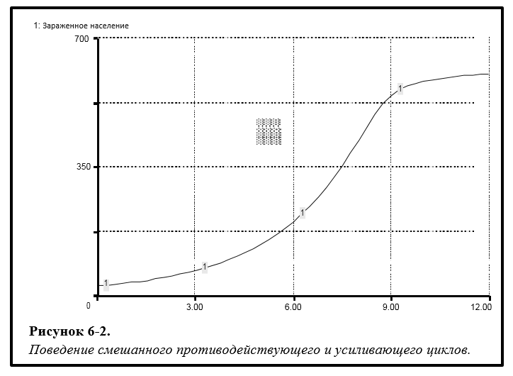
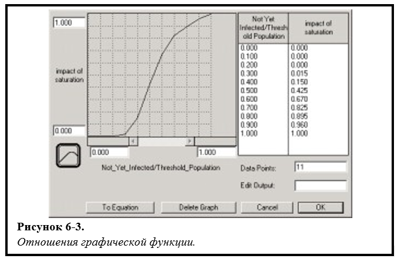
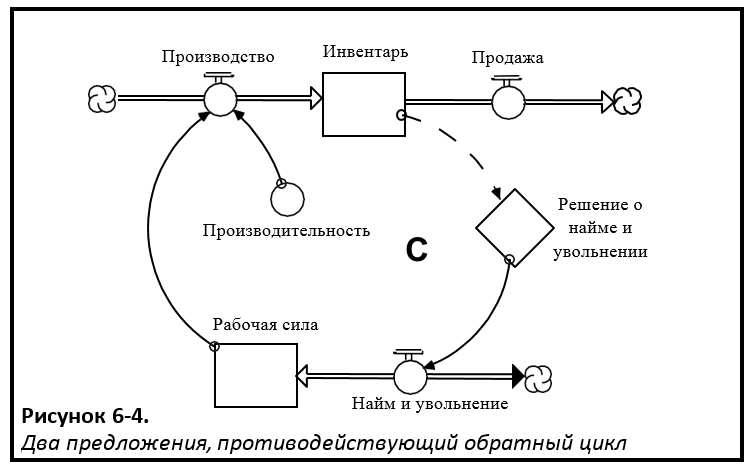
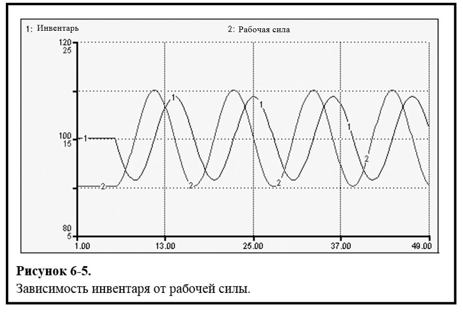
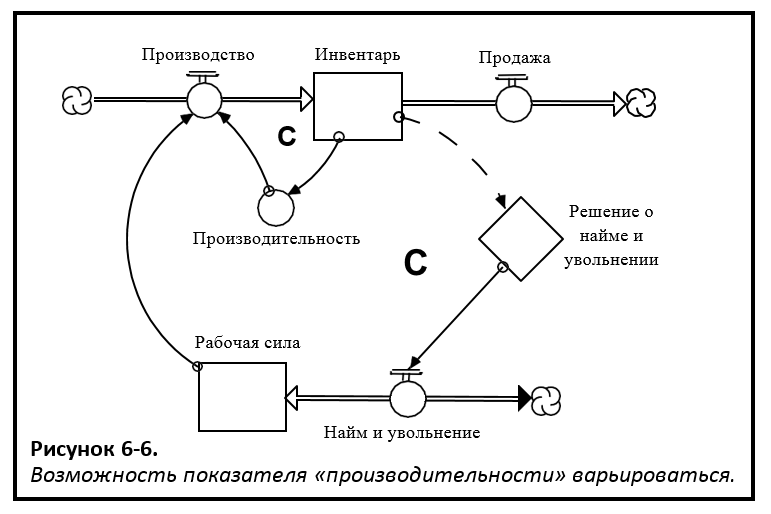
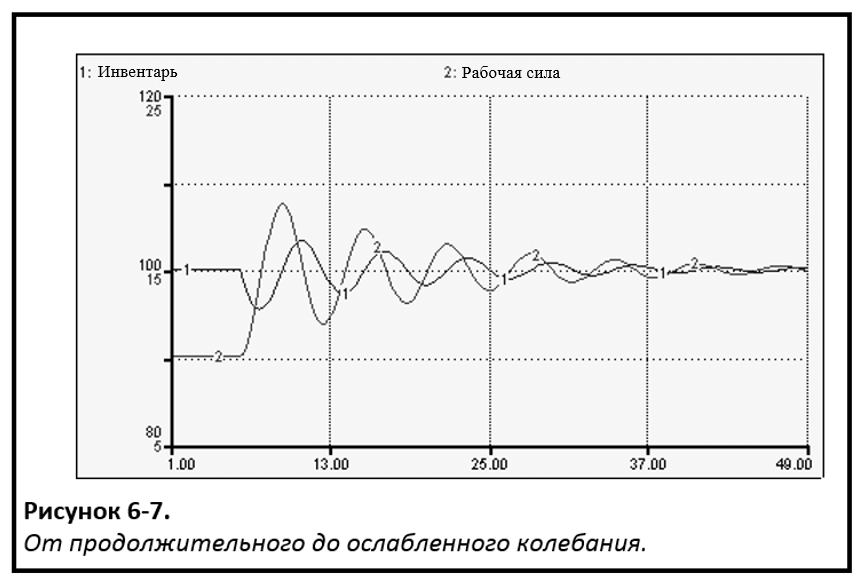

## Глава 6: Конструирование «более интересных» абзацев. *Замкнутое и нелинейное мышление*

### Возможность параметров варьироваться

В 5 главе мы рассмотрели «простые» циклы обратной связи. В этой главе мы рассмотрим два условия, которые определяют циклы как «простые». Мы примем во внимание изменения параметров, связанных с циклом обратной связи, а также расширим ссылки, из которых состоит цикл обратной связи, для привлечения более чем одного "предложения". Как вы увидите в дальнейшем, ослабление этих двух ограничений позволит циклам обратной связи генерировать гораздо *более* богатое разнообразие динамических действий, чем это было возможно при «простых» циклах!

Прежде чем мы продолжим рассматривать ссылки для создания циклов обратной связи с участием *нескольких* предложений, давайте посмотрим, какое характерное изобилие мы можем вызвать, позволяя изменять параметры в *прямой* структуре цикла обратной связи. На рисунке 6-1А изображен простой усиленный цикл обратной связи (как показано на рисунке 6-1 с буквой «R»). Как было описано в 5 главе, если оставить цикл действовать самостоятельно, это приведет к тому, что *Инфицированное население* будет всегда расти экспоненциально.

На рисунке 6-1B был добавлен противодействующий цикл (как показано на рисунке 6-1 с «C»). Точка соединения между усиливающим и противодействующим циклом находится в переменной *доля зараженных*. Вместо того чтобы оставаться постоянной, на нее теперь воздействует (то есть умножается) «эффект насыщения», который зависит от размера *Незараженного населения*. То, как данная зависимость обнаруживается, иллюстрирует одну из самых мощных функций программного обеспечения STELLA. Но прежде чем рассматривать эту функцию, я хочу быть уверенным, что вы «видите» противодействующий цикл (обозначенный на рисунке 6-1 «C»).

Цикл работает следующим образом: после того как значение Незараженного населения опускается ниже некоторого порогового уровня, *воздействие насыщения* начинает снижать *долю инфекции*, которая, в свою очередь, замедляет скорость *заражения*. По мере того как *население, которое еще не инфицировано*, продолжает уменьшаться, воздействие становится все более депрессивным - в конечном счете поток будет *полностью заражен*. Эта взаимосвязь отражает тот факт, что с меньшим количеством людей, которые еще не инфицированы, становится все труднее находить человека, который восприимчив к инфекции (то есть без иммунитета или какой-либо защиты от болезни)! Таким образом, воздействие насыщения приводит к разрыву роста *зараженного населения*. Противодействующий цикл «охлаждает» отводящий усиливающий цикл. Какой шаблон будет отслеживать *Зараженное население* в результате этого взаимодействия между противодействующим и усиливающим циклом? 

Если вы подумали о «S-образном росте», то вы были правы, это изображено на рисунке 6-2.

Если вы так не подумали, то вот почему вы должны были... В начале моделирования, когда население незараженных людей велико, *доля заражения* находится на самом высоком уровне. Она остается постоянной какое-то время, потому что *воздействие насыщения* еще не «нагнетается» (то есть противодействующий цикл оказывает нейтральное воздействие). Это означает, что усиливающий цикл работает так, как будто он изолирован, усугубляется с *постоянной* процентной ставкой. Поэтому мы должны ожидать *экспоненциального роста* инфицированной популяции в течение определенного периода времени. И это именно то, что происходит на ранней стадии симуляции. Если вы посмотрите на траекторию, прослеживаемую Инфицированным населением примерно до 7 лет, то можно заметить, что она экспоненциальна. После этого она постепенно прогрессирует медленнее (верхняя часть «S»), пока к концу симуляции она практически не перестает расти.

Итак, вам может быть интересно ... Как эта невидимая маленькая *инфекционная доля* справляется со всей этой магией? Как она может оказывать все большее влияние, а количество *незараженного населения* уменьшаться? Она работает благодаря очень важной и мощной функции в программном обеспечении STELLA. Эта функция называется «графической функцией».

#### Графическая функция

Взгляните на рис. 6-1B. Если вы внимательно посмотрите на *долю инфекционных*, вы увидите знак (хотя и тонкий) его «утери безгрешности» (в свое время он был просто неизменным). Обратите внимание на маленький знак «~» на лице? «~» обозначает «графическую функцию». Графические функции выражают связь между входной переменной и выходной переменной. В частности, они указывают, как изменится выходная переменная при изменении соответствующей входной переменной. Важно отметить, что они выражают двумерные отношения, не прибегая к математике, а скорее используя эскиз с сеткой на нем. По существу, вы *рисуете* отношения, которые вы себе представляете.

Таким образом, графические функции позволяют не-математически склонным людям выражать отношения, которые до сих пор в значительной степени ограничивались областью математики. Конечно, математики также могут использовать графическую функцию, и многие делают это довольно эффективно. Если бы вы дважды щелкнули на переменной *воздействия насыщения*, то увидели бы что-то вроде того, что показано на рисунке 6-3.

Графические функции *не являются* графиками вывода модели во времени. Вместо этого они используются для представления «структурных отношений» внутри модели. Они показывают, как данная переменная изменяется в результате движений какой-либо другой переменной.

В этом случае воздействие насыщения определяется переменной. Переменная, определяющая его, - это пропорция *еще незараженного населения* к *пороговому* значению. Значение, принимаемое «воздействием», будет определяться значением, принятым этой пропорцией. Когда количество *еще незараженного населения* не превышает или равно *пороговому значению* (то есть пропорция больше 1.0), «воздействие» будет принимать значение 1.0. Графические функции *сохраняют* свои конечные значения (то есть они *не* экстраполируют кривые за пределы рисунка). Как видно на рисунке 6-3, когда пропорция *еще не зараженного* населения к пороговому значению (которое является константой) опускается ниже 1,0, «воздействие» становится все более удручающим (помните, что «воздействие» было умножено, поэтому меньшее значение означает *более* удручающее воздействие). Когда пропорция падает до 0,2 (то есть еще количество *еще незараженного* населения составляет 20% от *порогового значения*), рост числа инфицированных людей равен нулю, поскольку множитель воздействия будет принимать значение нуля в этой точке.

Как показано на примере, графические функции позволяют циклам обратной связи изменять силу в ходе моделирования. Такие «изменения в силе» называются «сдвигами в доминировании циклов обратной связи». При отсутствии таких сдвигов поведенческий репертуар циклов обратной связи довольно ограничен. При необходимости вспомнить это стоит обратиться к 5 главе еще раз. Всякий раз когда усиливающий и противодействующий циклы были в действии, - один из них контролировал приток, другой - отток, запас, либо величина запаса росла экспоненциально (всегда), подвергалась экспоненциальному распаду (всегда) или оставалась неизменной (всегда). Это связано с тем, что когда доли смешивания и дренирования остаются постоянными, преобладает либо усиливающий цикл, либо противодействующий цикл, либо *ни один* из них не доминирует (поскольку они точно равны по силе). И как только первоначальная обстановка доминирования создается выбором значений параметров, она затем *сохраняется* навсегда, потому что значения параметров не могут измениться! 

Как только мы позволим одному или двум параметрам, определяющим силу соответствующих циклов, меняться, доминирование петли может *сдвинуться*! Например, на предыдущей иллюстрации *усиливающий* цикл изначально является доминирующим. Во время его правления *Инфицированное население* растет экспоненциально. Затем, когда количество *еще не зараженного* населения падает ниже порогового значения, значение *противодействующего* цикла постепенно увеличивается. И поскольку он все больше нейтрализует *усиливающие* циклы, изменяется картина экспоненциального роста на шаблон «подгонки», характерный для систем с преобладанием *противодействующих* циклов обратной связи. 

Сдвиги в доминировании циклов обратной связи являются одной из вещей, которые заставляют системы генерировать «сюрпризы». Такие сдвиги отвечают за «нелинейные реакции» (обсуждаемые в 1 главе), в которых большие толчки иногда дают едва заметные реакции, а небольшие щекотки могут развязать лавины!

Сдвиги в доминировании петли обратной связи вызваны изменением соответствующих значений параметров (то есть терминов «производительности»), связанных с циклами. В моделях STELLA такие вариации чаще всего реализуются с помощью графической функции. Также эти параметры можно «разделить» с помощью алгоритма типа IF-THEN-ELSE. Это в большинстве случаев является нарушением мысли «10 000 метров». Таким образом, я не буду обращаться к дискретному варианту. *Файлы справки*, связанные с программным обеспечением, содержат подробную информацию о том, как создавать такие выражения. Но, опять же, по большей части, если вы рассматриваете перспективу системного мышления, графическая функция почти всегда будет вашим оружием для создания сдвигов в доминировании циклов обратной связи.

Таким образом, графические функции очень важны для небольших устройств. Формулирование их - это своего рода искусство, но в основном наука. Приложение к этой главе описывает подробнее эту науку. Уделить большее количество времени подробному изучению как механических, так и концептуальных аспектов Приложения - очень хорошая идея!

###Расширение ссылок для создания циклов обратной связи «множественного предложения»

Вы теперь видели, как послабление допущения о постоянстве по параметрам, определяющим силу цикла обратной связи, может обогатить репертуар динамики, которую может проявить система. Следующий пункт послабления будет относиться к «размерам» циклов обратной связи. Все циклы обратной связи, которые мы рассмотрели в 5 главе, и до этого момента в 6 главе, включали в себя только *одно* предложение (хотя в некоторых случаях и составное предложение). Теперь мы готовы рассмотреть, что может случиться, когда мы расширяем ссылки, составляющие цикл обратной связи, чтобы включить *более чем одно* предложение.

Рисунок 6-4 иллюстрирует структуру цикла обратной связи с двумя предложениями. Цикл *противодействует* природе. Его цель - поддерживать *Инвентарь* на заданном уровне. «Стратегия» для достижения этого заключается в том, чтобы регулировать показатель *рабочей силы* вверх или вниз, чтобы регулировать объем *производства*. Вот как работает цикл обратной связи ...

Первоначально *объем продаж* постоянный. *Рабочая сила* находится на том уровне, который заставляет *объем производства* (обратите внимание, что *производительность постоянна*) равняться *объему продаж*. В результате *Инвентарь* остается постоянным на своем «заданном» уровне (цель «зарыта» внутри решения *о найме и увольнении* DPD). Пока *Инвентарь* остается на заданных уровнях, объем *найма и увольнения* останется на нуле. И до тех пор пока объем *найма / увольнения* остается равным нулю, показатель труда будет оставаться постоянным. Система находится в стационарном состоянии.

 

Но вы знаете, как Системы Мыслители *ненавидят* системы, которые остаются в состоянии покоя. Они хотят видеть динамику! Чтобы уговорить эту систему раскрыть свой материал, мы повысим прежний поток *продаж* до более высокого и постоянного объема. Необходимо мысленно сымитировать то, что, по вашему мнению, будет происходить в ответ на это нарушение. 

Вы узнали шаблон, который вы видите на рисунке 6-5? Если так, браво! Большинство людей этого не могут сделать.

 

Здесь я приведу краткое «анатомическое» объяснение. Но сначала признайте, что эта простейшая маленькая структура создает довольно дикое и запутанное поведение! Связывание предложений через циклы обратной связи даже с *постоянными* параметрами действительно расширяет связанный поведенческий репертуар!

В этом случае происходит... как только рост *продаж* постепенно вырастет (*отток* из *Инвентаря*), показатель *Инвентаря* начинает падать, потому что объем *производственного* потока (*приток* в Инвентарь) остается на прежнем статичном уровне, что меньше чем теперь увеличившийся объем *продаж*. По мере того как *Инвентарь* падает ниже заданных уровней, наём «вступает в игру». В результате рост *рабочей силы* увеличивает объем *производства*. Однако до тех пор пока объем *производства* не станет равным объему *продаж*, *Инвентарь* будет продолжать падать. Удостоверьтесь, что вы поняли данный раздел, прежде чем продолжить.

Хорошо, так что все-таки происходит с *Инвентарем* в момент, когда наем вызвал увеличение запасов *рабочей силы*, чтобы увеличить объем *производства* до такой степени, что теперь он снова равен объему *продаж*?

Если вы сказали, что *Инвентарь* перестает падать... Хорошо! Однако обратите внимание на то, что действительно важно для понимания этой динамики. В тот момент, когда *Инвентарь* перестает падать, он так же далеко, как и всегда, от своего заданного уровня! Вы видите это?

Таким образом, когда объем производства увеличился до такой степени, когда он (как первоначально был) равен объему продаж - необходимость в установившемся состоянии будет достигнута. *Показатель инвентаря* достигает устойчивого уровня! Таким образом, у нас теперь есть система, которая очень далека от удара! Потоки, связанные с данным запасом, равны в точке, где запасы достигают своего целевого уровня! Это именно то условие, которое должно преобладать для того, чтобы произошло «устойчивое колебание». 

Давайте продолжим разбираться дальше, чтобы вы точно поняли, что происходит. Когда *Инвентарь* будет намного ниже своего заданного уровня (то есть отрицательное несоответствие между ними максимально), уровень найма достигнет максимума. Это означает, что фонд *рабочей силы* расширяется с максимальной скоростью, и, следовательно, *производство* также будет *расти* с максимальной скоростью, и это происходит прямо в точке, где *производство* равно *продаже*. Таким образом, по мере того как объем *рабочей силы* продолжает расширяться, объем *производства* последует его примеру, быстро падая на фоне объема *продаж*. И, как и раньше, *Инвентарь* начнет восстанавливаться (приток в ванну теперь будет превышать отток), и темпы найма будут замедляться.

Однако, пока уровни *Инвентаря* остаются ниже заданных уровней, процесс найма будет продолжаться, и, следовательно, объем *производства* будет продолжать расти за пределами объема *продаж*. В какой-то момент уровни *Инвентаря* будут перестроены обратно в точности на заданные уровни - еще одно из условий, необходимых для того, чтобы система снова получила устойчивое состояние. Но на данный момент то система может успокоиться?

Нет, не может. Потому что на данный момент объем *производства*, хотя он и прекратит свое увеличение, будет стоять *выше* объема *продаж*. Это означает, что значение *рабочей силы* слишком велико. Таким образом, в то время как *Инвентарь* будет восстановлен на установившемся уровне, *рабочая сила* будет выше своего установившегося уровня. Ты видишь проблему? Это называется состояние «не в фазе»! И учитывая расположение структуры обратной связи, цель не может вернуться в состояние «в фазе». 

Итог: хотя эта система регулируется *противодействующим* контуром, этот цикл не способен вернуть систему в режим покоя. Но он попробует и будет стараться изо всех сил! Но из-за природы противодействующих отношений эта система будет продолжать колебаться в течение целой вечности (или до тех пор, пока батарея вашего ноутбука не сядет, если вы на самолете).

###Объединение переменных параметров и расширенных ссылок

Итак, как мы можем добиться определенного контроля над этой системой? Противодействующие циклы всегда выигрывают над усиливающими циклами в плане увеличения контроля, поэтому давайте добавим *второй* противодействующий цикл в эту систему. Мы сделаем это, разрешив одному из ранее постоянных параметров стать переменным. 

Конкретным параметром, который мы позволяем изменять, является *производительность*. *Производительность*, по сути, определяет *силу* связи между *рабочей силой* и *производственным* потоком (то есть сила противодействующей обратной связи). То есть чем больше значение *производительности*, тем меньше объем *рабочей силы*, который потребуется для увеличения объема *производства* на определенную сумму (поскольку каждая единица рабочей силы будет вносить большую сумму в объем *производства*). И наоборот, меньшее значение *производительности* приведет к ослаблению противодействующих циклов, поскольку это будет означать, что потребуется больше *рабочей силы* для увеличения *производства* на любую заданную сумму. 

Предположим, что мы смогли укрепить противодействующий цикл как путем повышения *производительности*, когда необходимо увеличить объем *производства*, так и путем снижения *производительности*, когда этот объем необходимо сократить. Такое изменение происходит естественным образом в большинстве рабочих ситуаций. Нарастание рабочих процессов, как правило, стимулирует фокус, сворачивание и выполнение работы (то есть повышение *производительности*). Положительные отставания позволяют людям пить больше кофе и болтать возле автомата с водой (падение *производительности*).

Чтобы реализовать такую возможность изменения, мы будем полагаться на старого приятеля - графическую функцию. Полученная новая «структура» выглядит так, как представлено на рисунке 6-6.

 

Обратите внимание, что, связывая *Инвентарь* с *производительностью*, мы добавили второй противодействующий цикл обратной связи. Этот второй цикл работает в согласии с первым, то есть усиливает его! Этот второй цикл несет определенную *производственную* нагрузку на увеличение (и уменьшение) объема добывающего потока, поскольку уровни *Инвентаря* возрастают и падают относительно цели. Например, вместо того чтобы иметь возможность проворачивать *производство* исключительно путем привлечения дополнительной рабочей силы, некоторые из способов увеличения *производства* могут быть достигнуты за счет повышения уровня *производительности*.

Итак, какой эффект, по вашему мнению, наложит этот второй противодействующий цикл на поведение системы? Будет ли это усиливать или ослаблять нестабильность, проявляемую системой? И почему? 

Такие вопросы ставят в тупик. Одним из значительных вкладов программного обеспечения STELLA является тот факт, что он обеспечивает проверку интуиции, а также предоставляет средство для построения понимания «почему». Благодаря этому процессу будет развиваться ваша способность к интуитивной динамике, так же как и ваша способность формулировать связанные «как происходит». На рисунке 6-7 показано, что происходит с поведением системы при добавлении второго цикла противодействия.

 

Как показано на рисунке, активация нового цикла ослабляет колебания. Простое объяснение состоит в том, что вместо того чтобы показатель *рабочей силы* продолжил расширяться до такой степени, когда *производство* достигает максимума выше *продаж*, *производство* теперь может достичь своего максимума выше продаж до того, как *рабочая сила* достигнет своего максимума (поскольку *производительность также* увеличивает *производство*!). Это означает, что на подъеме будет нанято не так много *рабочей силы*, и, следовательно, на спаде будет не так много необходимости в ней. Это, в свою очередь, означает, что на *следующий* подъем будет нанято еще меньше людей, и тем не менее еще меньше будет значение последующего упадка и так далее. Таким образом, система может постепенно оседать в устойчивое состояние (за исключением дальнейших наружных нарушений).

###Циклы обратной связи, подводя итоги

Цикл обратной связи - это гениальная и невероятно мощная «структура». Циклы обратной связи изобилуют физическими, технологическими, естественными и социальными системами. Они позволяют этим системам поддерживать внутренние балансы, а также расти. Они руководят эволюционной адаптацией и катастрофическими крахами. Обратные циклы *самогенерируют* все виды динамического поведения. Начните волновать один, и вы будете приводить в движение постоянную динамическую систему целиком, а не разово. Шаблон, который будет отслеживаться динамикой, зависит от относительной силы различных циклов обратной связи, которые составляют систему, и того, как эти сильные стороны то нарастают, то убывают с течением времени. Графическая функция в программном обеспечении STELLA, выступая в качестве точки соединения между циклами, часто является средством, позволяющим разворачивать такое нарастание и убывание.

Теперь вы хорошо подготовлены (после изучения Приложения к этой главе), чтобы начать захватывать в своих моделях STELLA циклы обратной связи, существующие в реалиях, которые вы хотите представить. Вы увидите больше примеров циклов обратной связи на протяжении всего этого руководства и в моделях, приведенных в качестве образцов, которые сопровождают программное обеспечение. Использование структуры цикла обратной связи системы на оперативном уровне является сущностью разницы между строительными моделями с такими инструментами, как электронные таблицы, и использованием программного обеспечения STELLA. Это важная разница!

###Что же дальше?

В следующей главе приведены несколько примеров общих схем цикла обратной связи. Вы найдете эти небольшие «инфраструктуры» очень полезными в качестве строительных блоков для заполнения «коротких рассказов», которые вы пишете с помощью программного обеспечения STELLA.
