## Глава 7: Короткие сюжетные темы. *Общие инфраструктуры*.

Эта глава завершает раздел, начатый в 2 главе, представляя несколько «коротких сюжетных тем» - набор из пяти общих *инфраструктур*, которые могут служить ядром для моделей, построенных вами. Каждый из них построен из комбинации абзацев. Каждый из них порождает собственное интересное динамическое поведение. Мы используем эти инфраструктуры во многих из построенных нами моделях. Мы призываем вас делать то же самое, когда это необходимо.

Инфраструктуры располагаются в форме шаблона и содержатся в виде моделей STELLA в папке *«Вступление в системное мышление»*. В этой папке вы найдете шаблоны для следующих инфраструктур:

•	Перегрузка и сбой
•	Скользкое /липкое восприятие
•	Главная цепь
•	Отслеживание атрибутов
•	Относительная привлекательность

Для каждой инфраструктуры я предоставлю...

•	Предложения по использованию
•	Описание структуры
•	Объяснение динамического поведения
•	Некоторые вариации

## Перегрузка и сбой

### Предложения по использованию
Многие физические, биологические и социальные системы не обеспечивают плавного перехода от роста к устойчивому состоянию. Вместо этого они быстро растут, достигают пика, а затем разрушаются до более низкого стационарного значения, что в некоторых случаях является исчезновением.

### Описание структуры
На рисунке 7-1 показана простая структура перегрузки и сбоя.

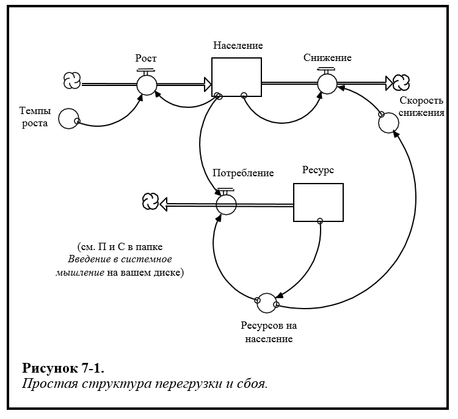 

Население потребляет невозобновляемый ресурс. В результате дефицит ресурса приводит к разрушению населения. Восстановление невозможно, поскольку ресурс не возобновляется.

### Описание поведения
На рисунке 7-2 показана схема поведения с перегрузкой и сбоем. Как видно на рисунке, фаза роста схемы очень похожа на S-образный рост. Вначале можно наблюдать быстрый рост, показатель *ресурса* изобилует, поэтому процесс усугубления доминирует над поведением. По мере того как показатель *ресурса* снижается, цикл смертности приобретает силу. Рост замедляется, когда *население* приближается к своему максимальному значению. Но показатель *населения* не может быть устойчивым, потому что *ресурс* будет по-прежнему истощаться, если есть какое-нибудь количество *населения*, потребляющее его. По мере того как *ресурс* продолжает неуклонно снижаться, *темп истощения* увеличивается за счет *показателей прироста*. Таким образом, отток из *населения* становится больше, чем приток, и он всегда будет оставаться таким.

Три кривые показаны на рисунке 7-2. Первый - это базовый случай. Вторая и третья кривые были сконструированы удвоением, а затем утроением начального количества *ресурса*. Заметьте, что делая так, даже близко не приближаетесь к удвоению или утроению количества времени перед тем, как система взорвется. Это потому что процессы усугубления генерируют экспоненциальный, а не линейный рост! Увеличение начального объема ресурсов просто позволяет усугублять работу в течение более длительного времени. Для экспоненты не требуется много времени, чтобы вырваться из-под контроля.

### Вариации

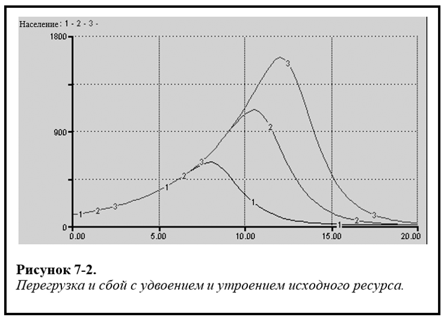 

На рисунке 7-3 приведены успешные вариации общей структуры перегрузки и сбоя. Он позволяет регенерировать ресурс, но скорость регенерации *снижается* по мере *снижения* уровня ресурса (например, окружение деревьев оленем). Эта структура может генерировать отдачу от сбоя в определенных ситуациях, которую вы увидите, если запустите связанную модель. Для того чтобы произошла отдача, важно, чтобы *ресурсы по умолчанию* достигли нуля, до того как *ресурс* достигнет нуля. В противном случае, когда *ресурс* достигнет нуля, система не имеет оснований для регенерации. 

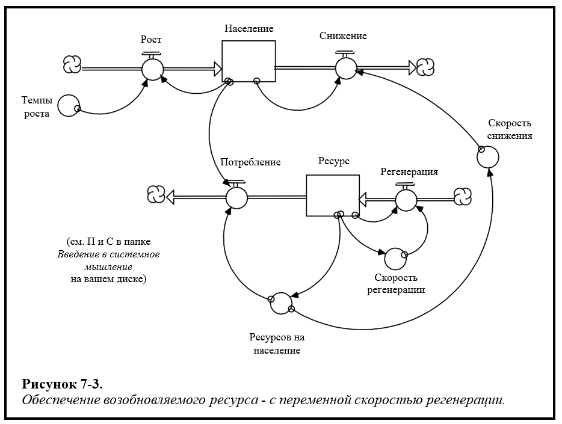 

## Скользкое /липкое восприятие

### Предложения по использованию 
Когда есть асимметрия в скорости, с которой настроены восприятия, эта структура может захватывать ее хорошо, без необходимости в большом техническом волшебстве. Например, когда потребители узнают о проблеме качества с продуктом. Как правило, они очень быстро корректируют свое восприятие качества продукта в негативную сторону. Затем, когда компания, производящая продукт, исправляет проблему качества, для потребителей часто требуется намного больше времени, чтобы перенастроить их восприятие обратно в положительную сторону. То же самое часто происходит, скажем, с восприятием репутации человека. Если человек «испортит» ее, многие довольно быстро станут негативно воспринимать характера человека, и ему потребуется много доказательств, чтобы вернуть прежние восприятия. 

### Описание структуры
Скользкая / липкая структура изображена на рисунке 7-4. Проницательный наблюдатель быстро распознает его как шаблон регулировки запаса с одним «недостатком». *Время настройки* - это переменная, а не *константа*. В частности, *время настройки* зависит от отношения между *воспринимаемым состоянием* и *фактическим состоянием*. Если *фактическое состояние* было меньше, чем *воспринимаемое состояние*, время настройки будет небольшим, предполагая, что вы хотите захватить процесс восприятия, который скользил *вниз*. Если *фактическое состояние* было больше, чем предполагалось, *время настройки* будет большим - процесс восприятия будет "липнуть вверх". 

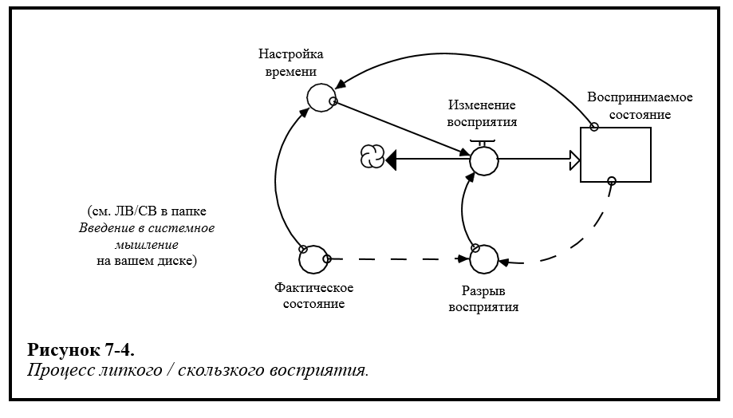 

### Описание поведения
Подобное поведение, созданное этой инфраструктурой, показано на рисунке 7-5. То, что изображено, - это отклонение от начального установившегося состояния до 40% -ного увеличения шага и уменьшения ступени в *фактическом состоянии*. Как вы можете видеть, два ответа *несимметричны*. Регулировка вниз выполняется в течение нескольких периодов времени (скользкая), в то время как корректировка вверх занимает почти 50 периодов времени для завершения (липкая). Если вы посмотрите на фактическую модель на своем диске, вы заметите использование некоторой алгебры логики для определения *времени настройки*.

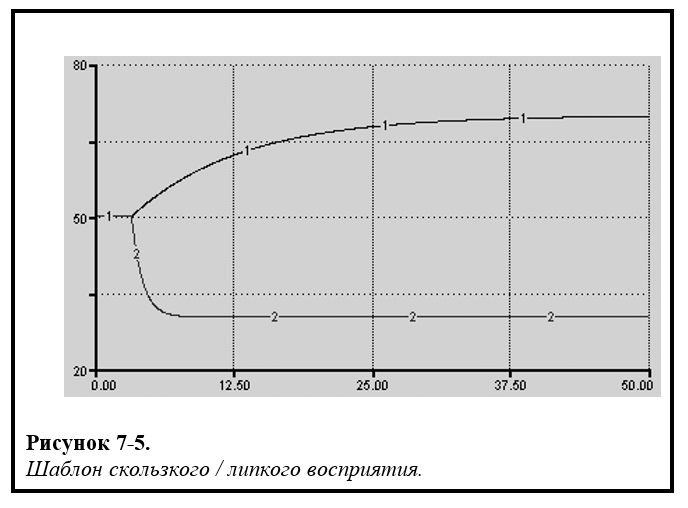 

### Вариации
Один из вариантов этой общей инфраструктуры заключается в том, чтобы позволить *времени настройки* быть представленным графической функцией, а не определять ее с помощью алгебры логики. Это позволит регулировать скорость настройки более непрерывно, а не просто быть одним значением, если фактическое меньше воспринимаемого и другое значение в противном случае.  

## Главная цепь

### Предложения по использованию
Инфраструктура *главной цепи*, также называемой «спинной мозг», весьма полезна всякий раз, когда вы хотите представить последовательность этапов, через которые проходит материал. Вот некоторые из многих примеров: последовательность фаз, которые растение или животное проходит по мере своего роста; психологическое состояния людей, которые проходят через путь к принятию потери или неудачи; продвижение людей по карьерной лестнице; и этапы рыночной инновации, поскольку она «созревает».

### Описание структуры
На рисунке 7-6 показано общее использование инфраструктуры главной цепи: представление процесса старения. 

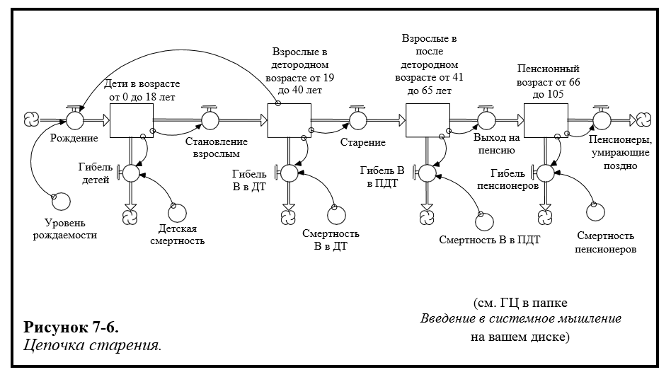 

В этой конфигурации цепочка резервуаров подается в начало контура одним потоком, *рождаясь*. Два оттока истощают каждый резервуар. Первый - это поток, который перемещает материал на следующую «фазу» (в данном случае - возрастная категория). Второй - выходной поток, который истощает материал из цепи. Связанный с каждым потоком выход - удельный коэффициент смертности. Обратите внимание, что все оттоки в цепочке представлены с использованием шаблона «Осушения». 

### Описание поведения
Основные цепи имеют интересную характерную модель поведения. В стационарном состоянии они будут распределять свое общее содержание среди запасов в цепочке пропорционально среднему времени пребывания, связанному с каждым запасом. Среднее время пребывания каждого запаса определяется как некоторая смесь его сквозных и выходных «временных констант».

График на рисунке 7-7 показывает поведение иллюстративной основной цепи из начальной точки. В момент номер 5 уровень смертности, связанный с последним запасом в цепочке, снижается. Это приводит к увеличению среднего времени пребывания, связанного с этим запасом (люди остаются на складе в среднем на более длительный период времени). В результате, как показано на рисунке, процент от общей численности населения в последнем классе увеличивается до нового, более высокого, установившегося уровня.

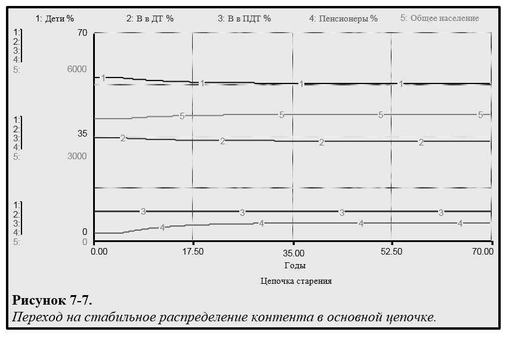 

### Вариации
В «классической» форме основная цепь питается притоком только в первый запас в цепочке. Добавление притока в любой из других запасов - один из способов изменить классическую структуру. Другой вариант - заменить резервуары конвейерами. Наконец, во многих ситуациях параметры, связанные с процессами осушения (то есть осушающие доли), изменяются, а не остаются постоянными.

## Отслеживание атрибутов

### Предложения по использованию
Инфраструктура *отслеживания атрибутов* полезна всякий раз, когда вы хотите «отслеживать» атрибут, связанный с запасом. Структура создает движение «экспоненциальной средней» атрибута. В отличие от среднего арифметического расчета, который взвешивает каждое число, попадающее в него в равной степени, экспоненциальное среднее дает постепенно меньший вес для дальнейшего возврата во временные числа, используемые в расчете.

### Описание структуры
На рисунке 7-8 показана структура отслеживания основных атрибутов.

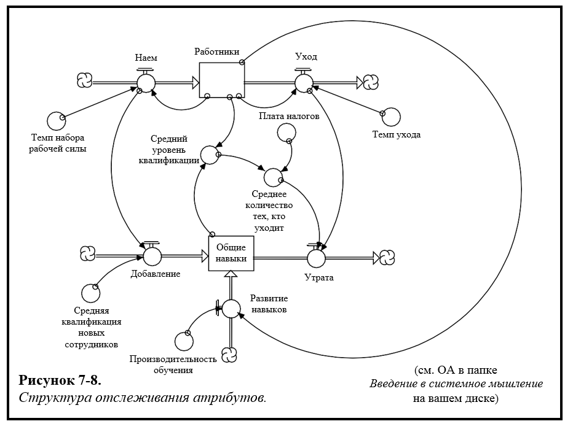 

В этом случае отслеживаемый атрибут - это уровень квалификации населения. Чтобы рассчитать средний уровень квалификации для общего населения, общее количество сотрудников делится на общее количество навыков, которыми они обладают, чтобы получить средний уровень квалификации на одного сотрудника. Каждый наемный работник несет с собой средний уровень мастерства (процесс совместного потока). Каждый, кто уходит, также, через процесс совместного потока, несет с собой средний уровень мастерства. Как можно заметить на рисунке, эта последняя сумма связана с текущим средним уровнем квалификации населения. Отношение выражается путем умножения среднего на *смещение уклона*. Если это смещение больше 1,0, то выбывшие берут что-то большее, чем текущее среднее. Если смещение равно 1,0, то стоит выбрать среднее. И если смещение меньше 1.0, выбирается значение меньшее, чем средние. Есть еще один приток к сумме *общих навыков*, и это *развитие навыков*. Этот поток происходит независимо от потоков сотрудников. Процесс *развития навыков* формулируется как процесс внешних ресурсов, хотя это не всегда так. 

### Описание поведения
Инфраструктура инициализируется в стационарном режиме. В стационарном режиме *найм* равен *увольнению*. *Смещение от уклона* равно нулю, а это означает, что эти увольнения относятся к среднему уровню навыков существующих сотрудников. Однако новые сотрудники входят в организацию с более низким уровнем квалификации, чем существующие сотрудники. Таким образом, чтобы оставаться в стабильном состоянии, система должна компенсировать эту разницу через приток *развивающих навыков*.

В 3 период времени смещение уклона составляет до 20, то есть выпускников теперь начинают брать на 20% больше, чем средний уровень квалификации существующих сотрудников. Как видно из рисунка 7-9, результатом является медленный спад среднего уровня квалификации существующей популяции до нового, более низкого стационарного значения.

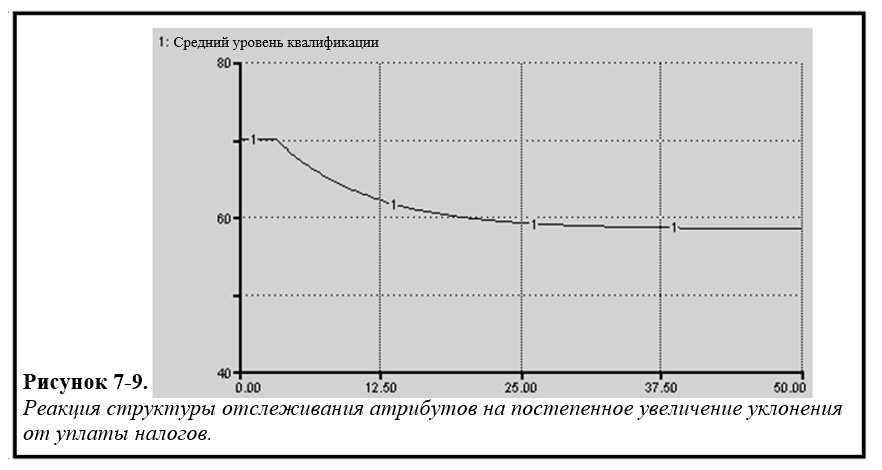 

### Вариации
Самые популярные вариации этой структуры достигаются за счет изменения каждого из постоянных параметров, связанных с структурой. Часто вариации «управляются» средним уровнем атрибута. Так, например, на этой иллюстрации можно было бы отобразить *отпускную ставку, смещение уклона, производительность обучения* и *среднюю квалификацию новых сотрудников* как графические функции *среднего уровня квалификации*.

## Относительная привлекательность

### Предложения по использованию
Инфраструктура *относительной привлекательности* полезна всякий раз, когда вы хотите создать индекс привлекательности, который состоит из набора компонентов привлекательности. Индекс состоит из взвешенного среднего этих компонентов.

### Описание структуры
Рисунок 7-10 иллюстрирует структуру относительной привлекательности. Основная ситуация, на которую стоит обратить внимание на иллюстрации, - это населенный пункт (например, город, регион, страна). Иллюстрируются только три фактора «привлекательности», но структура легко расширяется до такого количества факторов, которые вы хотели бы рассмотреть. Обратите внимание, что три весовых коэффициента прикреплены к слайдерам. Если вы откроете модель, вы обнаружите, что слайдеры «закованы в цепочку», что означает, что не более 100% веса можно распределить.

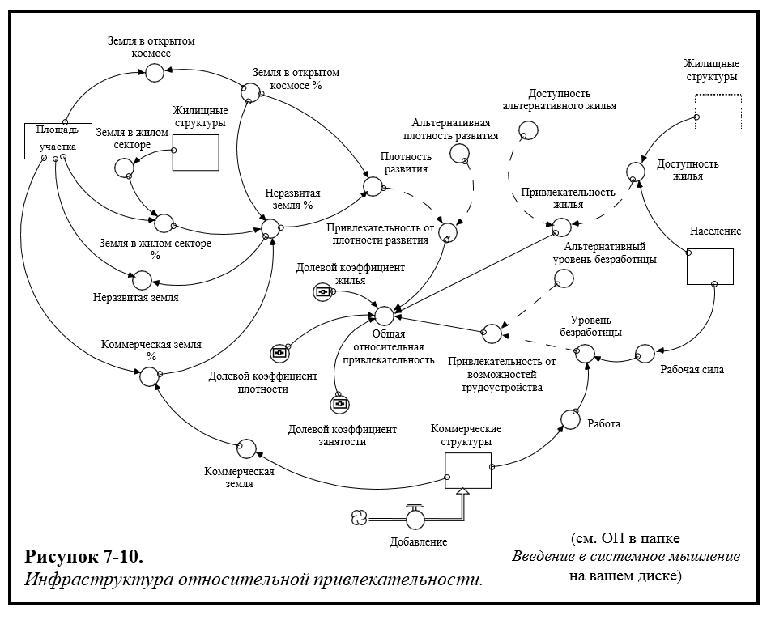 

### Описание поведения
Инфраструктура инициализируется, чтобы создать устойчивое отношение относительной привлекательности. Для каждого из трех компонентов привлекательности (плотность развития, безработица и доступность жилья) устанавливаются равные значения, принятые городом / регионом, с которым сравнивается этот населенный пункт, то есть «градиент привлекательности» нейтрален. За три периода времени происходит приток новых предприятий на 10%, увеличение рабочих мест на тот же процент и, следовательно, повышение привлекательности, с точки зрения рабочих мест. Однако, как показано на рисунке 7-11, увеличение привлекательности от занятости (2) несколько компенсируется снижением привлекательности из-за более высокой плотности развития (3), вызванной увеличением числа бизнес-структур.

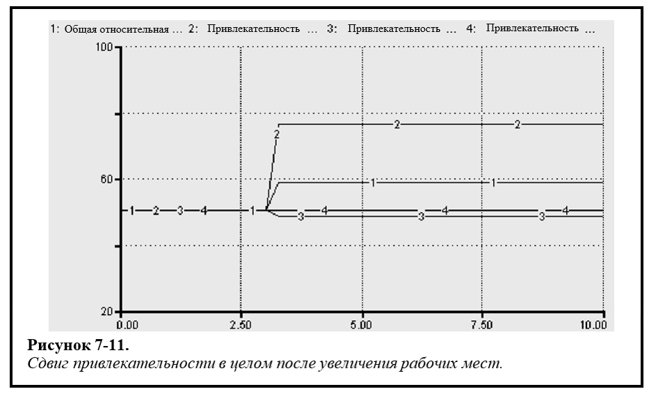 

При интерпретации рисунка 7-11 важно отметить, что весовые коэффициенты на трех компонентах привлекательности равны. Вот почему несмотря на то, что повысилась привлекательность от занятости, общий показатель привлекательности значительно снизился (даже без смещения из-за увеличения плотности развития). Возможно, вы захотите попробовать поэкспериментировать с этими весами, а затем повторить симуляцию теста, чтобы увидеть, как изменяется воздействие.

### Вариации
Вариации состоят главным образом в добавлении дополнительных факторов привлекательности и обеспечении того, чтобы весовые коэффициенты этих факторов менялись (а не фиксировались). Одной из очевидных характеристик процессов восприятия человека является то, что когда конкретный компонент привлекательности «удовлетворен», люди склонны меньше его взвешивать (то есть «считать это само собой разумеющимся»). Веса могут быть настроены так, чтобы варьироваться в зависимости от этого понятия, наподобие работы иерархия потребностей Маслоу.
